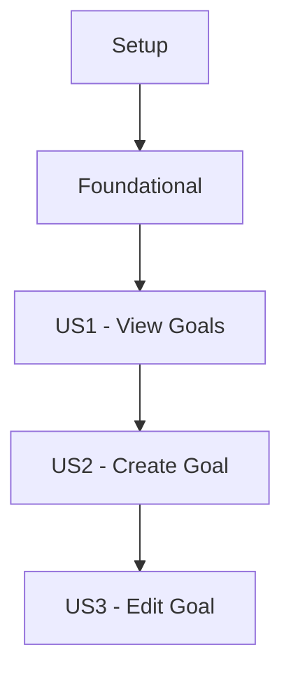

# Phase 3: Plan Implementation - GitHub Copilot Prompt

## User Input

```text
$ARGUMENTS
```

You **MUST** consider user input before proceeding (if not empty).

## Context

You are helping to create a comprehensive implementation plan for the CPR (Career Progress Registry) project. This is **Phase 3: Plan Implementation**, where we translate the refined specification into actionable technical design and task breakdown.

**Prerequisites**:
- Phase 1 (Specify) created the initial specification
- Phase 2 (Refine) clarified all ambiguities and edge cases
- The `description.md` is complete and approved

**Your Mission**: Fill in the Phase 3 planning documents with comprehensive, actionable content that enables smooth implementation.

**🚨 CRITICAL REQUIREMENT**: You MUST generate actual content based on the specification, NOT copy template placeholders. Every endpoint, entity, DTO, and task must be specific to this feature. If you find yourself leaving `[placeholder text]` unchanged, you are doing it wrong.

---

## IMPORTANT: Run Phase 3 Tool First

**Before using this prompt**, you MUST run the Phase 3 PowerShell tool to create the planning document templates:

```powershell
# From the cpr-meta repository root, run:

# Mandatory artifacts only (implementation-plan.md, tasks.md, endpoints.md)
.\framework\tools\phase-3-plan.ps1 -FeatureNumber "0001" -FeatureName "user-profile-management"

# OR with optional artifacts (data-model.md, research.md)
.\framework\tools\phase-3-plan.ps1 -FeatureNumber "0001" -FeatureName "user-profile-management" -IncludeDataModel -IncludeResearch
```

**What the tool does**:
1. Verifies specification folder exists from Phase 1
2. Checks that `description.md` exists from Phase 2
3. Creates planning document templates in `specifications/[####]-<feature-name>/`
4. Updates `progress.md` with Phase 3 tracking

**After running the tool**, you will have empty templates ready to fill. Use this prompt to populate them with comprehensive content.

---

## ⚠️ CRITICAL: NO TEMPLATE PLACEHOLDERS ALLOWED

**You MUST generate actual content, not leave template placeholders unchanged.**

This is NOT acceptable:
- ❌ `[Feature Name]` - Must be replaced with actual feature name
- ❌ `[resource]` - Must be replaced with actual resource name (e.g., `goals`)
- ❌ `[ENTITY_NAME]` - Must be replaced with actual entity name (e.g., `Goal`)
- ❌ `[table_name]` - Must be replaced with actual table name (e.g., `goals`)
- ❌ Generic template examples that don't match the feature

**Before completing Phase 3, verify that all planning documents contain:**
- ✅ Real endpoint paths (e.g., `POST /api/v1/goals`, not `POST /api/v1/[resource]`)
- ✅ Actual DTO properties based on feature requirements
- ✅ Concrete SQL schemas with real column names
- ✅ Specific task descriptions with exact file paths
- ✅ Complete C# and TypeScript code that matches the feature

**If you find yourself copying template text unchanged, STOP and generate actual content based on the specification.**

---

## Planning Documents Overview

### Mandatory Documents

1. **implementation-plan.md** - Overall technical strategy, architecture, phases
2. **tasks.md** - Detailed task checklist with dependencies and priorities
3. **endpoints.md** - Complete API endpoint specifications (**MUST contain real endpoints**)

### Optional Documents

4. **data-model.md** - Database schema and entity definitions (**MUST contain real entities if created**)
5. **research.md** - Technical decisions and alternatives (if new technologies or patterns)

---

## Step 1: Read and Analyze the Specification

**Action**: Load the complete refined specification

1. Read `specifications/[####]-<feature-name>/description.md` thoroughly
2. Extract all user stories and acceptance criteria
3. Identify technical requirements (API, database, UI, performance, security)
4. Note any constitutional principles that need special attention

**Questions to Answer**:
- What user stories are there, and what are their priorities (P1, P2, P3)?
- What API endpoints are needed based on user stories?
- Does this feature require database changes (new entities, migrations)?
- Are there any new technologies or patterns not used in the project?
- What are the performance requirements?
- What are the security and authorization requirements?
- What offline capabilities are needed?

---

## Step 2: Complete Constitutional Compliance Check

**Document**: `implementation-plan.md` → Constitutional Compliance Check section

For **each of the 11 CPR Constitutional Principles**, evaluate:

1. **Read the principle** from `constitution.md`
2. **Assess applicability** to this feature
3. **Document compliance approach**:
   - Check items that apply to this feature
   - Set status: PASS (addressed), FAIL (not addressed), NEEDS REVIEW (uncertain)
   - Add notes explaining how compliance is achieved

### Principle-by-Principle Guidance

**Principle 1: Specification-First Development**
- ✅ Check if description.md is complete
- ✅ Check if stakeholder approval obtained
- Status: Should be PASS (Phase 2 completed)

**Principle 2: API Contract Consistency**
- Define matching DTOs for C# and TypeScript
- Ensure JSON uses snake_case
- Document property mappings
- Status: Mark NEEDS REVIEW until endpoints.md is complete

**Principle 3: API Standards & Security**
- Verify RESTful conventions (GET, POST, PUT, DELETE)
- Define standard status codes (200, 201, 400, 401, 404, 500)
- Specify authentication and authorization
- Status: Mark NEEDS REVIEW until security approach defined

**Principle 4: Type Safety Everywhere**
- Plan C# DTOs with validation attributes
- Plan TypeScript interfaces (no `any`)
- Define enums where appropriate
- Status: PASS if types will be strongly typed

**Principle 5: Offline Mode**
- Define offline caching strategy (React Query + IndexedDB)
- Specify sync mechanism
- Document conflict resolution
- Status: PASS if offline strategy defined

**Principle 6: Internationalization**
- Identify all user-facing text
- Plan i18n keys in translation files
- Note locale-specific formatting needs
- Status: PASS if i18n approach clear

**Principle 7: Comprehensive Testing**
- Define unit test strategy (>80% coverage target)
- Define integration test scenarios
- Define performance test requirements
- Status: PASS if testing strategy documented in tasks.md

**Principle 8: Performance-First React Development**
- Set measurable performance targets
- Plan React Query caching strategy
- Identify optimization opportunities
- Status: PASS if performance targets defined

**Principle 9: Strict Naming Conventions**
- ✅ Verify JSON/API will use snake_case
- ✅ Verify C# will use PascalCase with `[JsonPropertyName]`
- ✅ Verify TypeScript will use camelCase
- ✅ Verify database will use snake_case
- ✅ Verify URLs will use kebab-case
- Status: Should be PASS (project standard)

**Principle 10: Security & Data Privacy**
- Specify authentication requirements (JWT, roles)
- Define authorization rules (who can access what)
- Plan data encryption approach
- Document sensitive data handling
- Status: Mark NEEDS REVIEW until security plan complete

**Principle 11: Database Design Standards**
- Verify entities will use UUIDs for primary keys
- Plan foreign key constraints
- Identify indexes needed for performance
- Ensure proper normalization
- Status: Mark NEEDS REVIEW if data-model.md needed, PASS otherwise

---

## Step 3: Define Technical Context

**Document**: `implementation-plan.md` → Technical Context section

### Technology Stack

Fill in the technology stack based on project standards:

**Backend (cpr-api)**:
- Framework: .NET 8 Web API (standard)
- Language: C# 12 (standard)
- Database: PostgreSQL 16 (standard)
- ORM: Entity Framework Core 8 (standard)
- Authentication: [Specify based on spec: JWT, OAuth, etc.]
- Additional Libraries: [List any new libraries needed]

**Frontend (cpr-ui)**:
- Framework: React 18 (standard)
- Language: TypeScript 5 (standard)
- State Management: Zustand, React Query (standard)
- UI Library: Material-UI v6 (standard)
- Build Tool: Vite (standard)
- Testing: Vitest, React Testing Library (standard)
- Additional Libraries: [List any new libraries needed]

### Architecture Patterns

**Backend**: Clean Architecture with Repository Pattern (standard)

**Frontend**: Component Composition + Custom Hooks + Service Layer (standard)

### Integration Points

List any existing features/systems this feature integrates with:
- Example: "User Profile System" → "API call to /api/v1/users/{id}"
- Example: "Skills Management" → "Shared skills taxonomy"

### Dependencies

**External Dependencies**:
- New NuGet packages (if any)
- New npm packages (if any)
- External APIs (if any)

**Internal Dependencies**:
- Other features that must exist first
- Shared components/services needed

---

## Step 4: Design Implementation Phases

**Document**: `implementation-plan.md` → Implementation Phases section

Break implementation into logical phases:

### Recommended Phase Structure

**Phase 1: Foundation & Setup** (Typically 1-3 days)
- Database schema and migrations
- Domain models and DTOs
- TypeScript types and interfaces
- Repository and service scaffolding

**Phase 2: Backend API Implementation** (Typically 2-5 days)
- API endpoints
- Business logic
- Validation
- Authorization
- Error handling

**Phase 3: Frontend UI Implementation** (Typically 3-7 days)
- React components
- State management (Zustand stores)
- API integration (services, React Query)
- Offline support
- Internationalization

**Phase 4: Testing & QA** (Typically 2-4 days)
- Unit tests (>80% coverage)
- Integration tests
- Performance testing
- Security review

**Phase 5: Documentation & Deployment** (Typically 1-2 days)
- API documentation
- User guides
- Deployment preparation

### For Each Phase, Document:

1. **Duration**: Estimated days/hours
2. **Objectives**: What this phase accomplishes
3. **Deliverables**: Concrete outputs (with checkboxes)
4. **Key Files**: List specific file paths that will be created/modified

**Example**:
```markdown
### Phase 2: Backend API Implementation

**Duration**: 3-4 days

**Objectives**:
- Implement all CRUD API endpoints
- Add request validation
- Implement authorization policies
- Add comprehensive error handling

**Deliverables**:
- [ ] API endpoints implemented and tested
- [ ] Request validation added with FluentValidation
- [ ] Authorization policies applied
- [ ] Error responses standardized

**Key Files** (Backend):
\`\`\`
src/CPR.Api/Controllers/GoalsController.cs
src/CPR.Application/Services/Implementations/GoalsService.cs
src/CPR.Infrastructure/Repositories/Implementations/GoalsRepository.cs
\`\`\`
```

---

## Step 5: Define API Endpoints

**Document**: `endpoints.md`

**CRITICAL**: You MUST generate complete, real API endpoint specifications. DO NOT leave templates unchanged. DO NOT use placeholder text like `[resource]`, `[Feature Name]`, or `[ENTITY_NAME]`. If specification describes only front-end REMOVE endpoint specification.

For **each user story**, identify and **GENERATE** the required API endpoints:

### Endpoint Design Process

1. **List User Actions**: What can users do? (View, Create, Edit, Delete, Filter, Search)
2. **Map to HTTP Methods**: 
   - View/List → GET
   - Create → POST
   - Update → PUT
   - Delete → DELETE
3. **Define URL Structure**: `/api/v1/[resource]` (kebab-case)
4. **Specify Request/Response**: DTOs for both C# and TypeScript

### MANDATORY: Replace Template Content

You MUST replace ALL template placeholders in `endpoints.md`:
- Replace `[Feature Name]` with actual feature name
- Replace `[resource]` with actual resource name (e.g., `goals`, `user-profiles`)
- Replace template endpoint table with ACTUAL endpoints for this feature
- Generate COMPLETE endpoint specifications (not template examples)

### For Each Endpoint, Document:

#### 1. Endpoint Metadata
- HTTP Method
- URL (with path parameters)
- Description
- Authorization requirements (roles, ownership)

#### 2. Request Specification
- Path parameters (with types and validation)
- Query parameters (with types, defaults, validation)
- Request body (JSON schema)
- Headers (if custom headers needed)

#### 3. Response Specification
- Success response (200, 201)
- Error responses (400, 401, 403, 404, 409, 500)
- Response body (JSON schema)
- Response headers (Location, etc.)

#### 4. DTOs (C# and TypeScript)

**C# DTO Example**:
```csharp
public class CreateGoalDto
{
    [JsonPropertyName("title")]
    [Required]
    [StringLength(200, MinimumLength = 1)]
    public string Title { get; set; } = string.Empty;
    
    [JsonPropertyName("description")]
    [StringLength(1000)]
    public string? Description { get; set; }
    
    [JsonPropertyName("target_date")]
    public DateTime? TargetDate { get; set; }
}
```

**TypeScript Interface Example**:
```typescript
export interface CreateGoalDto {
  title: string; // 1-200 characters, required
  description?: string | null; // max 1000 characters
  target_date?: string | null; // ISO 8601 date
}
```

#### 5. Validation Rules
- List all validation rules
- Specify error messages
- Note business rule constraints

#### 6. Examples
- Request example (with curl or HTTP)
- Success response example (JSON)
- Error response example (JSON)

### Standard Endpoints to Consider

**CRUD Pattern** (if applicable):
- `GET /api/v1/[resource]` - List (with pagination, filtering, sorting)
- `GET /api/v1/[resource]/{id}` - Get single
- `POST /api/v1/[resource]` - Create
- `PUT /api/v1/[resource]/{id}` - Update
- `DELETE /api/v1/[resource]/{id}` - Delete

**Additional Patterns**:
- Statistics: `GET /api/v1/[resource]/statistics`
- Batch operations: `POST /api/v1/[resource]/batch`
- Related resources: `GET /api/v1/[resource]/{id}/[subresource]`

### Generation Instructions

**You MUST generate actual endpoints based on the user stories in description.md**:

1. **Read each user story** from description.md
2. **Identify what API calls are needed** for that user story
3. **Write the complete endpoint specification** following the template structure
4. **Generate real DTOs** with actual properties from the feature requirements
5. **Include concrete examples** with actual data (not placeholder data)

Example of what you should generate:
```markdown
### 1. Create Personal Goal

**Endpoint**: `POST /api/v1/goals`

**Description**: Create a new personal goal for the authenticated user

**Request Body**:
```json
{
  "title": "Learn TypeScript",
  "description": "Master TypeScript fundamentals",
  "target_date": "2025-12-31"
}
```

**C# DTO**:
```csharp
public class CreateGoalDto
{
    [JsonPropertyName("title")]
    [Required]
    [StringLength(200, MinimumLength = 1)]
    public string Title { get; set; } = string.Empty;
    
    [JsonPropertyName("description")]
    [StringLength(1000)]
    public string? Description { get; set; }
    
    [JsonPropertyName("target_date")]
    public DateTime? TargetDate { get; set; }
}
```
```

### Offline Mode Considerations

Document caching strategy for each endpoint:
- Cache key format
- TTL (Time To Live)
- Invalidation triggers
- Sync mechanism

### ✅ ACTION REQUIRED

**NOW generate the complete `endpoints.md` file:**

1. Open `specifications/[####]-<feature-name>/endpoints.md`
2. Read the current template content
3. **REPLACE all template content** with actual endpoint specifications
4. For each user story in description.md, generate the corresponding endpoints
5. Ensure NO placeholders like `[resource]` or `[Feature Name]` remain
6. Verify DTOs have real properties from the feature requirements

---

## Step 6: Design Data Model (if applicable)

**Document**: `data-model.md` (only if database changes needed)

**CRITICAL**: If you determine that database changes are needed, you MUST generate complete, real data model specifications. DO NOT leave templates unchanged. DO NOT use placeholder text like `[ENTITY_NAME]`, `[table_name]`, or `[Feature Name]`. If database changes not needed, remove data-model specification.

**When to create data-model.md**:
- Feature requires new database tables
- Feature modifies existing entities
- Feature adds new relationships

### MANDATORY: Replace Template Content

If data-model.md is needed, you MUST replace ALL template placeholders:
- Replace `[Feature Name]` with actual feature name
- Replace `[ENTITY_NAME]` and `[table_name]` with actual entity/table names
- Generate COMPLETE entity definitions (not template examples)
- Create REAL SQL schema based on feature requirements
- Generate ACTUAL C# domain models with real properties

### Generation Instructions

**You MUST analyze the feature requirements and generate actual database entities**:

1. **Identify what data needs to be stored** based on user stories
2. **Design the entity structure** with real columns and relationships
3. **Write complete SQL CREATE TABLE statements** with actual constraints
4. **Generate C# domain models** with real properties
5. **Include EF Core configurations** with actual mappings

Example of what you should generate:
```sql
CREATE TABLE goals (
    id UUID PRIMARY KEY DEFAULT gen_random_uuid(),
    title VARCHAR(200) NOT NULL,
    description TEXT,
    status VARCHAR(20) NOT NULL DEFAULT 'active',
    target_date TIMESTAMP WITH TIME ZONE,
    created_at TIMESTAMP WITH TIME ZONE NOT NULL DEFAULT NOW(),
    updated_at TIMESTAMP WITH TIME ZONE NOT NULL DEFAULT NOW(),
    user_id UUID NOT NULL,
    
    CONSTRAINT fk_goals_user FOREIGN KEY (user_id) 
        REFERENCES users(id) ON DELETE CASCADE,
    CONSTRAINT chk_goals_status 
        CHECK (status IN ('active', 'completed', 'abandoned'))
);
```

### For Each Entity, Document:

#### 1. Entity Overview
- Table name (snake_case)
- Description
- Relationships (belongs to, has many)

#### 2. Database Schema
- SQL CREATE TABLE statement
- All columns with types and constraints
- Primary key (UUID, auto-generated)
- Foreign keys (with ON DELETE behavior)
- Unique constraints
- Check constraints
- Indexes (for performance)
- Triggers (e.g., updated_at)

**Column Table Format**:
| Column | Type | Nullable | Default | Description | Validation |
|--------|------|----------|---------|-------------|------------|
| id | UUID | No | gen_random_uuid() | Primary key | - |
| title | VARCHAR(200) | No | - | Goal title | 1-200 chars |
| created_at | TIMESTAMP | No | NOW() | Creation time | Auto-managed |

#### 3. C# Domain Model
- Full class definition
- Properties with XML documentation
- Navigation properties for relationships

#### 4. Entity Framework Configuration
- IEntityTypeConfiguration implementation
- Property mappings (column names in snake_case)
- Relationships configuration
- Indexes configuration
- Constraints configuration

#### 5. Database Migration
- Up migration code (EF Core)
- Down migration code (rollback)
- Migration commands

#### 6. Repository Interface
- Method signatures for data access
- Paged queries
- Filtering and sorting
- Specialized queries

#### 7. Data Validation Rules
- Business rules (uniqueness, state transitions)
- Field validation (ranges, formats, lengths)
- Relationship constraints

#### 8. Performance Considerations
- Query optimization strategy
- Index strategy
- Expected query performance
- Scaling considerations

### ✅ ACTION REQUIRED (if data-model.md is needed)

**If database changes are required, NOW generate the complete `data-model.md` file:**

1. Open `specifications/[####]-<feature-name>/data-model.md`
2. Read the current template content
3. **REPLACE all template content** with actual entity specifications
4. Analyze user stories and endpoints to determine what entities are needed
5. Generate real SQL schemas with actual table/column names
6. Create complete C# domain models with actual properties
7. Ensure NO placeholders like `[ENTITY_NAME]` or `[table_name]` remain
8. Verify entity relationships match the feature requirements

**If NO database changes are needed:**
- Delete the `data-model.md` file
- Note in `implementation-plan.md` that no database changes are required

---

## Step 7: Break Down Into Tasks

**Document**: `tasks.md`

Create a comprehensive, executable task checklist.

### Task Organization Structure

Organize tasks by **user story** (not by layer):

**Phase 1: Setup** - Project initialization
**Phase 2: Foundational** - Shared infrastructure (blocking prerequisites)
**Phase 3+: User Story Implementation** - One phase per user story (in priority order)
**Final Phase: Polish** - Cross-cutting concerns

### Task Format (CRITICAL)

Every task MUST follow this exact format:

```
- [ ] [TaskID] [P] [USx] Description with file path
```

**Components**:
1. **Checkbox**: `- [ ]` (markdown checkbox)
2. **Task ID**: T001, T002, T003... (sequential)
3. **[P] marker**: ONLY if task can run in parallel (optional)
4. **[USx] label**: REQUIRED for user story tasks (US1, US2, US3...)
5. **Description**: Clear action + exact file path

**Examples**:
- ✅ `- [ ] T001 Create database migration for goals in src/CPR.Infrastructure/Data/Migrations/`
- ✅ `- [ ] T015 [P] [US1] Create GET endpoint in src/CPR.Api/Controllers/GoalsController.cs`
- ✅ `- [ ] T024 [P] [US1] Create GoalsList component in src/components/Goals/GoalsList.tsx`
- ❌ WRONG: `- [ ] Create Goal model` (missing ID, US label, file path)
- ❌ WRONG: `T001 Create model` (missing checkbox)

### Task Generation Process

1. **Analyze User Stories**: Extract from description.md with priorities
2. **Map Components**: For each user story, identify:
   - Database entities needed
   - API endpoints needed
   - UI components needed
   - Tests needed
3. **Identify Dependencies**: What must be done first?
4. **Mark Parallel Tasks**: Different files, no dependencies → [P]
5. **Add File Paths**: Every task must specify exact file path

### Phase Structure

#### Setup Phase (No US labels)
```markdown
- [ ] T001 Create database migration for goals in src/CPR.Infrastructure/Data/Migrations/
- [ ] T002 Create Goal domain entity in src/CPR.Domain/Entities/Goal.cs
- [ ] T003 [P] Create repository interface in src/CPR.Application/Interfaces/Repositories/IGoalsRepository.cs
```

#### Foundational Phase (No US labels)
```markdown
- [ ] T010 Implement repository in src/CPR.Infrastructure/Repositories/Implementations/GoalsRepository.cs
- [ ] T011 [P] Implement service in src/CPR.Application/Services/Implementations/GoalsService.cs
```

#### User Story Phases (WITH US labels)
```markdown
## Phase 3: User Story 1 - View Goals List

**User Story**: As a user, I want to view my goals, so that I can track progress

**Acceptance Criteria**:
1. [List from spec]
2. [List from spec]

### Backend Tasks (US1)
- [ ] T019 [P] [US1] Implement GET /api/v1/goals endpoint in src/CPR.Api/Controllers/GoalsController.cs
- [ ] T020 [P] [US1] Add pagination logic to GoalsService in src/CPR.Application/Services/Implementations/GoalsService.cs

### Frontend Tasks (US1)
- [ ] T024 [P] [US1] Create GoalsList component in src/components/Goals/GoalsList.tsx
- [ ] T025 [P] [US1] Create Zustand store in src/stores/goalsStore.ts

### Testing Tasks (US1)
- [ ] T030 [P] [US1] Write backend unit tests in tests/CPR.Tests/Services/GoalsServiceTests.cs
```

### Dependencies Section

Create a dependency graph showing user story completion order:



### Parallel Execution Plan

Identify tasks that can run in parallel:

```markdown
**Batch 1** (all parallel):
- T003: Backend repository interface
- T004: Backend service interface
- T006: Frontend types
- T007: Frontend DTOs

**Batch 2** (after Batch 1):
- Backend Developer: T019-T023 (US1 backend)
- Frontend Developer: T024-T029 (US1 frontend)
- QA: T030-T033 (US1 tests) - can start after T019 or T024
```

### Task Validation Checklist

Include checklist for what to verify before marking task complete:
- [ ] Code follows naming conventions
- [ ] Types are strongly typed
- [ ] Contracts match between backend/frontend
- [ ] I18n keys added
- [ ] Error handling implemented
- [ ] Tests written and passing
- [ ] Code reviewed

---

## Step 8: Document Technical Decisions (if applicable)

**Document**: `research.md` (only if new technologies or significant architectural decisions)

**When to create research.md**:
- Feature uses new libraries or frameworks
- Significant architectural decisions needed
- Multiple technical approaches considered
- Complex technical tradeoffs involved

### Decision Log Format

For each significant decision:

1. **Decision Title**: Clear, descriptive name
2. **Status**: Decided, Under Review, Rejected
3. **Date**: When decided
4. **Context**: Problem/requirement that prompted decision
5. **Decision**: What was chosen
6. **Rationale**: Why this was chosen
7. **Alternatives Considered**:
   - For each alternative:
     - Pros
     - Cons
     - Why rejected
8. **Consequences**:
   - Positive impacts
   - Negative impacts/tradeoffs
   - Risks and mitigation
9. **References**: Links to docs, research, discussions

### Common Decisions to Document

- State management approach (if different from standard)
- Data storage strategy (relational vs. JSONB vs. NoSQL)
- Authentication/authorization approach
- Caching strategy
- Performance optimization tactics
- Offline sync mechanism
- Third-party library choices

---

## Step 9: Estimate Effort

**Document**: `implementation-plan.md` → Effort Estimation section

### Estimation Approach

Create a table with effort estimates:

| Phase | Estimated Hours | Notes |
|-------|----------------|-------|
| Phase 1: Foundation | 8-12 hours | Database + scaffolding |
| Phase 2: Backend API | 12-16 hours | 5 endpoints + validation |
| Phase 3: Frontend UI | 16-24 hours | 3 components + state |
| Phase 4: Testing | 12-16 hours | Unit + integration tests |
| Phase 5: Documentation | 4-6 hours | API docs + user guide |
| **TOTAL** | **52-74 hours** | **~7-10 days** |

### Estimation Guidelines

**Backend Tasks**:
- Simple CRUD endpoint: 1-2 hours
- Complex endpoint with business logic: 2-4 hours
- Database migration: 1-2 hours
- Service implementation: 2-4 hours
- Unit tests for service: 1-2 hours

**Frontend Tasks**:
- Simple component: 1-2 hours
- Complex component with state: 2-4 hours
- React Query hook: 0.5-1 hour
- Zustand store: 1-2 hours
- Component tests: 1-2 hours

**Include Buffer**: Add 20-30% buffer for unexpected issues

---

## Step 10: Assess Risks

**Document**: `implementation-plan.md` → Risk Assessment section

### Risk Table Format

| Risk | Probability | Impact | Mitigation Strategy |
|------|-------------|--------|---------------------|
| Database migration fails in production | Low | High | Test in staging, have rollback script ready |
| Performance targets not met | Medium | Medium | Early performance testing, optimize queries |
| Offline sync conflicts | Medium | Medium | Clear user messaging, conflict resolution UI |

### Risk Categories to Consider

1. **Technical Risks**: New technologies, complex algorithms, performance
2. **Dependency Risks**: External APIs, other teams, blocking features
3. **Data Risks**: Migrations, data integrity, data loss
4. **Security Risks**: Authentication, authorization, data exposure
5. **UX Risks**: Usability issues, accessibility, browser compatibility

---

## Step 11: Define Success Metrics

**Document**: `implementation-plan.md` → Success Metrics section

### Metric Categories

**Functional Metrics**:
- [ ] All acceptance criteria met
- [ ] All user stories implemented
- [ ] Zero critical bugs

**Quality Metrics**:
- [ ] Code coverage > 80%
- [ ] All tests passing
- [ ] Zero security vulnerabilities
- [ ] Accessibility score > 95

**Performance Metrics**:
- [ ] API response time < 200ms (95th percentile)
- [ ] Page load time < 2s
- [ ] No performance regressions

---

## Key Principles to Follow

### 1. Be Comprehensive, Not Abstract

**BAD**: "Implement goal management"
**GOOD**: "Implement POST /api/v1/goals endpoint in src/CPR.Api/Controllers/GoalsController.cs with CreateGoalDto validation"

### 2. Always Include File Paths

Every task, every file mention should have an exact path from the repository root.

### 3. Match Backend and Frontend Contracts

When defining DTOs:
- C# properties: PascalCase
- JSON properties: snake_case (via `[JsonPropertyName]`)
- TypeScript properties: camelCase (map to snake_case for API)

### 4. Consider Constitutional Compliance

Every section should reference relevant constitutional principles.

### 5. Plan for Both Repositories

- Backend tasks → cpr-api repository
- Frontend tasks → cpr-ui repository
- Clearly separate them

### 6. Prioritize by User Story

Organize work by feature (user story), not by technical layer. This enables incremental delivery.

### 7. Enable Parallel Work

Mark tasks with `[P]` if they can run in parallel. This helps with team coordination and faster delivery.

### 8. Define "Done" Criteria

For each phase and task, be clear about what "complete" means.

---

## Output Checklist

Before finishing Phase 3, verify:

### ⚠️ TEMPLATE VERIFICATION (MUST CHECK FIRST)
- [ ] **NO placeholders** like `[Feature Name]`, `[resource]`, `[ENTITY_NAME]` remain in ANY document
- [ ] **ALL endpoints** use actual resource names (e.g., `POST /api/v1/goals`, not `POST /api/v1/[resource]`)
- [ ] **ALL DTOs** have real properties based on feature requirements (not generic examples)
- [ ] **ALL SQL schemas** have actual table/column names (not template placeholders)
- [ ] **ALL entities** are specific to this feature (not generic template examples)
- [ ] Endpoints Summary table shows REAL endpoints for this feature
- [ ] Entity Relationship Diagram shows REAL entities (not `[ENTITY_NAME]`)

### implementation-plan.md
- [ ] Executive summary completed
- [ ] All 11 constitutional principles assessed
- [ ] Technical context filled (stack, patterns, integrations)
- [ ] Implementation phases defined with deliverables
- [ ] Data model changes documented (if applicable)
- [ ] API endpoints summarized (reference to endpoints.md)
- [ ] Risk assessment completed
- [ ] Performance considerations documented
- [ ] Effort estimation provided
- [ ] Success metrics defined

### tasks.md
- [ ] Task summary table created
- [ ] Dependency graph shows user story order
- [ ] All tasks follow format: `- [ ] [TaskID] [P] [USx] Description with file path`
- [ ] Tasks organized by user story
- [ ] Setup and Foundational phases defined
- [ ] One phase per user story (in priority order)
- [ ] Polish phase for cross-cutting concerns
- [ ] Parallel execution opportunities identified
- [ ] Task validation checklist included

### endpoints.md
- [ ] **CRITICAL**: All template placeholders removed (no `[resource]`, `[Feature Name]`)
- [ ] All endpoints from user stories defined with REAL paths
- [ ] Each endpoint has: method, URL, description, auth
- [ ] Request specifications (params, body, headers)
- [ ] Response specifications (success, errors)
- [ ] C# DTOs with validation attributes and REAL properties
- [ ] TypeScript interfaces matching C# DTOs
- [ ] Validation rules documented
- [ ] Examples provided with REAL data (not placeholder examples)
- [ ] Error responses standardized
- [ ] Offline caching strategy defined

### data-model.md (if created)
- [ ] **CRITICAL**: All template placeholders removed (no `[ENTITY_NAME]`, `[table_name]`)
- [ ] Entity relationship diagram with REAL entity names
- [ ] SQL schema for each entity with ACTUAL table/column names
- [ ] Column details table
- [ ] Constraints and indexes
- [ ] C# domain models with REAL properties
- [ ] EF Core configurations
- [ ] Migration code
- [ ] Repository interfaces
- [ ] Data validation rules
- [ ] Performance considerations

### research.md (if created)
- [ ] Decision log with structured entries
- [ ] Each decision has: context, rationale, alternatives, consequences
- [ ] Technology stack choices justified
- [ ] Architecture patterns documented
- [ ] Security decisions recorded
- [ ] Performance benchmarks defined
- [ ] Open questions listed

---

## Final Validation

After completing all planning documents:

1. **Cross-Reference Check**:
   - Do endpoints.md endpoints match user stories in description.md?
   - Do tasks.md tasks cover all endpoints in endpoints.md?
   - Do data-model.md entities support all endpoints?
   - Does implementation-plan.md reference all other documents?

2. **Constitutional Compliance Check**:
   - Review each principle again
   - Ensure nothing violates CPR constitution
   - Document any intentional deviations with justification

3. **Completeness Check**:
   - Can a developer start implementation with ONLY these planning documents?
   - Are all file paths clear and specific?
   - Are all acceptance criteria addressable?
   - Is effort estimation realistic?

4. **Update Progress**:
   - Mark Phase 3 checkboxes in progress.md
   - Update status to "Complete" when done
   - Add completion date

---

## Common Mistakes to Avoid

### 🚨 MOST CRITICAL MISTAKE: Leaving Templates Unchanged

❌ **BIGGEST ERROR**: Copying template files without replacing placeholders
- **Wrong**: `POST /api/v1/[resource]` in endpoints.md
- **Wrong**: `[ENTITY_NAME]` in data-model.md
- **Wrong**: Generic DTO examples that don't match the feature
- ✅ **Right**: Generate actual content based on specification

❌ **Not analyzing requirements**: Skipping description.md analysis and just copying templates
- ✅ **Right**: Read user stories, extract requirements, then generate specific artifacts

### Other Important Mistakes

❌ **Vague tasks**: "Implement goals" → ✅ "Implement POST /api/v1/goals endpoint in src/CPR.Api/Controllers/GoalsController.cs"

❌ **Missing file paths**: "Create component" → ✅ "Create GoalsList component in src/components/Goals/GoalsList.tsx"

❌ **Wrong task organization**: Organizing by layer (all backend, then all frontend) → ✅ Organize by user story

❌ **Inconsistent naming**: Mixing snake_case and camelCase → ✅ Follow Principle 9 strictly

❌ **Missing US labels**: `- [ ] T015 Create endpoint` → ✅ `- [ ] T015 [US1] Create endpoint in GoalsController.cs`

❌ **Incomplete DTOs**: Missing validation attributes → ✅ Include `[Required]`, `[StringLength]`, etc.

❌ **No TypeScript types**: Only C# DTOs → ✅ Provide matching TypeScript interfaces

❌ **Unclear dependencies**: No dependency graph → ✅ Show which user stories depend on others

❌ **No parallel markers**: All tasks sequential → ✅ Mark independent tasks with [P]

❌ **Ignored constitutional principles**: No compliance check → ✅ Assess all 11 principles

---

## Success Criteria for Phase 3

Phase 3 is complete when:

✅ All planning documents are comprehensive and actionable
✅ Constitutional compliance verified for all 11 principles
✅ API endpoints fully specified with C# and TypeScript DTOs
✅ Tasks are specific, include file paths, and organized by user story
✅ Dependencies and parallel opportunities clearly identified
✅ Data model designed (if applicable) with migrations planned
✅ Technical decisions documented (if applicable) with rationale
✅ Effort estimation provided and realistic
✅ Risk assessment completed with mitigation strategies
✅ A developer can start implementation immediately with these documents
✅ Progress.md updated to reflect Phase 3 completion

---

## Next Phase Preview

After Phase 3 is complete:

**Phase 4: Analyze** (Future) - Code review of existing patterns, identify reusable components

**Phase 5: Implement** (Future) - Execute tasks.md with TDD approach

**Phase 6: Code Review** (Future) - Peer review, quality gates

**Phase 7: Test** (Future) - Comprehensive testing, coverage validation

**Phase 8: Deploy** (Future) - Production deployment, monitoring

---

**Remember**: Phase 3 is the bridge between "what to build" (Phase 1-2) and "building it" (Phase 5+). Invest time here to save time during implementation. A comprehensive plan prevents rework and ensures quality.
