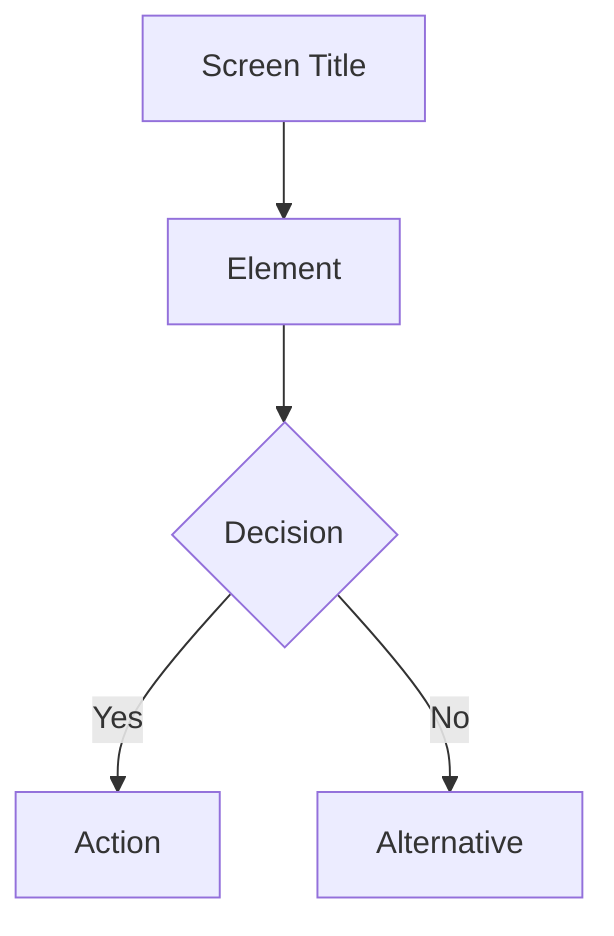
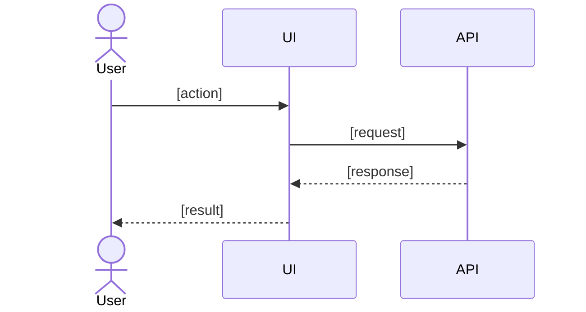
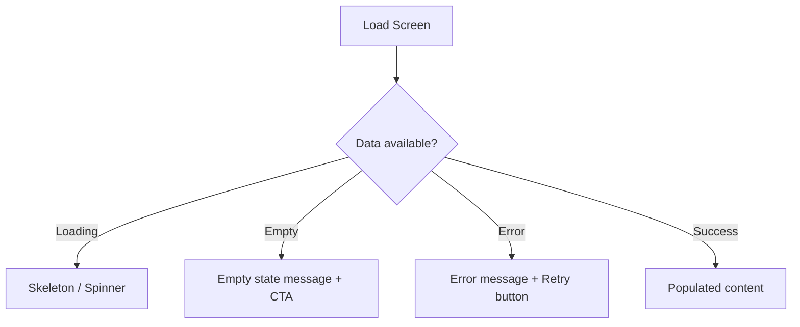

# Wireframes — [Feature Name] ([####])

> **Coverage requirement**: every screen or interaction flow mentioned in `stories.md`
> must have a corresponding section below. Check stories.md before finalising this document.

## [Screen / Component Name]

**Notes**
- [Interaction detail or design decision]
- [Edge case behavior]

---

## [Another Screen or Flow]

**Notes**
- [Note]

---

## [Screen Name] — States

Document non-happy-path states for every screen that has them.

**Notes**
- Empty state: [what message and call-to-action to show]
- Error state: [what error message and recovery action to show]
- Loading state: [skeleton layout or spinner placement]
