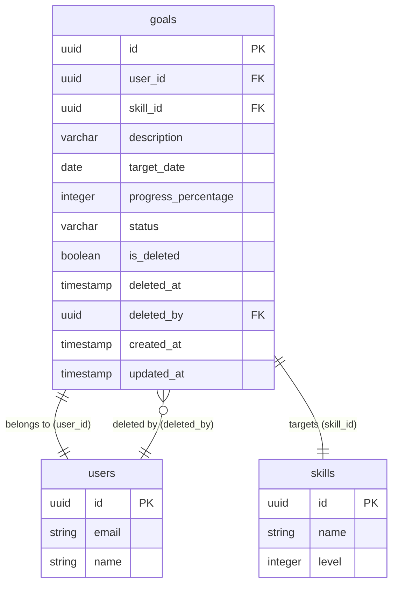

# Data Model - Personal Goal Creation Management

> **Feature**: 0001 - personal-goal-creation-management  
> **Status**: Planning  
> **Created**: 2025-11-07  
> **Last Updated**: 2025-11-07

---

## Overview

This document defines the data model for the Personal Goal Creation Management feature, including database schema, entity relationships, and domain models.

**Database**: PostgreSQL 16

---

## Entity Relationship Diagram



---

## Entities

### 1. Goal

**Table Name**: `goals` (snake_case)

**Description**: Represents a personal or professional development goal for an employee, linked to a specific skill one level above their current proficiency.

**Relationships**:
- Belongs to: `users` (many-to-one via `user_id`) - Goal owner
- Belongs to: `skills` (many-to-one via `skill_id`) - Target skill
- Belongs to: `users` (many-to-one via `deleted_by`) - User who deleted goal (nullable)

#### Database Schema

```sql
CREATE TABLE goals (
    id UUID PRIMARY KEY DEFAULT gen_random_uuid(),
    user_id UUID NOT NULL,
    skill_id UUID NOT NULL,
    description VARCHAR(500) NOT NULL,
    target_date DATE NOT NULL,
    progress_percentage INTEGER NOT NULL DEFAULT 0,
    status VARCHAR(20) NOT NULL DEFAULT 'active',
    is_deleted BOOLEAN NOT NULL DEFAULT FALSE,
    deleted_at TIMESTAMP WITH TIME ZONE,
    deleted_by UUID,
    created_at TIMESTAMP WITH TIME ZONE NOT NULL DEFAULT NOW(),
    updated_at TIMESTAMP WITH TIME ZONE NOT NULL DEFAULT NOW(),
    
    -- Constraints
    CONSTRAINT fk_goals_user FOREIGN KEY (user_id) 
        REFERENCES users(id) ON DELETE CASCADE,
    CONSTRAINT fk_goals_skill FOREIGN KEY (skill_id) 
        REFERENCES skills(id) ON DELETE RESTRICT,
    CONSTRAINT fk_goals_deleted_by FOREIGN KEY (deleted_by) 
        REFERENCES users(id) ON DELETE SET NULL,
    CONSTRAINT chk_goals_description_length 
        CHECK (char_length(description) >= 10),
    CONSTRAINT chk_goals_progress_range 
        CHECK (progress_percentage >= 0 AND progress_percentage <= 100),
    CONSTRAINT chk_goals_status 
        CHECK (status IN ('active', 'completed', 'archived'))
);

-- Indexes
CREATE INDEX idx_goals_user_id ON goals(user_id) 
    WHERE is_deleted = FALSE;
    
CREATE INDEX idx_goals_skill_id ON goals(skill_id);

CREATE INDEX idx_goals_status ON goals(status) 
    WHERE is_deleted = FALSE;
    
CREATE INDEX idx_goals_is_deleted ON goals(is_deleted);

CREATE INDEX idx_goals_created_at ON goals(created_at DESC);

-- Trigger for auto-updating updated_at
CREATE TRIGGER update_goals_updated_at
    BEFORE UPDATE ON goals
    FOR EACH ROW
    EXECUTE FUNCTION update_updated_at_column();
```

#### Column Details

| Column | Type | Nullable | Default | Description | Validation |
|--------|------|----------|---------|-------------|------------|
| `id` | UUID | No | `gen_random_uuid()` | Primary key | Auto-generated |
| `user_id` | UUID | No | - | Goal owner reference | Must exist in users table |
| `skill_id` | UUID | No | - | Target skill reference | Must exist in skills table, must be next-level skill |
| `description` | VARCHAR(500) | No | - | Goal description | 10-500 characters |
| `target_date` | DATE | No | - | Target completion date | Must be future at creation, can be past on update |
| `progress_percentage` | INTEGER | No | `0` | Completion progress (0-100) | Range: 0-100, auto-calculated from tasks (future) |
| `status` | VARCHAR(20) | No | `'active'` | Goal status | Must be: active, completed, archived |
| `is_deleted` | BOOLEAN | No | `FALSE` | Soft delete flag | Soft delete pattern |
| `deleted_at` | TIMESTAMP | Yes | NULL | When goal was deleted | Auto-set on soft delete |
| `deleted_by` | UUID | Yes | NULL | Who deleted the goal | References users, nullable |
| `created_at` | TIMESTAMP | No | `NOW()` | Creation timestamp (UTC) | Auto-managed |
| `updated_at` | TIMESTAMP | No | `NOW()` | Last update timestamp (UTC) | Auto-managed by trigger |

#### Constraints

**Primary Key**:
- `id` (UUID)

**Foreign Keys**:
- `user_id` → `users.id` (CASCADE on delete) - When user deleted, all their goals deleted
- `skill_id` → `skills.id` (RESTRICT on delete) - Cannot delete skill if goals reference it
- `deleted_by` → `users.id` (SET NULL on delete) - If deleter account deleted, set to NULL

**Check Constraints**:
- `description` length must be >= 10 characters
- `progress_percentage` must be between 0 and 100 (inclusive)
- `status` must be one of: `active`, `completed`, `archived`

**Indexes**:
- `idx_goals_user_id` - Partial index (WHERE is_deleted = FALSE) for user goal queries
- `idx_goals_skill_id` - For skill-based filtering
- `idx_goals_status` - Partial index (WHERE is_deleted = FALSE) for status filtering
- `idx_goals_is_deleted` - For filtering out soft-deleted goals
- `idx_goals_created_at DESC` - For sorting by creation date (most recent first)

#### C# Domain Model

**File**: `src/CPR.Domain/Entities/Goal.cs`

```csharp
namespace CPR.Domain.Entities;

/// <summary>
/// Represents a personal or professional development goal
/// </summary>
public class Goal
{
    /// <summary>
    /// Unique identifier
    /// </summary>
    public Guid Id { get; set; }
    
    /// <summary>
    /// Goal owner user ID
    /// </summary>
    public Guid UserId { get; set; }
    
    /// <summary>
    /// Target skill ID (must be one level above current)
    /// </summary>
    public Guid SkillId { get; set; }
    
    /// <summary>
    /// Goal description (10-500 characters)
    /// </summary>
    public string Description { get; set; } = string.Empty;
    
    /// <summary>
    /// Target completion date
    /// </summary>
    public DateOnly TargetDate { get; set; }
    
    /// <summary>
    /// Completion progress percentage (0-100)
    /// Auto-calculated from task completion in future
    /// </summary>
    public int ProgressPercentage { get; set; } = 0;
    
    /// <summary>
    /// Current status: active, completed, or archived
    /// </summary>
    public string Status { get; set; } = "active";
    
    /// <summary>
    /// Soft delete flag
    /// </summary>
    public bool IsDeleted { get; set; } = false;
    
    /// <summary>
    /// When goal was soft deleted (nullable)
    /// </summary>
    public DateTime? DeletedAt { get; set; }
    
    /// <summary>
    /// User who deleted the goal (nullable)
    /// </summary>
    public Guid? DeletedBy { get; set; }
    
    /// <summary>
    /// Creation timestamp (UTC)
    /// </summary>
    public DateTime CreatedAt { get; set; }
    
    /// <summary>
    /// Last update timestamp (UTC)
    /// </summary>
    public DateTime UpdatedAt { get; set; }
    
    // Navigation properties
    
    /// <summary>
    /// Goal owner
    /// </summary>
    public User User { get; set; } = null!;
    
    /// <summary>
    /// Target skill
    /// </summary>
    public Skill Skill { get; set; } = null!;
    
    /// <summary>
    /// User who deleted the goal (if applicable)
    /// </summary>
    public User? DeletedByUser { get; set; }
}
```

#### Entity Framework Configuration

**File**: `src/CPR.Infrastructure/Data/Configurations/GoalConfiguration.cs`

```csharp
using Microsoft.EntityFrameworkCore;
using Microsoft.EntityFrameworkCore.Metadata.Builders;
using CPR.Domain.Entities;

namespace CPR.Infrastructure.Data.Configurations;

public class GoalConfiguration : IEntityTypeConfiguration<Goal>
{
    public void Configure(EntityTypeBuilder<Goal> builder)
    {
        builder.ToTable("goals");
        
        // Primary Key
        builder.HasKey(g => g.Id);
        
        builder.Property(g => g.Id)
            .HasColumnName("id")
            .ValueGeneratedOnAdd();
        
        // Properties
        builder.Property(g => g.UserId)
            .HasColumnName("user_id")
            .IsRequired();
        
        builder.Property(g => g.SkillId)
            .HasColumnName("skill_id")
            .IsRequired();
        
        builder.Property(g => g.Description)
            .HasColumnName("description")
            .HasMaxLength(500)
            .IsRequired();
        
        builder.Property(g => g.TargetDate)
            .HasColumnName("target_date")
            .IsRequired();
        
        builder.Property(g => g.ProgressPercentage)
            .HasColumnName("progress_percentage")
            .IsRequired()
            .HasDefaultValue(0);
        
        builder.Property(g => g.Status)
            .HasColumnName("status")
            .HasMaxLength(20)
            .IsRequired()
            .HasDefaultValue("active");
        
        builder.Property(g => g.IsDeleted)
            .HasColumnName("is_deleted")
            .IsRequired()
            .HasDefaultValue(false);
        
        builder.Property(g => g.DeletedAt)
            .HasColumnName("deleted_at");
        
        builder.Property(g => g.DeletedBy)
            .HasColumnName("deleted_by");
        
        builder.Property(g => g.CreatedAt)
            .HasColumnName("created_at")
            .IsRequired();
        
        builder.Property(g => g.UpdatedAt)
            .HasColumnName("updated_at")
            .IsRequired();
        
        // Relationships
        builder.HasOne(g => g.User)
            .WithMany()
            .HasForeignKey(g => g.UserId)
            .OnDelete(DeleteBehavior.Cascade)
            .HasConstraintName("fk_goals_user");
        
        builder.HasOne(g => g.Skill)
            .WithMany()
            .HasForeignKey(g => g.SkillId)
            .OnDelete(DeleteBehavior.Restrict)
            .HasConstraintName("fk_goals_skill");
        
        builder.HasOne(g => g.DeletedByUser)
            .WithMany()
            .HasForeignKey(g => g.DeletedBy)
            .OnDelete(DeleteBehavior.SetNull)
            .HasConstraintName("fk_goals_deleted_by");
        
        // Indexes
        builder.HasIndex(g => g.UserId)
            .HasDatabaseName("idx_goals_user_id")
            .HasFilter("is_deleted = false");
        
        builder.HasIndex(g => g.SkillId)
            .HasDatabaseName("idx_goals_skill_id");
        
        builder.HasIndex(g => g.Status)
            .HasDatabaseName("idx_goals_status")
            .HasFilter("is_deleted = false");
        
        builder.HasIndex(g => g.IsDeleted)
            .HasDatabaseName("idx_goals_is_deleted");
        
        builder.HasIndex(g => g.CreatedAt)
            .HasDatabaseName("idx_goals_created_at")
            .IsDescending();
        
        // Check Constraints
        builder.ToTable(t =>
        {
            t.HasCheckConstraint("chk_goals_description_length", "char_length(description) >= 10");
            t.HasCheckConstraint("chk_goals_progress_range", "progress_percentage >= 0 AND progress_percentage <= 100");
            t.HasCheckConstraint("chk_goals_status", "status IN ('active', 'completed', 'archived')");
        });
    }
}
```

---

## Database Migrations

### Migration: AddGoalsTableWithSoftDelete

**File**: `src/CPR.Infrastructure/Data/Migrations/[Timestamp]_AddGoalsTableWithSoftDelete.cs`

**Up Migration**:
```csharp
using Microsoft.EntityFrameworkCore.Migrations;
using System;

#nullable disable

namespace CPR.Infrastructure.Data.Migrations
{
    public partial class AddGoalsTableWithSoftDelete : Migration
    {
        protected override void Up(MigrationBuilder migrationBuilder)
        {
            migrationBuilder.CreateTable(
                name: "goals",
                columns: table => new
                {
                    id = table.Column<Guid>(type: "uuid", nullable: false, defaultValueSql: "gen_random_uuid()"),
                    user_id = table.Column<Guid>(type: "uuid", nullable: false),
                    skill_id = table.Column<Guid>(type: "uuid", nullable: false),
                    description = table.Column<string>(type: "character varying(500)", maxLength: 500, nullable: false),
                    target_date = table.Column<DateOnly>(type: "date", nullable: false),
                    progress_percentage = table.Column<int>(type: "integer", nullable: false, defaultValue: 0),
                    status = table.Column<string>(type: "character varying(20)", maxLength: 20, nullable: false, defaultValue: "active"),
                    is_deleted = table.Column<bool>(type: "boolean", nullable: false, defaultValue: false),
                    deleted_at = table.Column<DateTime>(type: "timestamp with time zone", nullable: true),
                    deleted_by = table.Column<Guid>(type: "uuid", nullable: true),
                    created_at = table.Column<DateTime>(type: "timestamp with time zone", nullable: false, defaultValueSql: "NOW()"),
                    updated_at = table.Column<DateTime>(type: "timestamp with time zone", nullable: false, defaultValueSql: "NOW()")
                },
                constraints: table =>
                {
                    table.PrimaryKey("PK_goals", x => x.id);
                    table.ForeignKey(
                        name: "fk_goals_user",
                        column: x => x.user_id,
                        principalTable: "users",
                        principalColumn: "id",
                        onDelete: ReferentialAction.Cascade);
                    table.ForeignKey(
                        name: "fk_goals_skill",
                        column: x => x.skill_id,
                        principalTable: "skills",
                        principalColumn: "id",
                        onDelete: ReferentialAction.Restrict);
                    table.ForeignKey(
                        name: "fk_goals_deleted_by",
                        column: x => x.deleted_by,
                        principalTable: "users",
                        principalColumn: "id",
                        onDelete: ReferentialAction.SetNull);
                    table.CheckConstraint("chk_goals_description_length", "char_length(description) >= 10");
                    table.CheckConstraint("chk_goals_progress_range", "progress_percentage >= 0 AND progress_percentage <= 100");
                    table.CheckConstraint("chk_goals_status", "status IN ('active', 'completed', 'archived')");
                });

            migrationBuilder.CreateIndex(
                name: "idx_goals_user_id",
                table: "goals",
                column: "user_id",
                filter: "is_deleted = false");

            migrationBuilder.CreateIndex(
                name: "idx_goals_skill_id",
                table: "goals",
                column: "skill_id");

            migrationBuilder.CreateIndex(
                name: "idx_goals_status",
                table: "goals",
                column: "status",
                filter: "is_deleted = false");

            migrationBuilder.CreateIndex(
                name: "idx_goals_is_deleted",
                table: "goals",
                column: "is_deleted");

            migrationBuilder.CreateIndex(
                name: "idx_goals_created_at",
                table: "goals",
                column: "created_at")
                .Annotation("Npgsql:IndexSortOrder", new[] { SortOrder.Descending });
        }

        protected override void Down(MigrationBuilder migrationBuilder)
        {
            migrationBuilder.DropTable(name: "goals");
        }
    }
}
```

**Commands**:
```bash
# Create migration
dotnet ef migrations add AddGoalsTableWithSoftDelete --project src/CPR.Infrastructure --startup-project src/CPR.Api

# Apply migration
dotnet ef database update --project src/CPR.Infrastructure --startup-project src/CPR.Api

# Rollback migration
dotnet ef database update [PreviousMigrationName] --project src/CPR.Infrastructure --startup-project src/CPR.Api

# Remove migration (if not applied)
dotnet ef migrations remove --project src/CPR.Infrastructure --startup-project src/CPR.Api
```

**Rollback Impact**: All user-created goals will be permanently deleted. Use only in development/staging.

---

## Data Access Patterns

### Repository Interface

**File**: `src/CPR.Application/Interfaces/Repositories/IGoalsRepository.cs`

```csharp
using CPR.Domain.Entities;

namespace CPR.Application.Interfaces.Repositories;

public interface IGoalsRepository
{
    Task<Goal?> GetByIdAsync(Guid id, CancellationToken cancellationToken = default);
    Task<IEnumerable<Goal>> GetByUserIdAsync(Guid userId, CancellationToken cancellationToken = default);
    Task<IEnumerable<Goal>> GetByUserIdFilteredAsync(
        Guid userId, 
        string? status = null, 
        Guid? skillId = null,
        string? sortBy = null,
        string? sortOrder = null,
        CancellationToken cancellationToken = default);
    Task<IEnumerable<Goal>> GetAllAsync(CancellationToken cancellationToken = default);
    Task<Goal> CreateAsync(Goal goal, CancellationToken cancellationToken = default);
    Task<Goal> UpdateAsync(Goal goal, CancellationToken cancellationToken = default);
    Task SoftDeleteAsync(Guid id, Guid deletedByUserId, CancellationToken cancellationToken = default);
    Task<bool> ExistsAsync(Guid id, CancellationToken cancellationToken = default);
    Task<bool> IsOwnerAsync(Guid goalId, Guid userId, CancellationToken cancellationToken = default);
}
```

### Repository Implementation

**File**: `src/CPR.Infrastructure/Repositories/Implementations/GoalsRepository.cs`

```csharp
using CPR.Application.Interfaces.Repositories;
using CPR.Domain.Entities;
using CPR.Infrastructure.Data;
using Microsoft.EntityFrameworkCore;

namespace CPR.Infrastructure.Repositories.Implementations;

public class GoalsRepository : IGoalsRepository
{
    private readonly ApplicationDbContext _context;

    public GoalsRepository(ApplicationDbContext context)
    {
        _context = context;
    }

    public async Task<Goal?> GetByIdAsync(Guid id, CancellationToken cancellationToken = default)
    {
        return await _context.Goals
            .AsNoTracking()
            .Include(g => g.Skill)
            .Where(g => !g.IsDeleted)
            .FirstOrDefaultAsync(g => g.Id == id, cancellationToken);
    }

    public async Task<IEnumerable<Goal>> GetByUserIdAsync(Guid userId, CancellationToken cancellationToken = default)
    {
        return await _context.Goals
            .AsNoTracking()
            .Include(g => g.Skill)
            .Where(g => g.UserId == userId && !g.IsDeleted)
            .OrderByDescending(g => g.CreatedAt)
            .ToListAsync(cancellationToken);
    }

    public async Task<IEnumerable<Goal>> GetByUserIdFilteredAsync(
        Guid userId, 
        string? status = null, 
        Guid? skillId = null,
        string? sortBy = null,
        string? sortOrder = null,
        CancellationToken cancellationToken = default)
    {
        var query = _context.Goals
            .AsNoTracking()
            .Include(g => g.Skill)
            .Where(g => g.UserId == userId && !g.IsDeleted);

        // Filtering
        if (!string.IsNullOrWhiteSpace(status))
            query = query.Where(g => g.Status == status);

        if (skillId.HasValue)
            query = query.Where(g => g.SkillId == skillId.Value);

        // Sorting
        query = (sortBy?.ToLower(), sortOrder?.ToLower()) switch
        {
            ("target_date", "desc") => query.OrderByDescending(g => g.TargetDate),
            ("target_date", _) => query.OrderBy(g => g.TargetDate),
            ("progress_percentage", "desc") => query.OrderByDescending(g => g.ProgressPercentage),
            ("progress_percentage", _) => query.OrderBy(g => g.ProgressPercentage),
            ("created_at", "asc") => query.OrderBy(g => g.CreatedAt),
            _ => query.OrderByDescending(g => g.CreatedAt)
        };

        return await query.ToListAsync(cancellationToken);
    }

    public async Task<Goal> CreateAsync(Goal goal, CancellationToken cancellationToken = default)
    {
        goal.CreatedAt = DateTime.UtcNow;
        goal.UpdatedAt = DateTime.UtcNow;
        
        await _context.Goals.AddAsync(goal, cancellationToken);
        await _context.SaveChangesAsync(cancellationToken);
        
        return goal;
    }

    public async Task<Goal> UpdateAsync(Goal goal, CancellationToken cancellationToken = default)
    {
        goal.UpdatedAt = DateTime.UtcNow;
        
        _context.Goals.Update(goal);
        await _context.SaveChangesAsync(cancellationToken);
        
        return goal;
    }

    public async Task SoftDeleteAsync(Guid id, Guid deletedByUserId, CancellationToken cancellationToken = default)
    {
        var goal = await _context.Goals.FindAsync(new object[] { id }, cancellationToken);
        if (goal != null)
        {
            goal.IsDeleted = true;
            goal.DeletedAt = DateTime.UtcNow;
            goal.DeletedBy = deletedByUserId;
            goal.UpdatedAt = DateTime.UtcNow;
            
            await _context.SaveChangesAsync(cancellationToken);
        }
    }

    public async Task<bool> ExistsAsync(Guid id, CancellationToken cancellationToken = default)
    {
        return await _context.Goals
            .Where(g => !g.IsDeleted)
            .AnyAsync(g => g.Id == id, cancellationToken);
    }

    public async Task<bool> IsOwnerAsync(Guid goalId, Guid userId, CancellationToken cancellationToken = default)
    {
        return await _context.Goals
            .Where(g => !g.IsDeleted)
            .AnyAsync(g => g.Id == goalId && g.UserId == userId, cancellationToken);
    }
}
```

---

## Data Validation Rules

### Business Rules

1. **Skill Level Validation**
   - Goal skill must be one level above employee's current skill level for their position
   - Enforced by: Service layer validation before create/update
   - Error: 422 Unprocessable Entity

2. **Target Date Validation**
   - At creation: Target date must be in the future
   - At update: Target date can be past or future
   - Enforced by: DTO validation with custom attribute
   - Error: 400 Bad Request

3. **Soft Delete Pattern**
   - Deletion sets `is_deleted = true`, preserves data
   - Sets `deleted_at` timestamp and `deleted_by` user ID
   - Soft-deleted goals filtered from all queries (WHERE is_deleted = FALSE)
   - Admin can view deleted goals for audit (optional future feature)

4. **Cascade Delete Behavior**
   - When user is deleted, all their goals are cascade deleted (hard delete)
   - When skill is deleted, prevent if goals reference it (RESTRICT)
   - When deleter user is deleted, set `deleted_by` to NULL

5. **Progress Calculation (Future)**
   - Progress percentage auto-calculated based on completed tasks
   - Initially set to 0, manually updated when task system integrated
   - Range: 0-100, enforced by check constraint

### Field Validation

| Field | Rules | Error Messages |
|-------|-------|---------------|
| `description` | Required, 10-500 chars | "Description must be 10-500 characters" |
| `target_date` | Required, future at creation | "Target date must be in the future" |
| `skill_id` | Required, must exist, must be next-level | "Invalid skill or not available for your position" |
| `status` | Required, enum (active/completed/archived) | "Status must be active, completed, or archived" |
| `progress_percentage` | Range 0-100 | "Progress must be between 0 and 100" |

---

## Performance Considerations

### Query Optimization

**Most Common Queries**:
1. Get goals by user ID (filtered by status, skill) - `idx_goals_user_id` (partial, WHERE is_deleted = FALSE)
2. Get single goal by ID - Primary key lookup
3. Filter by status - `idx_goals_status` (partial, WHERE is_deleted = FALSE)
4. Sort by created_at - `idx_goals_created_at DESC`
5. Filter by skill_id - `idx_goals_skill_id`

**Index Strategy**:
- Partial indexes on `user_id` and `status` (WHERE is_deleted = FALSE) reduce index size and improve performance
- DESC index on `created_at` optimizes most common sorting (newest first)
- Covering indexes not needed (< 100 goals per user expected)

**Expected Query Performance** (with proper indexing):
- List goals by user: < 50ms (up to 100 goals)
- Get goal by ID: < 10ms (primary key lookup)
- Filter by status/skill: < 20ms (indexed columns)

**EXPLAIN ANALYZE Examples**:
```sql
-- Should use idx_goals_user_id (partial index)
EXPLAIN ANALYZE 
SELECT * FROM goals 
WHERE user_id = '123e4567-e89b-12d3-a456-426614174000' 
  AND is_deleted = FALSE 
ORDER BY created_at DESC;

-- Should use idx_goals_status (partial index)
EXPLAIN ANALYZE 
SELECT * FROM goals 
WHERE status = 'active' 
  AND is_deleted = FALSE;
```

### Scaling Considerations

- **Current**: Expected < 100 goals per user, ~1,000 users = 100K total rows
- **Future**: If > 1M total rows, consider:
  - Table partitioning by `user_id` or date range
  - Archiving old completed/archived goals to separate table
  - Materialized views for aggregate queries
- **Caching**: Goals cached in application layer (React Query) with 5-minute TTL

---

## Seed Data

For development and testing purposes (optional):

**File**: `src/CPR.Infrastructure/Data/Seeders/GoalSeeder.cs`

```csharp
using CPR.Domain.Entities;
using Microsoft.EntityFrameworkCore;

namespace CPR.Infrastructure.Data.Seeders;

public static class GoalSeeder
{
    public static void Seed(ModelBuilder modelBuilder)
    {
        // Assumes test users and skills already seeded
        var testUserId = Guid.Parse("123e4567-e89b-12d3-a456-426614174000");
        var azureSkillId = Guid.Parse("a1b2c3d4-e5f6-4789-a012-3456789abcde");
        var leadershipSkillId = Guid.Parse("b2c3d4e5-f6a7-5890-b123-4567890bcdef");
        
        modelBuilder.Entity<Goal>().HasData(
            new Goal
            {
                Id = Guid.Parse("550e8400-e29b-41d4-a716-446655440000"),
                UserId = testUserId,
                SkillId = azureSkillId,
                Description = "Complete Azure Solutions Architect certification",
                TargetDate = DateOnly.FromDateTime(DateTime.UtcNow.AddMonths(6)),
                ProgressPercentage = 0,
                Status = "active",
                IsDeleted = false,
                CreatedAt = DateTime.UtcNow.AddDays(-7),
                UpdatedAt = DateTime.UtcNow.AddDays(-7)
            },
            new Goal
            {
                Id = Guid.Parse("660e8400-e29b-41d4-a716-446655440001"),
                UserId = testUserId,
                SkillId = leadershipSkillId,
                Description = "Lead a cross-functional team project",
                TargetDate = DateOnly.FromDateTime(DateTime.UtcNow.AddMonths(3)),
                ProgressPercentage = 25,
                Status = "active",
                IsDeleted = false,
                CreatedAt = DateTime.UtcNow.AddDays(-14),
                UpdatedAt = DateTime.UtcNow.AddDays(-2)
            }
        );
    }
}
```

---

## References

- Specification: `specifications/0001-personal-goal-creation-management/description.md`
- Implementation Plan: `specifications/0001-personal-goal-creation-management/implementation-plan.md`
- Endpoints: `specifications/0001-personal-goal-creation-management/endpoints.md`
- Database Design Standards: `../../constitution.md` (Principle 11)
- Architecture: `../../architecture.md`

---

## Change Log

| Date | Author | Changes |
|------|--------|---------|
| 2025-11-07 | GitHub Copilot | Initial data model created with goals table |
