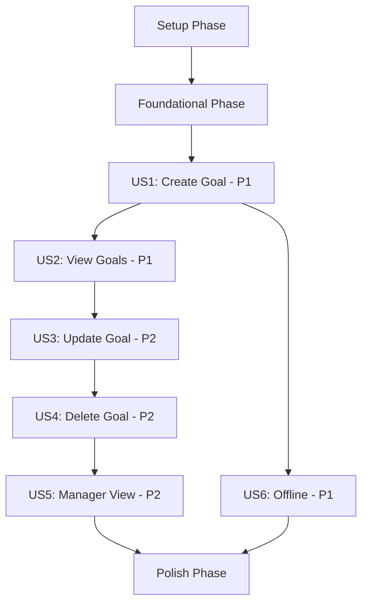

# Implementation Tasks - Personal Goal Creation Management

> **Feature**: 0001 - personal-goal-creation-management  
> **Status**: Planning  
> **Created**: 2025-11-07  
> **Last Updated**: 2025-11-07

---

## Task Format

All tasks follow this format:
```
- [ ] [TaskID] [P] [USx] Description with file path
```

**Legend**:
- `[TaskID]`: Sequential task number (T001, T002, etc.)
- `[P]`: Optional - Task can be executed in parallel
- `[USx]`: User Story reference (US1, US2, etc.) - only for user story tasks
- **Description**: Clear action with exact file path

---

## Task Summary

| Phase | Total Tasks | Completed | Remaining | Status |
|-------|-------------|-----------|-----------|--------|
| Setup | 8 | 0 | 8 | ⏳ Pending |
| Foundational | 10 | 0 | 10 | ⏳ Pending |
| US1 (Create Goal) | 15 | 0 | 15 | ⏳ Pending |
| US2 (View Goals) | 12 | 0 | 12 | ⏳ Pending |
| US3 (Update Goal) | 10 | 0 | 10 | ⏳ Pending |
| US4 (Delete Goal) | 8 | 0 | 8 | ⏳ Pending |
| US5 (Manager View) | 10 | 0 | 10 | ⏳ Pending |
| US6 (Offline) | 8 | 0 | 8 | ⏳ Pending |
| Polish | 12 | 0 | 12 | ⏳ Pending |
| **TOTAL** | **93** | **0** | **93** | ⏳ Pending |

---

## Dependencies & Execution Order

### User Story Completion Order



### Critical Path
Tasks that must be completed sequentially (blocking tasks):

1. **Setup Phase** → Create database migration, domain entities, DTOs
2. **Foundational Phase** → Repository, service, controller scaffolding
3. **User Story Dependencies**:
   - US2 depends on: US1 (need creation before viewing)
   - US3 depends on: US1, US2 (need goals to update)
   - US4 depends on: US1, US2 (need goals to delete)
   - US5 depends on: US1, US2 (manager views employee goals)
   - US6 can run parallel with US2 (offline caching)

### Parallel Execution Opportunities

**Phase 1 - Setup** (Batch 1 - all parallel):
- T003, T004, T005, T006, T007, T008 can run in parallel

**Phase 2 - Foundational** (Batch 2 - split by team):
- Backend: T010, T011, T012, T013 
- Frontend: T015, T016, T017, T018

**User Story 1** (Batch 3 - split by team):
- Backend: T019-T026
- Frontend: T027-T035
- Testing: T036-T039 (start after backend/frontend complete)

---

## Phase 1: Setup & Project Structure

**Objective**: Initialize project structure and prepare development environment

**Duration**: 8-10 hours

### Backend Setup (cpr-api)

- [ ] T001 Create database migration AddGoalsTableWithSoftDelete in `src/CPR.Infrastructure/Data/Migrations/YYYYMMDDHHMMSS_AddGoalsTableWithSoftDelete.cs`
- [ ] T002 Create domain entity Goal.cs in `src/CPR.Domain/Entities/Goal.cs`
- [ ] T003 [P] Create repository interface IGoalsRepository.cs in `src/CPR.Application/Interfaces/Repositories/IGoalsRepository.cs`
- [ ] T004 [P] Create service interface IGoalsService.cs in `src/CPR.Application/Interfaces/Services/IGoalsService.cs`
- [ ] T005 [P] Create CreateGoalDto.cs in `src/CPR.Application/DTOs/Goals/CreateGoalDto.cs`
- [ ] T006 [P] Create GoalDto.cs in `src/CPR.Application/DTOs/Goals/GoalDto.cs`
- [ ] T007 [P] Create UpdateGoalDto.cs in `src/CPR.Application/DTOs/Goals/UpdateGoalDto.cs`
- [ ] T008 [P] Create AvailableSkillDto.cs in `src/CPR.Application/DTOs/Goals/AvailableSkillDto.cs`

### Frontend Setup (cpr-ui)

- [ ] T009 [P] Create TypeScript types in `src/types/goals.ts`
- [ ] T010 [P] Create TypeScript DTOs in `src/dtos/goals.ts`
- [ ] T011 [P] Create component folder structure `src/components/Goals/`

---

## Phase 2: Foundational Implementation

**Objective**: Implement core infrastructure and shared services

**Duration**: 16-20 hours

### Backend Foundational Tasks

- [ ] T012 Create EF Core configuration GoalConfiguration.cs in `src/CPR.Infrastructure/Data/Configurations/GoalConfiguration.cs`
- [ ] T013 Implement repository GoalsRepository.cs in `src/CPR.Infrastructure/Repositories/Implementations/GoalsRepository.cs`
- [ ] T014 [P] Implement service GoalsService.cs in `src/CPR.Application/Services/Implementations/GoalsService.cs`
- [ ] T015 [P] Create API controller GoalsController.cs in `src/CPR.Api/Controllers/GoalsController.cs`
- [ ] T016 Create FluentValidation validator CreateGoalDtoValidator.cs in `src/CPR.Application/Validators/CreateGoalDtoValidator.cs`
- [ ] T017 Create FluentValidation validator UpdateGoalDtoValidator.cs in `src/CPR.Application/Validators/UpdateGoalDtoValidator.cs`
- [ ] T018 Configure dependency injection in `src/CPR.Api/Program.cs`
- [ ] T019 Add DbSet to ApplicationDbContext in `src/CPR.Infrastructure/Data/ApplicationDbContext.cs`
- [ ] T020 Run database migration and verify schema in development database

### Frontend Foundational Tasks

- [ ] T021 [P] Create goals API service in `src/services/goalsService.ts`
- [ ] T022 [P] Create Zustand store for tutorial in `src/stores/tutorialStore.ts`
- [ ] T023 [P] Create React Query hooks in `src/hooks/queries/useGoalsQuery.ts`
- [ ] T024 [P] Create React Query hooks in `src/hooks/queries/useAvailableSkillsQuery.ts`
- [ ] T025 [P] Create mutation hooks in `src/hooks/mutations/useGoalMutations.ts`
- [ ] T026 Configure React Query persistence for offline in `src/utils/offline/queryClientConfig.ts`

---

## Phase 3: User Story 1 - Create Personal Goal

**User Story**: As a CPR user, I want to create a new personal or professional development goal, so that I can track my career progress

**Acceptance Criteria**:
1. User can input goal description (10-500 characters)
2. User can set a target date (must be future date)
3. User selects a skill from dropdown (only next-level skills)
4. System validates all required fields before saving
5. System assigns unique UUID to new goal
6. System records creation timestamp and user ID
7. First-time users see tutorial explaining goal creation

**Duration**: 18-24 hours

### Backend Tasks (US1)

- [ ] T027 [P] [US1] Implement POST /api/v1/goals endpoint in GoalsController.cs method CreateGoal()
- [ ] T028 [P] [US1] Implement GET /api/v1/me/available-skills endpoint in GoalsController.cs method GetAvailableSkills()
- [ ] T029 [P] [US1] Add CreateGoal business logic to GoalsService.cs
- [ ] T030 [P] [US1] Add GetAvailableSkills logic to GoalsService.cs (filter by next level)
- [ ] T031 [US1] Add skill level validation in CreateGoalDtoValidator.cs
- [ ] T032 [US1] Add authorization policy check (authenticated users only)
- [ ] T033 [US1] Add error handling for duplicate/conflict scenarios

### Frontend Tasks (US1)

- [ ] T034 [P] [US1] Create GoalForm component in `src/components/Goals/GoalForm.tsx`
- [ ] T035 [P] [US1] Create SkillSelect component in `src/components/Goals/SkillSelect.tsx`
- [ ] T036 [P] [US1] Create TutorialDialog component in `src/components/Goals/TutorialDialog.tsx`
- [ ] T037 [US1] Add form validation with react-hook-form and zod
- [ ] T038 [US1] Integrate useCreateGoal mutation hook
- [ ] T039 [US1] Integrate useAvailableSkills query hook
- [ ] T040 [US1] Add internationalization keys to `src/locales/en/goals.json`
- [ ] T041 [US1] Add internationalization keys to `src/locales/en/tutorial.json`
- [ ] T042 [US1] Implement tutorial logic with tutorialStore
- [ ] T043 [US1] Add error handling and loading states
- [ ] T044 [US1] Add success notification on goal creation

### Testing Tasks (US1)

- [ ] T045 [P] [US1] Write backend unit tests in `tests/CPR.Tests/Services/GoalsServiceTests.cs` (CreateGoal method)
- [ ] T046 [P] [US1] Write backend unit tests in `tests/CPR.Tests/Validators/CreateGoalDtoValidatorTests.cs`
- [ ] T047 [P] [US1] Write backend integration tests in `tests/CPR.Tests/Integration/Controllers/GoalsControllerTests.cs` (POST endpoint)
- [ ] T048 [P] [US1] Write frontend component tests in `src/components/Goals/__tests__/GoalForm.test.tsx`
- [ ] T049 [P] [US1] Write frontend component tests in `src/components/Goals/__tests__/SkillSelect.test.tsx`
- [ ] T050 [P] [US1] Write frontend integration tests for goal creation flow

**Test Criteria for US1**:
- [ ] User can create goal with valid data
- [ ] Validation errors display for invalid data (description < 10 chars, past date, missing skill)
- [ ] Skill dropdown shows only next-level skills for user's position
- [ ] Tutorial appears on first visit only
- [ ] Success notification appears after creation

---

## Phase 4: User Story 2 - View My Goals

**User Story**: As a CPR user, I want to view all my goals, so that I can track my development objectives

**Acceptance Criteria**:
1. User can view list of all their goals
2. Goals display description, skill, target date, progress, status
3. Goals can be filtered by skill or status
4. System shows only goals owned by current user
5. UI loads within 1 second with up to 100 goals

**Duration**: 16-20 hours

### Backend Tasks (US2)

- [ ] T051 [P] [US2] Implement GET /api/v1/goals endpoint in GoalsController.cs method GetGoals()
- [ ] T052 [P] [US2] Implement GET /api/v1/me/goals endpoint in GoalsController.cs method GetMyGoals()
- [ ] T053 [P] [US2] Implement GET /api/v1/goals/{id} endpoint in GoalsController.cs method GetGoalById()
- [ ] T054 [US2] Add filtering logic (status, skill_id) to GoalsRepository
- [ ] T055 [US2] Add sorting logic (created_at, target_date, progress) to GoalsRepository
- [ ] T056 [US2] Add authorization check (owner or manager or admin)

### Frontend Tasks (US2)

- [ ] T057 [P] [US2] Create GoalsList component in `src/components/Goals/GoalsList.tsx`
- [ ] T058 [P] [US2] Create GoalCard component in `src/components/Goals/GoalCard.tsx`
- [ ] T059 [P] [US2] Create GoalFilters component in `src/components/Goals/GoalFilters.tsx`
- [ ] T060 [US2] Integrate useGoals query hook with filtering
- [ ] T061 [US2] Add status badges and progress bars to GoalCard
- [ ] T062 [US2] Add filter UI (status dropdown, skill dropdown)
- [ ] T063 [US2] Add sort UI (created_at, target_date, progress)
- [ ] T064 [US2] Add empty state when no goals
- [ ] T065 [US2] Add loading skeleton while fetching

### Testing Tasks (US2)

- [ ] T066 [P] [US2] Write backend unit tests for GetGoals in GoalsServiceTests.cs
- [ ] T067 [P] [US2] Write backend integration tests for GET endpoints in GoalsControllerTests.cs
- [ ] T068 [P] [US2] Write frontend component tests for GoalsList.test.tsx
- [ ] T069 [P] [US2] Write frontend component tests for GoalCard.test.tsx

**Test Criteria for US2**:
- [ ] User sees only their own goals
- [ ] Filtering by status works correctly
- [ ] Filtering by skill works correctly
- [ ] Sorting by date/progress works correctly
- [ ] UI loads within 1 second with 100 goals

---

## Phase 5: User Story 3 - Update Goal Progress

**User Story**: As a CPR user, I want to update my goal's description, target date, or skill, so that I can keep my development plan current

**Acceptance Criteria**:
1. User can modify goal description
2. User can change target date (past dates allowed on update)
3. User can change target skill (still must be next-level)
4. Updates show immediately in UI (optimistic update)
5. If sync fails, UI reverts to previous state and shows error
6. Only goal owner can update (unless admin)

**Duration**: 14-18 hours

### Backend Tasks (US3)

- [ ] T070 [P] [US3] Implement PATCH /api/v1/goals/{id} endpoint in GoalsController.cs method UpdateGoal()
- [ ] T071 [US3] Add UpdateGoal business logic to GoalsService.cs
- [ ] T072 [US3] Add partial update validation in UpdateGoalDtoValidator.cs
- [ ] T073 [US3] Add skill level validation for skill_id changes
- [ ] T074 [US3] Add authorization check (owner or admin only)

### Frontend Tasks (US3)

- [ ] T075 [P] [US3] Add edit mode to GoalCard or create GoalEditDialog component
- [ ] T076 [US3] Integrate useUpdateGoal mutation hook
- [ ] T077 [US3] Implement optimistic updates with React Query
- [ ] T078 [US3] Add rollback logic on update failure
- [ ] T079 [US3] Add error notification on sync failure
- [ ] T080 [US3] Add success notification on successful update

### Testing Tasks (US3)

- [ ] T081 [P] [US3] Write backend unit tests for UpdateGoal in GoalsServiceTests.cs
- [ ] T082 [P] [US3] Write backend integration tests for PATCH endpoint
- [ ] T083 [P] [US3] Write frontend tests for optimistic updates
- [ ] T084 [P] [US3] Write frontend tests for rollback on failure

**Test Criteria for US3**:
- [ ] User can update goal description, target date, skill
- [ ] Optimistic update shows immediately in UI
- [ ] Rollback works correctly on server error
- [ ] Authorization prevents non-owners from updating

---

## Phase 6: User Story 4 - Delete Goal

**User Story**: As a CPR user, I want to delete a goal, so that I can remove outdated or irrelevant objectives

**Acceptance Criteria**:
1. User can delete their own goals
2. System prompts for confirmation before deletion
3. Manager can delete direct report goals
4. Admin can delete any goal
5. Deletion is soft delete (sets is_deleted flag)
6. Deleted goals include deleted_at and deleted_by fields

**Duration**: 10-14 hours

### Backend Tasks (US4)

- [ ] T085 [P] [US4] Implement DELETE /api/v1/goals/{id} endpoint in GoalsController.cs method DeleteGoal()
- [ ] T086 [US4] Add SoftDelete logic to GoalsService.cs (set is_deleted, deleted_at, deleted_by)
- [ ] T087 [US4] Add authorization check (owner, manager via manager_id, or admin)
- [ ] T088 [US4] Add soft delete filter to all read queries (WHERE is_deleted = FALSE)

### Frontend Tasks (US4)

- [ ] T089 [P] [US4] Create DeleteConfirmDialog component in `src/components/Goals/DeleteConfirmDialog.tsx`
- [ ] T090 [US4] Integrate useDeleteGoal mutation hook
- [ ] T091 [US4] Add delete button to GoalCard
- [ ] T092 [US4] Add confirmation dialog before deletion
- [ ] T093 [US4] Add success notification on deletion
- [ ] T094 [US4] Remove deleted goal from UI immediately (optimistic)

### Testing Tasks (US4)

- [ ] T095 [P] [US4] Write backend unit tests for SoftDelete in GoalsServiceTests.cs
- [ ] T096 [P] [US4] Write backend integration tests for DELETE endpoint
- [ ] T097 [P] [US4] Write frontend tests for delete confirmation and execution

**Test Criteria for US4**:
- [ ] User can delete own goals
- [ ] Confirmation dialog appears before deletion
- [ ] Soft delete preserves data (is_deleted = TRUE)
- [ ] Manager can delete direct report goals
- [ ] Admin can delete any goal

---

## Phase 7: User Story 5 - Manager View Employee Goals

**User Story**: As a Manager, I want to view goals of my direct reports, so that I can support their development

**Acceptance Criteria**:
1. Manager can view all goals of direct reports
2. Manager can filter by employee or skill
3. System enforces manager-employee relationship via employees.manager_id
4. Only direct reports' goals visible (no skip-level)

**Duration**: 12-16 hours

### Backend Tasks (US5)

- [ ] T098 [P] [US5] Implement GET /api/v1/users/{userId}/goals endpoint in GoalsController.cs
- [ ] T099 [US5] Add IsDirectReport check in EmployeeRepository or EmployeeService
- [ ] T100 [US5] Add authorization logic for manager access (check manager_id relationship)
- [ ] T101 [US5] Add filtering by employee and skill to endpoint

### Frontend Tasks (US5)

- [ ] T102 [P] [US5] Create ManagerGoalsView component in `src/components/Goals/ManagerGoalsView.tsx`
- [ ] T103 [P] [US5] Create EmployeeSelect component for manager to choose direct report
- [ ] T104 [US5] Integrate useEmployeeGoals query hook
- [ ] T105 [US5] Add employee filter dropdown
- [ ] T106 [US5] Add skill filter dropdown
- [ ] T107 [US5] Show employee name with each goal

### Testing Tasks (US5)

- [ ] T108 [P] [US5] Write backend unit tests for IsDirectReport logic
- [ ] T109 [P] [US5] Write backend integration tests for manager authorization
- [ ] T110 [P] [US5] Write frontend tests for manager view

**Test Criteria for US5**:
- [ ] Manager can view direct reports' goals
- [ ] Manager cannot view non-direct-report goals
- [ ] Filter by employee works correctly
- [ ] Authorization enforced via manager_id FK

---

## Phase 8: User Story 6 - Offline Goal Management

**User Story**: As a CPR user, I want to manage goals when offline, so that I can work without internet connectivity

**Acceptance Criteria**:
1. Goals cached in IndexedDB for offline viewing
2. User can create goals offline (queued for sync)
3. User can view cached goals offline
4. Offline update/delete shows error message
5. When connection restored, offline-created goals sync to server
6. Offline indicator shows current sync status in UI

**Duration**: 10-14 hours

### Frontend Tasks (US6)

- [ ] T111 [US6] Configure React Query persistence with IndexedDB in queryClientConfig.ts
- [ ] T112 [US6] Add offline detection hook in `src/hooks/useOnlineStatus.ts`
- [ ] T113 [US6] Create OfflineIndicator component in `src/components/Common/OfflineIndicator.tsx`
- [ ] T114 [US6] Implement offline create queue with localforage
- [ ] T115 [US6] Implement sync logic when connection restored
- [ ] T116 [US6] Add error messages for offline update/delete attempts
- [ ] T117 [US6] Add offline badge to goals created offline
- [ ] T118 [US6] Test offline scenarios (create, view, attempted update/delete)

**Test Criteria for US6**:
- [ ] Goals cached in IndexedDB for offline viewing
- [ ] User can create goals offline (queued)
- [ ] Offline update shows error message
- [ ] Offline delete shows error message
- [ ] Sync works when connection restored
- [ ] Offline indicator visible when offline

---

## Phase 9: Polish & Cross-Cutting Concerns

**Objective**: Final improvements, optimizations, and documentation

**Duration**: 16-20 hours

### Documentation

- [ ] T119 Update Swagger/OpenAPI documentation for all 8 endpoints
- [ ] T120 Update README.md with goal management feature usage
- [ ] T121 Create user guide section in `docs/user-guide/personal-goals.md`
- [ ] T122 Document migration procedures in `docs/deployment/migration-guide.md`

### Performance Optimization

- [ ] T123 [P] Run EXPLAIN ANALYZE on goal queries and optimize if needed
- [ ] T124 [P] Add in-memory caching for available skills (rarely changes)
- [ ] T125 [P] Optimize React Query staleTime and cacheTime
- [ ] T126 [P] Add lazy loading for Tutorial component (code splitting)

### Security & Quality

- [ ] T127 Security audit: test authorization for all roles (employee/manager/admin)
- [ ] T128 Accessibility audit: WCAG 2.1 AA compliance check
- [ ] T129 Performance benchmarking: 100 concurrent users, <200ms API response
- [ ] T130 Code review and refactoring for code quality

### Deployment Preparation

- [ ] T131 Create deployment checklist in `docs/deployment/checklist.md`
- [ ] T132 Test migration scripts in staging environment
- [ ] T133 Prepare rollback procedures in `docs/deployment/rollback-procedures.md`
- [ ] T134 Update CI/CD pipeline if needed

---

## Parallel Execution Plan

### Optimal Task Batching

**Batch 1 - Setup** (all parallel, 8-10 hours):
- T003, T004, T005, T006, T007, T008, T009, T010, T011

**Batch 2 - Foundational Backend** (6-8 hours):
- T012, T013, T014, T015, T016, T017

**Batch 3 - Foundational Frontend** (4-6 hours):
- T021, T022, T023, T024, T025, T026

**Batch 4 - US1 Backend** (Backend Developer, 8-10 hours):
- T027, T028, T029, T030, T031, T032, T033

**Batch 5 - US1 Frontend** (Frontend Developer, parallel with Batch 4, 10-14 hours):
- T034, T035, T036, T037, T038, T039, T040, T041, T042, T043, T044

**Batch 6 - US1 Testing** (QA/Developer, 6-8 hours):
- T045, T046, T047, T048, T049, T050

**Continue pattern for US2-US6...**

---

## Task Validation Checklist

Before marking a task complete, verify:

- [ ] Code follows CPR naming conventions (snake_case JSON, PascalCase C#, camelCase TS)
- [ ] TypeScript/C# types are strongly typed (no `any`)
- [ ] API contracts match between backend and frontend
- [ ] Internationalization keys added for all UI text
- [ ] Error handling implemented
- [ ] Unit tests written and passing (>80% coverage goal)
- [ ] Code reviewed by peer
- [ ] Documentation updated (if applicable)

---

## Notes & Assumptions

**Assumptions**:
1. User authentication system (JWT) already exists and functional
2. Employee management system with manager_id relationships already exists
3. Skills taxonomy system already exists with skills and levels
4. Database schema can be modified without production impact (development phase)
5. Frontend components can reuse existing Material-UI patterns
6. React Query v5 and Zustand already configured in cpr-ui

**Known Issues**:
1. Progress percentage initially set to 0 (auto-calculation requires task management system integration in future)
2. Manager view is read-only (managers cannot edit direct reports' goals per spec clarification)

**Future Enhancements** (deferred):
1. Goal comments/feedback from managers
2. Goal analytics and reporting dashboard
3. Goal templates for common career paths
4. Goal reminders/notifications before target date
5. Integration with performance review system

---

## Change Log

| Date | Author | Changes |
|------|--------|---------|
| 2025-11-07 | GitHub Copilot | Initial task breakdown with 93 tasks across 9 phases |
