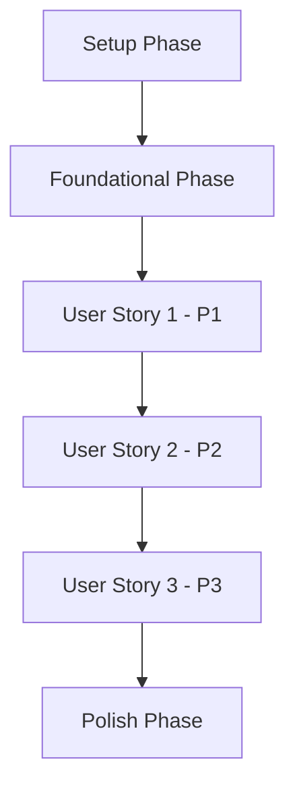

# Implementation Tasks - Personal Goal Creation Management

> **Feature**: 0001 - personal-goal-creation-management  
> **Status**: Planning  
> **Created**: 2025-11-07  
> **Last Updated**: 2025-11-07

---

## Task Format

All tasks follow this format:
```
- [ ] [TaskID] [P] [USx] Description with file path
```

**Legend**:
- `[TaskID]`: Sequential task number (T001, T002, etc.)
- `[P]`: Optional - Task can be executed in parallel
- `[USx]`: User Story reference (US1, US2, etc.) - only for user story tasks
- **Description**: Clear action with exact file path

---

## Task Summary

| Phase | Total Tasks | Completed | Remaining | Status |
|-------|-------------|-----------|-----------|--------|
| Setup | [X] | 0 | [X] | ⏳ Pending |
| Foundational | [X] | 0 | [X] | ⏳ Pending |
| User Story 1 | [X] | 0 | [X] | ⏳ Pending |
| User Story 2 | [X] | 0 | [X] | ⏳ Pending |
| Polish | [X] | 0 | [X] | ⏳ Pending |
| **TOTAL** | **[X]** | **0** | **[X]** | ⏳ Pending |

---

## Dependencies & Execution Order

### User Story Completion Order
Based on priorities from specification:



### Critical Path
Tasks that must be completed sequentially (blocking tasks):

1. **Setup Phase** → All tasks must complete before Foundational
2. **Foundational Phase** → Database migrations, base services
3. **User Story Dependencies**:
   - US2 depends on: US1 (reason)
   - US3 depends on: US1, US2 (reason)

### Parallel Execution Opportunities
Tasks marked with `[P]` can run in parallel within the same phase:

**Phase 1 - Setup**:
- T003 and T004 can run in parallel (different files, no dependencies)

**Phase 2 - Foundational**:
- T010, T011, T012 can run in parallel (independent services)

**User Story 1**:
- Frontend and backend tasks can run in parallel after contracts defined

---

## Phase 1: Setup & Project Structure

**Objective**: Initialize project structure and prepare development environment

**Duration**: [X hours]

### Backend Setup (cpr-api)

- [ ] T001 Create database migration for [feature] in `src/CPR.Infrastructure/Data/Migrations/`
- [ ] T002 Create domain entity `[EntityName].cs` in `src/CPR.Domain/Entities/`
- [ ] T003 [P] Create repository interface `I[Feature]Repository.cs` in `src/CPR.Application/Interfaces/Repositories/`
- [ ] T004 [P] Create service interface `I[Feature]Service.cs` in `src/CPR.Application/Interfaces/Services/`
- [ ] T005 [P] Create DTOs in `src/CPR.Application/DTOs/[Feature]/` folder

### Frontend Setup (cpr-ui)

- [ ] T006 [P] Create TypeScript types in `src/types/[feature].ts`
- [ ] T007 [P] Create TypeScript DTOs in `src/dtos/[feature].ts`
- [ ] T008 [P] Create component folder structure in `src/components/[Feature]/`

---

## Phase 2: Foundational Implementation

**Objective**: Implement core infrastructure and shared services

**Duration**: [X hours]

### Backend Foundational Tasks

- [ ] T009 Implement repository `[Feature]Repository.cs` in `src/CPR.Infrastructure/Repositories/Implementations/`
- [ ] T010 [P] Implement service `[Feature]Service.cs` in `src/CPR.Application/Services/Implementations/`
- [ ] T011 [P] Create API controller `[Feature]Controller.cs` in `src/CPR.Api/Controllers/`
- [ ] T012 [P] Add validation attributes to DTOs in `src/CPR.Application/DTOs/[Feature]/`
- [ ] T013 Configure dependency injection in `src/CPR.Api/Program.cs`
- [ ] T014 Add database context configuration in `src/CPR.Infrastructure/Data/ApplicationDbContext.cs`

### Frontend Foundational Tasks

- [ ] T015 [P] Create Zustand store in `src/stores/[feature]Store.ts`
- [ ] T016 [P] Create API service in `src/services/[feature]Service.ts`
- [ ] T017 [P] Create React Query hooks in `src/hooks/queries/use[Feature]Query.ts`
- [ ] T018 [P] Create mutation hooks in `src/hooks/mutations/use[Feature]Mutations.ts`

---

## Phase 3: User Story 1 - [Story Title]

**User Story**: As a [user type], I want [action], so that [benefit]

**Acceptance Criteria**:
1. [Criterion 1]
2. [Criterion 2]
3. [Criterion 3]

**Duration**: [X hours]

### Backend Tasks (US1)

- [ ] T019 [P] [US1] Implement GET endpoint in `[Feature]Controller.cs` method `Get[Resource]()`
- [ ] T020 [P] [US1] Implement POST endpoint in `[Feature]Controller.cs` method `Create[Resource]()`
- [ ] T021 [P] [US1] Add business logic to `[Feature]Service.cs` for creation workflow
- [ ] T022 [US1] Add authorization policy in `src/CPR.Api/Authorization/[Feature]Policy.cs`
- [ ] T023 [P] [US1] Create validator class in `src/CPR.Application/Validators/[Feature]Validator.cs`

### Frontend Tasks (US1)

- [ ] T024 [P] [US1] Create main component `[Feature]List.tsx` in `src/components/[Feature]/`
- [ ] T025 [P] [US1] Create form component `[Feature]Form.tsx` in `src/components/[Feature]/`
- [ ] T026 [P] [US1] Add internationalization keys to `src/locales/en/[feature].json`
- [ ] T027 [US1] Implement offline caching in `src/services/[feature]Service.ts`
- [ ] T028 [US1] Add error handling and loading states to components
- [ ] T029 [US1] Integrate components with routes in `src/App.tsx`

### Testing Tasks (US1)

- [ ] T030 [P] [US1] Write backend unit tests in `tests/CPR.Tests/Services/[Feature]ServiceTests.cs`
- [ ] T031 [P] [US1] Write backend integration tests in `tests/CPR.Tests/Controllers/[Feature]ControllerTests.cs`
- [ ] T032 [P] [US1] Write frontend component tests in `src/components/[Feature]/__tests__/[Feature]List.test.tsx`
- [ ] T033 [P] [US1] Write frontend integration tests in `src/components/[Feature]/__tests__/[Feature].integration.test.tsx`

**Independent Test Criteria for US1**:
- [ ] User can [action] successfully
- [ ] Validation errors display correctly
- [ ] Offline mode works as expected
- [ ] All UI text is internationalized

---

## Phase 4: User Story 2 - [Story Title]

**User Story**: As a [user type], I want [action], so that [benefit]

**Acceptance Criteria**:
1. [Criterion 1]
2. [Criterion 2]
3. [Criterion 3]

**Dependencies**: Requires User Story 1 completion

**Duration**: [X hours]

### Backend Tasks (US2)

- [ ] T034 [P] [US2] Implement PUT endpoint in `[Feature]Controller.cs` method `Update[Resource]()`
- [ ] T035 [P] [US2] Implement DELETE endpoint in `[Feature]Controller.cs` method `Delete[Resource]()`
- [ ] T036 [US2] Add update business logic to `[Feature]Service.cs`
- [ ] T037 [US2] Add delete business logic to `[Feature]Service.cs`
- [ ] T038 [P] [US2] Update validators for edit scenarios in `[Feature]Validator.cs`

### Frontend Tasks (US2)

- [ ] T039 [P] [US2] Create edit component `[Feature]Edit.tsx` in `src/components/[Feature]/`
- [ ] T040 [P] [US2] Create delete confirmation dialog in `src/components/[Feature]/DeleteDialog.tsx`
- [ ] T041 [US2] Add edit/delete actions to list component
- [ ] T042 [US2] Update Zustand store with edit/delete actions
- [ ] T043 [P] [US2] Add internationalization for edit/delete features

### Testing Tasks (US2)

- [ ] T044 [P] [US2] Write backend tests for update in `[Feature]ServiceTests.cs`
- [ ] T045 [P] [US2] Write backend tests for delete in `[Feature]ServiceTests.cs`
- [ ] T046 [P] [US2] Write frontend tests for edit component
- [ ] T047 [P] [US2] Write frontend tests for delete functionality

**Independent Test Criteria for US2**:
- [ ] User can edit [resource] successfully
- [ ] User can delete [resource] successfully
- [ ] Confirmation dialog appears before delete
- [ ] Optimistic updates work correctly

---

## Phase 5: User Story 3 - [Story Title]

[Repeat pattern for additional user stories]

---

## Phase X: Polish & Cross-Cutting Concerns

**Objective**: Final improvements, optimizations, and documentation

**Duration**: [X hours]

### Documentation

- [ ] T0XX Update API documentation in Swagger/OpenAPI
- [ ] T0XX Update README.md with feature usage
- [ ] T0XX Create user guide section for [feature]
- [ ] T0XX Document migration procedures

### Performance Optimization

- [ ] T0XX [P] Add database indexes based on query patterns
- [ ] T0XX [P] Implement caching strategy (Redis/in-memory)
- [ ] T0XX [P] Optimize frontend bundle size
- [ ] T0XX [P] Add React Query cache configuration

### Security & Quality

- [ ] T0XX Security audit and penetration testing
- [ ] T0XX Accessibility audit (WCAG 2.1 AA)
- [ ] T0XX Performance benchmarking against targets
- [ ] T0XX Code review and refactoring

### Deployment Preparation

- [ ] T0XX Create deployment checklist
- [ ] T0XX Test migration scripts in staging
- [ ] T0XX Prepare rollback procedures
- [ ] T0XX Update CI/CD pipeline if needed

---

## Testing Strategy

### Unit Tests
**Target**: >80% code coverage

**Backend**:
- Services: Test business logic, validation, error handling
- Repositories: Test data access, queries, CRUD operations
- Validators: Test all validation rules

**Frontend**:
- Components: Test rendering, user interactions, edge cases
- Hooks: Test state management, API calls
- Services: Test API integration, error handling

### Integration Tests

**Backend**:
- API endpoints: Test full request/response cycle
- Database: Test migrations, constraints, transactions
- Authorization: Test policy enforcement

**Frontend**:
- User flows: Test complete user journeys
- API integration: Test with MSW mock handlers
- State management: Test cross-component interactions

### Performance Tests

- API response times under load
- Database query performance
- Frontend rendering performance
- Concurrent user scenarios

### Acceptance Tests

Map each user story acceptance criterion to specific tests:

**User Story 1**:
- AC1: [Test description]
- AC2: [Test description]
- AC3: [Test description]

---

## Parallel Execution Plan

### Optimal Task Batching

**Batch 1** (can all run in parallel):
- T003: Backend repository interface
- T004: Backend service interface
- T006: Frontend types
- T007: Frontend DTOs

**Batch 2** (after Batch 1 complete):
- T010: Backend service implementation
- T015: Frontend Zustand store
- T016: Frontend API service

**Batch 3** (split by team/developer):
- **Backend Developer**: T019-T023 (User Story 1 backend)
- **Frontend Developer**: T024-T029 (User Story 1 frontend)
- **QA/Developer**: T030-T033 (User Story 1 tests) - can start after T019 or T024

---

## Implementation Strategy

### MVP Scope
**Minimum Viable Product** includes:
- ✅ User Story 1 (P1 - highest priority)
- ✅ Core functionality only
- ✅ Basic testing coverage (>70%)

**MVP Excludes**:
- ❌ User Story 2+ (can be added incrementally)
- ❌ Advanced features
- ❌ Performance optimizations (unless critical)

### Incremental Delivery Plan

1. **Sprint 1**: Setup + Foundational + User Story 1
2. **Sprint 2**: User Story 2 + Testing
3. **Sprint 3**: User Story 3 + Polish
4. **Sprint 4**: Performance + Documentation + Deployment

---

## Task Validation Checklist

Before marking a task complete, verify:

- [ ] Code follows CPR naming conventions
- [ ] TypeScript/C# types are strongly typed (no `any`)
- [ ] API contracts match between backend and frontend
- [ ] Internationalization keys added for UI text
- [ ] Error handling implemented
- [ ] Unit tests written and passing
- [ ] Code reviewed by peer
- [ ] Documentation updated

---

## Notes & Assumptions

**Assumptions**:
1. [List key assumptions made during planning]
2. [e.g., "Database schema can be modified without production impact"]
3. [e.g., "Frontend components can reuse existing Material-UI patterns"]

**Known Issues**:
1. [List any known limitations or technical debt]

**Future Enhancements**:
1. [Features deferred to future iterations]

---

## Change Log

| Date | Author | Changes |
|------|--------|---------|
| 2025-11-07 | [Name] | Initial task breakdown created |
