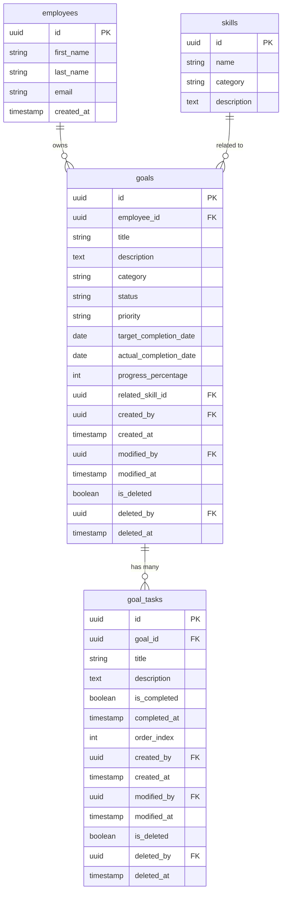

# Data Model - Personal Goal Management

> **Feature**: 0001 - personal-goal-management  
> **Status**: Planning  
> **Created**: 2025-11-11  

---

## Overview

This document defines the data model for the Personal Goal Management feature. The backend database schema already exists with `goals` and `goal_tasks` tables. This document describes the existing schema and the migration needed to add task ordering support.

**Database**: PostgreSQL 16  
**ORM**: Entity Framework Core 8  
**Schema**: `public`

---

## Entity Relationship Diagram



---

## Entities

### 1. Goal (Existing)

**Table Name**: `goals`

**Description**: Represents a personal goal for career or skill development

**Relationships**:
- Belongs to: `employees` (many-to-one) - goal owner
- Has many: `goal_tasks` (one-to-many) - tasks for breaking down goal
- References: `skills` (many-to-one, optional) - related skill taxonomy

#### Database Schema

```sql
-- Table already exists - documented here for reference
CREATE TABLE goals (
    id UUID PRIMARY KEY DEFAULT gen_random_uuid(),
    employee_id UUID NOT NULL,
    title VARCHAR(200) NOT NULL,
    description TEXT,
    category VARCHAR(50) NOT NULL,
    status VARCHAR(20) NOT NULL DEFAULT 'not_started',
    priority VARCHAR(20) NOT NULL DEFAULT 'medium',
    target_completion_date DATE,
    actual_completion_date DATE,
    progress_percentage INT NOT NULL DEFAULT 0,
    related_skill_id UUID,
    -- Audit columns (per constitution.md and data.md)
    created_by UUID NULL REFERENCES users(id),
    created_at TIMESTAMPTZ DEFAULT CURRENT_TIMESTAMP,
    modified_by UUID NULL REFERENCES users(id),
    modified_at TIMESTAMPTZ NULL,
    is_deleted BOOLEAN DEFAULT FALSE,
    deleted_by UUID NULL REFERENCES users(id),
    deleted_at TIMESTAMPTZ NULL,
    
    -- Constraints
    CONSTRAINT fk_goals_employee FOREIGN KEY (employee_id) 
        REFERENCES employees(id) ON DELETE CASCADE,
    CONSTRAINT fk_goals_skill FOREIGN KEY (related_skill_id) 
        REFERENCES skills(id) ON DELETE SET NULL,
    CONSTRAINT chk_goals_category 
        CHECK (category IN ('skill', 'career', 'project', 'personal')),
    CONSTRAINT chk_goals_status 
        CHECK (status IN ('not_started', 'in_progress', 'completed', 'on_hold', 'cancelled')),
    CONSTRAINT chk_goals_priority 
        CHECK (priority IN ('low', 'medium', 'high', 'critical')),
    CONSTRAINT chk_goals_progress 
        CHECK (progress_percentage >= 0 AND progress_percentage <= 100)
);

-- Indexes (already exist)
CREATE INDEX idx_goals_employee_id ON goals(employee_id);
CREATE INDEX idx_goals_status ON goals(status);
CREATE INDEX idx_goals_category ON goals(category);
CREATE INDEX idx_goals_priority ON goals(priority);
CREATE INDEX idx_goals_related_skill_id ON goals(related_skill_id);
CREATE INDEX idx_goals_target_date ON goals(target_completion_date);
CREATE INDEX idx_goals_created_at ON goals(created_at DESC);

-- Trigger for modified_at (already exists)
CREATE TRIGGER update_goals_modified_at
    BEFORE UPDATE ON goals
    FOR EACH ROW
    EXECUTE FUNCTION update_modified_at_column();

-- Trigger for auto-setting actual_completion_date (already exists)
CREATE OR REPLACE FUNCTION set_goal_completion_date()
RETURNS TRIGGER AS $$
BEGIN
    -- If status changes to 'completed', set actual_completion_date
    IF NEW.status = 'completed' AND OLD.status != 'completed' THEN
        NEW.actual_completion_date = CURRENT_DATE;
    END IF;
    
    -- If actual_completion_date is set, change status to 'completed'
    IF NEW.actual_completion_date IS NOT NULL AND OLD.actual_completion_date IS NULL THEN
        NEW.status = 'completed';
    END IF;
    
    RETURN NEW;
END;
$$ LANGUAGE plpgsql;

CREATE TRIGGER trigger_set_goal_completion_date
    BEFORE UPDATE ON goals
    FOR EACH ROW
    EXECUTE FUNCTION set_goal_completion_date();

-- Trigger for auto-calculating progress_percentage from tasks (already exists)
CREATE OR REPLACE FUNCTION update_goal_progress()
RETURNS TRIGGER AS $$
DECLARE
    total_tasks INT;
    completed_tasks INT;
    new_progress INT;
BEGIN
    -- Count total and completed tasks for the goal
    SELECT COUNT(*), COUNT(*) FILTER (WHERE is_completed = TRUE)
    INTO total_tasks, completed_tasks
    FROM goal_tasks
    WHERE goal_id = NEW.goal_id;
    
    -- Calculate progress percentage
    IF total_tasks = 0 THEN
        new_progress = 0;
    ELSE
        new_progress = ROUND((completed_tasks::DECIMAL / total_tasks::DECIMAL) * 100);
    END IF;
    
    -- Update goal progress
    UPDATE goals
    SET progress_percentage = new_progress,
        modified_at = CURRENT_TIMESTAMP
    WHERE id = NEW.goal_id;
    
    RETURN NEW;
END;
$$ LANGUAGE plpgsql;

CREATE TRIGGER trigger_update_goal_progress_on_task_change
    AFTER INSERT OR UPDATE OR DELETE ON goal_tasks
    FOR EACH ROW
    EXECUTE FUNCTION update_goal_progress();
```

#### Column Details

| Column | Type | Nullable | Default | Description | Validation |
|--------|------|----------|---------|-------------|------------|
| `id` | UUID | No | `gen_random_uuid()` | Primary key | - |
| `employee_id` | UUID | No | - | Goal owner | FK to employees.id |
| `title` | VARCHAR(200) | No | - | Goal title | 3-200 characters |
| `description` | TEXT | Yes | NULL | Detailed description | Max 2000 characters |
| `category` | VARCHAR(50) | No | - | Goal category | Enum: skill, career, project, personal |
| `status` | VARCHAR(20) | No | `not_started` | Current status | Enum: not_started, in_progress, completed, on_hold, cancelled |
| `priority` | VARCHAR(20) | No | `medium` | Goal priority | Enum: low, medium, high, critical |
| `target_completion_date` | DATE | Yes | NULL | Target date | Must be future date if set |
| `actual_completion_date` | DATE | Yes | NULL | Actual completion date | Auto-set when status=completed |
| `progress_percentage` | INT | No | 0 | Progress (0-100) | Auto-calculated from tasks, can be manually overridden |
| `related_skill_id` | UUID | Yes | NULL | Related skill | FK to skills.id (optional) |
| `created_by` | UUID | Yes | NULL | User who created record | FK to users.id |
| `created_at` | TIMESTAMPTZ | No | CURRENT_TIMESTAMP | Creation timestamp | Immutable |
| `modified_by` | UUID | Yes | NULL | User who last modified | FK to users.id |
| `modified_at` | TIMESTAMPTZ | Yes | NULL | Last modification timestamp | Auto-updated by trigger |
| `is_deleted` | BOOLEAN | No | FALSE | Soft delete flag | Admin can delete |
| `deleted_by` | UUID | Yes | NULL | User who deleted record | FK to users.id |
| `deleted_at` | TIMESTAMPTZ | Yes | NULL | Deletion timestamp | Set when is_deleted=TRUE |

#### C# Domain Model

**Location**: `src/CPR.Domain/Entities/Goal.cs` (already exists)

```csharp
public class Goal
{
    public Guid Id { get; set; }
    public Guid EmployeeId { get; set; }
    public string Title { get; set; } = string.Empty;
    public string? Description { get; set; }
    public GoalCategory Category { get; set; }
    public GoalStatus Status { get; set; }
    public GoalPriority Priority { get; set; }
    public DateTime? TargetCompletionDate { get; set; }
    public DateTime? ActualCompletionDate { get; set; }
    public int ProgressPercentage { get; set; }
    public Guid? RelatedSkillId { get; set; }
    public DateTime CreatedAt { get; set; }
    public DateTime UpdatedAt { get; set; }
    public bool IsDeleted { get; set; }
    
    // Navigation properties
    public Employee Employee { get; set; } = null!;
    public Skill? RelatedSkill { get; set; }
    public ICollection<GoalTask> Tasks { get; set; } = new List<GoalTask>();
}

public enum GoalCategory
{
    Skill,
    Career,
    Project,
    Personal
}

public enum GoalStatus
{
    NotStarted,
    InProgress,
    Completed,
    OnHold,
    Cancelled
}

public enum GoalPriority
{
    Low,
    Medium,
    High,
    Critical
}
```

---

### 2. GoalTask (Existing + Migration Required)

**Table Name**: `goal_tasks`

**Description**: Represents a task within a goal for granular progress tracking

**Relationships**:
- Belongs to: `goals` (many-to-one) - parent goal

#### Database Schema

```sql
-- Table already exists - documented here for reference
CREATE TABLE goal_tasks (
    id UUID PRIMARY KEY DEFAULT gen_random_uuid(),
    goal_id UUID NOT NULL,
    title VARCHAR(200) NOT NULL,
    description TEXT,
    is_completed BOOLEAN NOT NULL DEFAULT FALSE,
    completed_at TIMESTAMPTZ,
    -- Audit columns (per constitution.md and data.md)
    created_by UUID NULL REFERENCES users(id),
    created_at TIMESTAMPTZ DEFAULT CURRENT_TIMESTAMP,
    modified_by UUID NULL REFERENCES users(id),
    modified_at TIMESTAMPTZ NULL,
    is_deleted BOOLEAN DEFAULT FALSE,
    deleted_by UUID NULL REFERENCES users(id),
    deleted_at TIMESTAMPTZ NULL,
    
    -- Constraints
    CONSTRAINT fk_goal_tasks_goal FOREIGN KEY (goal_id) 
        REFERENCES goals(id) ON DELETE CASCADE
);

-- Indexes (already exist)
CREATE INDEX idx_goal_tasks_goal_id ON goal_tasks(goal_id);
CREATE INDEX idx_goal_tasks_is_completed ON goal_tasks(is_completed);

-- Trigger for modified_at (already exists)
CREATE TRIGGER update_goal_tasks_modified_at
    BEFORE UPDATE ON goal_tasks
    FOR EACH ROW
    EXECUTE FUNCTION update_modified_at_column();

-- Trigger for auto-setting completed_at (already exists)
CREATE OR REPLACE FUNCTION set_task_completed_at()
RETURNS TRIGGER AS $$
BEGIN
    -- If is_completed changes to TRUE, set completed_at
    IF NEW.is_completed = TRUE AND (OLD.is_completed IS NULL OR OLD.is_completed = FALSE) THEN
        NEW.completed_at = NOW();
    END IF;
    
    -- If is_completed changes to FALSE, clear completed_at
    IF NEW.is_completed = FALSE AND OLD.is_completed = TRUE THEN
        NEW.completed_at = NULL;
    END IF;
    
    RETURN NEW;
END;
$$ LANGUAGE plpgsql;

CREATE TRIGGER trigger_set_task_completed_at
    BEFORE UPDATE ON goal_tasks
    FOR EACH ROW
    EXECUTE FUNCTION set_task_completed_at();
```

#### Column Details

| Column | Type | Nullable | Default | Description | Validation |
|--------|------|----------|---------|-------------|------------|
| `id` | UUID | No | `gen_random_uuid()` | Primary key | - |
| `goal_id` | UUID | No | - | Parent goal | FK to goals.id |
| `title` | VARCHAR(200) | No | - | Task title | 1-200 characters |
| `description` | TEXT | Yes | NULL | Task description | Max 1000 characters |
| `is_completed` | BOOLEAN | No | FALSE | Completion status | - |
| `completed_at` | TIMESTAMPTZ | Yes | NULL | Completion timestamp | Auto-set when is_completed=TRUE |
| `order_index` | INT | No | 0 | Display order | **TO BE ADDED in migration** |
| `created_by` | UUID | Yes | NULL | User who created record | FK to users.id |
| `created_at` | TIMESTAMPTZ | No | CURRENT_TIMESTAMP | Creation timestamp | Immutable |
| `modified_by` | UUID | Yes | NULL | User who last modified | FK to users.id |
| `modified_at` | TIMESTAMPTZ | Yes | NULL | Last modification timestamp | Auto-updated by trigger |
| `is_deleted` | BOOLEAN | No | FALSE | Soft delete flag | - |
| `deleted_by` | UUID | Yes | NULL | User who deleted record | FK to users.id |
| `deleted_at` | TIMESTAMPTZ | Yes | NULL | Deletion timestamp | Set when is_deleted=TRUE |

#### C# Domain Model

**Location**: `src/CPR.Domain/Entities/GoalTask.cs` (already exists, needs order_index property)

```csharp
public class GoalTask
{
    public Guid Id { get; set; }
    public Guid GoalId { get; set; }
    public string Title { get; set; } = string.Empty;
    public string? Description { get; set; }
    public bool IsCompleted { get; set; }
    public DateTime? CompletedAt { get; set; }
    public int OrderIndex { get; set; } // NEW PROPERTY
    public DateTime CreatedAt { get; set; }
    public DateTime UpdatedAt { get; set; }
    
    // Navigation property
    public Goal Goal { get; set; } = null!;
}
```

---

## Database Migration

### Migration: AddOrderIndexToGoalTasks

**Purpose**: Add `order_index` column to `goal_tasks` table to support drag-and-drop reordering

**Migration File**: `src/CPR.Infrastructure/Persistence/Migrations/XXXXXX_AddOrderIndexToGoalTasks.cs`

#### Up Migration

```sql
-- Step 1: Add order_index column with default 0
ALTER TABLE goal_tasks
ADD COLUMN order_index INT NOT NULL DEFAULT 0;

-- Step 2: Populate order_index with row numbers ordered by created_at
UPDATE goal_tasks
SET order_index = subquery.row_num - 1
FROM (
    SELECT id, ROW_NUMBER() OVER (PARTITION BY goal_id ORDER BY created_at) as row_num
    FROM goal_tasks
) AS subquery
WHERE goal_tasks.id = subquery.id;

-- Step 3: Create composite index for efficient ordering queries
CREATE INDEX idx_goal_tasks_goal_id_order ON goal_tasks(goal_id, order_index);

-- Step 4: Add check constraint to ensure non-negative order_index
ALTER TABLE goal_tasks
ADD CONSTRAINT chk_goal_tasks_order_index CHECK (order_index >= 0);
```

#### Down Migration (Rollback)

```sql
-- Remove constraint
ALTER TABLE goal_tasks
DROP CONSTRAINT IF EXISTS chk_goal_tasks_order_index;

-- Remove index
DROP INDEX IF EXISTS idx_goal_tasks_goal_id_order;

-- Remove column
ALTER TABLE goal_tasks
DROP COLUMN IF EXISTS order_index;
```

#### Entity Framework Core Migration (C#)

```csharp
public partial class AddOrderIndexToGoalTasks : Migration
{
    protected override void Up(MigrationBuilder migrationBuilder)
    {
        // Add column
        migrationBuilder.AddColumn<int>(
            name: "order_index",
            table: "goal_tasks",
            type: "integer",
            nullable: false,
            defaultValue: 0);

        // Populate with row numbers
        migrationBuilder.Sql(@"
            UPDATE goal_tasks
            SET order_index = subquery.row_num - 1
            FROM (
                SELECT id, ROW_NUMBER() OVER (PARTITION BY goal_id ORDER BY created_at) as row_num
                FROM goal_tasks
            ) AS subquery
            WHERE goal_tasks.id = subquery.id;
        ");

        // Create composite index
        migrationBuilder.CreateIndex(
            name: "idx_goal_tasks_goal_id_order",
            table: "goal_tasks",
            columns: new[] { "goal_id", "order_index" });

        // Add check constraint
        migrationBuilder.AddCheckConstraint(
            name: "chk_goal_tasks_order_index",
            table: "goal_tasks",
            sql: "order_index >= 0");
    }

    protected override void Down(MigrationBuilder migrationBuilder)
    {
        // Remove check constraint
        migrationBuilder.DropCheckConstraint(
            name: "chk_goal_tasks_order_index",
            table: "goal_tasks");

        // Remove index
        migrationBuilder.DropIndex(
            name: "idx_goal_tasks_goal_id_order",
            table: "goal_tasks");

        // Remove column
        migrationBuilder.DropColumn(
            name: "order_index",
            table: "goal_tasks");
    }
}
```

---

## Data Constraints & Business Rules

### Goal Constraints

1. **Title Uniqueness**: No explicit uniqueness constraint - users can have multiple goals with same title
2. **Date Logic**: `target_completion_date` must be in the future at creation time
3. **Status Transitions**: 
   - `completed` → requires `actual_completion_date` (auto-set by trigger)
   - `cancelled` → progress_percentage remains frozen
4. **Soft Delete**: `is_deleted=TRUE` goals are hidden from queries but preserved for audit
5. **Cascading Delete**: Deleting goal deletes all associated tasks (ON DELETE CASCADE)

### GoalTask Constraints

1. **Order Uniqueness**: `order_index` must be unique per goal (enforced by application logic, not database)
2. **Order Gaps**: Gaps in `order_index` are allowed but discouraged (application should reindex on delete)
3. **Completion Logic**: Setting `is_completed=TRUE` auto-sets `completed_at` (trigger)
4. **Progress Calculation**: Task completion triggers recalculation of parent goal's `progress_percentage`

---

## Indexes & Performance

### Existing Indexes

| Index Name | Table | Columns | Type | Purpose |
|------------|-------|---------|------|---------|
| `idx_goals_employee_id` | goals | employee_id | B-tree | Filter by employee |
| `idx_goals_status` | goals | status | B-tree | Filter by status |
| `idx_goals_category` | goals | category | B-tree | Filter by category |
| `idx_goals_priority` | goals | priority | B-tree | Sort by priority |
| `idx_goals_target_date` | goals | target_completion_date | B-tree | Sort by due date |
| `idx_goals_created_at` | goals | created_at DESC | B-tree | Sort by creation date |
| `idx_goal_tasks_goal_id` | goal_tasks | goal_id | B-tree | Join goals with tasks |
| `idx_goal_tasks_is_completed` | goal_tasks | is_completed | B-tree | Filter completed tasks |

### New Index (Migration)

| Index Name | Table | Columns | Type | Purpose |
|------------|-------|---------|------|---------|
| `idx_goal_tasks_goal_id_order` | goal_tasks | (goal_id, order_index) | B-tree Composite | Efficient ordering within goal |

### Query Performance Targets

- **List goals** (filtered, sorted): < 100ms for 500 goals
- **Get goal with tasks**: < 50ms (single query with join)
- **Reorder tasks**: < 200ms (batch update of 20 tasks)
- **Calculate progress**: < 10ms (trigger-based, runs on task update)

---

## Data Seeding (Development/Testing)

**Location**: `src/CPR.Infrastructure/Persistence/Seeds/GoalSeeder.cs`

```csharp
public static class GoalSeeder
{
    public static void SeedGoals(CPRDbContext context)
    {
        if (context.Goals.Any()) return; // Skip if data exists
        
        var employeeId = context.Employees.First().Id; // Get test employee
        
        var sampleGoals = new[]
        {
            new Goal
            {
                EmployeeId = employeeId,
                Title = "Master React Performance Optimization",
                Description = "Learn advanced React performance patterns",
                Category = GoalCategory.Skill,
                Status = GoalStatus.InProgress,
                Priority = GoalPriority.High,
                TargetCompletionDate = DateTime.Now.AddMonths(3),
                ProgressPercentage = 40
            },
            new Goal
            {
                EmployeeId = employeeId,
                Title = "Complete Senior Developer Certification",
                Description = "Achieve senior developer certification",
                Category = GoalCategory.Career,
                Status = GoalStatus.NotStarted,
                Priority = GoalPriority.Critical,
                TargetCompletionDate = DateTime.Now.AddMonths(6),
                ProgressPercentage = 0
            }
        };
        
        context.Goals.AddRange(sampleGoals);
        context.SaveChanges();
        
        // Add sample tasks
        var goal = context.Goals.First();
        var sampleTasks = new[]
        {
            new GoalTask
            {
                GoalId = goal.Id,
                Title = "Study React.memo and useMemo",
                Description = "Complete course module",
                IsCompleted = true,
                OrderIndex = 0
            },
            new GoalTask
            {
                GoalId = goal.Id,
                Title = "Implement lazy loading",
                Description = "Apply to project",
                IsCompleted = false,
                OrderIndex = 1
            }
        };
        
        context.GoalTasks.AddRange(sampleTasks);
        context.SaveChanges();
    }
}
```

---

## TypeScript Type Definitions

**Location**: `cpr-ui/src/types/goal.types.ts`

```typescript
export interface GoalDto {
  id: string;
  employee_id: string;
  title: string;
  description: string | null;
  category: GoalCategory;
  status: GoalStatus;
  priority: GoalPriority;
  target_completion_date: string | null; // ISO 8601 date
  actual_completion_date: string | null; // ISO 8601 date
  progress_percentage: number; // 0-100
  related_skill_id: string | null;
  created_by: string | null;
  created_at: string; // ISO 8601 datetime
  modified_by: string | null;
  modified_at: string | null; // ISO 8601 datetime
  is_deleted: boolean;
  deleted_by: string | null;
  deleted_at: string | null; // ISO 8601 datetime
  tasks: GoalTaskDto[];
}

export interface GoalTaskDto {
  id: string;
  goal_id: string;
  title: string;
  description: string | null;
  is_completed: boolean;
  completed_at: string | null; // ISO 8601 datetime
  order_index: number;
  created_by: string | null;
  created_at: string; // ISO 8601 datetime
  modified_by: string | null;
  modified_at: string | null; // ISO 8601 datetime
  is_deleted: boolean;
  deleted_by: string | null;
  deleted_at: string | null; // ISO 8601 datetime
}

export type GoalCategory = 'skill' | 'career' | 'project' | 'personal';
export type GoalStatus = 'not_started' | 'in_progress' | 'completed' | 'on_hold' | 'cancelled';
export type GoalPriority = 'low' | 'medium' | 'high' | 'critical';
```

---

## Backup & Recovery

### Backup Strategy

- **Full backup**: Daily at 2 AM UTC
- **Incremental backup**: Every 6 hours
- **Retention**: 30 days

### Restore Procedure

```sql
-- Restore from backup
pg_restore -U postgres -d cpr_production -t goals -t goal_tasks backup_file.dump

-- Verify data integrity
SELECT COUNT(*) FROM goals;
SELECT COUNT(*) FROM goal_tasks;

-- Rebuild indexes
REINDEX TABLE goals;
REINDEX TABLE goal_tasks;
```

---

## Change Log

| Date | Author | Changes |
|------|--------|---------|
| 2025-11-11 | Agent | Initial data model documentation |
| 2025-11-11 | Agent | Added migration for order_index column |
