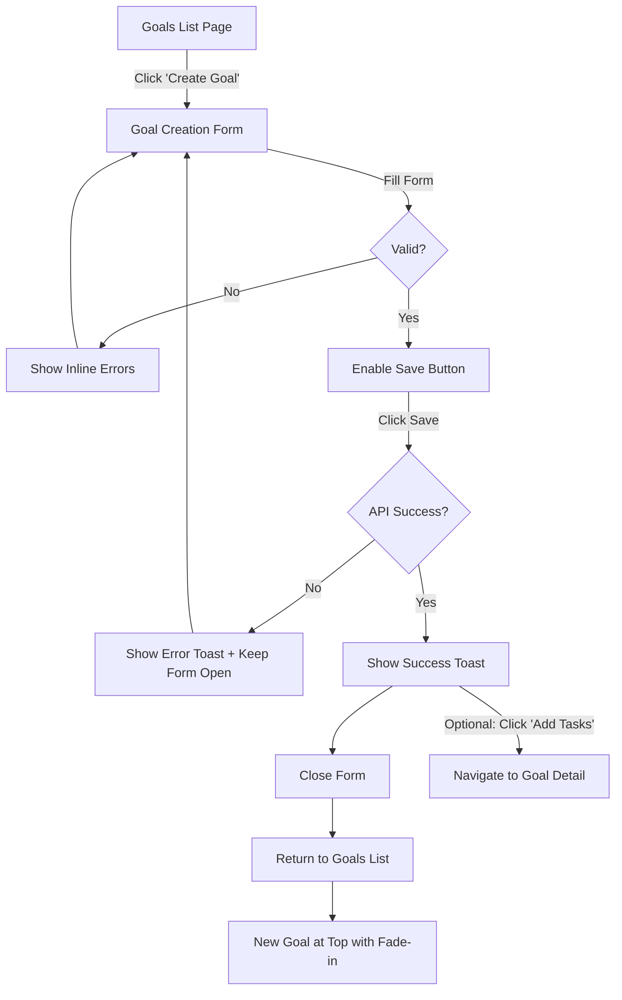
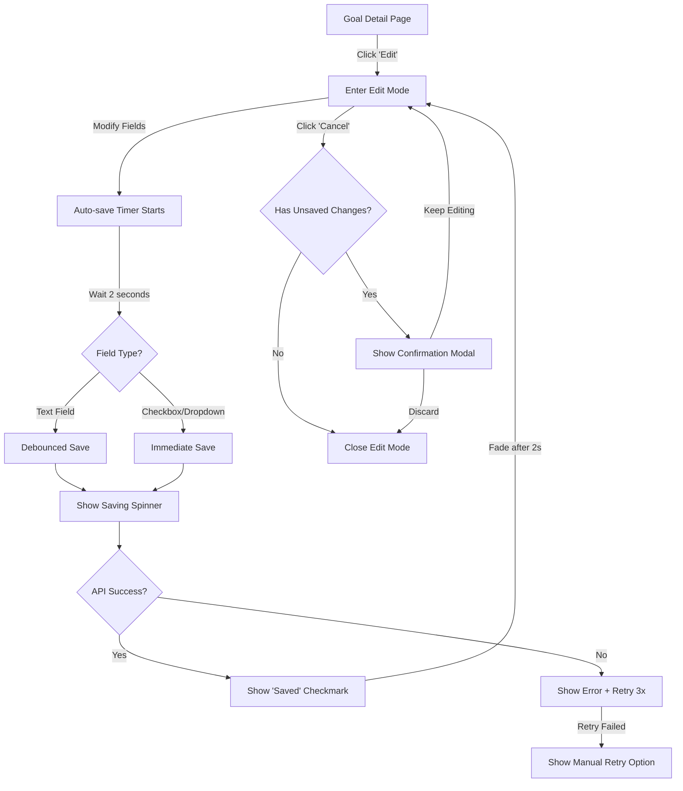
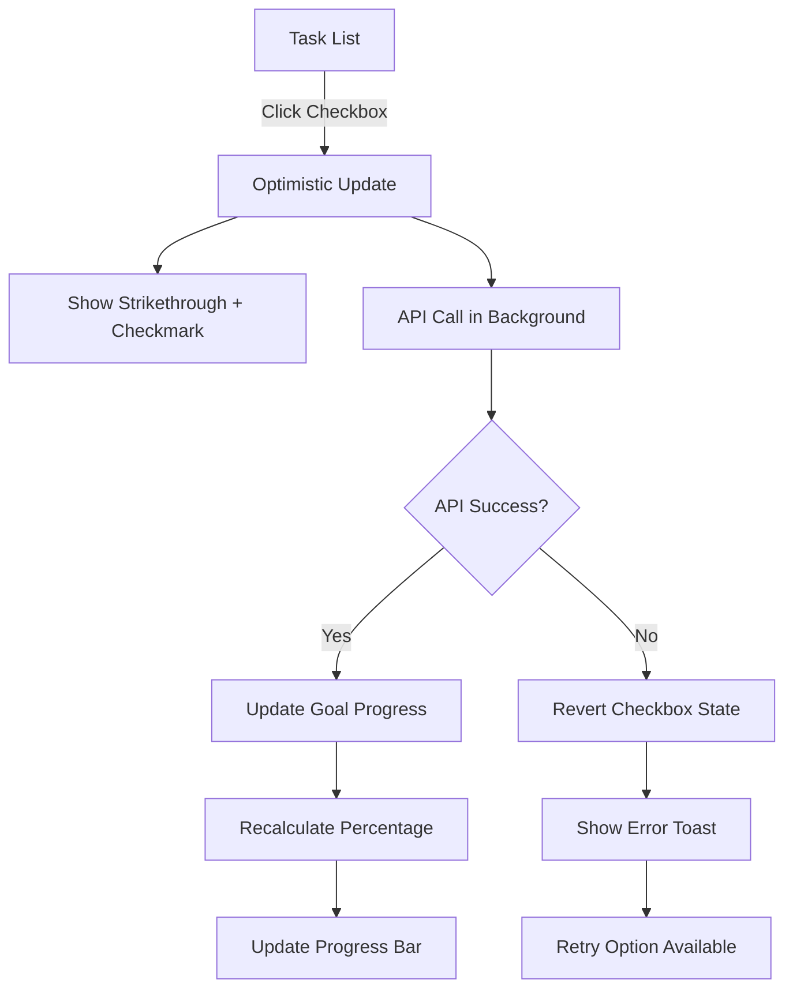
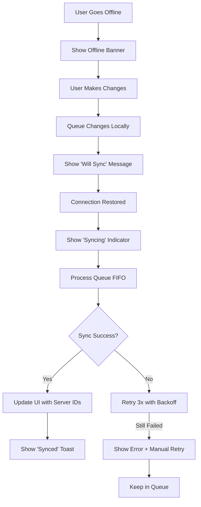

---
type: feature_specification
feature_number: 0001
feature_name: personal-goal-management
version: 1.0.0
created: 2025-11-11
status: draft
phase: 1_specify
repositories:
  - cpr-meta
  - cpr-api
  - cpr-ui
related_documents:
  - ../../constitution.md
  - ../../architecture.md
---

# Personal Goal Creation & Management

> **Specification ID**: SPEC-0001  
> **Feature**: personal-goal-management  
> **Priority**: High  
> **Complexity**: Medium

## Executive Summary

Personal Goal Management enables employees to create, track, and manage their professional and personal development goals throughout their career journey. This feature provides a structured framework for setting SMART goals, breaking them into manageable tasks, tracking progress, and aligning personal objectives with organizational competencies and career paths. Goals support deadline tracking, priority management, and visibility controls to facilitate both independent work and collaborative oversight.

**Business Impact**: Empowers employees to take ownership of their career development while providing managers and organizations with visibility into individual growth initiatives, ultimately improving employee engagement, retention, and skill development alignment.

---

## Core User Stories

### US-001: Create Personal Goals
**As a** registered employee  
**I want** to create new personal and professional development goals with titles, descriptions, deadlines, and priorities  
**So that** I can organize and track my career development initiatives in a structured manner

**Acceptance Criteria**:
- [ ] I can access goal creation form via: "Create Goal" button in header, empty state button (if no goals), or FAB on mobile
- [ ] I can create a goal with a required title (2-200 characters) and optional description (up to 2000 characters)
- [ ] Title validation occurs on blur; error displays inline below field in red with icon
- [ ] Description validation occurs only on form submit (not intrusive for optional field)
- [ ] I can set an optional deadline using date picker (must be today or future date; immediate validation when selected)
- [ ] I can assign a priority level (1=highest to 5=lowest) via dropdown (optional field)
- [ ] I can associate the goal with a specific skill using searchable autocomplete dropdown (shows top 10 matches, loads more on scroll, includes "None" option)
- [ ] I can set visibility dropdown (private [default], team, organization) to control who can view my goal
- [ ] All validations re-run on form submit as final check before API call
- [ ] Validation errors display inline below each field (red text with icon) for field-level errors
- [ ] API errors display as toast notification at top-right of screen
- [ ] "Save" button is enabled only when all required fields are valid
- [ ] Upon successful creation, form closes, toast shows "Goal '[Title]' created successfully" with "Add Tasks" action button, and I return to goals list with new goal at top (highlighted with fade-in animation)
- [ ] On API error, form remains open with data preserved and error toast displayed
- [ ] "Cancel" button prompts "You have unsaved changes. Discard changes?" if form is dirty (has any data entered)
- [ ] Form uses ARIA live regions for screen reader accessibility on validation errors

**Edge Cases**:
- [ ] Title with only whitespace is rejected with error "Title cannot be empty"
- [ ] Title exactly at 200 character limit is accepted
- [ ] Description exceeding 2000 characters is rejected with error "Description cannot exceed 2000 characters (current: X)"
- [ ] Selecting today's date as deadline is accepted (today is valid)
- [ ] Skills API fails to load: Show "Unable to load skills. You can still create goal without skill association" message
- [ ] Creating goal while offline: Save to local queue, show toast "Goal saved offline. Will sync when online"
- [ ] Rapid clicking "Save" button: Disable button during API call to prevent duplicate submissions
- [ ] Network timeout during creation: Show error toast "Request timed out. Please try again" and keep form data

### US-002: View and Filter Personal Goals
**As a** registered employee  
**I want** to view all my goals with filtering and sorting capabilities  
**So that** I can quickly find and focus on relevant goals based on status, priority, or deadline

**Acceptance Criteria**:
- [ ] I can view a paginated list of my goals (default 20 per page) with skeleton loaders during initial load
- [ ] Each goal card displays: title (truncated at 60 chars with ellipsis), status badge, progress bar with percentage, priority indicator, deadline, task count (X/Y completed), optional skill badge, and first 100 characters of description (collapsed, expandable on click)
- [ ] I can filter goals using dropdowns above the list: Status (All/Open/In Progress/Completed), Priority (All/High(1)/Medium(2-3)/Low(4-5))
- [ ] I can sort goals using dropdown: Newest (created_at DESC), Oldest (created_at ASC), Deadline (deadline ASC), Priority (priority ASC), Progress (progress_percent DESC)
- [ ] Multiple filters combine with AND logic (e.g., Status=in_progress AND Priority=1 shows only high-priority goals in progress)
- [ ] Filter and sort selections persist across sessions via user preferences stored in database (fallback: Newest first)
- [ ] URL includes query parameters for filter/sort state (e.g., /goals?status=in_progress&sort=deadline) for shareable filtered views
- [ ] Goals with deadlines within 7 days (inclusive) show yellow/warning badge with icon
- [ ] Goals with deadlines overdue (past deadline) show red/urgent badge with icon
- [ ] Goals due today show orange/immediate badge with icon
- [ ] Deadline indicators include tooltip on hover showing exact due date
- [ ] I can see the total count displayed above list: "Showing X of Y goals (Z active, W completed)"
- [ ] Clicking a goal card navigates to goal detail page (read-only view)
- [ ] Page displays appropriate empty states based on context

**Empty States**:
- [ ] **No goals at all**: "Start your career journey" message with illustration + "Create Your First Goal" button
- [ ] **No matches for filters**: "No goals match your filters" message + "Clear Filters" button
- [ ] **All completed**: "All goals completed! 🎉" encouragement message + "Create New Goal" button

**Edge Cases**:
- [ ] User with 1000+ goals: Pagination performs efficiently, list view renders within 500ms
- [ ] Filter change while scrolled down: Reset scroll to top of list, show shimmer effect on cards during re-fetch
- [ ] Clearing all filters returns to default view (All goals, sorted by Newest)
- [ ] Invalid URL query parameters (e.g., ?status=invalid) are ignored, fallback to defaults
- [ ] User's timezone used for "today" calculation in deadline warnings (not server timezone)
- [ ] Goals without deadline don't show deadline indicator (empty space)
- [ ] Goals without priority don't show priority indicator
- [ ] If skill API fails to load skill names: Show skill ID or "(Unknown Skill)"

### US-003: Update Goal Progress and Details
**As a** registered employee  
**I want** to update my goals' details, status, and progress  
**So that** I can maintain accurate records of my development journey

**Acceptance Criteria**:
- [ ] From goal detail page (read-only view), I click "Edit" button to enter edit mode with form fields
- [ ] In edit mode, I can edit: title, description, deadline, priority, visibility, status, and skill association
- [ ] I can update the goal status dropdown (open → in_progress → completed) with forward progression only
- [ ] Once goal status is "completed", status dropdown becomes read-only for non-admins (shows only "completed")
- [ ] Admins see "Reopen Goal" link separate from status dropdown with tooltip explaining regression capability
- [ ] I can manually set progress using slider (0-100) if goal has no tasks, labeled "Progress (Manual)"
- [ ] If goal has tasks, progress displays as "Progress (X/Y tasks)" and slider is disabled
- [ ] When creating first task, modal prompts: "Switch to automatic progress from tasks? Manual progress will be replaced." with "Confirm" and "Cancel" buttons
- [ ] When deleting all tasks, goal returns to manual mode with progress reset to 0% and slider re-enabled
- [ ] When I mark status as "completed", system automatically records completion timestamp (completed_at)
- [ ] Text field changes auto-save after 2 seconds of inactivity (debounced)
- [ ] Checkboxes and dropdowns save immediately (no delay)
- [ ] Visual feedback during save: Saving spinner → "Saved" checkmark (fades after 2 seconds)
- [ ] I have "Save" and "Cancel" buttons at bottom of edit form
- [ ] Clicking "Cancel" with unsaved changes prompts modal: "You have unsaved changes. Discard changes?" with "Discard" (destructive) and "Keep Editing" (primary) buttons
- [ ] If auto-save already succeeded, "Cancel" closes edit mode without confirmation
- [ ] After manual "Save" click, form remains in edit mode with success toast, allowing continued editing

**Progress Mode Behavior**:
- [ ] **Manual Mode**: No tasks exist, user controls slider (0-100%), label shows "Progress (Manual)"
- [ ] **Auto Mode**: Tasks exist, system calculates progress = (completed_tasks / total_tasks) × 100, label shows "Progress (X/Y tasks)", slider is disabled
- [ ] **Transition to Auto**: Creating first task shows modal confirmation before switching modes
- [ ] **Revert to Manual**: Deleting all tasks automatically returns to manual mode with progress set to 0%

**Edge Cases**:
- [ ] Editing title to exceed 200 characters: Show inline error, disable "Save" button until fixed
- [ ] Setting status to "completed" but progress < 100%: Allow (user may round to nearest milestone)
- [ ] Network failure during auto-save: Show error toast "Auto-save failed. Changes will retry" + retry 3 times with exponential backoff
- [ ] User navigates away during pending auto-save: Show "Unsaved changes" prompt even if auto-save scheduled
- [ ] Concurrent edit (another user/admin modified goal): On save, detect conflict, show toast "Goal was updated by another user. Reload to see latest version?" with "Reload" and "Keep My Changes" options
- [ ] Multiple fields changed rapidly: Queue saves, execute sequentially (don't overload API)
- [ ] Offline edit: Queue changes, show "Changes saved offline. Will sync when online" toast

### US-004: Break Goals into Tasks
**As a** registered employee  
**I want** to decompose complex goals into smaller, actionable tasks with individual deadlines  
**So that** I can manage goals incrementally and track detailed progress

**Acceptance Criteria**:
- [ ] From goal detail page, I see Tasks section below goal information card
- [ ] Tasks display as expandable list (collapsed by default on mobile, expanded on desktop)
- [ ] "+ Add Task" button is always visible at bottom of tasks section
- [ ] Clicking "+ Add Task" opens inline form with fields: title (required), description (optional), deadline (optional date picker)
- [ ] Task title validates on blur (2-200 characters); inline error if invalid
- [ ] Task description validates on submit if provided (max 2000 characters)
- [ ] If task deadline is after goal deadline, yellow warning icon displays with tooltip: "Task deadline is after goal deadline" (not blocking)
- [ ] I can save task with "Add Task" button or press Enter in title field
- [ ] Upon successful task creation, task appears in list, form clears for another task, and goal progress recalculates automatically
- [ ] I can mark tasks complete by clicking checkbox next to task title (optimistic update)
- [ ] Clicking checkbox immediately shows visual update (strikethrough, checkmark) and triggers background API call
- [ ] On successful completion: Task remains marked with completion timestamp displayed
- [ ] On API failure: Checkbox reverts to unchecked, error toast shows "Failed to mark task complete. Try again"
- [ ] Completed tasks show strikethrough text and completion timestamp (e.g., "Completed 2 hours ago")
- [ ] Task completion automatically recalculates goal progress: (completed_tasks / total_tasks) × 100, updating goal's progress bar in real-time
- [ ] I can manually reorder tasks using drag-and-drop on desktop or move up/down buttons on mobile
- [ ] Task order is stored in database (order_index column) and persists across sessions
- [ ] I can click "Sort by Deadline" button to temporarily view tasks sorted by deadline (not saved, reverts to manual order on page refresh)
- [ ] I can edit existing task by clicking it → Opens inline edit form with same fields
- [ ] I can delete task by clicking delete icon (trash) → Task removed immediately with undo toast "Task deleted. Undo?" for 10 seconds
- [ ] Undo button restores deleted task; after 10 seconds, deletion is permanent
- [ ] Bulk selection: Shift+click selects multiple tasks, "Mark Complete" button appears to complete all selected tasks at once
- [ ] Deleting task(s) automatically recalculates goal progress percentage

**Empty Tasks State**:
- [ ] When goal has no tasks, show empty state message: "Break this goal into smaller tasks to track detailed progress"
- [ ] Sub-message: "Tasks automatically calculate your progress percentage"
- [ ] Button: "Add Your First Task"
- [ ] Alternative link: "Set progress manually" (for users who prefer not to use tasks)

**Edge Cases**:
- [ ] Adding task to goal that previously had manual progress: Show confirmation modal before switching to auto mode
- [ ] Task with deadline set to past date: Allow (users may track overdue tasks)
- [ ] Deleting multiple tasks rapidly: Queue operations, show cumulative undo "3 tasks deleted. Undo?"
- [ ] Reordering tasks while offline: Store order locally, sync when online
- [ ] Network failure during completion: Revert visual state, show error, retry 3 times
- [ ] Concurrent task completion (multiple devices): Last completion wins, sync via polling or websockets
- [ ] Very long task title (200 chars): Truncate with ellipsis in list view, show full title in edit form
- [ ] Goal with 100+ tasks: Implement virtual scrolling for performance, paginate API response

### US-005: Delete Goals and Tasks
**As a** registered employee  
**I want** to delete goals or tasks that are no longer relevant  
**So that** I can maintain a clean and focused goals list

**Acceptance Criteria (Goal Deletion)**:
- [ ] Only Administrators can delete goals in v1 (non-admins do not see delete button)
- [ ] Delete button appears on goal detail page in header actions (red, with trash icon)
- [ ] Clicking "Delete" opens confirmation modal with title: "Delete goal '[Goal Title]'?"
- [ ] Modal message: "This goal and its [X] task(s) will be removed from your view. Administrators can restore deleted goals if needed."
- [ ] Modal buttons: "Cancel" (primary, gray), "Delete" (destructive, red)
- [ ] Upon confirmation, goal is soft-deleted (deleted_at timestamp set, not physically removed)
- [ ] Success toast shows: "Goal '[Goal Title]' deleted"
- [ ] User redirected to goals list page after deletion
- [ ] Deleted goals are completely hidden from regular user views (list, detail, filters)
- [ ] Admins have access to "Deleted Goals" view in admin menu → List of deleted goals with "Restore" action button
- [ ] Deleted goals retained for 90 days, then hard-deleted (cleanup job)
- [ ] Restoring a goal un-sets deleted_at, goal reappears in owner's goals list

**Acceptance Criteria (Task Deletion)**:
- [ ] Any user can delete tasks from their own goals (no admin restriction for tasks)
- [ ] Delete icon (trash) appears on hover over each task in tasks list
- [ ] Clicking delete icon immediately removes task from view (optimistic update)
- [ ] Toast notification appears: "Task deleted. Undo?" with undo button (10-second timeout)
- [ ] Clicking "Undo" restores task to its previous position in list
- [ ] After 10 seconds (or toast dismissed), deletion is permanent (saved to API)
- [ ] Deleting task automatically recalculates goal's progress percentage in real-time
- [ ] If task deletion causes goal to have zero tasks, goal reverts to manual progress mode with progress reset to 0%
- [ ] Multiple task deletions: Undo stack maintains last 5 deletions; each shows separate undo toast

**Edge Cases**:
- [ ] Deleting goal while offline: Queue deletion, show toast "Goal will be deleted when online"
- [ ] Admin deleting another user's goal: Same confirmation flow, success message includes user name "Goal for [Employee Name] deleted"
- [ ] Deleting goal with 50+ tasks: Show count in confirmation, deletion completes within 2 seconds
- [ ] Restoring deleted goal: Check if related entities (skills) still exist, show warning if dependencies are missing
- [ ] Task deletion API failure: Revert visual state, show error toast "Failed to delete task. Try again", task reappears in list
- [ ] Rapid multiple task deletions: Queue operations, batch undo if needed
- [ ] Undoing task deletion after navigating away: Undo stack clears on page change (cannot undo after leaving page)
- [ ] Deleting last task while goal is in "completed" status: Auto-revert status to "in_progress" with notification

---

## Business Rules

1. **Goal Ownership**: Each goal must have exactly one owner (employee). Only the owner can create, edit, or view private goals. Managers and administrators can view team/org goals based on reporting hierarchy.

2. **Title and Description Constraints**: Goal titles must be 2-200 characters. Descriptions are optional but limited to 2000 characters. Both fields are trimmed and sanitized to prevent XSS attacks.

3. **Deadline Validation**: Deadlines, when specified, must be future dates (today or later). Past dates are rejected with a clear validation error. Deadlines are stored as date-only values (no time component).

4. **Status Workflow**: Goals follow a defined status progression: `open` → `in_progress` → `completed`. Status cannot regress (e.g., completed → in_progress) without manual intervention by an administrator.

5. **Progress Calculation**: Progress percentage is automatically calculated based on completed tasks: `(completed_tasks / total_tasks) × 100`. If no tasks exist, progress can be manually set (0-100). Progress cannot exceed 100% or be negative.

6. **Priority Levels**: Priority is an optional field with values 1 (highest) to 5 (lowest). If not specified, defaults to null (no priority assigned).

7. **Visibility Controls**: Goals have three visibility levels:
   - **private**: Only owner can view
   - **team**: Owner's manager and team members can view
   - **organization**: All employees in the organization can view
   Default visibility is `private`.

8. **Skill Association**: Goals can optionally be linked to a skill from the organizational taxonomy and a target skill level. This association is used for career path recommendations and progress tracking.

9. **Task Completion Impact**: When all tasks in a goal are completed, the goal's `is_completed` flag is automatically set to `true` and `completed_at` is timestamped. Uncompleting a task reverts these fields.

10. **Soft Deletion**: Deleted goals are marked as deleted but not physically removed from the database. This preserves historical data for reporting and audit purposes.

---

## UI/UX Specifications

### Page Structure & Navigation

**Goals List Page** (`/goals`)
- Header: "My Goals" + "Create Goal" button + filter/sort controls
- Sidebar (desktop) / Hamburger menu (mobile): Navigation to other modules
- Main content: Goal cards in grid/list layout
- Footer: Pagination controls (if > 20 goals)

**Goal Detail Page** (`/goals/{id}`)
- Header: Goal title + "Edit" button + "Delete" button (admin only)
- Goal information card: All goal metadata in read-only format
- Tasks section: Expandable/collapsible task list
- Breadcrumb: "My Goals > [Goal Title]"

**Goal Edit Mode** (`/goals/{id}/edit` or in-place modal)
- Editable form fields for all goal properties
- "Save" and "Cancel" buttons
- Auto-save indicators
- Validation error messages inline

### Interaction Flows

#### Create Goal Flow


#### Update Goal Flow


#### Task Completion Flow


#### Offline Sync Flow


### Visual Design Specifications

**Goal Status Badges**
- `open`: Gray badge, text "Open"
- `in_progress`: Blue badge, text "In Progress"
- `completed`: Green badge with checkmark icon, text "Completed"

**Priority Indicators**
- Priority 1 (Highest): Red flag icon
- Priority 2: Orange flag icon
- Priority 3 (Medium): Yellow flag icon
- Priority 4: Light gray flag icon
- Priority 5 (Lowest): Very light gray flag icon
- No priority: No indicator displayed

**Deadline Warnings**
- **Within 7 days**: Yellow badge with calendar icon + "Due in X days"
- **Due today**: Orange badge with clock icon + "Due today"
- **Overdue**: Red badge with alert icon + "Overdue by X days"

**Progress Bar**
- 0-33%: Red progress bar (needs attention)
- 34-66%: Yellow progress bar (in progress)
- 67-99%: Blue progress bar (almost there)
- 100%: Green progress bar with checkmark (completed)
- Width: Full width of goal card, height: 8px, rounded corners

**Loading States**
- **Skeleton Loaders**: 3-5 gray animated placeholder cards during initial load
- **Shimmer Effect**: Subtle shimmer animation on cards during filter/sort refresh
- **Inline Spinners**: Small spinner icon next to saving indicator
- **Progress Bar**: Thin indeterminate progress bar at top of page for navigation loading

**Toast Notifications**
- **Success**: Green background, checkmark icon, auto-dismiss after 5 seconds
- **Error**: Red background, X icon, auto-dismiss after 10 seconds or manual dismiss
- **Warning**: Yellow background, alert icon, auto-dismiss after 7 seconds
- **Info**: Blue background, info icon, auto-dismiss after 5 seconds
- **Position**: Top-right corner (desktop), top-center (mobile)
- **Action Button**: Optional action (e.g., "Add Tasks", "Undo") on right side

**Modal Dialogs**
- **Confirmation Modals**: Centered overlay with backdrop (semi-transparent black)
- **Width**: 500px max (desktop), 90% viewport (mobile)
- **Buttons**: Primary action (right), Secondary action (left), Close X (top-right)
- **Animation**: Fade-in backdrop + scale-up modal (200ms)

### Responsive Breakpoints
- **Mobile**: < 768px (single column, vertical layout, FAB for create)
- **Tablet**: 768px - 1024px (2-column grid for goal cards)
- **Desktop**: > 1024px (3-column grid for goal cards, sidebar visible)

### Accessibility Requirements
- **Keyboard Navigation**: Tab order follows visual flow, Enter to submit forms, Escape to close modals
- **Screen Readers**: ARIA labels on all interactive elements, ARIA live regions for dynamic content
- **Focus Indicators**: Visible outline (2px blue) on focused elements
- **Color Contrast**: WCAG AA compliance (4.5:1 for text, 3:1 for UI components)
- **Skip Links**: "Skip to main content" link for keyboard users

---

## Technical Requirements

### Performance
- **API Response Time**: Goal list endpoint (GET /api/me/goals) must respond < 200ms at 95th percentile under normal load (100 concurrent users)
- **Goal Creation**: POST /api/goals must complete < 150ms at 95th percentile
- **Database Query Optimization**: Implement proper indexing on `employee_id`, `status`, `deadline`, and `priority` columns
- **Pagination**: Support efficient pagination for large goal lists (tested up to 1000+ goals per user)
- **Initial Page Load**: Goals dashboard page must render within 2 seconds on 3G network speeds

### Security
- **Authentication Required**: All goal management endpoints require valid JWT authentication token
- **Authorization**: Users can only access their own goals unless they have Manager/Administrator roles
- **Input Sanitization**: All text inputs (title, description) are sanitized to prevent XSS attacks
- **SQL Injection Prevention**: Use parameterized queries for all database operations
- **HTTPS Only**: All API endpoints must be accessed via HTTPS in production
- **Data Privacy**: Goals with `private` visibility are never exposed to unauthorized users, even via API errors

### Offline Mode (Constitutional Principle 5)
- **Read Operations**: User can view cached goals and tasks when offline
- **Create/Edit Operations**: Changes made offline are queued and synchronized when connection is restored
- **Conflict Resolution**: Last-write-wins strategy for conflicting updates, with user notification
- **Cache Duration**: Goals cached for up to 24 hours; expired cache prompts re-fetch on reconnection
- **Sync Indicator**: Visual indicator shows sync status (synced, pending, failed)
- **Background Sync**: Automatic synchronization when app returns online, with retry logic (3 attempts with exponential backoff)

### Internationalization (Constitutional Principle 6)
- **UI Text Externalization**: All labels, buttons, error messages, and help text externalized to i18n resource files
- **Date Formatting**: Deadlines and timestamps formatted according to user's locale (e.g., MM/DD/YYYY vs DD/MM/YYYY)
- **Number Formatting**: Progress percentages formatted with locale-specific decimal separators
- **RTL Support**: UI layout supports right-to-left languages (Arabic, Hebrew)
- **Pluralization**: Task count messages handle singular/plural forms correctly per locale
- **Translation Keys**: Use structured keys: `goals.create.title`, `goals.list.empty_state`, etc.

---

## API Design (Constitutional Principles 2, 3, 9)

### Endpoints

**Goal Management**
```
POST   /api/goals                        # Create a new goal for authenticated user
GET    /api/me/goals                     # Get paginated list of user's goals (?page=1&per_page=20&status=open&sort=deadline)
GET    /api/goals/{id}                   # Get specific goal by ID (owner/manager/admin access)
PATCH  /api/goals/{id}                   # Partially update goal (title, description, status, etc.)
DELETE /api/goals/{id}                   # Soft delete a goal (admin only currently)
```

**Task Management**
```
POST   /api/goals/{id}/tasks             # Add a new task to a goal
GET    /api/goals/{id}/tasks             # List all tasks for a goal (ordered by order_index)
PATCH  /api/goals/{id}/tasks/{taskId}    # Update task (title, description, completion status, order_index)
DELETE /api/goals/{id}/tasks/{taskId}    # Delete a task from a goal
PATCH  /api/goals/{id}/tasks/reorder     # Batch update task order (array of {id, order_index})
```

**Supporting Endpoints**
```
GET    /api/skills                       # Get skills for autocomplete (?search={query}&limit=10)
GET    /api/user-preferences             # Get user preferences (default view, locale, etc.)
PUT    /api/user-preferences             # Update user preferences
```

### Query Parameters

**GET /api/me/goals** - Query Parameters
- `page` (integer, optional, default: 1): Page number for pagination
- `per_page` (integer, optional, default: 20, max: 100): Number of results per page
- `status` (string, optional): Filter by status (`open`, `in_progress`, `completed`)
- `priority` (integer, optional): Filter by priority (1-5)
- `sort` (string, optional, default: `created_at_desc`): Sort order
  - `created_at_desc`: Newest first (default)
  - `created_at_asc`: Oldest first
  - `deadline_asc`: Earliest deadline first (nulls last)
  - `priority_asc`: Highest priority first (nulls last)
  - `progress_desc`: Highest progress first

**GET /api/skills** - Query Parameters
- `search` (string, optional): Search query for skill name (min 2 characters)
- `limit` (integer, optional, default: 10, max: 50): Number of results to return
- `category_id` (UUID, optional): Filter by skill category

**Examples**:
- `/api/me/goals?status=in_progress&sort=deadline_asc` - In-progress goals sorted by deadline
- `/api/me/goals?priority=1&page=2` - High-priority goals, page 2
- `/api/skills?search=react&limit=10` - Search for skills containing "react", return top 10

### Request/Response Examples

**POST /api/goals** (Create Goal)
```json
{
  "title": "Master React Performance Optimization",
  "description": "Learn advanced React optimization techniques including memoization, virtualization, and code splitting",
  "deadline": "2026-06-30",
  "priority": 2,
  "visibility": "team",
  "related_skill_id": "123e4567-e89b-12d3-a456-426614174000",
  "related_skill_level_id": "223e4567-e89b-12d3-a456-426614174000"
}
```

**Response 201 Created**
```json
{
  "id": "f47ac10b-58cc-4372-a567-0e02b2c3d479",
  "employee_id": "a47ac10b-58cc-4372-a567-0e02b2c3d479",
  "title": "Master React Performance Optimization",
  "description": "Learn advanced React optimization techniques...",
  "status": "open",
  "deadline": "2026-06-30",
  "priority": 2,
  "visibility": "team",
  "related_skill_id": "123e4567-e89b-12d3-a456-426614174000",
  "related_skill_level_id": "223e4567-e89b-12d3-a456-426614174000",
  "is_completed": false,
  "completed_at": null,
  "progress_percent": 0.00,
  "created_at": "2025-11-11T10:30:00Z",
  "modified_at": "2025-11-11T10:30:00Z",
  "tasks": []
}
```

**GET /api/me/goals?page=1&per_page=20** (List Goals)
```json
{
  "data": [
    {
      "id": "f47ac10b-58cc-4372-a567-0e02b2c3d479",
      "employee_id": "a47ac10b-58cc-4372-a567-0e02b2c3d479",
      "title": "Master React Performance Optimization",
      "status": "in_progress",
      "progress_percent": 45.50,
      "priority": 2,
      "deadline": "2026-06-30",
      "is_completed": false,
      "created_at": "2025-11-11T10:30:00Z",
      "modified_at": "2025-11-15T14:20:00Z"
    }
  ],
  "pagination": {
    "page": 1,
    "per_page": 20,
    "total": 47,
    "total_pages": 3
  }
}
```

**PATCH /api/goals/{id}** (Update Goal)
```json
{
  "status": "in_progress",
  "progress_percent": 65.00,
  "description": "Updated description with recent progress notes"
}
```

**POST /api/goals/{id}/tasks** (Add Task)
```json
{
  "title": "Complete React Profiler tutorial",
  "description": "Work through official React Profiler documentation and examples",
  "deadline": "2025-12-15"
}
```

**Response 201 Created**
```json
{
  "id": "b47ac10b-58cc-4372-a567-0e02b2c3d479",
  "goal_id": "f47ac10b-58cc-4372-a567-0e02b2c3d479",
  "title": "Complete React Profiler tutorial",
  "description": "Work through official React Profiler documentation and examples",
  "deadline": "2025-12-15",
  "is_completed": false,
  "completed_at": null,
  "created_at": "2025-11-11T10:35:00Z"
}
```

### Status Codes
- **200 OK**: Successful GET/PATCH operation
- **201 Created**: Successful POST operation
- **204 No Content**: Successful DELETE operation
- **400 Bad Request**: Invalid input data (validation errors)
- **401 Unauthorized**: Missing or invalid authentication token
- **403 Forbidden**: User lacks permission to access resource
- **404 Not Found**: Goal or task not found
- **422 Unprocessable Entity**: Business rule violation
- **500 Internal Server Error**: Server-side error

---

## Data Model (Constitutional Principle 11)

### Goals Table
```sql
CREATE TABLE goals (
  id UUID PRIMARY KEY DEFAULT gen_random_uuid(),
  employee_id UUID NOT NULL REFERENCES employees(id) ON DELETE CASCADE,
  title VARCHAR(200) NOT NULL,
  description TEXT,
  status VARCHAR(20) NOT NULL DEFAULT 'open' CHECK (status IN ('open', 'in_progress', 'completed')),
  related_skill_id UUID REFERENCES skills(id) ON DELETE SET NULL,
  related_skill_level_id UUID REFERENCES skill_levels(id) ON DELETE SET NULL,
  deadline DATE,
  is_completed BOOLEAN NOT NULL DEFAULT FALSE,
  completed_at TIMESTAMPTZ,
  progress_percent NUMERIC(5,2) NOT NULL DEFAULT 0.00 CHECK (progress_percent >= 0 AND progress_percent <= 100),
  priority SMALLINT CHECK (priority >= 1 AND priority <= 5),
  visibility VARCHAR(20) DEFAULT 'private' CHECK (visibility IN ('private', 'team', 'organization')),
  created_by UUID NULL REFERENCES users(id),
  created_at TIMESTAMPTZ DEFAULT CURRENT_TIMESTAMP,
  modified_by UUID NULL REFERENCES users(id),
  modified_at TIMESTAMPTZ NULL,
  is_deleted BOOLEAN DEFAULT FALSE,
  deleted_by UUID NULL REFERENCES users(id),
  deleted_at TIMESTAMPTZ,
  
  CONSTRAINT chk_deadline_future CHECK (deadline IS NULL OR deadline >= CURRENT_DATE),
  CONSTRAINT chk_completed_state CHECK (
    (is_completed = TRUE AND completed_at IS NOT NULL) OR
    (is_completed = FALSE AND completed_at IS NULL)
  )
);

-- Indexes for performance
CREATE INDEX idx_goals_employee_id ON goals(employee_id) WHERE deleted_at IS NULL;
CREATE INDEX idx_goals_status ON goals(status) WHERE deleted_at IS NULL;
CREATE INDEX idx_goals_deadline ON goals(deadline) WHERE deleted_at IS NULL AND deadline IS NOT NULL;
CREATE INDEX idx_goals_priority ON goals(priority) WHERE deleted_at IS NULL AND priority IS NOT NULL;
CREATE INDEX idx_goals_created_at ON goals(created_at DESC) WHERE deleted_at IS NULL;
```

### Goal Tasks Table
```sql
CREATE TABLE goal_tasks (
  id UUID PRIMARY KEY DEFAULT gen_random_uuid(),
  goal_id UUID NOT NULL REFERENCES goals(id) ON DELETE CASCADE,
  title VARCHAR(200) NOT NULL,
  description TEXT,
  deadline TIMESTAMPTZ,
  is_completed BOOLEAN NOT NULL DEFAULT FALSE,
  completed_at TIMESTAMPTZ,
  order_index INT NOT NULL DEFAULT 0,
  created_by UUID NULL REFERENCES users(id),
  created_at TIMESTAMPTZ DEFAULT CURRENT_TIMESTAMP,
  modified_by UUID NULL REFERENCES users(id),
  modified_at TIMESTAMPTZ NULL,
  is_deleted BOOLEAN DEFAULT FALSE,
  deleted_by UUID NULL REFERENCES users(id),
  deleted_at TIMESTAMPTZ,
  
  CONSTRAINT chk_task_completed_state CHECK (
    (is_completed = TRUE AND completed_at IS NOT NULL) OR
    (is_completed = FALSE AND completed_at IS NULL)
  )
);

-- Index for fetching tasks by goal with order
CREATE INDEX idx_goal_tasks_goal_id_order ON goal_tasks(goal_id, order_index);
CREATE INDEX idx_goal_tasks_created_at ON goal_tasks(created_at);
```

### Trigger for Progress Calculation
```sql
CREATE OR REPLACE FUNCTION update_goal_progress()
RETURNS TRIGGER AS $$
DECLARE
  total_tasks INTEGER;
  completed_tasks INTEGER;
  new_progress NUMERIC(5,2);
BEGIN
  -- Count total and completed tasks for the goal
  SELECT COUNT(*), COUNT(*) FILTER (WHERE is_completed = TRUE)
  INTO total_tasks, completed_tasks
  FROM goal_tasks
  WHERE goal_id = NEW.goal_id;
  
  -- Calculate progress percentage
  IF total_tasks > 0 THEN
    new_progress := (completed_tasks::NUMERIC / total_tasks::NUMERIC) * 100;
    
    -- Update the goal's progress
    UPDATE goals
    SET progress_percent = new_progress,
        is_completed = (completed_tasks = total_tasks),
        completed_at = CASE 
          WHEN completed_tasks = total_tasks THEN CURRENT_TIMESTAMP
          ELSE NULL
        END,
        modified_at = CURRENT_TIMESTAMP
    WHERE id = NEW.goal_id;
  END IF;
  
  RETURN NEW;
END;
$$ LANGUAGE plpgsql;

CREATE TRIGGER trg_update_goal_progress
AFTER INSERT OR UPDATE OR DELETE ON goal_tasks
FOR EACH ROW
EXECUTE FUNCTION update_goal_progress();
```

---

## Type Safety (Constitutional Principles 2, 4, 9)

### C# DTOs (cpr-api)

**Goal DTOs**
```csharp
using System;
using System.Collections.Generic;
using System.ComponentModel.DataAnnotations;
using System.Text.Json.Serialization;

namespace CPR.Application.Contracts
{
    /// <summary>
    /// DTO for creating a new goal
    /// </summary>
    public class CreateGoalDto
    {
        [JsonPropertyName("title")]
        [Required(ErrorMessage = "Title is required")]
        [MinLength(2, ErrorMessage = "Title must be at least 2 characters")]
        [MaxLength(200, ErrorMessage = "Title cannot exceed 200 characters")]
        public string Title { get; set; } = null!;

        [JsonPropertyName("description")]
        [MaxLength(2000, ErrorMessage = "Description cannot exceed 2000 characters")]
        public string? Description { get; set; }

        [JsonPropertyName("deadline")]
        public DateTime? Deadline { get; set; }

        [JsonPropertyName("priority")]
        [Range(1, 5, ErrorMessage = "Priority must be between 1 and 5")]
        public short? Priority { get; set; }

        [JsonPropertyName("visibility")]
        [RegularExpression("^(private|team|organization)$", ErrorMessage = "Visibility must be private, team, or organization")]
        public string? Visibility { get; set; } = "private";

        [JsonPropertyName("related_skill_id")]
        public Guid? RelatedSkillId { get; set; }

        [JsonPropertyName("related_skill_level_id")]
        public Guid? RelatedSkillLevelId { get; set; }
    }

    /// <summary>
    /// DTO for updating an existing goal
    /// </summary>
    public class UpdateGoalDto
    {
        [JsonPropertyName("title")]
        [MinLength(2)]
        [MaxLength(200)]
        public string? Title { get; set; }

        [JsonPropertyName("description")]
        [MaxLength(2000)]
        public string? Description { get; set; }

        [JsonPropertyName("status")]
        [RegularExpression("^(open|in_progress|completed)$")]
        public string? Status { get; set; }

        [JsonPropertyName("deadline")]
        public DateTime? Deadline { get; set; }

        [JsonPropertyName("priority")]
        [Range(1, 5)]
        public short? Priority { get; set; }

        [JsonPropertyName("visibility")]
        [RegularExpression("^(private|team|organization)$")]
        public string? Visibility { get; set; }

        [JsonPropertyName("progress_percent")]
        [Range(0, 100)]
        public decimal? ProgressPercent { get; set; }

        [JsonPropertyName("related_skill_id")]
        public Guid? RelatedSkillId { get; set; }

        [JsonPropertyName("related_skill_level_id")]
        public Guid? RelatedSkillLevelId { get; set; }
    }

    /// <summary>
    /// Complete goal representation with all fields
    /// </summary>
    public class GoalDto
    {
        [JsonPropertyName("id")]
        public Guid Id { get; set; }

        [JsonPropertyName("employee_id")]
        public Guid EmployeeId { get; set; }

        [JsonPropertyName("title")]
        public string Title { get; set; } = null!;

        [JsonPropertyName("description")]
        public string? Description { get; set; }

        [JsonPropertyName("status")]
        public string Status { get; set; } = "open";

        [JsonPropertyName("related_skill_id")]
        public Guid? RelatedSkillId { get; set; }

        [JsonPropertyName("related_skill_level_id")]
        public Guid? RelatedSkillLevelId { get; set; }

        [JsonPropertyName("deadline")]
        public DateTime? Deadline { get; set; }

        [JsonPropertyName("is_completed")]
        public bool IsCompleted { get; set; }

        [JsonPropertyName("completed_at")]
        public DateTimeOffset? CompletedAt { get; set; }

        [JsonPropertyName("progress_percent")]
        public decimal ProgressPercent { get; set; }

        [JsonPropertyName("priority")]
        public short? Priority { get; set; }

        [JsonPropertyName("visibility")]
        public string? Visibility { get; set; }

        [JsonPropertyName("created_at")]
        public DateTimeOffset CreatedAt { get; set; }

        [JsonPropertyName("modified_at")]
        public DateTimeOffset? ModifiedAt { get; set; }

        [JsonPropertyName("tasks")]
        public List<TaskDto> Tasks { get; set; } = new();
    }
}
```

**Task DTOs**
```csharp
namespace CPR.Application.Contracts
{
    /// <summary>
    /// DTO for creating a new goal task
    /// </summary>
    public class CreateGoalTaskDto
    {
        [JsonPropertyName("title")]
        [Required(ErrorMessage = "Title is required")]
        [MinLength(2, ErrorMessage = "Title must be at least 2 characters")]
        [MaxLength(200, ErrorMessage = "Title cannot exceed 200 characters")]
        public string Title { get; set; } = null!;

        [JsonPropertyName("description")]
        [MaxLength(2000, ErrorMessage = "Description cannot exceed 2000 characters")]
        public string? Description { get; set; }

        [JsonPropertyName("deadline")]
        public DateTimeOffset? Deadline { get; set; }
    }

    /// <summary>
    /// DTO for updating a goal task
    /// </summary>
    public class UpdateGoalTaskDto
    {
        [JsonPropertyName("title")]
        [MinLength(2)]
        [MaxLength(200)]
        public string? Title { get; set; }

        [JsonPropertyName("description")]
        [MaxLength(2000)]
        public string? Description { get; set; }

        [JsonPropertyName("deadline")]
        public DateTimeOffset? Deadline { get; set; }

        [JsonPropertyName("is_completed")]
        public bool? IsCompleted { get; set; }
    }

    /// <summary>
    /// Complete task representation
    /// </summary>
    public class TaskDto
    {
        [JsonPropertyName("id")]
        public Guid Id { get; set; }

        [JsonPropertyName("goal_id")]
        public Guid GoalId { get; set; }

        [JsonPropertyName("title")]
        public string Title { get; set; } = null!;

        [JsonPropertyName("description")]
        public string? Description { get; set; }

        [JsonPropertyName("deadline")]
        public DateTimeOffset? Deadline { get; set; }

        [JsonPropertyName("is_completed")]
        public bool IsCompleted { get; set; }

        [JsonPropertyName("completed_at")]
        public DateTimeOffset? CompletedAt { get; set; }

        [JsonPropertyName("created_at")]
        public DateTimeOffset CreatedAt { get; set; }
    }
}
```

### TypeScript Interfaces (cpr-ui)

**Goal Types**
```typescript
// src/types/goal.types.ts

export type GoalStatus = 'open' | 'in_progress' | 'completed';
export type GoalVisibility = 'private' | 'team' | 'organization';
export type GoalPriority = 1 | 2 | 3 | 4 | 5;

export interface CreateGoalRequest {
  title: string;
  description?: string;
  deadline?: string; // ISO date string (YYYY-MM-DD)
  priority?: GoalPriority;
  visibility?: GoalVisibility;
  related_skill_id?: string;
  related_skill_level_id?: string;
}

export interface UpdateGoalRequest {
  title?: string;
  description?: string;
  status?: GoalStatus;
  deadline?: string;
  priority?: GoalPriority;
  visibility?: GoalVisibility;
  progress_percent?: number;
  related_skill_id?: string;
  related_skill_level_id?: string;
}

export interface Goal {
  id: string;
  employee_id: string;
  title: string;
  description: string | null;
  status: GoalStatus;
  related_skill_id: string | null;
  related_skill_level_id: string | null;
  deadline: string | null; // ISO date string
  is_completed: boolean;
  completed_at: string | null; // ISO datetime string
  progress_percent: number;
  priority: GoalPriority | null;
  visibility: GoalVisibility | null;
  created_at: string; // ISO datetime string
  modified_at: string | null; // ISO datetime string
  tasks: Task[];
}

export interface GoalListResponse {
  data: Goal[];
  pagination: {
    page: number;
    per_page: number;
    total: number;
    total_pages: number;
  };
}
```

**Task Types**
```typescript
// src/types/task.types.ts

export interface CreateTaskRequest {
  title: string;
  description?: string;
  deadline?: string; // ISO datetime string
}

export interface UpdateTaskRequest {
  title?: string;
  description?: string;
  deadline?: string;
  is_completed?: boolean;
}

export interface Task {
  id: string;
  goal_id: string;
  title: string;
  description: string | null;
  deadline: string | null; // ISO datetime string
  is_completed: boolean;
  completed_at: string | null; // ISO datetime string
  created_at: string; // ISO datetime string
}
```

---

## Testing Strategy (Constitutional Principle 7)

### Unit Tests

**Backend (C# - xUnit)**
- `GoalService.CreateGoal_ValidInput_ReturnsGoalDto`: Verify goal creation with valid data
- `GoalService.CreateGoal_InvalidTitle_ThrowsValidationException`: Test title validation (length, null)
- `GoalService.CreateGoal_PastDeadline_ThrowsValidationException`: Reject past deadlines
- `GoalService.UpdateGoal_ValidProgress_UpdatesCorrectly`: Test progress percentage updates (0-100)
- `GoalService.UpdateGoal_OverMaxProgress_ThrowsValidationException`: Reject progress > 100%
- `GoalService.CalculateProgress_WithTasks_ReturnsCorrectPercentage`: Verify auto-calculation logic
- `GoalService.DeleteGoal_SoftDelete_MarksAsDeleted`: Ensure soft deletion works
- `TaskService.AddTask_ValidInput_ReturnsTaskDto`: Test task creation
- `TaskService.CompleteTask_UpdatesGoalProgress_Correctly`: Verify progress recalculation

**Frontend (TypeScript - Vitest)**
- `goalValidation.validateTitle_ValidInput_Passes`: Test client-side title validation
- `goalValidation.validateDeadline_PastDate_Fails`: Reject past deadline on client
- `goalMapper.mapGoalToDto_ValidGoal_MapsCorrectly`: Test DTO mapping logic
- `goalUtils.calculateProgressColor_DifferentRanges_ReturnsCorrectColor`: Visual indicator logic
- `goalUtils.isDeadlineApproaching_WithinSevenDays_ReturnsTrue`: Deadline warning logic

### Integration Tests

**Backend (C# - IntegrationTests)**
- `POST /api/goals` with valid authentication returns 201 and correct DTO structure
- `GET /api/me/goals` returns only authenticated user's goals with proper pagination
- `PATCH /api/goals/{id}` updates only specified fields, leaves others unchanged
- `DELETE /api/goals/{id}` requires Administrator role, returns 403 for regular users
- `POST /api/goals/{id}/tasks` creates task and triggers progress recalculation
- `PATCH /api/goals/{id}/tasks/{taskId}` with `is_completed=true` updates goal progress
- Database trigger correctly calculates progress when all tasks completed
- Cascading delete: Deleting goal removes all associated tasks
- Authorization: User cannot access another user's private goals
- Offline sync: Queued operations execute in correct order after reconnection

**Frontend (TypeScript - Playwright E2E)**
- User can create a goal with all optional fields and see it in the goals list
- Goal list filters by status (open, in_progress, completed) correctly
- User can edit goal title inline with auto-save
- Marking all tasks complete automatically updates goal to 100% progress
- Deleting a task recalculates progress percentage in real-time
- Deadline approaching (< 7 days) shows visual warning indicator
- Offline mode: Changes made offline sync when connection restored
- Empty state displays when user has no goals

### Performance Tests

**Load Testing (Backend - k6 or Artillery)**
- **Goal List Performance**: 100 concurrent users fetching goals list maintains < 200ms p95 response time
- **Goal Creation Under Load**: 50 concurrent POST requests complete within 150ms p95
- **Database Query Performance**: Goals query with 1000+ records per user completes < 100ms
- **Pagination Efficiency**: Fetching page 50 of goals (1000 total) performs similar to page 1

**Frontend Performance (Lighthouse)**
- **Initial Load**: Goals dashboard loads and becomes interactive within 2 seconds on 3G
- **Time to Interactive (TTI)**: Goals list renders within 1.5 seconds
- **Component Rendering**: Goal list with 50 items renders in < 500ms
- **Offline Cache Load**: Cached goals display within 500ms when offline

### Contract Tests

**API Contract Validation (Pact or similar)**
- Consumer (cpr-ui) expectations match provider (cpr-api) responses
- All snake_case JSON properties match between backend DTOs and frontend types
- Validation error responses follow consistent structure across all endpoints
- Pagination response format matches specification

---

## Success Metrics

- **Goal Creation Rate**: 80% of active users create at least one goal within first 30 days of feature launch
- **Goal Completion Rate**: 60% of goals with deadlines are completed by their deadline date
- **Feature Adoption**: 85% of employees use goal management feature at least once per quarter
- **Task Utilization**: 70% of goals have at least one task associated with them
- **Progress Tracking Engagement**: Users update goal progress at least twice per month on average
- **Performance Target Achievement**: 95% of API requests complete within specified performance thresholds (200ms p95)
- **Offline Sync Success Rate**: 99% of offline changes successfully sync when connection restored
- **User Satisfaction**: Goal management feature receives average rating of 4.2/5.0 in user surveys
- **Time to First Goal**: New users create their first goal within 5 minutes of accessing the feature
- **Mobile Usage**: 40% of goal interactions occur on mobile devices within 6 months of launch

---

## Constitutional Compliance ✅

- [x] **Principle 1**: Specification-First Development
  - Complete specification created before implementation
  - All requirements documented with acceptance criteria
  - Business rules and technical constraints defined

- [x] **Principle 2**: API Contract Consistency
  - Matching DTOs defined for C# backend (GoalDto, CreateGoalDto, UpdateGoalDto, TaskDto)
  - Corresponding TypeScript interfaces for frontend (Goal, CreateGoalRequest, Task)
  - Data contracts synchronized across repositories with snake_case JSON properties

- [x] **Principle 3**: RESTful API Standards
  - RESTful endpoints following REST conventions (GET, POST, PATCH, DELETE)
  - Proper HTTP methods for each operation (POST for create, PATCH for update)
  - Standard status codes (200, 201, 204, 400, 401, 403, 404, 422, 500)
  - Consistent URL structure: /api/goals, /api/me/goals, /api/goals/{id}/tasks

- [x] **Principle 4**: Type Safety Everywhere
  - C# DTOs with validation attributes ([Required], [MinLength], [MaxLength], [Range])
  - TypeScript interfaces with strict types (GoalStatus, GoalPriority literals)
  - Strong typing enforced throughout (Guid for IDs, DateTimeOffset for timestamps)

- [x] **Principle 5**: Offline Mode Support
  - Read operations work with cached data when offline
  - Create/edit operations queued and synced when online
  - Conflict resolution strategy defined (last-write-wins with notification)
  - Background sync with retry logic (3 attempts, exponential backoff)

- [x] **Principle 6**: Internationalization
  - All UI text externalized to i18n resource files with structured keys
  - Date formatting respects user locale (MM/DD/YYYY vs DD/MM/YYYY)
  - Number formatting with locale-specific separators for progress percentages
  - RTL language support for Arabic and Hebrew
  - Proper pluralization for task count messages

- [x] **Principle 7**: Comprehensive Testing
  - Unit tests defined for business logic and validation (40+ test cases)
  - Integration tests for end-to-end workflows and authorization
  - Performance tests with measurable targets (k6, Lighthouse)
  - Contract tests for API/UI data consistency

- [x] **Principle 8**: Performance-First Development
  - Measurable performance targets: < 200ms p95 for list, < 150ms for create
  - Database indexing strategy defined (employee_id, status, deadline, priority)
  - Efficient pagination for large datasets (1000+ goals)
  - Initial page load within 2 seconds on 3G

- [x] **Principle 9**: Strict Naming Conventions
  - JSON/API: snake_case (`employee_id`, `created_at`, `is_completed`)
  - C# Properties: PascalCase with [JsonPropertyName] (`EmployeeId` → `"employee_id"`)
  - TypeScript: camelCase in code, snake_case in API types
  - Database: snake_case for tables (goals, goal_tasks), columns, indexes
  - URLs: kebab-case (`/api/me/goals`)

- [x] **Principle 10**: Security & Data Privacy
  - All endpoints require JWT authentication
  - Authorization: users access only their own goals (unless Manager/Admin)
  - Input sanitization to prevent XSS attacks
  - Parameterized queries to prevent SQL injection
  - HTTPS enforcement in production
  - Private goals never exposed to unauthorized users

- [x] **Principle 11**: Database Design Standards
  - UUIDs for primary keys (id, employee_id, goal_id)
  - Proper foreign key constraints with CASCADE/SET NULL
  - CHECK constraints for data validation (status, priority, progress_percent)
  - Proper indexing for query performance (6 indexes defined)
  - Soft deletion support (is_deleted, deleted_at, deleted_by columns)
  - Audit timestamps (created_by, created_at, modified_by, modified_at)
  - Database triggers for automated progress calculation

---

## Dependencies & Assumptions

**Dependencies:**
- **Authentication System**: Microsoft Entra External ID (formerly Azure AD B2C) for user authentication and JWT token validation
- **Employee Database**: Existing `employees` table with employee records and organizational hierarchy
- **Skills Taxonomy**: Existing `skills` and `skill_levels` tables for skill association (optional feature)
- **PostgreSQL Database**: Version 13+ with UUID support and trigger capabilities
- **React Query**: For data fetching, caching, and offline sync in the frontend
- **i18n Framework**: react-i18next or similar for internationalization support
- **Authorization Framework**: Role-based access control (RBAC) with Employee, Manager, Administrator roles

**Assumptions:**
- User authentication is already implemented and functional across the platform
- Employees table contains accurate employee_id values for all active users
- Database connection pooling handles concurrent requests efficiently (100+ users)
- Network connectivity is generally reliable; offline mode handles intermittent disconnections, not prolonged offline usage
- Users understand SMART goal concepts and can self-direct their goal creation without extensive training
- Managers have proper reporting relationships established in the employee hierarchy
- The skills taxonomy is complete and maintained by administrators
- All users access the application via modern browsers (last 2 versions of Chrome, Firefox, Safari, Edge)
- Mobile responsiveness is required but native mobile apps are not in scope
- Email notifications for goal reminders are out of scope for initial release
- Goal sharing/collaboration features are out of scope for initial release
- Integration with external systems (Slack, Teams, etc.) is out of scope for initial release

**Known Limitations:**
- Delete operation currently requires Administrator role (will be expanded to goal owners in future iteration)
- No bulk operations support (create/update/delete multiple goals at once)
- Progress percentage is either auto-calculated from tasks OR manually set, but not both simultaneously
- Visibility controls are basic; advanced sharing permissions (specific users/teams) not supported in v1

---

**Next Phase**: Phase 2 (Refine) - Detailed requirements analysis and technical design validation
