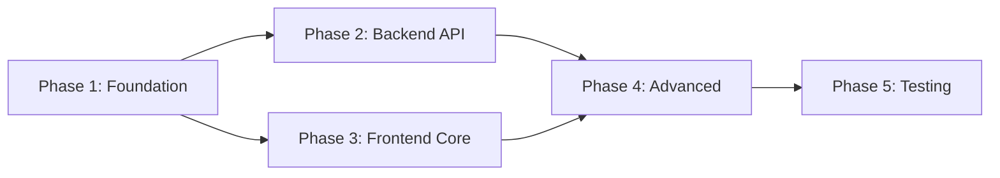

# Implementation Tasks - Personal Goal Management

> **Feature**: 0001 - personal-goal-management  
> **Status**: Planning  
> **Created**: 2025-11-11  

---

## Task Format

```
- [ ] [TaskID] [Priority] [Phase] Description (Estimate) | File: path/to/file
```

**Legend**:
- `[TaskID]`: Sequential task number (T001, T002, etc.)
- `[Priority]`: P0 (critical), P1 (high), P2 (medium), P3 (low)
- `[Phase]`: Phase 1-5 from implementation plan
- **(Estimate)**: Hours estimated
- **File**: Exact file path to create/modify

---

## Task Summary

| Phase | Total Tasks | P0 | P1 | P2 | Estimated Hours | Status |
|-------|-------------|----|----|----|-----------------| -------|
| Phase 1: Foundation | 16 | 4 | 8 | 4 | 12 | ⏳ Pending |
| Phase 2: Backend API | 14 | 3 | 7 | 4 | 8 | ⏳ Pending |
| Phase 3: Frontend Core | 32 | 10 | 15 | 7 | 32 | ⏳ Pending |
| Phase 4: Advanced Features | 24 | 6 | 10 | 8 | 24 | ⏳ Pending |
| Phase 5: Testing & Polish | 20 | 8 | 8 | 4 | 20 | ⏳ Pending |
| **TOTAL** | **106** | **31** | **48** | **27** | **96** | ⏳ Pending |

---

## Dependencies & Critical Path

### Phase Dependencies


### Parallel Execution Opportunities
- **Phase 1**: Backend migration (T001-T002) can run parallel with Frontend types setup (T003-T007)
- **Phase 2**: All 4 new endpoints can be developed in parallel (T017-T030)
- **Phase 3**: Component development can be parallelized after base services ready (T040+)
- **Phase 4**: Offline sync, i18n, and drag-drop can run in parallel (T070+)

---

## Phase 1: Foundation Setup & Data Model
**Objective**: Database migration, TypeScript types, API service layer, React Query hooks  
**Duration**: 12 hours (1.5 days)

### Backend Tasks (2 hours)

- [ ] **T001** [P0] [Phase 1] Create EF Core migration for order_index column (2h) | File: `src/CPR.Infrastructure/Persistence/Migrations/XXXXXX_AddOrderIndexToGoalTasks.cs`
  - Add order_index INT column with default 0
  - Populate existing rows with ROW_NUMBER() OVER (PARTITION BY goal_id ORDER BY created_at)
  - Create composite index idx_goal_tasks_goal_id_order
  - Add check constraint order_index >= 0
  - Test migration up/down

- [ ] **T002** [P1] [Phase 1] Update GoalTask entity with OrderIndex property (0.5h) | File: `src/CPR.Domain/Entities/GoalTask.cs`
  - Add public int OrderIndex { get; set; } property
  - Update EF Core configuration if needed

### Frontend Tasks (10 hours)

- [ ] **T003** [P0] [Phase 1] Create goal type definitions (1h) | File: `src/types/goal.types.ts`
  - Define GoalDto interface matching backend
  - Define GoalTaskDto interface with order_index
  - Define CreateGoalDto, UpdateGoalDto interfaces
  - Define CreateGoalTaskDto, UpdateGoalTaskDto interfaces
  - Define GoalCategory, GoalStatus, GoalPriority types
  - Add JSDoc comments for all types

- [ ] **T004** [P0] [Phase 1] Create goal API service layer (2h) | File: `src/services/goalService.ts`
  - Implement getGoals(query: ListGoalsQuery): Promise<GoalDto[]>
  - Implement getGoal(id: string): Promise<GoalDto>
  - Implement createGoal(dto: CreateGoalDto): Promise<GoalDto>
  - Implement updateGoal(id: string, dto: UpdateGoalDto): Promise<GoalDto>
  - Implement deleteGoal(id: string): Promise<void>
  - Add error handling with custom exceptions
  - Add request/response interceptors

- [ ] **T005** [P0] [Phase 1] Create task API service layer (1.5h) | File: `src/services/taskService.ts`
  - Implement getTasks(goalId: string): Promise<GoalTaskDto[]>
  - Implement createTask(goalId: string, dto: CreateGoalTaskDto): Promise<GoalTaskDto>
  - Implement updateTask(goalId: string, taskId: string, dto: UpdateGoalTaskDto): Promise<GoalTaskDto>
  - Implement deleteTask(goalId: string, taskId: string): Promise<void>
  - Implement reorderTasks(goalId: string, order: TaskOrderItem[]): Promise<void>
  - Add error handling

- [ ] **T006** [P1] [Phase 1] Create React Query hooks for goals (2h) | File: `src/hooks/useGoals.ts`
  - Implement useGoals(query?: ListGoalsQuery) with React Query
  - Implement useGoal(id: string)
  - Implement useCreateGoal() mutation
  - Implement useUpdateGoal() mutation
  - Implement useDeleteGoal() mutation
  - Configure staleTime, cacheTime, retry policies
  - Add query invalidation on mutations

- [ ] **T007** [P1] [Phase 1] Create React Query hooks for tasks (1.5h) | File: `src/hooks/useTasks.ts`
  - Implement useTasks(goalId: string)
  - Implement useCreateTask() mutation
  - Implement useUpdateTask() mutation
  - Implement useDeleteTask() mutation
  - Implement useReorderTasks() mutation
  - Add optimistic updates for mutations

- [ ] **T008** [P1] [Phase 1] Create goal routes configuration (0.5h) | File: `src/routes/GoalRoutes.tsx`
  - Define routes: /goals (list), /goals/:id (detail), /goals/new (create)
  - Add lazy loading for route components
  - Add route guards for authentication

- [ ] **T009** [P2] [Phase 1] Create API client configuration (1h) | File: `src/config/apiClient.ts`
  - Configure Axios with base URL
  - Add JWT token interceptor
  - Add request/response logging (dev only)
  - Add retry logic for network errors
  - Add timeout configuration

- [ ] **T010** [P2] [Phase 1] Create constants and enums (0.5h) | File: `src/constants/goals.ts`
  - Define GOAL_CATEGORIES, GOAL_STATUSES, GOAL_PRIORITIES arrays
  - Define status/priority badge colors
  - Define default filter/sort values
  - Define validation constraints (min/max title length, etc.)

---

## Phase 2: Backend API Enhancements
**Objective**: Implement 4 new backend endpoints  
**Duration**: 8 hours (1 day)

### Skills Autocomplete Endpoint (2 hours)

- [ ] **T011** [P1] [Phase 2] Create SkillDto (0.5h) | File: `src/CPR.Application/Contracts/SkillDto.cs`
  - Add Id, Name, Category, Description properties
  - Add [JsonPropertyName] attributes for snake_case

- [ ] **T012** [P1] [Phase 2] Create ISkillService interface (0.5h) | File: `src/CPR.Application/Services/ISkillService.cs`
  - Define SearchSkillsAsync(string search, int limit) method

- [ ] **T013** [P1] [Phase 2] Implement SkillService (0.5h) | File: `src/CPR.Application/Services/SkillService.cs`
  - Implement search logic with LIKE query
  - Add caching (5min TTL)
  - Limit results (max 50)

- [ ] **T014** [P0] [Phase 2] Create SkillsController (0.5h) | File: `src/CPR.Api/Controllers/SkillsController.cs`
  - Add GET /api/skills endpoint
  - Add [Authorize] attribute
  - Add query parameter validation

### User Preferences Endpoints (3 hours)

- [ ] **T015** [P1] [Phase 2] Create UserPreferencesDto (0.5h) | File: `src/CPR.Application/Contracts/UserPreferencesDto.cs`
  - Add GoalsDefaultFilters, GoalsDefaultSort, GoalsViewMode properties
  - Add nested DTOs: GoalsFilters, GoalsSortOptions

- [ ] **T016** [P1] [Phase 2] Create user_preferences table migration (1h) | File: `src/CPR.Infrastructure/Persistence/Migrations/XXXXXX_CreateUserPreferencesTable.cs`
  - Create table with employee_id FK, preferences_json JSONB column
  - Add unique index on employee_id

- [ ] **T017** [P1] [Phase 2] Create UserPreference entity (0.5h) | File: `src/CPR.Domain/Entities/UserPreference.cs`
  - Add EmployeeId, PreferencesJson properties
  - Configure EF Core JSON column mapping

- [ ] **T018** [P0] [Phase 2] Create UserPreferencesController (1h) | File: `src/CPR.Api/Controllers/UserPreferencesController.cs`
  - Add GET /api/user-preferences endpoint
  - Add PUT /api/user-preferences endpoint
  - Add [Authorize] attribute

### Task Reorder Endpoint (3 hours)

- [ ] **T019** [P1] [Phase 2] Create ReorderTasksDto (0.5h) | File: `src/CPR.Application/Contracts/ReorderTasksDto.cs`
  - Add TaskOrder property (List<TaskOrderItem>)
  - Add validation: min 1 item, sequential indices

- [ ] **T020** [P0] [Phase 2] Add ReorderTasks endpoint to GoalsController (1h) | File: `src/CPR.Api/Controllers/GoalsController.cs`
  - Add PATCH /api/goals/{id}/tasks/reorder endpoint
  - Add authorization check (goal owner only)
  - Validate all task_ids belong to goal

- [ ] **T021** [P1] [Phase 2] Implement batch update logic in GoalService (1h) | File: `src/CPR.Application/Services/GoalService.cs`
  - Implement transaction-based batch update
  - Add rollback on any failure
  - Optimize with single UPDATE query

### Testing & Documentation (0 hours in estimate - part of Phase 5)

- [ ] **T022** [P2] [Phase 2] Update API documentation (0.5h) | File: `src/CPR.Api/swagger.json`
  - Document new endpoints in Swagger
  - Add request/response examples

- [ ] **T023** [P2] [Phase 2] Add unit tests for new services (included in Phase 5)

- [ ] **T024** [P2] [Phase 2] Add integration tests for new endpoints (included in Phase 5)

---

## Phase 3: Frontend Core - List & Detail Views
**Objective**: Goals list page, goal detail page, create/edit forms, task management  
**Duration**: 32 hours (4 days)

### Base Components & Pages (8 hours)

- [ ] **T025** [P0] [Phase 3] Create GoalsListPage (2h) | File: `src/pages/goals/GoalsListPage.tsx`
  - Fetch goals with useGoals hook
  - Render GoalsList component
  - Add GoalFilters sidebar
  - Add "New Goal" button
  - Handle loading/error states
  - Add empty state

- [ ] **T026** [P0] [Phase 3] Create GoalsList component (2h) | File: `src/components/goals/GoalsList.tsx`
  - Accept goals array prop
  - Render as card grid or table (toggle)
  - Add pagination (50 per page)
  - Add sorting controls
  - Memoize expensive renders with React.memo

- [ ] **T027** [P0] [Phase 3] Create GoalCard component (1.5h) | File: `src/components/goals/GoalCard.tsx`
  - Display title, description, status, priority, progress
  - Add status/priority badges
  - Add progress bar
  - Add "View Details" link
  - Add hover effects
  - Make responsive (mobile-first)

- [ ] **T028** [P0] [Phase 3] Create GoalDetailPage (2.5h) | File: `src/pages/goals/GoalDetailPage.tsx`
  - Fetch goal by ID with useGoal hook
  - Display goal details (editable/read-only toggle)
  - Render TaskList component
  - Add "Edit" button (toggles edit mode)
  - Add "Back to List" navigation
  - Handle 404 errors

### Forms (10 hours)

- [ ] **T029** [P0] [Phase 3] Create GoalForm component (4h) | File: `src/components/goals/GoalForm.tsx`
  - Use react-hook-form for state management
  - Add title input (required, 3-200 chars)
  - Add description textarea (optional, max 2000 chars)
  - Add category select (skill/career/project/personal)
  - Add priority select (low/medium/high/critical)
  - Add status select (not_started/in_progress/completed/on_hold/cancelled)
  - Add target_completion_date datepicker
  - Add related_skill autocomplete (connect to skills API)
  - Add form validation with error messages
  - Add auto-save with 2-second debounce
  - Handle create vs. update modes

- [ ] **T030** [P1] [Phase 3] Create skills autocomplete component (1.5h) | File: `src/components/goals/SkillAutocomplete.tsx`
  - Use MUI Autocomplete component
  - Fetch from GET /api/skills with 300ms debounce
  - Display skill name + category
  - Handle loading state
  - Cache recent searches (localStorage)

- [ ] **T031** [P1] [Phase 3] Create form field components (2h) | Files: `src/components/goals/fields/*`
  - CategorySelect.tsx - dropdown with icons
  - PrioritySelect.tsx - dropdown with color badges
  - StatusSelect.tsx - dropdown with status badges
  - DatePicker.tsx - date picker with validation
  - Reusable field wrapper with label/error

- [ ] **T032** [P1] [Phase 3] Add form validation logic (1.5h) | File: `src/utils/goalValidation.ts`
  - Title: min 3, max 200 characters
  - Description: max 2000 characters
  - Target date: must be future date
  - Enum validations for category, status, priority
  - Custom error messages for i18n

- [ ] **T033** [P2] [Phase 3] Implement auto-save hook (1h) | File: `src/hooks/useDebouncedSave.ts`
  - Debounce changes by 2 seconds
  - Show "Saving..." indicator
  - Show "Saved" checkmark on success
  - Show error on failure with retry
  - Cancel pending save on unmount

### Task Management Components (8 hours)

- [ ] **T034** [P0] [Phase 3] Create TaskList component (2h) | File: `src/components/goals/TaskList.tsx`
  - Accept tasks array prop
  - Render TaskItem components
  - Add "Add Task" button
  - Handle empty state (no tasks)
  - Calculate completion progress
  - Add "Reorder" mode toggle

- [ ] **T035** [P0] [Phase 3] Create TaskItem component (2h) | File: `src/components/goals/TaskItem.tsx`
  - Display task title, description
  - Add checkbox for completion (toggles is_completed)
  - Add "Edit" button (inline editing)
  - Add "Delete" button (with confirmation)
  - Show completed_at timestamp if completed
  - Add drag handle for reordering
  - Disable interactions in read-only mode

- [ ] **T036** [P1] [Phase 3] Create TaskForm component (2h) | File: `src/components/goals/TaskForm.tsx`
  - Use react-hook-form
  - Add title input (required, 1-200 chars)
  - Add description textarea (optional, max 1000 chars)
  - Add form validation
  - Handle create vs. update modes
  - Inline editing mode for TaskItem

- [ ] **T037** [P2] [Phase 3] Create task completion hook (1h) | File: `src/hooks/useTaskCompletion.ts`
  - Toggle task completion status
  - Update local state optimistically
  - Recalculate goal progress
  - Handle API errors with rollback
  - Show toast notification

- [ ] **T038** [P1] [Phase 3] Add task delete confirmation modal (1h) | File: `src/components/goals/DeleteTaskDialog.tsx`
  - Use MUI Dialog
  - Show task title in message
  - "Cancel" and "Delete" buttons
  - Handle delete mutation
  - Show toast on success/error

### Filters & Sorting (4 hours)

- [ ] **T039** [P1] [Phase 3] Create GoalFilters component (2h) | File: `src/components/goals/GoalFilters.tsx`
  - Add status filter (multi-select checkboxes)
  - Add category filter (multi-select checkboxes)
  - Add priority filter (multi-select checkboxes)
  - Add search input (debounced 300ms)
  - Add "Clear Filters" button
  - Persist filters to user preferences on change
  - Load filters from user preferences on mount

- [ ] **T040** [P1] [Phase 3] Create sort controls component (1h) | File: `src/components/goals/SortControls.tsx`
  - Sort by: created_at, modified_at, target_completion_date, title, priority, progress_percentage
  - Sort order: asc/desc toggle
  - Persist to user preferences

- [ ] **T041** [P2] [Phase 3] Implement filter/sort logic hook (1h) | File: `src/hooks/useGoalFilters.ts`
  - Manage filter state
  - Build query string for API
  - Sync with URL query params
  - Load/save preferences

### Common Components (2 hours)

- [ ] **T042** [P1] [Phase 3] Create OfflineIndicator component (0.5h) | File: `src/components/common/OfflineIndicator.tsx`
  - Detect online/offline status
  - Show banner when offline
  - Show sync queue count
  - Position sticky at top

- [ ] **T043** [P1] [Phase 3] Create ConfirmDialog component (0.5h) | File: `src/components/common/ConfirmDialog.tsx`
  - Reusable confirmation modal
  - Customizable title, message, buttons
  - Promise-based API

- [ ] **T044** [P2] [Phase 3] Create EmptyState component (0.5h) | File: `src/components/common/EmptyState.tsx`
  - Show icon, message, action button
  - Used for "No goals yet", "No tasks yet"

- [ ] **T045** [P2] [Phase 3] Create LoadingSkeleton component (0.5h) | File: `src/components/common/LoadingSkeleton.tsx`
  - MUI Skeleton for goal cards
  - MUI Skeleton for goal detail
  - MUI Skeleton for task list

---

## Phase 4: Advanced Features & Offline Support
**Objective**: Drag-drop, offline sync, i18n, auto-save, optimistic updates  
**Duration**: 24 hours (3 days)

### Drag-and-Drop Task Reordering (6 hours)

- [ ] **T046** [P1] [Phase 4] Install @dnd-kit dependencies (0.5h)
  - npm install @dnd-kit/core @dnd-kit/sortable @dnd-kit/utilities

- [ ] **T047** [P0] [Phase 4] Implement drag-drop in TaskList (3h) | File: `src/components/goals/TaskList.tsx`
  - Wrap with DndContext from @dnd-kit/core
  - Wrap tasks with SortableContext
  - Make TaskItem draggable with useSortable
  - Handle onDragEnd event
  - Update local order immediately
  - Call reorderTasks API with debounce (500ms)
  - Add visual drag feedback (CSS transforms)

- [ ] **T048** [P1] [Phase 4] Add drag handle to TaskItem (1h) | File: `src/components/goals/TaskItem.tsx`
  - Add drag handle icon (⋮⋮)
  - Style handle with hover effects
  - Connect to dnd-kit listeners

- [ ] **T049** [P2] [Phase 4] Add touch support for mobile drag-drop (1h)
  - Configure @dnd-kit sensors for touch
  - Test on mobile devices
  - Add haptic feedback if supported

- [ ] **T050** [P3] [Phase 4] Add drag-drop animations (0.5h)
  - Add CSS transitions for smooth reordering
  - Add placeholder while dragging

### Offline Support (8 hours)

- [ ] **T051** [P0] [Phase 4] Create offline storage service (2h) | File: `src/services/offlineStorageService.ts`
  - Initialize IndexedDB database
  - Create goals object store
  - Create sync_queue object store
  - Implement get, set, delete, clear methods
  - Add error handling for quota exceeded

- [ ] **T052** [P0] [Phase 4] Create sync queue service (2h) | File: `src/services/syncQueueService.ts`
  - Add operation to queue (create, update, delete)
  - Process queue on reconnection
  - Handle conflicts (last-write-wins)
  - Retry failed operations (3 attempts)
  - Clear processed items from queue

- [ ] **T053** [P0] [Phase 4] Create offline sync hook (2h) | File: `src/hooks/useOfflineSync.ts`
  - Detect online/offline events
  - Trigger sync on reconnection
  - Show sync progress notifications
  - Handle sync errors

- [ ] **T054** [P1] [Phase 4] Create Zustand offline store (1h) | File: `src/store/offlineStore.ts`
  - Track online/offline status
  - Track sync queue count
  - Track last sync timestamp
  - Provide actions: queueOperation, processQueue

- [ ] **T055** [P2] [Phase 4] Implement optimistic updates utility (1h) | File: `src/utils/optimisticUpdate.ts`
  - Helper for React Query optimistic updates
  - Rollback on error
  - Show loading state during mutation

### Internationalization (5 hours)

- [ ] **T056** [P1] [Phase 4] Install i18next dependencies (0.5h)
  - npm install react-i18next i18next i18next-browser-languagedetector

- [ ] **T057** [P0] [Phase 4] Configure i18n setup (1h) | File: `src/i18n/config.ts`
  - Initialize i18next with resources
  - Configure language detector
  - Set fallback language (English)
  - Export useTranslation hook

- [ ] **T058** [P0] [Phase 4] Create English translations (1.5h) | File: `src/i18n/locales/en/goals.json`
  - Add all goal-related keys
  - Page titles, button labels, field labels
  - Error messages, validation messages
  - Empty states, success messages
  - 100+ translation keys

- [ ] **T059** [P0] [Phase 4] Create Ukrainian translations (1.5h) | File: `src/i18n/locales/uk/goals.json`
  - Translate all English keys to Ukrainian
  - Use formal/informal tone consistently
  - Review with native speaker

- [ ] **T060** [P2] [Phase 4] Add language switcher component (0.5h) | File: `src/components/common/LanguageSwitcher.tsx`
  - Dropdown with English/Ukrainian options
  - Persist selection to localStorage
  - Show current language flag

### User Preferences (3 hours)

- [ ] **T061** [P1] [Phase 4] Create user preferences service (1h) | File: `src/services/userPreferencesService.ts`
  - Implement loadPreferences(): Promise<UserPreferencesDto>
  - Implement savePreferences(dto): Promise<void>
  - Add caching (session-scoped)
  - Handle 404 (no preferences) gracefully

- [ ] **T062** [P1] [Phase 4] Create user preferences hook (1h) | File: `src/hooks/useUserPreferences.ts`
  - Load preferences on mount
  - Save preferences on change (debounced 1s)
  - Provide default preferences if none exist
  - Use React Query for caching

- [ ] **T063** [P2] [Phase 4] Apply preferences to GoalsListPage (1h)
  - Load filters from preferences
  - Load sort from preferences
  - Load view mode (card/table) from preferences
  - Save changes automatically

### Performance Optimization (2 hours)

- [ ] **T064** [P2] [Phase 4] Add React.memo to expensive components (1h)
  - GoalCard, TaskItem, GoalsList
  - Add custom comparison functions

- [ ] **T065** [P2] [Phase 4] Add useMemo for filtered/sorted lists (0.5h)
  - Memoize filter/sort computations in GoalsListPage

- [ ] **T066** [P3] [Phase 4] Implement virtual scrolling (if needed) (0.5h)
  - Use @tanstack/react-virtual for 100+ goals
  - Only if performance testing shows need

---

## Phase 5: Testing, Performance & Polish
**Objective**: Comprehensive testing, performance optimization, accessibility audit  
**Duration**: 20 hours (2.5 days)

### Unit Tests - Components (8 hours)

- [ ] **T067** [P0] [Phase 5] Test GoalsList component (1h) | File: `src/components/goals/__tests__/GoalsList.test.tsx`
  - Renders goals correctly
  - Handles empty state
  - Handles loading state
  - Handles error state
  - Pagination works

- [ ] **T068** [P0] [Phase 5] Test GoalForm component (1.5h) | File: `src/components/goals/__tests__/GoalForm.test.tsx`
  - Validates required fields
  - Validates field lengths
  - Submits form correctly
  - Auto-saves after 2 seconds
  - Handles API errors

- [ ] **T069** [P0] [Phase 5] Test TaskList component (1h) | File: `src/components/goals/__tests__/TaskList.test.tsx`
  - Renders tasks correctly
  - Handles empty state
  - Adds new task
  - Toggles task completion
  - Deletes task with confirmation

- [ ] **T070** [P1] [Phase 5] Test GoalFilters component (1h) | File: `src/components/goals/__tests__/GoalFilters.test.tsx`
  - Applies filters correctly
  - Clears filters
  - Persists to preferences

- [ ] **T071** [P1] [Phase 5] Test SkillAutocomplete component (0.5h) | File: `src/components/goals/__tests__/SkillAutocomplete.test.tsx`
  - Fetches skills on input
  - Debounces search
  - Selects skill

- [ ] **T072** [P2] [Phase 5] Test drag-drop functionality (1h) | File: `src/components/goals/__tests__/TaskList.drag.test.tsx`
  - Reorders tasks on drag
  - Calls reorder API
  - Handles reorder errors

- [ ] **T073** [P2] [Phase 5] Test offline indicator (0.5h) | File: `src/components/common/__tests__/OfflineIndicator.test.tsx`
  - Shows when offline
  - Hides when online
  - Shows sync queue count

- [ ] **T074** [P2] [Phase 5] Test i18n switching (0.5h) | File: `src/i18n/__tests__/i18n.test.ts`
  - Switches language correctly
  - Persists selection
  - Translates all keys

### Unit Tests - Hooks (4 hours)

- [ ] **T075** [P0] [Phase 5] Test useGoals hook (1h) | File: `src/hooks/__tests__/useGoals.test.ts`
  - Fetches goals successfully
  - Handles errors
  - Filters/sorts correctly
  - Caches results

- [ ] **T076** [P0] [Phase 5] Test useTasks hook (1h) | File: `src/hooks/__tests__/useTasks.test.ts`
  - Fetches tasks successfully
  - Creates task
  - Updates task
  - Deletes task
  - Reorders tasks

- [ ] **T077** [P1] [Phase 5] Test useOfflineSync hook (1h) | File: `src/hooks/__tests__/useOfflineSync.test.ts`
  - Detects offline/online
  - Queues operations when offline
  - Syncs on reconnection
  - Handles conflicts

- [ ] **T078** [P2] [Phase 5] Test useDebouncedSave hook (0.5h) | File: `src/hooks/__tests__/useDebouncedSave.test.ts`
  - Debounces saves correctly
  - Cancels on unmount
  - Shows indicators

- [ ] **T079** [P2] [Phase 5] Test useUserPreferences hook (0.5h) | File: `src/hooks/__tests__/useUserPreferences.test.ts`
  - Loads preferences
  - Saves preferences
  - Uses defaults when none exist

### Integration Tests - API Services (3 hours)

- [ ] **T080** [P0] [Phase 5] Test goalService (1h) | File: `src/services/__tests__/goalService.test.ts`
  - Test all CRUD operations
  - Test error handling
  - Test request/response parsing
  - Mock API with MSW

- [ ] **T081** [P0] [Phase 5] Test taskService (1h) | File: `src/services/__tests__/taskService.test.ts`
  - Test all CRUD operations
  - Test reorder batch update
  - Test error handling
  - Mock API with MSW

- [ ] **T082** [P1] [Phase 5] Test offlineStorageService (0.5h) | File: `src/services/__tests__/offlineStorageService.test.ts`
  - Test IndexedDB operations
  - Test quota exceeded handling
  - Mock IndexedDB

- [ ] **T083** [P2] [Phase 5] Test syncQueueService (0.5h) | File: `src/services/__tests__/syncQueueService.test.ts`
  - Test queue operations
  - Test conflict resolution
  - Test retry logic

### E2E Tests (4 hours)

- [ ] **T084** [P0] [Phase 5] Test goal lifecycle (1.5h) | File: `tests/e2e/goals/goal-lifecycle.spec.ts`
  - Login
  - Create goal
  - View goal detail
  - Edit goal
  - Delete goal (as admin)
  - Verify all steps

- [ ] **T085** [P0] [Phase 5] Test task management (1h) | File: `tests/e2e/goals/task-management.spec.ts`
  - Add task to goal
  - Complete task
  - Reorder tasks (drag-drop)
  - Delete task
  - Verify progress updates

- [ ] **T086** [P1] [Phase 5] Test offline mode (1h) | File: `tests/e2e/goals/offline-sync.spec.ts`
  - Go offline
  - Create goal (queued)
  - Update goal (queued)
  - Go online
  - Verify sync completes

- [ ] **T087** [P2] [Phase 5] Test filters and sorting (0.5h) | File: `tests/e2e/goals/filters-sorting.spec.ts`
  - Apply multiple filters
  - Change sort order
  - Verify results
  - Clear filters

### Accessibility & Performance (1 hour)

- [ ] **T088** [P1] [Phase 5] Run Lighthouse audit (0.5h)
  - Performance score > 90
  - Accessibility score > 95
  - Best practices score > 95
  - Fix issues found

- [ ] **T089** [P1] [Phase 5] Run axe DevTools audit (0.5h)
  - Run on all goal pages
  - Fix critical/serious issues
  - Document minor issues

### Documentation (1 hour)

- [ ] **T090** [P2] [Phase 5] Update README.md (0.5h) | File: `cpr-ui/README.md`
  - Document goals feature
  - Add screenshots
  - Add setup instructions
  - Add troubleshooting

- [ ] **T091** [P3] [Phase 5] Create user guide (0.5h) | File: `documents/goals-feature-guide.md`
  - How to create goals
  - How to manage tasks
  - How to use filters
  - Offline mode explanation

---

## Backend Testing Tasks (Included in Phase 2 estimate)

### Unit Tests (3 hours)

- [ ] **T092** [P0] [Backend] Test SkillsController (0.5h) | File: `tests/CPR.Tests/Controllers/SkillsControllerTests.cs`

- [ ] **T093** [P0] [Backend] Test UserPreferencesController (0.5h) | File: `tests/CPR.Tests/Controllers/UserPreferencesControllerTests.cs`

- [ ] **T094** [P0] [Backend] Test GoalsController.ReorderTasks (0.5h) | File: `tests/CPR.Tests/Controllers/GoalsControllerTests.cs`

- [ ] **T095** [P1] [Backend] Test GoalService.ReorderTasksAsync (1h) | File: `tests/CPR.Tests/Services/GoalServiceTests.cs`

- [ ] **T096** [P2] [Backend] Test migration rollback (0.5h)

### Integration Tests (2 hours)

- [ ] **T097** [P0] [Backend] Test skills search endpoint (0.5h) | File: `tests/CPR.Tests/Integration/SkillsEndpointTests.cs`

- [ ] **T098** [P0] [Backend] Test user preferences endpoints (0.5h) | File: `tests/CPR.Tests/Integration/UserPreferencesEndpointTests.cs`

- [ ] **T099** [P0] [Backend] Test task reorder endpoint (1h) | File: `tests/CPR.Tests/Integration/TaskReorderEndpointTests.cs`

---

## Task Execution Guidelines

### Before Starting Any Task
1. Read specification in `description.md`
2. Review implementation plan
3. Check dependencies (can this task run now?)
4. Estimate actual hours
5. Update task status to "In Progress"

### While Working on Task
1. Follow naming conventions (see conventions.md)
2. Write self-documenting code
3. Add JSDoc/XML comments
4. Follow type safety rules
5. Test as you go

### After Completing Task
1. Run relevant tests (unit/integration)
2. Run linter (npm run lint / dotnet format)
3. Check TypeScript errors (npm run type-check)
4. Update task status to "Complete"
5. Commit with conventional commit message

### Commit Message Format
```
<type>(<scope>): <subject>

<body>

Refs: #<issue-number>
Task: T<task-id>
```

**Types**: feat, fix, docs, style, refactor, test, chore

**Examples**:
- `feat(goals): add GoalsList component`
- `fix(tasks): correct drag-drop reorder logic`
- `test(goals): add unit tests for GoalForm`

---

## Progress Tracking

Update this section as tasks complete:

**Last Updated**: 2025-11-11

**Overall Progress**: 0 / 106 tasks complete (0%)

**Phase Progress**:
- Phase 1: 0 / 16 (0%)
- Phase 2: 0 / 14 (0%)
- Phase 3: 0 / 32 (0%)
- Phase 4: 0 / 24 (0%)
- Phase 5: 0 / 20 (0%)

**Blockers**: None

**Notes**: Ready to start Phase 1

---

## Change Log

| Date | Author | Changes |
|------|--------|---------|
| 2025-11-11 | Agent | Initial task breakdown (106 tasks) |
