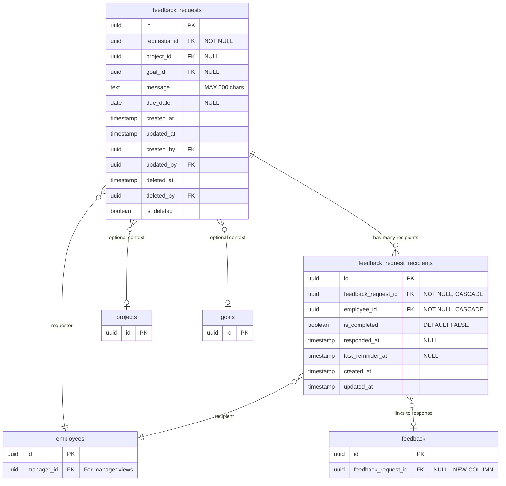

# Data Model - Feedback Request Management

> **Feature**: 0004 - feedback-request-management  
> **Status**: Planning  
> **Created**: 2025-11-13  
> **Last Updated**: 2025-11-13

---

## Overview

This document defines the data model for the Feedback Request Management feature, including database schema, entity relationships, and domain models.

**Database**: PostgreSQL 16

---

## Entity Relationship Diagram



**Key Architectural Decision**: Multi-recipient model uses junction table (`feedback_request_recipients`) to track per-recipient status independently. Parent request (`feedback_requests`) holds shared context (message, due_date, project, goal).

---

## Entities

### 1. FeedbackRequest (Parent Request)

**Table Name**: `feedback_requests`

**Description**: Stores feedback request metadata with shared context (message, due date, project/goal association). Each request can have 1-20 recipients tracked in the junction table.

**Relationships**:
- Belongs to: `employees` as requestor (many-to-one, CASCADE)
- Optionally references: `projects` (many-to-one, SET NULL)
- Optionally references: `goals` (many-to-one, SET NULL)
- Has many: `feedback_request_recipients` (one-to-many, CASCADE)
- Audit: Belongs to `users` for created_by, updated_by, deleted_by

#### Database Schema

```sql
CREATE TABLE feedback_requests (
    id UUID PRIMARY KEY DEFAULT gen_random_uuid(),
    requestor_id UUID NOT NULL REFERENCES employees(id) ON DELETE CASCADE,
    project_id UUID NULL REFERENCES projects(id) ON DELETE SET NULL,
    goal_id UUID NULL REFERENCES goals(id) ON DELETE SET NULL,
    message TEXT NULL CHECK (char_length(message) <= 500),
    due_date DATE NULL CHECK (due_date >= CURRENT_DATE OR due_date IS NULL),
    created_at TIMESTAMP WITH TIME ZONE NOT NULL DEFAULT NOW(),
    updated_at TIMESTAMP WITH TIME ZONE NOT NULL DEFAULT NOW(),
    created_by UUID NULL REFERENCES users(id) ON DELETE SET NULL,
    updated_by UUID NULL REFERENCES users(id) ON DELETE SET NULL,
    deleted_at TIMESTAMP WITH TIME ZONE NULL,
    deleted_by UUID NULL REFERENCES users(id) ON DELETE SET NULL,
    is_deleted BOOLEAN NOT NULL DEFAULT FALSE,
    
    -- Constraints
    CONSTRAINT valid_due_date CHECK (due_date IS NULL OR due_date >= created_at::date)
);

-- Indexes (6 for feedback_requests)
CREATE INDEX idx_feedback_requests_requestor ON feedback_requests(requestor_id) WHERE is_deleted = FALSE;
CREATE INDEX idx_feedback_requests_due_date ON feedback_requests(due_date) WHERE is_deleted = FALSE;
CREATE INDEX idx_feedback_requests_project ON feedback_requests(project_id) WHERE is_deleted = FALSE AND project_id IS NOT NULL;
CREATE INDEX idx_feedback_requests_goal ON feedback_requests(goal_id) WHERE is_deleted = FALSE AND goal_id IS NOT NULL;
CREATE INDEX idx_feedback_requests_created ON feedback_requests(created_at DESC) WHERE is_deleted = FALSE;

-- Trigger for updated_at
CREATE TRIGGER set_feedback_requests_updated_at
    BEFORE UPDATE ON feedback_requests
    FOR EACH ROW
    EXECUTE FUNCTION update_updated_at_column();
```

#### Column Details

| Column | Type | Nullable | Default | Description | Validation |
|--------|------|----------|---------|-------------|------------|
| `id` | UUID | No | `gen_random_uuid()` | Primary key | - |
| `requestor_id` | UUID | No | - | Employee requesting feedback | Must exist in employees table |
| `project_id` | UUID | Yes | NULL | Optional project context | Must exist in projects if provided |
| `goal_id` | UUID | Yes | NULL | Optional goal context | Must exist in goals if provided |
| `message` | TEXT | Yes | NULL | Request message/context | Max 500 characters |
| `due_date` | DATE | Yes | NULL | Optional response deadline | Must be today or future |
| `created_at` | TIMESTAMP | No | `NOW()` | Creation timestamp | Auto-managed |
| `updated_at` | TIMESTAMP | No | `NOW()` | Last update timestamp | Auto-managed by trigger |
| `created_by` | UUID | Yes | NULL | User who created (audit) | References users |
| `updated_by` | UUID | Yes | NULL | User who last updated (audit) | References users |
| `deleted_at` | TIMESTAMP | Yes | NULL | Soft delete timestamp | NULL = not deleted |
| `deleted_by` | UUID | Yes | NULL | User who deleted (audit) | References users |
| `is_deleted` | BOOLEAN | No | FALSE | Soft delete flag | Used for filtering active requests |

#### Constraints

**Primary Key**: `id` (UUID)

**Foreign Keys**:
- `requestor_id` → `employees.id` (CASCADE - if employee deleted, cascade delete their requests)
- `project_id` → `projects.id` (SET NULL - keep request if project deleted, lose association)
- `goal_id` → `goals.id` (SET NULL - keep request if goal deleted, lose association)
- `created_by`, `updated_by`, `deleted_by` → `users.id` (SET NULL - audit trail preserved)

**Check Constraints**:
- `message` length ≤ 500 characters (SQL: `char_length(message) <= 500`)
- `due_date` must be NULL or >= CURRENT_DATE (SQL: `due_date >= CURRENT_DATE OR due_date IS NULL`)
- `due_date` must be >= `created_at::date` (validation: `due_date >= created_at::date`)

**Indexes** (6 total, all with `WHERE is_deleted = FALSE` for performance):
- `idx_feedback_requests_requestor` on `requestor_id` - For "sent requests" list
- `idx_feedback_requests_due_date` on `due_date` - For sorting by due date
- `idx_feedback_requests_project` on `project_id` WHERE NOT NULL - For project association filtering
- `idx_feedback_requests_goal` on `goal_id` WHERE NOT NULL - For goal association filtering  
- `idx_feedback_requests_created` on `created_at DESC` - For sorting by newest first

---

### 2. FeedbackRequestRecipient (Junction Table for Multi-Recipient)

**Table Name**: `feedback_request_recipients`

**Description**: Tracks individual recipient status within a feedback request. Enables 1-20 recipients per request with per-recipient completion tracking, reminder timestamps, and feedback linkage.

**Relationships**:
- Belongs to: `feedback_requests` (many-to-one, CASCADE)
- Belongs to: `employees` as recipient (many-to-one, CASCADE)
- Optionally links to: `feedback` response (one-to-one via feedback.feedback_request_id backref)

#### Database Schema

```sql
CREATE TABLE feedback_request_recipients (
    id UUID PRIMARY KEY DEFAULT gen_random_uuid(),
    feedback_request_id UUID NOT NULL REFERENCES feedback_requests(id) ON DELETE CASCADE,
    employee_id UUID NOT NULL REFERENCES employees(id) ON DELETE CASCADE,
    is_completed BOOLEAN NOT NULL DEFAULT FALSE,
    responded_at TIMESTAMP WITH TIME ZONE NULL,
    last_reminder_at TIMESTAMP WITH TIME ZONE NULL,
    created_at TIMESTAMP WITH TIME ZONE NOT NULL DEFAULT NOW(),
    updated_at TIMESTAMP WITH TIME ZONE NOT NULL DEFAULT NOW(),
    
    -- Constraints
    CONSTRAINT unique_request_recipient UNIQUE (feedback_request_id, employee_id)
);

-- Indexes (4 for feedback_request_recipients)
CREATE INDEX idx_feedback_request_recipients_request ON feedback_request_recipients(feedback_request_id);
CREATE INDEX idx_feedback_request_recipients_employee ON feedback_request_recipients(employee_id);
CREATE INDEX idx_feedback_request_recipients_completed ON feedback_request_recipients(is_completed);
CREATE INDEX idx_feedback_request_recipients_pending ON feedback_request_recipients(employee_id, is_completed) WHERE is_completed = FALSE;

-- Trigger for updated_at
CREATE TRIGGER set_feedback_request_recipients_updated_at
    BEFORE UPDATE ON feedback_request_recipients
    FOR EACH ROW
    EXECUTE FUNCTION update_updated_at_column();
```

#### Column Details

| Column | Type | Nullable | Default | Description | Validation |
|--------|------|----------|---------|-------------|------------|
| `id` | UUID | No | `gen_random_uuid()` | Primary key | - |
| `feedback_request_id` | UUID | No | - | Parent request | Must exist in feedback_requests |
| `employee_id` | UUID | No | - | Recipient employee | Must exist in employees |
| `is_completed` | BOOLEAN | No | FALSE | Response status | FALSE=pending, TRUE=responded or cancelled |
| `responded_at` | TIMESTAMP | Yes | NULL | When feedback submitted | NULL=pending, NOT NULL=responded |
| `last_reminder_at` | TIMESTAMP | Yes | NULL | Last manual reminder sent | Used for 48h cooldown enforcement |
| `created_at` | TIMESTAMP | No | `NOW()` | When recipient added | Auto-managed |
| `updated_at` | TIMESTAMP | No | `NOW()` | Last status update | Auto-managed by trigger |

#### Constraints

**Primary Key**: `id` (UUID)

**Foreign Keys**:
- `feedback_request_id` → `feedback_requests.id` (CASCADE - if request deleted, cascade delete recipients)
- `employee_id` → `employees.id` (CASCADE - if employee deleted, cascade delete recipient entries)

**Unique Constraints**:
- (`feedback_request_id`, `employee_id`) - Prevents duplicate recipients in same request

**Indexes** (4 total):
- `idx_feedback_request_recipients_request` on `feedback_request_id` - For loading all recipients of a request
- `idx_feedback_request_recipients_employee` on `employee_id` - For "todo" inbox queries
- `idx_feedback_request_recipients_completed` on `is_completed` - For status filtering
- `idx_feedback_request_recipients_pending` on `(employee_id, is_completed) WHERE is_completed = FALSE` - **CRITICAL** for todo list performance

**Status Interpretation**:
- `is_completed = FALSE, responded_at = NULL` → **Pending** (awaiting response)
- `is_completed = TRUE, responded_at = TIMESTAMP` → **Responded** (feedback submitted)
- `is_completed = TRUE, responded_at = NULL` → **Cancelled** (removed from request)

#### C# Domain Model

**File**: `src/CPR.Domain/Entities/[EntityName].cs`

```csharp
namespace CPR.Domain.Entities;

/// <summary>
/// Represents a [entity description]
/// </summary>
public class [EntityName]
{
    /// <summary>
    /// Unique identifier
    /// </summary>
    public Guid Id { get; set; }
    
    /// <summary>
    /// Resource name (1-100 characters, unique per user)
    /// </summary>
    public string Name { get; set; } = string.Empty;
    
    /// <summary>
    /// Resource description (optional, max 500 characters)
    /// </summary>
    public string? Description { get; set; }
    
    /// <summary>
    /// Current status: active, inactive, or pending
    /// </summary>
    public string Status { get; set; } = "active";
    
    /// <summary>
    /// Creation timestamp (UTC)
    /// </summary>
    public DateTime CreatedAt { get; set; }
    
    /// <summary>
    /// Last update timestamp (UTC)
    /// </summary>
    public DateTime UpdatedAt { get; set; }
    
    /// <summary>
    /// Owner user ID
    /// </summary>
    public Guid UserId { get; set; }
    
    // Navigation properties
    
    /// <summary>
    /// Owner user
    /// </summary>
    public User User { get; set; } = null!;
    
    /// <summary>
    /// Related entities
    /// </summary>
    public ICollection<[RelatedEntity]> [RelatedEntities] { get; set; } = new List<[RelatedEntity]>();
}
```

#### Entity Framework Configuration

**File**: `src/CPR.Infrastructure/Data/Configurations/[EntityName]Configuration.cs`

```csharp
using Microsoft.EntityFrameworkCore;
using Microsoft.EntityFrameworkCore.Metadata.Builders;
using CPR.Domain.Entities;

namespace CPR.Infrastructure.Data.Configurations;

public class [EntityName]Configuration : IEntityTypeConfiguration<[EntityName]>
{
    public void Configure(EntityTypeBuilder<[EntityName]> builder)
    {
        builder.ToTable("[table_name]");
        
        builder.HasKey(e => e.Id);
        
        builder.Property(e => e.Id)
            .HasColumnName("id")
            .ValueGeneratedOnAdd();
            
        builder.Property(e => e.Name)
            .HasColumnName("name")
            .HasMaxLength(100)
            .IsRequired();
            
        builder.Property(e => e.Description)
            .HasColumnName("description")
            .HasColumnType("text");
            
        builder.Property(e => e.Status)
            .HasColumnName("status")
            .HasMaxLength(20)
            .IsRequired()
            .HasDefaultValue("active");
            
        builder.Property(e => e.CreatedAt)
            .HasColumnName("created_at")
            .IsRequired();
            
        builder.Property(e => e.UpdatedAt)
            .HasColumnName("updated_at")
            .IsRequired();
            
        builder.Property(e => e.UserId)
            .HasColumnName("user_id")
            .IsRequired();
        
        // Relationships
        builder.HasOne(e => e.User)
            .WithMany()
            .HasForeignKey(e => e.UserId)
            .OnDelete(DeleteBehavior.Cascade);
            
        builder.HasMany(e => e.[RelatedEntities])
            .WithOne(r => r.[EntityName])
            .HasForeignKey(r => r.[EntityName]Id)
            .OnDelete(DeleteBehavior.Cascade);
        
        // Indexes
        builder.HasIndex(e => e.UserId)
            .HasDatabaseName("idx_[table]_user_id");
            
        builder.HasIndex(e => e.Status)
            .HasDatabaseName("idx_[table]_status");
            
        builder.HasIndex(e => e.CreatedAt)
            .HasDatabaseName("idx_[table]_created_at")
            .IsDescending();
            
        // Unique constraint
        builder.HasIndex(e => new { e.Name, e.UserId })
            .HasDatabaseName("uq_[table]_name_user")
            .IsUnique();
    }
}
```

---

### 2. [Related Entity Name]

**Table Name**: `[related_table_name]` (snake_case)

**Description**: [Brief description]

**Relationships**:
- Belongs to: `[table_name]` (many-to-one)

[Repeat same structure as above for related entities]

---

## Database Migrations

### Migration: Add[FeatureName]Tables

**File**: `src/CPR.Infrastructure/Data/Migrations/[Timestamp]_Add[FeatureName]Tables.cs`

**Up Migration**:
```csharp
using Microsoft.EntityFrameworkCore.Migrations;

public partial class Add[FeatureName]Tables : Migration
{
    protected override void Up(MigrationBuilder migrationBuilder)
    {
        migrationBuilder.CreateTable(
            name: "[table_name]",
            columns: table => new
            {
                id = table.Column<Guid>(type: "uuid", nullable: false),
                name = table.Column<string>(type: "character varying(100)", maxLength: 100, nullable: false),
                description = table.Column<string>(type: "text", nullable: true),
                status = table.Column<string>(type: "character varying(20)", maxLength: 20, nullable: false, defaultValue: "active"),
                created_at = table.Column<DateTime>(type: "timestamp with time zone", nullable: false, defaultValueSql: "NOW()"),
                updated_at = table.Column<DateTime>(type: "timestamp with time zone", nullable: false, defaultValueSql: "NOW()"),
                user_id = table.Column<Guid>(type: "uuid", nullable: false)
            },
            constraints: table =>
            {
                table.PrimaryKey("PK_[table_name]", x => x.id);
                table.ForeignKey(
                    name: "fk_[table]_user",
                    column: x => x.user_id,
                    principalTable: "users",
                    principalColumn: "id",
                    onDelete: ReferentialAction.Cascade);
                table.CheckConstraint(
                    "chk_[table]_status",
                    "status IN ('active', 'inactive', 'pending')");
            });

        migrationBuilder.CreateIndex(
            name: "idx_[table]_user_id",
            table: "[table_name]",
            column: "user_id");

        migrationBuilder.CreateIndex(
            name: "idx_[table]_status",
            table: "[table_name]",
            column: "status");

        migrationBuilder.CreateIndex(
            name: "idx_[table]_created_at",
            table: "[table_name]",
            column: "created_at",
            descending: true);

        migrationBuilder.CreateIndex(
            name: "uq_[table]_name_user",
            table: "[table_name]",
            columns: new[] { "name", "user_id" },
            unique: true);
    }

    protected override void Down(MigrationBuilder migrationBuilder)
    {
        migrationBuilder.DropTable(name: "[table_name]");
    }
}
```

**Commands**:
```bash
# Create migration
dotnet ef migrations add Add[FeatureName]Tables --project src/CPR.Infrastructure --startup-project src/CPR.Api

# Apply migration
dotnet ef database update --project src/CPR.Infrastructure --startup-project src/CPR.Api

# Rollback migration
dotnet ef database update [PreviousMigrationName] --project src/CPR.Infrastructure --startup-project src/CPR.Api
```

---

## Data Access Patterns

### Repository Interface

**File**: `src/CPR.Application/Interfaces/Repositories/I[EntityName]Repository.cs`

```csharp
using CPR.Domain.Entities;

namespace CPR.Application.Interfaces.Repositories;

public interface I[EntityName]Repository
{
    Task<[EntityName]?> GetByIdAsync(Guid id, CancellationToken cancellationToken = default);
    Task<IEnumerable<[EntityName]>> GetByUserIdAsync(Guid userId, CancellationToken cancellationToken = default);
    Task<(IEnumerable<[EntityName]> Items, int TotalCount)> GetPagedAsync(
        Guid userId, 
        int page, 
        int pageSize, 
        string? sortBy = null, 
        string? sortOrder = null,
        string? status = null,
        string? search = null,
        CancellationToken cancellationToken = default);
    Task<[EntityName]> CreateAsync([EntityName] entity, CancellationToken cancellationToken = default);
    Task<[EntityName]> UpdateAsync([EntityName] entity, CancellationToken cancellationToken = default);
    Task DeleteAsync(Guid id, CancellationToken cancellationToken = default);
    Task<bool> ExistsAsync(Guid id, CancellationToken cancellationToken = default);
    Task<bool> NameExistsForUserAsync(string name, Guid userId, Guid? excludeId = null, CancellationToken cancellationToken = default);
}
```

### Repository Implementation

**File**: `src/CPR.Infrastructure/Repositories/Implementations/[EntityName]Repository.cs`

```csharp
using CPR.Application.Interfaces.Repositories;
using CPR.Domain.Entities;
using CPR.Infrastructure.Data;
using Microsoft.EntityFrameworkCore;

namespace CPR.Infrastructure.Repositories.Implementations;

public class [EntityName]Repository : I[EntityName]Repository
{
    private readonly ApplicationDbContext _context;

    public [EntityName]Repository(ApplicationDbContext context)
    {
        _context = context;
    }

    public async Task<[EntityName]?> GetByIdAsync(Guid id, CancellationToken cancellationToken = default)
    {
        return await _context.[EntityName]s
            .Include(e => e.[RelatedEntities])
            .FirstOrDefaultAsync(e => e.Id == id, cancellationToken);
    }

    public async Task<(IEnumerable<[EntityName]> Items, int TotalCount)> GetPagedAsync(
        Guid userId, 
        int page, 
        int pageSize, 
        string? sortBy = null, 
        string? sortOrder = null,
        string? status = null,
        string? search = null,
        CancellationToken cancellationToken = default)
    {
        var query = _context.[EntityName]s.Where(e => e.UserId == userId);

        // Filtering
        if (!string.IsNullOrWhiteSpace(status))
            query = query.Where(e => e.Status == status);

        if (!string.IsNullOrWhiteSpace(search))
            query = query.Where(e => e.Name.Contains(search) || (e.Description != null && e.Description.Contains(search)));

        // Sorting
        query = (sortBy?.ToLower(), sortOrder?.ToLower()) switch
        {
            ("name", "desc") => query.OrderByDescending(e => e.Name),
            ("name", _) => query.OrderBy(e => e.Name),
            ("status", "desc") => query.OrderByDescending(e => e.Status),
            ("status", _) => query.OrderBy(e => e.Status),
            ("created_at", "asc") => query.OrderBy(e => e.CreatedAt),
            _ => query.OrderByDescending(e => e.CreatedAt)
        };

        var totalCount = await query.CountAsync(cancellationToken);
        var items = await query
            .Skip((page - 1) * pageSize)
            .Take(pageSize)
            .ToListAsync(cancellationToken);

        return (items, totalCount);
    }

    // ... other methods
}
```

---

## Data Validation Rules

### Business Rules

1. **Unique Names Per User**
   - Each user must have unique resource names
   - Enforced by: Database unique constraint + application validation
   - Error: 409 Conflict

2. **Status Transitions**
   - Valid transitions: [Define state machine]
   - Example: `active` → `inactive` → `active` (allowed)
   - Example: `deleted` → `active` (not allowed)

3. **Cascade Delete**
   - When user is deleted, all their resources are deleted
   - When resource is deleted, all related entities are deleted

### Field Validation

| Field | Rules | Error Messages |
|-------|-------|---------------|
| `name` | Required, 1-100 chars | "Name is required and must be 1-100 characters" |
| `description` | Optional, max 500 chars | "Description must not exceed 500 characters" |
| `status` | Required, enum | "Status must be one of: active, inactive, pending" |
| `user_id` | Required, must exist | "Invalid user reference" |

---

## Performance Considerations

### Query Optimization

**Most Common Queries**:
1. List resources by user (filtered, sorted, paginated)
2. Get single resource by ID
3. Check name uniqueness

**Index Strategy**:
- `idx_[table]_user_id` - Covers most queries (filter by user)
- `idx_[table]_status` - For status filtering
- `idx_[table]_created_at DESC` - For sorting by date
- `uq_[table]_name_user` - For uniqueness check and name search

**Expected Query Performance**:
- List query: < 50ms (with index)
- Get by ID: < 10ms (primary key lookup)
- Name uniqueness check: < 10ms (unique index lookup)

### Scaling Considerations

- **Current**: Single table, expected < 100K rows per user
- **Future**: Consider partitioning by `user_id` if > 1M total rows
- **Caching**: Cache frequently accessed resources (TTL: 5-10 minutes)

---

## Seed Data

For development and testing purposes:

```csharp
public static class [EntityName]Seeder
{
    public static void Seed(ModelBuilder modelBuilder)
    {
        var userId = Guid.Parse("123e4567-e89b-12d3-a456-426614174000");
        
        modelBuilder.Entity<[EntityName]>().HasData(
            new [EntityName]
            {
                Id = Guid.Parse("550e8400-e29b-41d4-a716-446655440000"),
                Name = "Sample Resource 1",
                Description = "Sample description",
                Status = "active",
                CreatedAt = DateTime.UtcNow,
                UpdatedAt = DateTime.UtcNow,
                UserId = userId
            }
        );
    }
}
```

---

## References

- Specification: `specifications/0004-[feature-name]/description.md`
- Implementation Plan: `specifications/0004-[feature-name]/implementation-plan.md`
- Endpoints: `specifications/0004-[feature-name]/endpoints.md`
- Database Design Standards: `constitution.md` (Principle 11)

---

## Change Log

| Date | Author | Changes |
|------|--------|---------|
| 2025-11-13 | [Name] | Initial data model created |
