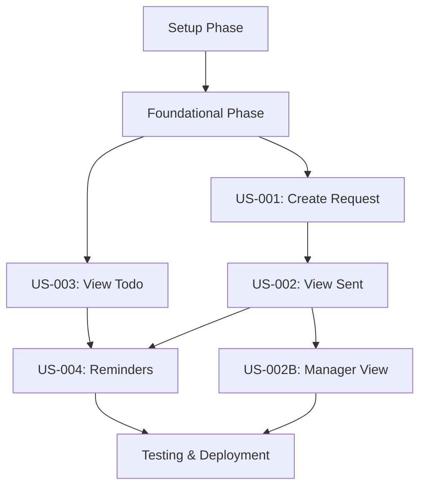

# Implementation Tasks - Feedback Request Management

> **Feature**: 0004 - feedback-request-management  
> **Status**: Planning  
> **Created**: 2025-11-13  
> **Last Updated**: 2025-11-13

---

## Task Format

All tasks follow this format:
```
- [ ] [TaskID] [P] [USx] Description with file path
```

**Legend**:
- `[TaskID]`: Sequential task number (T001, T002, etc.)
- `[P]`: Optional - Task can be executed in parallel
- `[USx]`: User Story reference (US1, US2, etc.) - only for user story tasks
- **Description**: Clear action with exact file path

---

## Task Summary

| Phase | Total Tasks | Completed | Remaining | Status |
|-------|-------------|-----------|-----------|--------|
| Setup | 12 | 0 | 12 | ⏳ Pending |
| Foundational | 15 | 0 | 15 | ⏳ Pending |
| US-001 (Create Request) | 18 | 0 | 18 | ⏳ Pending |
| US-002 (View Sent) | 14 | 0 | 14 | ⏳ Pending |
| US-002B (Manager View) | 8 | 0 | 8 | ⏳ Pending |
| US-003 (View Todo) | 10 | 0 | 10 | ⏳ Pending |
| US-004 (Reminders) | 6 | 0 | 6 | ⏳ Pending |
| Testing | 12 | 0 | 12 | ⏳ Pending |
| Deployment | 5 | 0 | 5 | ⏳ Pending |
| **TOTAL** | **100** | **0** | **100** | ⏳ Pending |

---

## Dependencies & Execution Order

### User Story Completion Order
Based on priorities from specification (all P1 high priority):



### Critical Path
Tasks that must be completed sequentially (blocking tasks):

1. **Setup Phase** → Must complete database migrations (T001-T003) before any other work
2. **Foundational Phase** → Repository, service, controller scaffolding blocks all user stories
3. **User Story Dependencies**:
   - US-002 (View Sent) depends on US-001 (Create Request) - must have requests to view
   - US-002B (Manager View) depends on US-002 - same UI patterns
   - US-003 (View Todo) independent - can run parallel with US-001/US-002
   - US-004 (Reminders) depends on US-002 - reminder UI in sent requests

### Parallel Execution Opportunities
Tasks marked with `[P]` can run in parallel within the same phase:

**Setup Phase - Batch 1** (after migrations): T004-T007, T009-T010 (interfaces, DTOs, types)
**Setup Phase - Batch 2**: T008, T011-T012 (component folders, i18n files)

**Foundational Phase - Batch 1**: T015-T017, T020-T022 (repository, service, controller implementations)
**Foundational Phase - Batch 2**: T023-T027 (frontend services, hooks, stores - after contracts defined)

**User Story Phases**: Backend and frontend tasks can run 100% in parallel (separate developers)
- Backend developer: T028-T031 (US-001 backend)
- Frontend developer: T035-T041 (US-001 frontend)
- QA: Prepare test cases while development ongoing

---

## Phase 1: Setup & Project Structure

**Objective**: Create database schema, domain entities, DTOs, and project structure for multi-recipient feedback requests

**Duration**: 16-20 hours (2-3 days)

### Backend Setup (cpr-api)

- [ ] T001 Create database migration `AddFeedbackRequestManagement` in `src/CPR.Infrastructure/Data/Migrations/` with CREATE TABLE feedback_requests (11 columns + audit)
- [ ] T002 Add CREATE TABLE feedback_request_recipients to same migration (8 columns, junction table with unique constraint)
- [ ] T003 Add ALTER TABLE feedback ADD COLUMN feedback_request_id to same migration (foreign key link)
- [ ] T004 [P] Create domain entity `FeedbackRequest.cs` in `src/CPR.Domain/Entities/` with navigation properties (Recipients, Project, Goal, Requestor)
- [ ] T005 [P] Create domain entity `FeedbackRequestRecipient.cs` in `src/CPR.Domain/Entities/` with navigation properties (FeedbackRequest, Employee, Feedback)
- [ ] T006 [P] Create EF Core configuration `FeedbackRequestConfiguration.cs` in `src/CPR.Infrastructure/Data/Configurations/` with Fluent API (indexes, constraints, mappings)
- [ ] T007 [P] Create EF Core configuration `FeedbackRequestRecipientConfiguration.cs` with unique constraint configuration
- [ ] T009 [P] Create C# DTOs in `src/CPR.Application/Contracts/FeedbackRequestDtos.cs`: CreateFeedbackRequestDto, FeedbackRequestDto, FeedbackRequestRecipientDto, UpdateFeedbackRequestDto, FeedbackRequestListDto, PaginationDto, SummaryDto (8 DTOs total)
- [ ] T010 [P] Create repository interface `IFeedbackRequestRepository.cs` in `src/CPR.Application/Interfaces/Repositories/` with methods: CreateAsync, GetByIdAsync, GetSentRequestsAsync, GetTodoRequestsAsync, UpdateAsync, DeleteAsync, GetTeamSentAsync, GetTeamReceivedAsync

### Frontend Setup (cpr-ui)

- [ ] T011 [P] Create TypeScript types in `src/types/feedbackRequest.ts` matching C# DTOs with snake_case (FeedbackRequestDto, FeedbackRequestRecipientDto, etc.)
- [ ] T012 [P] Create component folder structure `src/components/FeedbackRequest/` with subfolders for form, lists, cards
- [ ] T008 [P] Create i18n files: `src/locales/en/feedbackRequest.json` and `src/locales/es/feedbackRequest.json` with initial keys (form labels, buttons, errors, toasts)

---

## Phase 2: Foundational Implementation

**Objective**: Implement repository, service, controller scaffolding and shared frontend infrastructure

**Duration**: 28-36 hours (4-5 days)

### Backend Foundational Tasks

- [ ] T013 Apply database migration: `dotnet ef database update` to create feedback_requests and feedback_request_recipients tables
- [ ] T014 Add DbSet properties to `ApplicationDbContext.cs`: `DbSet<FeedbackRequest> FeedbackRequests` and `DbSet<FeedbackRequestRecipient> FeedbackRequestRecipients`
- [ ] T015 [P] Implement repository `FeedbackRequestRepository.cs` in `src/CPR.Infrastructure/Repositories/Implementations/` with complex queries (multi-recipient aggregation, per-recipient filtering)
- [ ] T016 [P] Implement service interface `IFeedbackRequestService.cs` in `src/CPR.Application/Interfaces/Services/` with business logic methods (duplicate detection, reminder throttling, status aggregation)
- [ ] T017 [P] Implement service `FeedbackRequestService.cs` in `src/CPR.Application/Services/Implementations/` with constructor injection (repository, notification service, employee service)
- [ ] T018 Create FluentValidation validator `CreateFeedbackRequestDtoValidator.cs` in `src/CPR.Application/Validators/` with rules: employee_ids 1-20, no self, message <=500, due_date future
- [ ] T019 Create FluentValidation validator `UpdateFeedbackRequestDtoValidator.cs` with due_date validation
- [ ] T020 [P] Create API controller `FeedbackRequestController.cs` in `src/CPR.Api/Controllers/` with skeleton methods for 7 endpoints
- [ ] T021 Create API controller `FeedbackRequestManagerController.cs` for manager-specific endpoints (team sent/received)
- [ ] T022 Configure dependency injection in `Program.cs`: register IFeedbackRequestRepository, IFeedbackRequestService, validators

### Frontend Foundational Tasks

- [ ] T023 [P] Create Zustand store `feedbackRequestDraftStore.ts` in `src/stores/` for auto-save draft functionality (30-second interval, 7-day retention)
- [ ] T024 [P] Create API service `feedbackRequestService.ts` in `src/services/` with axios wrappers for all 7 endpoints
- [ ] T025 [P] Create React Query hook `useSentRequests.ts` in `src/hooks/queries/` with pagination, filtering, sorting params
- [ ] T026 [P] Create React Query hook `useTodoRequests.ts` in `src/hooks/queries/` with pagination, filtering params
- [ ] T027 [P] Create mutation hooks in `src/hooks/mutations/` folder: `useCreateFeedbackRequest.ts`, `useSendReminder.ts`, `useCancelRequest.ts` with optimistic updates and error handling

---

## Phase 3: User Story US-001 - Create Feedback Request

**User Story**: As a registered employee, I want to request feedback from 1-20 specific colleagues with context about projects or goals, so that I can gather targeted input to support my professional development

**Key Features**: Multi-recipient select (max 20), project/goal association, message (500 chars), optional due date, duplicate detection, auto-save drafts, offline queue

**Duration**: 36-44 hours (5-6 days)

### Backend Tasks (US-001)

- [ ] T028 [P] [US-001] Implement POST /api/feedback/request endpoint in `FeedbackRequestController.cs`: Create method with employee_ids array parameter, requestor_id from JWT
- [ ] T029 [P] [US-001] Add duplicate detection logic to `FeedbackRequestService.CreateAsync()`: convert employee_ids to sorted set, hash comparison with existing active requests
- [ ] T030 [P] [US-001] Implement multi-recipient insert in `FeedbackRequestRepository.CreateAsync()`: bulk insert into feedback_request_recipients junction table (EF Core AddRange)
- [ ] T031 [US-001] Add notification trigger in service: queue notification job for all recipients (in-app + email with .ics calendar file)
- [ ] T032 [US-001] Create rate limiting middleware `FeedbackRequestRateLimitMiddleware.cs` in `src/CPR.Api/Middleware/`: check requestor has <50 requests in last 24 hours
- [ ] T033 [US-001] Add authorization check in controller: prevent self-requests (employee_ids cannot contain JWT.employee_id)
- [ ] T034 [US-001] Implement validation in service: verify all employee_ids exist and not deleted, verify project/goal exist if provided

### Frontend Tasks (US-001)

- [ ] T035 [P] [US-001] Create `FeedbackRequestForm.tsx` in `src/components/FeedbackRequest/` with react-hook-form (employee multi-select, project dropdown, goal dropdown, message textarea, due date picker)
- [ ] T036 [P] [US-001] Create `EmployeeMultiSelect.tsx` in `src/components/FeedbackRequest/` with debounced search (300ms), filter chips (department/location/role), 3-line results, max 20 validation
- [ ] T037 [P] [US-001] Implement duplicate detection UI in form: show warning modal for partial duplicates with "Remove Duplicates & Continue" option, error for full duplicates
- [ ] T038 [P] [US-001] Implement auto-save draft in form: useEffect with 30-second interval, save to localStorage with key `feedback_request_draft_${employeeId}`, 7-day retention
- [ ] T039 [US-001] Add offline queue in `feedbackRequestService.ts`: if navigator.onLine = false, save to IndexedDB queue, show toast "Request will be sent when online"
- [ ] T040 [US-001] Create success/error toast handling: green toast for success ("Request sent to [N] employees"), red toast for errors with specific messages
- [ ] T041 [US-001] Implement form validation: real-time character counter for message (500 chars), due date >= today, employee selection required, show inline errors
- [ ] T042 [US-001] Add navigation integration in `App.tsx`: route `/feedback/request/new` to FeedbackRequestForm component, add "Request Feedback" button in main navigation
- [ ] T043 [US-001] Create draft load/discard UI: show info banner if draft exists "<7 days old" with "Load Draft" and "Discard Draft" buttons
- [ ] T044 [US-001] Implement "Cancel" button behavior: show confirmation if form dirty, "Keep Editing" vs "Discard" options
- [ ] T045 [US-001] Add employee search API integration: GET /api/employees/search with query, department, location, role filters (debounced at 300ms)

### Testing Tasks (US-001)

- [ ] T046 [P] [US-001] Write backend service unit tests in `tests/CPR.Application.Tests/Services/FeedbackRequestServiceTests.cs`: CreateAsync with 1/10/20 recipients, duplicate detection (partial/full), validation errors (11 test cases)
- [ ] T047 [P] [US-001] Write backend controller integration tests in `tests/CPR.Api.Tests/Controllers/FeedbackRequestControllerTests.cs`: POST endpoint (201 Created, 400 validation, 403 self-request, 429 rate limit - 6 test cases)
- [ ] T048 [P] [US-001] Write frontend component tests in `src/components/FeedbackRequest/__tests__/FeedbackRequestForm.test.tsx`: form rendering, validation, submission, duplicate detection modal (10 test cases)
- [ ] T049 [US-001] Write E2E test in `tests/e2e/create-feedback-request.spec.ts`: complete create flow (navigate, select employees, fill form, submit, verify toast, verify sent list - 7 steps)

---

## Phase 4: User Story US-002 - View Sent Feedback Requests

**User Story**: As a registered employee, I want to view all feedback requests I've sent with per-recipient status tracking, so that I can track who I've requested feedback from and follow up on pending responses

**Key Features**: Paginated sent list (20/page), per-recipient status badges, expandable cards, remind/cancel actions, progress summaries

**Duration**: 28-32 hours (4 days)

### Backend Tasks (US-002)

- [ ] T050 [P] [US-002] Implement GET /api/me/feedback/request endpoint in `FeedbackRequestController.cs`: List method with pagination, status filter (all/pending/partial/complete), sorting
- [ ] T051 [P] [US-002] Add complex query in `FeedbackRequestRepository.GetSentRequestsAsync()`: JOIN feedback_request_recipients, GROUP BY for recipient aggregation, compute pending_count/responded_count
- [ ] T052 [US-002] Implement PATCH /api/feedback/request/{id} endpoint for due date updates and cancellation: validate owner, prevent modify if any recipient responded
- [ ] T053 [US-002] Implement DELETE /api/feedback/request/{id}/recipient/{recipientId} for partial cancellation: validate owner, check remaining recipients >=1, set is_completed=TRUE with no responded_at
- [ ] T054 [US-002] Add authorization check in service: ensure requestor_id matches JWT.employee_id (user can only view own sent requests)

### Frontend Tasks (US-002)

- [ ] T055 [P] [US-002] Create `SentRequestsList.tsx` in `src/components/FeedbackRequest/` with pagination component, filter dropdown (all/pending/partial/complete), sort dropdown (newest/oldest/due date)
- [ ] T056 [P] [US-002] Create `FeedbackRequestCard.tsx` component (expandable): header (date, due date badge, goal/project), recipients section (show 3 + "X more" link), message preview (100 chars + "Show more"), action buttons
- [ ] T057 [P] [US-002] Create `RecipientStatusBadge.tsx` component: Pending (gray), Overdue (red + warning icon), Responded (green + checkmark), Cancelled (gray strikethrough)
- [ ] T058 [US-002] Implement expandable card logic: show full recipient list, full message, per-recipient action buttons (View Feedback, Send Reminder, Cancel for [Name])
- [ ] T059 [US-002] Add "Cancel Request" modal: confirmation dialog with "Yes, Cancel" (destructive red) and "Keep Request" buttons, different messaging for single vs multi-recipient
- [ ] T060 [US-002] Implement filter and sort logic: update React Query params on dropdown change, refetch with new filters/sort
- [ ] T061 [US-002] Add summary statistics component: "Showing X of Y requests ([A] pending, [B] partially complete, [C] fully complete)"
- [ ] T062 [US-002] Implement empty state: "Start gathering feedback" illustration + "Request Feedback" button

### Testing Tasks (US-002)

- [ ] T063 [P] [US-002] Write backend service unit tests: GetSentRequestsAsync with filters, pagination, multi-recipient aggregation (7 test cases)
- [ ] T064 [P] [US-002] Write frontend component tests: SentRequestsList rendering, filter/sort functionality, card expansion, cancel modal (8 test cases)

---

## Phase 5: User Story US-002B - Manager View of Team Feedback Requests

**User Story**: As a manager, I want to view feedback requests sent by and addressed to my direct reports, so that I can support team development

**Key Features**: Team Requests tab (managers only), Sent by Team / Received by Team sub-tabs, read-only access, filter by team member

**Duration**: 16-20 hours (2-3 days)

### Backend Tasks (US-002B)

- [ ] T065 [P] [US-002B] Implement GET /api/team/feedback/request/sent endpoint in `FeedbackRequestManagerController.cs`: filter by direct reports (employees.manager_id = JWT.employee_id)
- [ ] T066 [P] [US-002B] Implement GET /api/team/feedback/request/received endpoint: filter recipients by direct reports
- [ ] T067 [US-002B] Add manager authorization check in controller: verify user has direct reports (query employees where manager_id = user's employee_id)
- [ ] T068 [US-002B] Ensure read-only enforcement: manager endpoints return 405 Method Not Allowed for POST/PATCH/DELETE

### Frontend Tasks (US-002B)

- [ ] T069 [P] [US-002B] Create `ManagerTeamRequests.tsx` component with two sub-tabs: "Sent by Team" and "Received by Team"
- [ ] T070 [US-002B] Add conditional rendering in navigation: show "Team Requests" tab only if user.is_manager or user has direct reports
- [ ] T071 [US-002B] Reuse SentRequestsList and FeedbackRequestCard components with read-only prop (hide action buttons, prepend team member name)
- [ ] T072 [US-002B] Add team member filter dropdown: GET /api/employees?manager_id={user_id}, filter by selected team member

---

## Phase 6: User Story US-003 - View and Respond to Feedback Requests (Todo List)

**User Story**: As a registered employee, I want to view feedback requests addressed to me and respond with structured feedback, so that I can support my colleagues' development

**Key Features**: Todo requests inbox, urgency indicators (overdue/due soon), respond button opens feedback form, mark as responded

**Duration**: 24-28 hours (3-4 days)

### Backend Tasks (US-003)

- [ ] T073 [P] [US-003] Implement GET /api/me/feedback/request/todo endpoint in `FeedbackRequestController.cs`: filter by feedback_request_recipients.employee_id = JWT.employee_id, is_completed = FALSE
- [ ] T074 [US-003] Add query optimization: eager load requestor, project, goal entities, sort by due_date ASC (overdue first)
- [ ] T075 [US-003] Update existing feedback submission service: when feedback submitted, mark feedback_request_recipients.is_completed = TRUE, set responded_at = NOW(), set feedback_id

### Frontend Tasks (US-003)

- [ ] T076 [P] [US-003] Create `TodoRequestsList.tsx` component with pagination, urgency badges (Overdue red, Due Today orange, Due Soon yellow), automatic sort by due_date
- [ ] T077 [P] [US-003] Add notification badge to "Todo Requests" tab in navigation: show count of pending requests
- [ ] T078 [US-003] Integrate "Respond" button with existing feedback submission form: pre-fill employee_id, goal_id, project_id from request
- [ ] T079 [US-003] Implement empty state: "You're all caught up! 🎉" message with "Request feedback from others" link
- [ ] T080 [US-003] Add filter dropdown: All / Pending / Responded
- [ ] T081 [US-003] Update list after feedback submission: optimistic update to mark request as responded, remove from pending filter
- [ ] T082 [US-003] Add dashboard widget: "Feedback Requests" card with count and "X overdue" warning if applicable

---

## Phase 7: User Story US-004 - Manage Request Due Dates and Reminders

**User Story**: As a registered employee, I want to set realistic due dates and send gentle reminders, so that I can manage expectations while respecting colleagues' time

**Key Features**: Due date quick selects (+3/+7/+14 days), manual reminders (48h cooldown), automatic reminders (3 days before, 1 day before), calendar .ics generation

**Duration**: 20-24 hours (3 days)

### Backend Tasks (US-004)

- [ ] T083 [P] [US-004] Implement POST /api/feedback/request/{id}/recipient/{recipientId}/remind endpoint: validate 48-hour cooldown (last_reminder_at check), update last_reminder_at, trigger notification
- [ ] T084 [US-004] Create background job `FeedbackRequestReminderJob.cs` in `src/CPR.Infrastructure/BackgroundJobs/`: Hangfire/Quartz scheduled job to send automatic reminders (3 days before, 1 day before due date)
- [ ] T085 [US-004] Add .ics calendar file generation in notification service: use iCal.NET library to create calendar event with "Provide feedback" title, due_date, 30-minute duration, deep link to respond

### Frontend Tasks (US-004)

- [ ] T086 [P] [US-004] Add "Send Reminder" button to FeedbackRequestCard per-recipient actions: visible if pending AND >3 days since request/last reminder, show 48h cooldown tooltip
- [ ] T087 [US-004] Implement "Remind All" button in expanded card: batch reminder to all eligible recipients (not reminded in last 48 hours)
- [ ] T088 [US-004] Add "Add to Calendar" link in email notification template: generates .ics file download link

---

## Phase 8: Testing

**Scope**: Comprehensive testing across all user stories (unit, integration, E2E, performance, security)

**Duration**: 32-40 hours (4-5 days)

### Unit Tests

- [ ] T089 [P] [TEST] Backend repository tests `FeedbackRequestRepositoryTests.cs`: GetSentRequestsAsync with 15 scenarios (pagination, filters, aggregation, edge cases like 0 recipients)
- [ ] T090 [P] [TEST] Backend service tests `FeedbackRequestServiceTests.cs`: All CRUD operations, duplicate detection (8 cases), rate limiting, validation errors (40+ test cases total)
- [ ] T091 [P] [TEST] Frontend hook tests `useFeedbackRequests.test.ts`: useSentRequests, useTodoRequests, useCreateFeedbackRequest with success/error/loading states (12 test cases)
- [ ] T092 [P] [TEST] Frontend store tests `feedbackRequestDraftStore.test.ts`: auto-save, draft load/discard, 7-day expiry logic (8 test cases)

### Integration Tests

- [ ] T093 [P] [TEST] API integration tests `FeedbackRequestApiTests.cs`: All 7 endpoints with database (25+ scenarios including authorization, rate limits, foreign key constraints)
- [ ] T094 [TEST] Notification integration tests: Verify .ics generation, notification triggers on create/remind, email content validation (6 test cases)
- [ ] T095 [TEST] Background job tests: FeedbackRequestReminderJob execution, 3-day and 1-day reminder logic, batch processing (4 test cases)

### E2E Tests

- [ ] T096 [P] [TEST] Playwright test `create-and-track-request.spec.ts`: Full workflow (create request, verify sent list, verify todo list for recipient, respond, verify completion - 10 steps)
- [ ] T097 [TEST] Playwright test `manager-team-view.spec.ts`: Manager accesses team requests, filters by team member, verifies read-only UI (6 steps)
- [ ] T098 [TEST] Playwright test `reminders-and-cancellation.spec.ts`: Send reminder with cooldown, cancel individual recipient, cancel full request (8 steps)

### Performance Tests

- [ ] T099 [TEST] Load test GET /api/me/feedback/request endpoint: 100 concurrent users, 20 requests/page, verify <500ms p95 response time
- [ ] T100 [TEST] Load test multi-recipient creation: create requests with 20 recipients, verify bulk insert performance <2 seconds, verify notification queue doesn't block

---

## Phase 9: Deployment

**Scope**: Production deployment preparation, documentation, monitoring

**Duration**: 16-20 hours (2-3 days)

### Documentation

- [ ] T101 [P] [DEPLOY] Update Swagger documentation in `src/CPR.Api/Program.cs`: Add XML comments to all 7 endpoints, annotate DTOs with examples
- [ ] T102 [P] [DEPLOY] Create user guide `feedback-request-user-guide.md` in `cpr-ui/documents/`: Screenshots for all 4 user stories, troubleshooting section

### Infrastructure

- [ ] T103 [DEPLOY] Configure Hangfire dashboard in appsettings.Production.json: Set recurring job schedule (daily at 9 AM UTC), configure retry policy (3 attempts, exponential backoff)
- [ ] T104 [DEPLOY] Run production migration testing: Apply migrations on staging environment, verify indexes created, verify data integrity constraints, rollback test

### Monitoring

- [ ] T105 [DEPLOY] Add Application Insights logging: Track feedback request creation rate, reminder job execution time, API endpoint latency (p50/p95/p99)

---

## Implementation Notes

### Parallel Execution Opportunities

**Batch 1 - Setup Phase** (T001-T012 can execute in parallel by 2-3 developers):
- Backend Dev: T001-T010 (migrations, entities, configs, DTOs, repository interface)
- Frontend Dev: T011-T012 (TypeScript types, component folders, i18n files)

**Batch 2 - Foundational Phase** (T013-T027 can split frontend/backend):
- Backend Dev: T013-T022 (DbContext, repository impl, service, validators, controllers, DI)
- Frontend Dev: T023-T027 (Zustand store, API service, React Query hooks)

**Batch 3 - User Stories** (Backend + Frontend can work in parallel per user story):
- US-001: Backend T028-T034 || Frontend T035-T045 (maximum parallelization opportunity)
- US-002: Backend T050-T054 || Frontend T055-T062
- US-002B: Backend T065-T068 || Frontend T069-T072
- US-003: Backend T073-T075 || Frontend T076-T082
- US-004: Backend T083-T085 || Frontend T086-T088

**Critical Path**: Setup → Foundational → US-001 → US-002 → Testing → Deployment (14-18 days)

### Task Dependencies Summary

- **US-002 depends on**: US-001 complete (reuses list patterns, requires create functionality working)
- **US-002B depends on**: US-002 complete (extends sent list with manager authorization)
- **US-003 independent**: Can run parallel to US-002 (todo list is separate concern)
- **US-004 depends on**: US-002 complete (reminders require sent list and recipient tracking)
- **Testing depends on**: All user stories complete
- **Deployment depends on**: Testing complete

### Code Quality Standards

Before marking any task complete:
- ✅ Follows CPR naming conventions (snake_case JSON, PascalCase C#, camelCase TS)
- ✅ No `any` types in TypeScript, strong typing throughout
- ✅ API DTOs match between backend/frontend
- ✅ Internationalization keys added to `en/feedback-request.json` and `es/feedback-request.json`
- ✅ Error handling with user-friendly messages
- ✅ Unit tests written (>80% coverage target)
- ✅ Code reviewed by peer
- ✅ Constitutional compliance verified (specification-first, no shortcuts)

### MVP Scope Definition

**Phase 1 MVP** (Minimum Viable Product - 8-10 days):
- ✅ Setup + Foundational phases (T001-T027)
- ✅ US-001 Create Request (T028-T049) - core value delivery
- ✅ US-003 View Todo (T073-T082) - recipient perspective essential
- ✅ Basic testing (50% of Phase 8)
- ✅ Deployment preparation

**Phase 2 Enhancements** (6-8 days):
- US-002 View Sent (T050-T064) - requestor tracking
- US-004 Reminders (T083-T088) - follow-up mechanism
- US-002B Manager View (T065-T072) - leadership visibility
- Complete testing suite

### Assumptions & Constraints

**Technical Assumptions**:
1. PostgreSQL 16 database with migration support available
2. Employee search API exists and returns employee_id, full_name, department, location, role
3. Notification system exists with email + in-app support (will integrate .ics generation)
4. Existing feedback submission form can be extended with pre-filled fields
5. HtmlSanitizer library available for XSS prevention (message field)
6. Hangfire or Quartz.NET available for background job scheduling

**Business Rules Confirmed**:
1. 50 requests/day rate limit per user (tracks creation timestamp)
2. 48-hour reminder cooldown per recipient (prevents spam)
3. Multi-recipient max = 20 (UI enforces, backend validates)
4. Soft delete: All deletions set is_deleted=TRUE, preserve data for audit
5. Manager access: Read-only for direct reports only (employees.manager_id check)

**Known Limitations**:
1. No bulk request creation (create 1 request at a time)
2. Cannot modify recipient list after creation (must cancel and recreate)
3. No email templates for reminders (uses system default with .ics attachment)
4. No advanced analytics (reports/dashboards deferred to future iteration)

---

## Change Log

| Date | Author | Changes |
|------|--------|---------|
| 2025-11-13 | [Name] | Initial task breakdown created |
