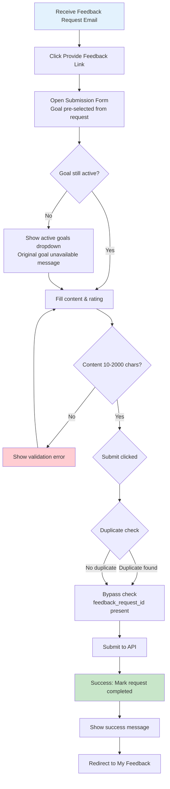
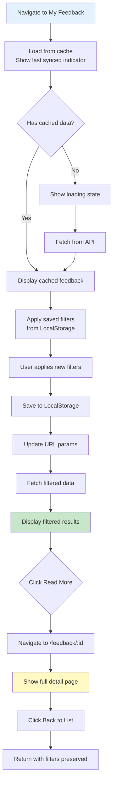

---
type: feature_specification
feature_number: 0005
feature_name: feedback-submission-collection
version: 2.0.0
created: 2025-11-24
last_updated: 2025-11-24
status: refined
phase: 2_refine
current_phase_status: completed
repositories:
  - cpr-meta
  - cpr-api
  - cpr-ui
related_documents:
  - ../../constitution.md
  - ../../architecture.md
  - ../../features-list.md
  - ../0004-feedback-request-management/description.md
dependencies:
  - 0001-personal-goal-management
  - 0004-feedback-request-management
---

# Feedback Submission & Collection

> **Specification ID**: SPEC-0005  
> **Feature**: feedback-submission-collection  
> **Priority**: High  
> **Complexity**: Medium

## Executive Summary

Feedback Submission & Collection enables employees to submit structured, constructive feedback to colleagues with project and goal associations, competency ratings (1-5 scale), and detailed comments. Recipients can view all feedback they've received in a centralized location with filtering, sorting, and analytics capabilities. This feature complements the Feedback Request Management system (F004) by providing the actual submission and viewing interfaces, closing the feedback loop and enabling data-driven performance reviews.

**Business Impact**: Facilitates continuous performance improvement through structured feedback exchange, provides employees with comprehensive feedback visibility for professional development, and generates rich feedback data for performance reviews and 360-degree assessments. Increases feedback quality through structured templates and reduces friction in the feedback submission process.

---

## Core User Stories

### US-001: Submit Feedback Response

**As a** registered employee  
**I want** to submit feedback to a colleague in response to their feedback request  
**So that** I can provide constructive input to support their professional development

**Acceptance Criteria**:

- [ ] I can access feedback submission from:
  - Feedback request todo list ("Provide Feedback" button)
  - Feedback request detail page ("Respond" action)
  - Direct navigation via email notification link (deep link to submission form)
  - Goal detail page ("Give Feedback" action in goal menu)
- [ ] I can submit feedback with:
  - **Goal selection** (required): Searchable dropdown showing colleague's goals (if from request, goal pre-selected)
    - If pre-selected goal is deleted/archived, dropdown shows active goals with message: "Original goal no longer available. Please select an active goal."
  - **Project association** (optional): Searchable dropdown showing shared projects
  - **Feedback content** (required): Multiline text input (plain text, no rich formatting) with 10-2000 character validation
  - **Rating** (required): 1-5 star scale with hover labels (1=Needs Improvement, 2=Below Expectations, 3=Meets Expectations, 4=Exceeds Expectations, 5=Outstanding)
  - **Feedback request link** (auto-filled if responding to request): Hidden field linking feedback to originating request
- [ ] Form includes:
  - Character counter showing "1850 / 2000 characters" with color coding (green >500, yellow 200-500, red <200)
  - Real-time validation with inline error messages
  - Recipient name and role displayed prominently at top
  - Goal context displayed (goal title, description, deadline, progress)
  - Project context displayed if selected (project title, status, role)
- [ ] Content input includes:
  - Multiline textarea (plain text, no formatting toolbar)
  - Auto-save draft every 30 seconds (saved to IndexedDB with 7-day expiration)
  - "Discard Draft" button if draft exists (with confirmation dialog)
  - Input sanitization on submit (basic text cleaning, no HTML processing needed)
- [ ] Submission process:
  - "Submit Feedback" button (primary, enabled when form valid)
  - "Cancel" button (secondary, shows confirmation if unsaved changes)
  - Duplicate detection (blocking): If submitting to same recipient for same goal within 24 hours of previous feedback creation, show error modal: "You already provided feedback on this goal [X hours] ago. Please wait [Y hours] before submitting again." with "OK" button (submission blocked)
  - Exception: Duplicate check bypassed when responding to formal feedback request (feedback_request_id present)
  - Loading state during submission with spinner
  - Success message: "Feedback submitted successfully to [Name]" with "View My Feedback" button
  - Error handling with specific messages (validation errors, duplicate detection, network errors, server errors)
- [ ] If responding to feedback request:
  - Feedback request marked as completed (is_completed = true, responded_at = now)
  - Feedback record linked via feedback_request_id foreign key
  - Requestor receives notification that feedback was provided
  - Feedback request todo item removed from my todo list
- [ ] Offline support:
  - Form works offline with cached goal/project data
  - Submission queued in IndexedDB if offline
  - Auto-sync when connection restored with retry logic (3 attempts)
  - Visual indicator showing "Offline - Will submit when online"

### US-002: View Received Feedback

**As a** registered employee  
**I want** to view all feedback I've received in a centralized, organized interface  
**So that** I can understand my strengths, identify improvement areas, and prepare for performance reviews

**Acceptance Criteria**:

- [ ] I can access "My Feedback" page from:
  - Main navigation (top-right menu: "My Feedback")
  - Dashboard widget ("View All Feedback" link)
  - Goal detail page ("View Feedback" link shows feedback for that specific goal)
- [ ] Feedback list displays:
  - **Card-based layout** with pagination (20 items per page)
  - Each card shows: Provider name + role, rating (stars), content preview (first 150 chars), goal title, project title (if any), date received, "Read More" button
  - Avatar/photo for feedback provider (40px circle)
  - Visual urgency indicators: Recent feedback (< 7 days) highlighted with "New" badge
  - Empty state with onboarding content:
    - Heading: "No feedback yet"
    - Explanation: "Feedback helps you understand your strengths and identify areas for improvement. Regular feedback accelerates professional development and prepares you for performance reviews."
    - Call-to-action: "Request Feedback" button
    - Secondary action: "Learn More" link to feedback help documentation
- [ ] Filtering options (sidebar, collapsible on mobile):
  - **Date range**: Last 7 days, Last 30 days, Last 90 days, Last year, Custom range (date picker), All time (default)
  - **Rating**: Filter by rating value (1-5 stars, multi-select checkboxes)
  - **Goal**: Dropdown with my goals (shows feedback count per goal)
  - **Project**: Dropdown with my projects (shows feedback count per project)
  - **Provider**: Dropdown with employees who've given me feedback (autocomplete search)
  - "Clear All Filters" link appears when any filter active
  - Filter chips displayed above results showing active filters
  - **Filter persistence**: All filter selections saved to LocalStorage (persists across browser sessions, user-specific preferences)
- [ ] Sorting options (dropdown, top-right):
  - Date received (newest first) - default
  - Date received (oldest first)
  - Rating (highest first)
  - Rating (lowest first)
  - Provider name (A-Z)
  - Goal title (A-Z)
- [ ] Search functionality:
  - Search input: "Search feedback content..." (searches content text only)
  - Minimum 3 characters to trigger search
  - Debounced at 500ms to reduce API calls
  - Highlights matching text in results (yellow background)
- [ ] Feedback detail view (separate page: /feedback/{id}):
  - Full feedback content (plain text, line breaks preserved)
  - Provider: Name, role, department, avatar/photo (80px circle)
  - Goal: Title, description, progress, status (if associated)
  - Project: Title, status, my role (if applicable)
  - Rating: Star display with label (e.g., "4 stars - Exceeds Expectations")
  - Timestamps: Received date + time
  - Action buttons:
    - "Back to List" (navigates back to /feedback with filters preserved)
    - "Reply" (opens conversation thread or email - future enhancement)
    - "Link to Goal" (if not already linked - future enhancement)
    - "Export" (PDF download of feedback item)
  - Browser back button returns to feedback list
  - Deep linkable URL for sharing or email notifications
- [ ] Analytics summary (top of page, card layout):
  - Total feedback received (count)
  - Average rating (decimal, e.g., "4.2 stars")
  - Rating distribution (bar chart: 5★: 12, 4★: 8, 3★: 3, 2★: 1, 1★: 0)
  - Recent trends (line chart: feedback count per month, last 12 months)
  - Top goals (goals with most feedback, top 5 list)
- [ ] Offline support:
  - Feedback list cached in IndexedDB (up to 100 most recent items)
  - Works fully offline with cached data
  - Sync when online to fetch new feedback (delta sync with last_sync timestamp)
  - Visual indicator: "Last synced: 2 hours ago" with refresh button

### US-003: Submit Unsolicited Feedback

**As a** registered employee  
**I want** to submit feedback to a colleague proactively (without a feedback request)  
**So that** I can provide timely input when I observe achievements or areas for improvement

**Acceptance Criteria**:

- [ ] I can access unsolicited feedback submission from:
  - Employee profile page ("Give Feedback" button)
  - Goal detail page (if viewing colleague's goal, "Give Feedback" action)
  - Main navigation ("Give Feedback" quick action)
  - Dashboard widget ("Quick Actions" → "Give Feedback")
- [ ] Form requires:
  - **Recipient selection** (required): Autocomplete search with same functionality as feedback request (search by name, email, department)
  - Cannot select myself as recipient (validation error: "You cannot give feedback to yourself")
  - **Goal selection** (optional): Searchable dropdown showing recipient's goals (fetched dynamically based on recipient)
  - Shows goal title, status, progress, owner name
  - Filters out: deleted goals, archived goals (status = 'archived')
  - Sorted by: Active goals first, then by created date (newest first)
  - Shows "No goals found" if recipient has no accessible goals
  - "Skip goal association" checkbox allows submitting feedback without goal (general feedback)
- [ ] All other form fields identical to US-001 (Submit Feedback Response)
- [ ] Validation:
  - Goal must belong to selected recipient if goal provided (validated on backend)
  - Recipient must be valid, active employee
  - Cannot submit duplicate feedback to same recipient for same goal within 24 hours (blocking error, submission prevented)
  - Duplicate check: Exact goal_id match required; 24-hour window starts from previous feedback creation timestamp
  - If no goal selected, duplicate check uses recipient + null goal combination
- [ ] Submission triggers:
  - Notification sent to recipient: "You received new feedback from [Name]"
  - Feedback appears in recipient's "My Feedback" list immediately
  - No feedback request link (feedback_request_id = NULL)
  - Auto-save draft behavior identical to US-001

### US-004: Feedback Analytics & Insights

**As a** registered employee  
**I want** to see analytics and trends in the feedback I've received  
**So that** I can identify patterns, track improvement over time, and prepare data-driven performance reviews

**Acceptance Criteria**:

- [ ] Analytics dashboard accessible from:
  - "My Feedback" page (tab navigation: "Feedback List" | "Analytics")
  - Dashboard main page (widget: "Feedback Insights" with summary metrics)
- [ ] Metrics displayed (cards, responsive grid):
  - **Total Feedback Received**: Count with trend indicator (↑12% from last period)
  - **Average Rating**: Decimal value with star visualization (e.g., 4.3 ⭐⭐⭐⭐☆)
  - **Feedback by Time**: Line chart showing count per month (last 12 months)
  - **Rating Distribution**: Horizontal bar chart (5★: 45%, 4★: 30%, 3★: 20%, 2★: 5%, 1★: 0%)
  - **Top Feedback Providers**: List of top 5 employees who've given me feedback (name, count, average rating)
  - **Goals with Most Feedback**: Top 5 goals ranked by feedback count (goal title, count, average rating)
  - **Projects with Most Feedback**: Top 5 projects ranked by feedback count (project title, count, average rating)
- [ ] Time range selector (dropdown, top-right):
  - Last 30 days
  - Last 90 days
  - Last 6 months
  - Year to date (default) - Calendar year from Jan 1 to today
  - All time
  - Custom range (date picker)
- [ ] Drill-down capabilities:
  - Click on chart segment to filter feedback list by that dimension
  - Click on goal/project name to view feedback for that goal/project
  - Click on provider name to view all feedback from that provider
- [ ] Export options:
  - "Export to PDF" button: Generates PDF report with all analytics, charts, and summary
  - "Export Data (CSV)" button: Downloads raw feedback data as CSV (columns: date, provider, goal, project, rating, content)
- [ ] Comparison views:
  - Compare current period vs previous period using same calendar boundaries:
    - If current = "Last 90 days" → previous = 90 days before that (same duration)
    - If current = "Year to date" (partial year, e.g., Jan-Nov 2025) → previous = full calendar year (all of 2024)
    - If current = "Last year" (full year 2025) → previous = full year 2024
    - If current = "Custom range" → previous = same duration immediately before start date
  - Shows delta indicators (+/-) for all metrics with percentage change
  - Side-by-side bar charts for rating distribution comparison
  - Comparison note displayed: "Comparing [current period] vs [previous period]" with date ranges
- [ ] Accessibility:
  - All charts have accessible data tables (toggle view: "View as Table")
  - Screen reader announcements for dynamic data updates
  - Keyboard navigation for all interactive elements

---

## UX Mockups & Wireframes

### Feedback Submission Form

```mermaid
graph TB
    subgraph "Feedback Submission Page"
        A[Header: Give Feedback to John Smith]
        B[Recipient Info Card<br/>John Smith - Senior Developer<br/>Engineering Department]
        C[Goal Selection Dropdown<br/>Optional - Select a goal or skip]
        D[Project Selection Dropdown<br/>Optional]
        E[Rating Section<br/>★★★★★<br/>1-5 stars with hover labels]
        F[Content Textarea<br/>Plain text, 10-2000 chars<br/>Character counter: 0 / 2000]
        G[Action Buttons<br/>Submit Feedback | Cancel]
        H[Draft Status: Auto-saved 10s ago]

        A --> B
        B --> C
        C --> D
        D --> E
        E --> F
        F --> H
        H --> G
    end

    style A fill:#e3f2fd
    style G fill:#c8e6c9
```

### My Feedback List View

```mermaid
graph TB
    subgraph "My Feedback Page - /feedback"
        A[Page Header: My Feedback]
        B[Summary Cards Row<br/>Total: 45 | Avg Rating: 4.3★ | Recent: 3 new]
        C[Filters Sidebar<br/>Date Range, Rating, Goal, Project, Provider<br/>Saved to LocalStorage]
        D[Active Filter Chips<br/>Rating: 5★ | Last 30 days | Clear All]
        E[Feedback Card List<br/>20 items per page, pagination]

        F[Feedback Card<br/>─────────────<br/>👤 Sarah Johnson - Manager<br/>★★★★★ Exceeds Expectations<br/>📅 Nov 20, 2025<br/>🎯 Complete React Training<br/>💬 Excellent progress on component architecture...<br/>🔗 Read More]

        G[Pagination Controls<br/>← Previous | Page 1 of 3 | Next →]
        H[Empty State<br/>No feedback yet<br/>Educational content about feedback value<br/>Request Feedback Button]

        A --> B
        B --> C
        B --> D
        D --> E
        E --> F
        E --> H
        E --> G
    end

    style A fill:#e3f2fd
    style F fill:#fff3e0
    style H fill:#ffebee
```

### Feedback Detail Page

```mermaid
graph TB
    subgraph "Feedback Detail Page - /feedback/:id"
        A[Back to List Button]
        B[Provider Header<br/>👤 Sarah Johnson<br/>Manager - Engineering Department]
        C[Rating Display<br/>★★★★★ 5 stars - Outstanding]
        D[Goal Association<br/>🎯 Complete React Training<br/>Progress: 75% | Status: In Progress]
        E[Project Context<br/>🔨 Customer Portal Redesign<br/>Status: Active]
        F[Full Feedback Content<br/>Plain text with line breaks preserved<br/>Full 2000 character content visible]
        G[Metadata<br/>📅 Received: Nov 20, 2025 at 2:30 PM<br/>🔗 In response to feedback request]
        H[Action Buttons<br/>Reply | Export PDF | Link to Goal]

        A --> B
        B --> C
        C --> D
        D --> E
        E --> F
        F --> G
        G --> H
    end

    style A fill:#e3f2fd
    style C fill:#c8e6c9
    style F fill:#fff9c4
```

### Analytics Dashboard

```mermaid
graph TB
    subgraph "Feedback Analytics - /feedback/analytics"
        A[Tab Navigation: Feedback List | Analytics]
        B[Time Range Selector<br/>Year to Date default]
        C[Comparison Toggle<br/>Compare with previous period]

        D[Metrics Cards Row]
        E[Total Feedback: 45<br/>↑12% vs last year]
        F[Avg Rating: 4.3★<br/>↑0.3 vs last year]
        G[Recent Trend<br/>↑ 3 this month]

        H[Rating Distribution Chart<br/>Horizontal bar chart<br/>5★: 45% | 4★: 30% | 3★: 20%]
        I[Feedback by Month Chart<br/>Line chart showing counts<br/>Last 12 months]

        J[Top Providers List<br/>1. Sarah Johnson: 8 feedback<br/>2. Mike Chen: 6 feedback<br/>3. Lisa Park: 5 feedback]
        K[Top Goals List<br/>1. React Training: 12 feedback<br/>2. API Development: 8 feedback]
        L[Export Buttons<br/>Export PDF | Export CSV]

        A --> B
        B --> C
        C --> D
        D --> E
        D --> F
        D --> G
        D --> H
        D --> I
        I --> J
        I --> K
        K --> L
    end

    style A fill:#e3f2fd
    style E fill:#c8e6c9
    style F fill:#c8e6c9
```

### User Flow: Submit Feedback from Request



### User Flow: View & Filter Feedback



---

## Business Rules

1. **Self-Feedback Prevention**: Employees cannot submit feedback to themselves. Validation enforced at both client (form disabled) and server levels (400 Bad Request error).

2. **Goal Ownership Validation**: Feedback can only be submitted for goals owned by the recipient. Backend validates goal.owner_id matches feedback.to_employee_id before submission.

3. **Content Sanitization**: All feedback content is plain text (no HTML). Basic text sanitization applied on submission to remove control characters and ensure UTF-8 encoding. Line breaks preserved for display formatting.

4. **Rating Scale Standard**: Rating is mandatory and must be integer 1-5 (1=Needs Improvement, 2=Below Expectations, 3=Meets Expectations, 4=Exceeds Expectations, 5=Outstanding). Enforced with validation attributes and UI constraints.

5. **Feedback Request Linkage**: When feedback is submitted in response to a feedback request, the feedback_request_id foreign key is set, and the corresponding feedback_request_recipients.is_completed flag is set to TRUE with responded_at timestamp.

6. **Duplicate Prevention (Strict)**: System blocks submission if user attempts to submit feedback to same recipient for same goal (exact goal_id match) within 24 hours of previous feedback creation. Displays error modal with time remaining. Exception: Duplicate check bypassed when responding to formal feedback request (feedback_request_id present). If no goal selected, duplicate check uses recipient + null goal combination.

7. **Feedback Visibility**: Employees can only view feedback addressed to them (to_employee_id = current_user). Managers cannot view direct reports' feedback unless explicitly shared. Admins have read-only access for auditing.

8. **Offline Sync Strategy**: Feedback submissions queued offline are synced in chronological order (oldest first) when connection restored. Failed syncs retry up to 3 times with exponential backoff (1s, 5s, 15s). After 3 failures, user receives error notification with "Retry" button.

9. **Audit Trail**: All feedback submissions are logged with created_by, created_at, modified_by, modified_at audit fields. Feedback cannot be deleted (no soft delete) but can be marked as "Archived" by recipient.

10. **Character Limits**: Feedback content must be 10-2000 characters. Enforced on client (real-time validation) and server (validation attribute). Draft auto-save respects limits.

11. **Goal/Project References**: Goal association is optional for unsolicited feedback. If referenced goal or project is deleted (soft delete), feedback remains visible but shows "(Deleted Goal)" or "(Deleted Project)" with strikethrough text. Backend ensures referential integrity with ON DELETE SET NULL constraints. Feedback without goal association displays "General Feedback" label.

12. **Notification Triggers**: System sends email + in-app notifications when: (1) Feedback is received, (2) Feedback request is responded to (notifies requestor), (3) Feedback submission fails after offline sync retries.

---

## Technical Requirements

### Performance

- **API Response Time**: POST /api/feedback submission < 300ms (95th percentile) including database write and notification trigger
- **API Response Time**: GET /api/me/feedback list < 200ms (95th percentile) for 20 items with includes (goal, project, provider details)
- **Page Load Time**: My Feedback page loads < 2 seconds on 3G network (including initial data fetch and rendering)
- **Search Performance**: Content search returns results within 500ms for datasets up to 1000 feedback items
- **Offline Sync**: Queued feedback submissions sync within 5 seconds of connection restoration
- **Analytics Load**: Analytics dashboard renders within 1.5 seconds with up to 12 months of data (caching enabled)

### Security

- **Authentication**: All endpoints require JWT Bearer token authentication (401 Unauthorized if missing/invalid)
- **Authorization**: Employees can only submit feedback to other employees (not self) and only view feedback addressed to them
- **Content Sanitization**: All feedback content sanitized to remove control characters and ensure UTF-8 encoding (plain text only, no HTML processing)
- **SQL Injection Prevention**: All queries use parameterized queries via Entity Framework (no raw SQL)
- **XSS Prevention**: Plain text input (no HTML tags allowed), sanitized on submission to remove control characters
- **Rate Limiting**: API endpoints rate-limited to 30 requests per minute per user (429 Too Many Requests if exceeded)
- **CSRF Protection**: All state-changing requests include anti-CSRF tokens validated on server
- **Input Validation**: All DTOs validated with DataAnnotations attributes ([Required], [StringLength], [Range])
- **Audit Logging**: All feedback submissions logged with user ID, IP address, timestamp for security audits

### Offline Mode (Constitutional Principle 5)

- **Offline Submission**: Feedback submission form works fully offline using cached goal/project data (last 30 days synced)
- **Offline Queue**: Submissions queued in IndexedDB with status tracking (pending/syncing/failed/success)
- **Data Caching**: Last 100 received feedback items cached in IndexedDB with 7-day expiration
- **Draft Persistence**: Form drafts saved to IndexedDB every 30 seconds, persist across browser restarts
- **Sync Indicators**: Visual indicators show sync status ("Offline", "Syncing", "Last synced: 2 hours ago")
- **Conflict Resolution**: If offline submission fails due to deleted goal/employee, user receives detailed error with resolution options
- **Delta Sync**: On reconnection, only fetch feedback created/modified since last_sync timestamp (efficient bandwidth usage)

### Internationalization (Constitutional Principle 6)

- **UI Text Externalization**: All labels, placeholders, buttons, error messages, validation messages externalized to i18n resource files
- **Locale Support**: English (en-US), Spanish (es-ES), French (fr-FR), German (de-DE)
- **Date Formatting**: All dates formatted per user's locale (e.g., MM/DD/YYYY for en-US, DD/MM/YYYY for en-GB)
- **Number Formatting**: Rating averages formatted per locale (e.g., "4.2" for en-US, "4,2" for de-DE)
- **RTL Support**: UI layout adapts for right-to-left languages (future: Arabic, Hebrew)
- **Character Encoding**: All text stored and transmitted in UTF-8 encoding
- **Translation Keys**: Naming convention: `feedback.submit.title`, `feedback.list.empty_state`, `feedback.rating.label_1`
- **Dynamic Content**: Feedback content submitted in any language, no translation enforced (user-generated content)

---

## API Design (Constitutional Principles 2, 3, 9)

### Endpoints

#### POST /api/feedback

**Purpose**: Submit feedback from authenticated user to another employee regarding a specific goal  
**Authentication**: Required (JWT Bearer token)  
**Authorization**: Must be authenticated employee, cannot submit to self  
**Rate Limit**: 30 requests per minute per user

**Request Body** (JSON):

```json
{
  "project_id": "uuid (optional) - Associated project context",
  "goal_id": "uuid (optional) - Goal this feedback is for (required when responding to feedback request)",
  "employee_id": "uuid (required) - Employee receiving feedback (to_employee_id)",
  "content": "string (required, 10-2000 chars) - Feedback content (plain text, auto-sanitized)",
  "rating": "integer (required, 1-5) - Rating on 1-5 scale",
  "feedback_request_id": "uuid (optional) - Originating feedback request if responding to request"
}
```

**Response 201 Created** (JSON):

```json
{
  "id": "uuid",
  "goal_id": "uuid",
  "project_id": "uuid | null",
  "from_employee_id": "uuid (authenticated user's employee ID)",
  "to_employee_id": "uuid",
  "content": "string (sanitized)",
  "rating": 4,
  "created_at": "2025-11-24T10:30:00Z",
  "feedback_request_id": "uuid | null",
  "project": {
    "id": "uuid",
    "title": "string",
    "status": "string"
  },
  "goal": {
    "id": "uuid",
    "title": "string",
    "status": "string",
    "progress": 75
  },
  "from_employee": {
    "id": "uuid",
    "display_name": "string",
    "job_title": "string",
    "department": "string"
  },
  "to_employee": {
    "id": "uuid",
    "display_name": "string",
    "job_title": "string",
    "department": "string"
  }
}
```

**Error Responses**:

- `400 Bad Request` - Validation errors (self-feedback, invalid goal, content length, rating range, sanitization failed, duplicate feedback detected)
- `401 Unauthorized` - Missing or invalid authentication token
- `404 Not Found` - Goal, project, or employee not found or soft-deleted
- `409 Conflict` - Duplicate feedback: feedback already submitted to this recipient for this goal within 24 hours
- `429 Too Many Requests` - Rate limit exceeded (30 requests per minute)

**Validation Rules**:

- `goal_id`: Optional (nullable), required if feedback_request_id provided; if provided, must be valid non-deleted goal owned by to_employee
- `employee_id`: Required, must be valid non-deleted employee, cannot equal from_employee_id
- `content`: Required, 10-2000 characters, plain text only (no HTML), auto-sanitized (removes control characters)
- `rating`: Required, must be integer 1-5
- `project_id`: Optional, if provided must be valid non-deleted project
- `feedback_request_id`: Optional, if provided must be valid feedback request where authenticated user is recipient
- `duplicate_check`: Blocks submission if feedback exists for same to_employee + goal_id combination within 24 hours (returns 409 Conflict), except when feedback_request_id provided

**Side Effects**:

- If `feedback_request_id` provided: Sets feedback_request_recipients.is_completed = TRUE, responded_at = NOW()
- Sends notification to recipient: "You received new feedback from [Name]"
- If responding to request: Sends notification to requestor: "[Name] responded to your feedback request"
- Logs audit trail: created_by, created_at with user ID and timestamp

---

#### GET /api/me/feedback

**Purpose**: Get all feedback addressed to authenticated user with filtering, sorting, and pagination  
**Authentication**: Required (JWT Bearer token)  
**Authorization**: Returns only feedback where to_employee_id = authenticated user

**Query Parameters**:

- `page` (integer, default: 1) - Page number for pagination
- `page_size` (integer, default: 20, max: 100) - Items per page
- `date_from` (ISO 8601 date, optional) - Filter feedback received after this date
- `date_to` (ISO 8601 date, optional) - Filter feedback received before this date
- `rating` (integer[], optional) - Filter by rating values (e.g., `rating=4&rating=5` for 4-5 stars)
- `goal_id` (uuid, optional) - Filter feedback for specific goal
- `project_id` (uuid, optional) - Filter feedback for specific project
- `from_employee_id` (uuid, optional) - Filter feedback from specific provider
- `search` (string, optional, min 3 chars) - Search feedback content (full-text search)
- `sort_by` (string, default: "created_at") - Sort field: `created_at`, `rating`, `from_employee_name`, `goal_title`
- `sort_order` (string, default: "desc") - Sort direction: `asc`, `desc`

**Response 200 OK** (JSON):

```json
{
  "items": [
    {
      "id": "uuid",
      "goal_id": "uuid",
      "project_id": "uuid | null",
      "from_employee_id": "uuid",
      "content": "string",
      "rating": 5,
      "created_at": "2025-11-24T10:30:00Z",
      "feedback_request_id": "uuid | null",
      "goal": {
        "id": "uuid",
        "title": "string",
        "status": "string",
        "progress": 80
      },
      "project": {
        "id": "uuid",
        "title": "string",
        "status": "string"
      } | null,
      "from_employee": {
        "id": "uuid",
        "display_name": "string",
        "job_title": "string",
        "department": "string",
        "avatar_url": "string | null"
      }
    }
  ],
  "pagination": {
    "page": 1,
    "page_size": 20,
    "total_items": 45,
    "total_pages": 3,
    "has_next": true,
    "has_previous": false
  },
  "summary": {
    "total_count": 45,
    "average_rating": 4.3,
    "rating_distribution": {
      "1": 0,
      "2": 2,
      "3": 8,
      "4": 15,
      "5": 20
    }
  }
}
```

**Error Responses**:

- `400 Bad Request` - Invalid query parameters (invalid date format, page out of range, invalid sort field)
- `401 Unauthorized` - Missing or invalid authentication token

---

#### GET /api/me/feedback/{id}

**Purpose**: Get single feedback item by ID (must be addressed to authenticated user)  
**Authentication**: Required (JWT Bearer token)  
**Authorization**: Returns only if to_employee_id = authenticated user

**Response 200 OK** (JSON):

```json
{
  "id": "uuid",
  "goal_id": "uuid",
  "project_id": "uuid | null",
  "from_employee_id": "uuid",
  "content": "string (full content with formatting)",
  "rating": 4,
  "created_at": "2025-11-24T10:30:00Z",
  "feedback_request_id": "uuid | null",
  "goal": {
    "id": "uuid",
    "title": "string",
    "description": "string",
    "status": "string",
    "progress": 75,
    "deadline": "2025-12-31"
  },
  "project": {
    "id": "uuid",
    "title": "string",
    "description": "string",
    "status": "string"
  } | null,
  "from_employee": {
    "id": "uuid",
    "display_name": "string",
    "email": "string",
    "job_title": "string",
    "department": "string",
    "avatar_url": "string | null"
  }
}
```

**Error Responses**:

- `401 Unauthorized` - Missing or invalid authentication token
- `403 Forbidden` - Feedback does not belong to authenticated user
- `404 Not Found` - Feedback ID not found or soft-deleted

---

#### GET /api/me/feedback/analytics

**Purpose**: Get analytics summary for feedback received by authenticated user  
**Authentication**: Required (JWT Bearer token)  
**Authorization**: Returns analytics for authenticated user only

**Query Parameters**:

- `date_from` (ISO 8601 date, optional) - Analytics period start date
- `date_to` (ISO 8601 date, optional) - Analytics period end date
- `compare_previous` (boolean, default: false) - Include comparison with previous period

**Response 200 OK** (JSON):

```json
{
  "period": {
    "start_date": "2025-01-01",
    "end_date": "2025-11-24"
  },
  "total_feedback_count": 45,
  "average_rating": 4.3,
  "rating_distribution": {
    "1": 0,
    "2": 2,
    "3": 8,
    "4": 15,
    "5": 20
  },
  "feedback_by_month": [
    { "month": "2025-01", "count": 3, "average_rating": 4.0 },
    { "month": "2025-02", "count": 5, "average_rating": 4.2 },
    { "month": "2025-03", "count": 4, "average_rating": 4.5 }
  ],
  "top_providers": [
    {
      "employee_id": "uuid",
      "display_name": "string",
      "feedback_count": 8,
      "average_rating": 4.5
    }
  ],
  "top_goals": [
    {
      "goal_id": "uuid",
      "goal_title": "string",
      "feedback_count": 12,
      "average_rating": 4.7
    }
  ],
  "top_projects": [
    {
      "project_id": "uuid",
      "project_title": "string",
      "feedback_count": 10,
      "average_rating": 4.3
    }
  ],
  "comparison": {
    "total_count_delta": 12,
    "total_count_delta_percent": 36.4,
    "average_rating_delta": 0.3
  } | null
}
```

**Error Responses**:

- `400 Bad Request` - Invalid date range (start > end, future dates)
- `401 Unauthorized` - Missing or invalid authentication token

---

#### GET /api/employees/{id}/goals

**Purpose**: Get goals for a specific employee (used for unsolicited feedback submission)  
**Authentication**: Required (JWT Bearer token)  
**Authorization**: Returns goals visible to authenticated user (own goals + shared project goals)

**Query Parameters**:

- `status` (string[], optional) - Filter by goal status: `active`, `in_progress`, `completed`, `on_hold`
- `include_archived` (boolean, default: false) - Include archived goals

**Response 200 OK** (JSON):

```json
{
  "items": [
    {
      "id": "uuid",
      "title": "string",
      "description": "string",
      "status": "active",
      "progress": 45,
      "deadline": "2025-12-31",
      "owner_id": "uuid",
      "owner_name": "string"
    }
  ]
}
```

**Error Responses**:

- `401 Unauthorized` - Missing or invalid authentication token
- `404 Not Found` - Employee not found or soft-deleted

---

## Data Model (Constitutional Principle 11)

### Database Schema

The `feedback` table already exists (created in initial database schema migration). This feature uses the existing table structure and adds logic for `feedback_request_id` foreign key linkage.

#### feedback (Existing Table)

**Purpose**: Stores submitted feedback between employees  
**Relationships**:

- Belongs to: `goals` (many-to-one, required)
- Belongs to: `projects` (many-to-one, optional)
- Belongs to: `employees` as from_employee (many-to-one, required)
- Belongs to: `employees` as to_employee (many-to-one, required)
- Optionally links to: `feedback_requests` (many-to-one, optional) - added by F004

```sql
CREATE TABLE feedback (
    id UUID PRIMARY KEY DEFAULT gen_random_uuid(),
    goal_id UUID NULL REFERENCES goals(id) ON DELETE CASCADE,
    project_id UUID NULL REFERENCES projects(id) ON DELETE SET NULL,
    from_employee_id UUID NOT NULL REFERENCES employees(id) ON DELETE CASCADE,
    to_employee_id UUID NOT NULL REFERENCES employees(id) ON DELETE CASCADE,
    content TEXT NOT NULL CHECK (char_length(content) >= 10 AND char_length(content) <= 2000),
    rating INTEGER NULL CHECK (rating >= 1 AND rating <= 5),
    feedback_request_id UUID NULL REFERENCES feedback_requests(id) ON DELETE SET NULL,
    created_by UUID NULL REFERENCES users(id) ON DELETE SET NULL,
    created_at TIMESTAMP WITH TIME ZONE NOT NULL DEFAULT NOW(),
    modified_by UUID NULL REFERENCES users(id) ON DELETE SET NULL,
    modified_at TIMESTAMP WITH TIME ZONE NULL,
    is_deleted BOOLEAN NOT NULL DEFAULT FALSE,
    deleted_by UUID NULL REFERENCES users(id) ON DELETE SET NULL,
    deleted_at TIMESTAMP WITH TIME ZONE NULL,

    -- Constraints
    CONSTRAINT chk_feedback_no_self_feedback CHECK (from_employee_id != to_employee_id)
);

-- Indexes (existing + new for this feature)
CREATE INDEX idx_feedback_goal ON feedback(goal_id) WHERE is_deleted = FALSE;
CREATE INDEX idx_feedback_project ON feedback(project_id) WHERE is_deleted = FALSE AND project_id IS NOT NULL;
CREATE INDEX idx_feedback_from_employee ON feedback(from_employee_id) WHERE is_deleted = FALSE;
CREATE INDEX idx_feedback_to_employee ON feedback(to_employee_id) WHERE is_deleted = FALSE;
CREATE INDEX idx_feedback_created ON feedback(created_at DESC) WHERE is_deleted = FALSE;
CREATE INDEX idx_feedback_rating ON feedback(rating) WHERE is_deleted = FALSE AND rating IS NOT NULL;
CREATE INDEX idx_feedback_request_link ON feedback(feedback_request_id) WHERE feedback_request_id IS NOT NULL;

-- Trigger for updated_at
CREATE TRIGGER set_feedback_updated_at
    BEFORE UPDATE ON feedback
    FOR EACH ROW
    EXECUTE FUNCTION update_updated_at_column();
```

**Column Details**:

- `id` (UUID, PK): Unique feedback identifier
- `goal_id` (UUID, FK, optional): Goal this feedback is about (nullable for general feedback)
- `project_id` (UUID, FK, optional): Optional project context
- `from_employee_id` (UUID, FK, required): Employee providing feedback
- `to_employee_id` (UUID, FK, required): Employee receiving feedback
- `content` (TEXT, required): Feedback content (10-2000 characters, sanitized)
- `rating` (INTEGER, optional): Rating value (1-5 scale)
- `feedback_request_id` (UUID, FK, optional): Links feedback to originating request (added by F004)
- `created_by`, `created_at`, `modified_by`, `modified_at`: Standard audit fields
- `is_deleted`, `deleted_by`, `deleted_at`: Soft delete fields (not used for feedback, but inherited pattern)

**Constraints**:

- `chk_feedback_no_self_feedback`: Ensures from_employee_id ≠ to_employee_id
- `chk_feedback_content_length`: Content must be 10-2000 characters
- `chk_feedback_rating_range`: Rating must be 1-5 if provided

**Indexes**:

- `idx_feedback_goal`: Fast lookup by goal for goal detail pages
- `idx_feedback_project`: Fast lookup by project for project dashboards
- `idx_feedback_from_employee`: Fast lookup for "Feedback I've Given" views
- `idx_feedback_to_employee`: Fast lookup for "My Feedback" views (primary use case)
- `idx_feedback_created`: Sorting by date received (newest first)
- `idx_feedback_rating`: Filtering/sorting by rating
- `idx_feedback_request_link`: Linking feedback responses to originating requests

---

### No New Tables Required

This feature leverages the existing `feedback` table structure. The `feedback_request_id` column was added by Feature 0004 (Feedback Request Management) and is already part of the schema.

**Data Dependencies**:

- `goals` table: Must exist, contains goals for feedback association
- `projects` table: Must exist, contains projects for optional context
- `employees` table: Must exist, contains employee records for from/to relationships
- `feedback_requests` table: Created by F004, enables feedback request linkage
- `users` table: Must exist, for audit trail (created_by, modified_by)

---

## Type Safety (Constitutional Principles 2, 4, 9)

### C# DTOs (cpr-api)

**Note**: `SubmitFeedbackRequestDto` and `FeedbackDto` already exist in `src/CPR.Application/Contracts/FeedbackDtos.cs`. This feature primarily implements UI components and additional API endpoints for analytics.

#### Existing: SubmitFeedbackRequestDto

```csharp
[NoSelfFeedback]
public class SubmitFeedbackRequestDto
{
    /// <summary>The project this feedback is for</summary>
    [JsonPropertyName("project_id")]
    public Guid? ProjectId { get; set; }

    /// <summary>The goal this feedback is for (optional for unsolicited feedback)</summary>
    [JsonPropertyName("goal_id")]
    public Guid? GoalId { get; set; }

    /// <summary>The employee receiving the feedback</summary>
    [JsonPropertyName("employee_id")]
    [Required(ErrorMessage = "Employee ID is required")]
    public Guid EmployeeId { get; set; }

    /// <summary>The feedback content</summary>
    [JsonPropertyName("content")]
    [Required(ErrorMessage = "Feedback content is required")]
    [StringLength(2000, MinimumLength = 10, ErrorMessage = "Feedback content must be between 10 and 2000 characters")]
    public string Content { get; set; } = null!;

    /// <summary>The rating (1-5 scale)</summary>
    [JsonPropertyName("rating")]
    [Required(ErrorMessage = "Rating is required")]
    [Range(1, 5, ErrorMessage = "Rating must be between 1 and 5")]
    public int Rating { get; set; }

    /// <summary>Optional link to originating feedback request</summary>
    [JsonPropertyName("feedback_request_id")]
    public Guid? FeedbackRequestId { get; set; }
}
```

#### Existing: FeedbackDto

```csharp
public class FeedbackDto
{
    [JsonPropertyName("id")]
    public Guid Id { get; set; }

    [JsonPropertyName("goal_id")]
    public Guid GoalId { get; set; }

    [JsonPropertyName("project_id")]
    public Guid? ProjectId { get; set; }

    [JsonPropertyName("from_employee_id")]
    public Guid FromEmployeeId { get; set; }

    [JsonPropertyName("to_employee_id")]
    public Guid ToEmployeeId { get; set; }

    [JsonPropertyName("content")]
    public string Content { get; set; } = string.Empty;

    [JsonPropertyName("rating")]
    public int? Rating { get; set; }

    [JsonPropertyName("created_at")]
    public DateTime CreatedAt { get; set; }

    [JsonPropertyName("feedback_request_id")]
    public Guid? FeedbackRequestId { get; set; }

    [JsonPropertyName("project")]
    public ProjectSummaryDto? Project { get; set; }

    [JsonPropertyName("goal")]
    public GoalSummaryDto? Goal { get; set; }

    [JsonPropertyName("from_employee")]
    public EmployeeSummaryDto? FromEmployee { get; set; }

    [JsonPropertyName("to_employee")]
    public EmployeeSummaryDto? ToEmployee { get; set; }
}
```

#### Existing: MyFeedbackDto (for viewing received feedback)

```csharp
public class MyFeedbackDto
{
    [JsonPropertyName("id")]
    public Guid Id { get; set; }

    [JsonPropertyName("goal_id")]
    public Guid GoalId { get; set; }

    [JsonPropertyName("project_id")]
    public Guid? ProjectId { get; set; }

    [JsonPropertyName("from_employee_id")]
    public Guid FromEmployeeId { get; set; }

    [JsonPropertyName("content")]
    public string Content { get; set; } = string.Empty;

    [JsonPropertyName("rating")]
    public int? Rating { get; set; }

    [JsonPropertyName("created_at")]
    public DateTime CreatedAt { get; set; }

    [JsonPropertyName("feedback_request_id")]
    public Guid? FeedbackRequestId { get; set; }

    [JsonPropertyName("project")]
    public ProjectSummaryDto? Project { get; set; }

    [JsonPropertyName("goal")]
    public GoalSummaryDto? Goal { get; set; }

    [JsonPropertyName("from_employee")]
    public EmployeeSummaryDto? FromEmployee { get; set; }
}
```

#### New: FeedbackAnalyticsDto (for analytics endpoint)

```csharp
public class FeedbackAnalyticsDto
{
    [JsonPropertyName("period")]
    public PeriodDto Period { get; set; } = null!;

    [JsonPropertyName("total_feedback_count")]
    public int TotalFeedbackCount { get; set; }

    [JsonPropertyName("average_rating")]
    public decimal AverageRating { get; set; }

    [JsonPropertyName("rating_distribution")]
    public Dictionary<int, int> RatingDistribution { get; set; } = new();

    [JsonPropertyName("feedback_by_month")]
    public List<FeedbackByMonthDto> FeedbackByMonth { get; set; } = new();

    [JsonPropertyName("top_providers")]
    public List<TopProviderDto> TopProviders { get; set; } = new();

    [JsonPropertyName("top_goals")]
    public List<TopGoalDto> TopGoals { get; set; } = new();

    [JsonPropertyName("top_projects")]
    public List<TopProjectDto> TopProjects { get; set; } = new();

    [JsonPropertyName("comparison")]
    public ComparisonDto? Comparison { get; set; }
}

public class PeriodDto
{
    [JsonPropertyName("start_date")]
    public DateTime StartDate { get; set; }

    [JsonPropertyName("end_date")]
    public DateTime EndDate { get; set; }
}

public class FeedbackByMonthDto
{
    [JsonPropertyName("month")]
    public string Month { get; set; } = string.Empty; // Format: "2025-01"

    [JsonPropertyName("count")]
    public int Count { get; set; }

    [JsonPropertyName("average_rating")]
    public decimal AverageRating { get; set; }
}

public class TopProviderDto
{
    [JsonPropertyName("employee_id")]
    public Guid EmployeeId { get; set; }

    [JsonPropertyName("display_name")]
    public string DisplayName { get; set; } = string.Empty;

    [JsonPropertyName("feedback_count")]
    public int FeedbackCount { get; set; }

    [JsonPropertyName("average_rating")]
    public decimal AverageRating { get; set; }
}

public class TopGoalDto
{
    [JsonPropertyName("goal_id")]
    public Guid GoalId { get; set; }

    [JsonPropertyName("goal_title")]
    public string GoalTitle { get; set; } = string.Empty;

    [JsonPropertyName("feedback_count")]
    public int FeedbackCount { get; set; }

    [JsonPropertyName("average_rating")]
    public decimal AverageRating { get; set; }
}

public class TopProjectDto
{
    [JsonPropertyName("project_id")]
    public Guid ProjectId { get; set; }

    [JsonPropertyName("project_title")]
    public string ProjectTitle { get; set; } = string.Empty;

    [JsonPropertyName("feedback_count")]
    public int FeedbackCount { get; set; }

    [JsonPropertyName("average_rating")]
    public decimal AverageRating { get; set; }
}

public class ComparisonDto
{
    [JsonPropertyName("total_count_delta")]
    public int TotalCountDelta { get; set; }

    [JsonPropertyName("total_count_delta_percent")]
    public decimal TotalCountDeltaPercent { get; set; }

    [JsonPropertyName("average_rating_delta")]
    public decimal AverageRatingDelta { get; set; }
}
```

---

### TypeScript Interfaces (cpr-ui)

**File**: `src/types/feedback.types.ts`

```typescript
// Existing: Submit Feedback Request
export interface SubmitFeedbackRequest {
  project_id?: string | null;
  goal_id?: string | null; // Optional for unsolicited feedback
  employee_id: string;
  content: string; // 10-2000 characters, plain text
  rating: 1 | 2 | 3 | 4 | 5;
  feedback_request_id?: string | null;
}

// Existing: Feedback DTO (received feedback)
export interface Feedback {
  id: string;
  goal_id: string;
  project_id: string | null;
  from_employee_id: string;
  to_employee_id: string;
  content: string;
  rating: number | null;
  created_at: string; // ISO 8601
  feedback_request_id: string | null;
  project?: ProjectSummary | null;
  goal?: GoalSummary | null;
  from_employee?: EmployeeSummary | null;
  to_employee?: EmployeeSummary | null;
}

// Existing: My Feedback DTO (for "My Feedback" view)
export interface MyFeedback {
  id: string;
  goal_id: string | null; // Nullable for general feedback
  project_id: string | null;
  from_employee_id: string;
  content: string;
  rating: number | null;
  created_at: string; // ISO 8601
  feedback_request_id: string | null;
  project?: ProjectSummary | null;
  goal?: GoalSummary | null;
  from_employee?: EmployeeSummary | null;
}

// New: Feedback Analytics
export interface FeedbackAnalytics {
  period: {
    start_date: string; // ISO 8601 date
    end_date: string; // ISO 8601 date
  };
  total_feedback_count: number;
  average_rating: number;
  rating_distribution: {
    [rating: number]: number; // e.g., { 1: 0, 2: 2, 3: 8, 4: 15, 5: 20 }
  };
  feedback_by_month: Array<{
    month: string; // Format: "2025-01"
    count: number;
    average_rating: number;
  }>;
  top_providers: Array<{
    employee_id: string;
    display_name: string;
    feedback_count: number;
    average_rating: number;
  }>;
  top_goals: Array<{
    goal_id: string;
    goal_title: string;
    feedback_count: number;
    average_rating: number;
  }>;
  top_projects: Array<{
    project_id: string;
    project_title: string;
    feedback_count: number;
    average_rating: number;
  }>;
  comparison?: {
    total_count_delta: number;
    total_count_delta_percent: number;
    average_rating_delta: number;
  } | null;
}

// New: Feedback List Response with Pagination
export interface FeedbackListResponse {
  items: MyFeedback[];
  pagination: PaginationMetadata;
  summary: {
    total_count: number;
    average_rating: number;
    rating_distribution: {
      [rating: number]: number;
    };
  };
}

// Supporting Types
export interface EmployeeSummary {
  id: string;
  display_name: string;
  email?: string;
  job_title: string;
  department: string;
  avatar_url?: string | null;
}

export interface GoalSummary {
  id: string;
  title: string;
  description?: string;
  status: string;
  progress: number;
  deadline?: string | null; // ISO 8601 date
}

export interface ProjectSummary {
  id: string;
  title: string;
  description?: string;
  status: string;
}

export interface PaginationMetadata {
  page: number;
  page_size: number;
  total_items: number;
  total_pages: number;
  has_next: boolean;
  has_previous: boolean;
}
```

---

## Testing Strategy (Constitutional Principle 7)

### Unit Tests (Backend - cpr-api)

**Test File**: `tests/CPR.Infrastructure.Tests/Services/FeedbackServiceTests.cs`

#### Feedback Submission Tests

- **Test**: `SubmitFeedbackAsync_ValidRequest_CreatesFeedbackSuccessfully`
  - Arrange: Valid DTO with goal, employee, content, rating
  - Act: Call SubmitFeedbackAsync
  - Assert: Feedback created in database, returns FeedbackDto with correct properties
- **Test**: `SubmitFeedbackAsync_SelfFeedback_ThrowsArgumentException`

  - Arrange: DTO where from_employee_id == to_employee_id
  - Act: Call SubmitFeedbackAsync
  - Assert: Throws ArgumentException with message "Cannot submit feedback to yourself"

- **Test**: `SubmitFeedbackAsync_InvalidGoal_ThrowsArgumentException`

  - Arrange: DTO with non-existent or deleted goal_id
  - Act: Call SubmitFeedbackAsync
  - Assert: Throws ArgumentException with message "Goal not found"

- **Test**: `SubmitFeedbackAsync_ContentTooShort_ThrowsArgumentException`

  - Arrange: DTO with content < 10 characters
  - Act: Call SubmitFeedbackAsync
  - Assert: Throws ArgumentException or validation error

- **Test**: `SubmitFeedbackAsync_ContentTooLong_ThrowsArgumentException`

  - Arrange: DTO with content > 2000 characters
  - Act: Call SubmitFeedbackAsync
  - Assert: Throws ArgumentException or validation error

- **Test**: `SubmitFeedbackAsync_RatingOutOfRange_ThrowsArgumentException`

  - Arrange: DTO with rating = 0 or rating = 6
  - Act: Call SubmitFeedbackAsync
  - Assert: Throws ArgumentException with "Rating must be between 1 and 5"

- **Test**: `SubmitFeedbackAsync_WithFeedbackRequestId_UpdatesRequestStatus`

  - Arrange: Valid DTO with feedback_request_id referencing pending request
  - Act: Call SubmitFeedbackAsync
  - Assert: Feedback created, feedback_request_recipients.is_completed = TRUE, responded_at set

- **Test**: `SubmitFeedbackAsync_ContentSanitization_RemovesMaliciousHTML`
  - Arrange: DTO with content containing `<script>alert('XSS')</script>`
  - Act: Call SubmitFeedbackAsync
  - Assert: Feedback.content sanitized, script tags removed

#### Feedback Retrieval Tests

- **Test**: `GetReceivedFeedbackAsync_ValidEmployeeId_ReturnsAllFeedback`

  - Arrange: Employee with 3 feedback items in database
  - Act: Call GetReceivedFeedbackAsync(employeeId)
  - Assert: Returns list with 3 items, includes related data (goal, project, from_employee)

- **Test**: `GetReceivedFeedbackAsync_WithFilters_ReturnsFilteredResults`

  - Arrange: Employee with feedback for multiple goals, ratings
  - Act: Call with filters (goal_id, rating=5, date_from)
  - Assert: Returns only feedback matching all filters

- **Test**: `GetReceivedFeedbackAsync_WithPagination_ReturnsCorrectPage`

  - Arrange: Employee with 45 feedback items
  - Act: Call with page=2, page_size=20
  - Assert: Returns items 21-40, pagination metadata correct

- **Test**: `GetReceivedFeedbackAsync_WithSearch_ReturnsMatchingContent`
  - Arrange: Employee with feedback containing "excellent" and "needs improvement"
  - Act: Call with search="excellent"
  - Assert: Returns only feedback with "excellent" in content

#### Analytics Tests

- **Test**: `GetFeedbackAnalyticsAsync_ValidPeriod_ReturnsAnalytics`

  - Arrange: Employee with feedback spanning 6 months
  - Act: Call GetFeedbackAnalyticsAsync(employeeId, date_from, date_to)
  - Assert: Returns correct totals, averages, distribution, top providers/goals/projects

- **Test**: `GetFeedbackAnalyticsAsync_WithComparison_ReturnsDeltas`
  - Arrange: Employee with feedback in current period (20 items) and previous period (15 items)
  - Act: Call with compare_previous=true
  - Assert: Returns comparison with delta (+5, +33.3%)

---

### Integration Tests (Backend - cpr-api)

**Test File**: `tests/CPR.Api.Tests/Controllers/FeedbackControllerTests.cs`

#### API Endpoint Tests

- **Test**: `POST_Feedback_ValidRequest_Returns201Created`

  - Arrange: Authenticated user, valid SubmitFeedbackRequestDto
  - Act: POST /api/feedback
  - Assert: Status 201, Location header set, response body contains FeedbackDto

- **Test**: `POST_Feedback_Unauthenticated_Returns401Unauthorized`

  - Arrange: No authentication token
  - Act: POST /api/feedback
  - Assert: Status 401

- **Test**: `POST_Feedback_SelfFeedback_Returns400BadRequest`

  - Arrange: Authenticated user, DTO with employee_id = current user
  - Act: POST /api/feedback
  - Assert: Status 400, error message "Cannot submit feedback to yourself"

- **Test**: `GET_MeFeedback_ValidRequest_Returns200WithPagination`

  - Arrange: Authenticated user with 10 feedback items
  - Act: GET /api/me/feedback?page=1&page_size=5
  - Assert: Status 200, response contains 5 items, pagination metadata correct

- **Test**: `GET_MeFeedback_WithFilters_ReturnsFilteredResults`

  - Arrange: Authenticated user with feedback for multiple goals, ratings
  - Act: GET /api/me/feedback?rating=5&goal_id={guid}
  - Assert: Status 200, returns only 5-star feedback for specified goal

- **Test**: `GET_MeFeedbackAnalytics_ValidPeriod_Returns200WithAnalytics`
  - Arrange: Authenticated user with feedback history
  - Act: GET /api/me/feedback/analytics?date_from=2025-01-01&date_to=2025-11-24
  - Assert: Status 200, response contains analytics DTO with all required fields

---

### Unit Tests (Frontend - cpr-ui)

**Test Files**:

- `src/components/feedback/FeedbackSubmissionForm.test.tsx`
- `src/components/feedback/MyFeedbackList.test.tsx`
- `src/components/feedback/FeedbackAnalytics.test.tsx`

#### FeedbackSubmissionForm Component Tests

- **Test**: `renders submission form with all required fields`

  - Arrange: Component rendered with props
  - Act: Component mounts
  - Assert: Goal selector, content editor, rating stars, submit button visible

- **Test**: `validates content length minimum (10 characters)`

  - Arrange: Component rendered
  - Act: Enter 5 characters in content field, attempt submit
  - Assert: Validation error displayed, submit button disabled

- **Test**: `validates content length maximum (2000 characters)`

  - Arrange: Component rendered
  - Act: Enter 2050 characters in content field
  - Assert: Character counter shows red, submit blocked

- **Test**: `auto-saves draft every 30 seconds`

  - Arrange: Component rendered with content
  - Act: Wait 30 seconds
  - Assert: Draft saved to IndexedDB, confirmation message shown

- **Test**: `submits feedback successfully and shows success message`

  - Arrange: Valid form data entered
  - Act: Click "Submit Feedback" button
  - Assert: API called with correct payload, success message shown, form reset

- **Test**: `handles offline submission with queue indicator`
  - Arrange: Offline mode enabled, valid form data
  - Act: Click "Submit Feedback"
  - Assert: Feedback queued in IndexedDB, "Will submit when online" message shown

#### MyFeedbackList Component Tests

- **Test**: `renders feedback list with pagination`

  - Arrange: Mock API returns 25 feedback items
  - Act: Component mounts
  - Assert: First 20 items displayed, pagination controls visible

- **Test**: `filters feedback by rating`

  - Arrange: Feedback list with mixed ratings
  - Act: Select "5 stars" filter
  - Assert: Only 5-star feedback displayed, filter chip shown

- **Test**: `searches feedback content`

  - Arrange: Feedback list with various content
  - Act: Type "excellent" in search input
  - Assert: Only feedback containing "excellent" displayed, search highlighted

- **Test**: `displays empty state when no feedback received`
  - Arrange: Mock API returns empty array
  - Act: Component mounts
  - Assert: Empty state message displayed with "Request Feedback" button

#### FeedbackAnalytics Component Tests

- **Test**: `renders analytics dashboard with charts`

  - Arrange: Mock API returns analytics data
  - Act: Component mounts
  - Assert: Total count, average rating, charts (rating distribution, feedback by month) displayed

- **Test**: `changes time range and refetches data`

  - Arrange: Component rendered with "Last year" data
  - Act: Select "Last 30 days" from dropdown
  - Assert: API called with new date range, charts update

- **Test**: `displays comparison deltas when enabled`
  - Arrange: Mock API returns data with comparison
  - Act: Component mounts
  - Assert: Delta indicators (↑12%, +0.3 stars) displayed with green/red colors

---

### Integration Tests (Frontend - cpr-ui)

**Test File**: `tests/e2e/feedback-submission.spec.ts` (Playwright)

#### End-to-End Scenarios

- **Test**: `Submit feedback from request todo list`

  - Navigate to feedback request todo page
  - Click "Provide Feedback" on first request
  - Fill in content and rating
  - Submit feedback
  - Verify success message and redirect

- **Test**: `View received feedback with filters`

  - Navigate to "My Feedback" page
  - Apply filter: Rating = 5 stars
  - Apply filter: Last 30 days
  - Verify filtered results match criteria
  - Click on feedback card to view details

- **Test**: `Submit unsolicited feedback to colleague`

  - Navigate to employee profile page
  - Click "Give Feedback" button
  - Select recipient and goal
  - Enter content and rating
  - Submit feedback
  - Verify success notification

- **Test**: `View feedback analytics dashboard`
  - Navigate to "My Feedback" page → "Analytics" tab
  - Verify charts render correctly
  - Change time range to "Last 90 days"
  - Verify charts update with new data

---

### Performance Tests

**Test File**: `tests/Performance/FeedbackPerformanceTests.cs` (NBomber or similar)

#### Load Tests

- **Test**: `POST /api/feedback under load`

  - Load: 100 concurrent users, 1000 requests over 1 minute
  - Target: 95th percentile response time < 300ms
  - Assert: No failures, database handles write load

- **Test**: `GET /api/me/feedback pagination performance`

  - Load: 50 concurrent users, page through 1000 feedback items
  - Target: 95th percentile response time < 200ms
  - Assert: Indexes used efficiently, no full table scans

- **Test**: `GET /api/me/feedback/analytics with 12 months data`
  - Load: 20 concurrent users, 500 requests
  - Target: Response time < 1.5 seconds
  - Assert: Aggregation queries optimized, caching used

#### Database Performance Tests

- **Test**: `Feedback insertion with related data loading`

  - Scenario: Insert 1000 feedback records with full related data (goal, project, employees)
  - Target: Batch insert completes in < 30 seconds
  - Assert: No N+1 query problems, proper indexing

- **Test**: `Feedback search with full-text search`
  - Scenario: Search 10,000 feedback records for keyword "leadership"
  - Target: Query executes in < 500ms
  - Assert: Full-text index used, no table scans

---

## Success Metrics

### User Adoption Metrics

- **Feedback Submission Rate**: 80% of employees submit at least 1 feedback per quarter within first 6 months of launch
- **Response Rate to Requests**: 85% of feedback requests receive response within 7 days (up from current baseline of waiting for annual review)
- **Unsolicited Feedback Rate**: 30% of feedback submissions are unsolicited (proactive, not request-driven) indicating culture shift

### User Experience Metrics

- **Form Completion Rate**: 95% of users who start feedback submission form complete and submit it (minimal abandonment)
- **Time to Submit**: Average time to submit feedback < 5 minutes from form open to successful submission
- **Page Load Performance**: My Feedback page loads within 2 seconds on 75th percentile network connection
- **Mobile Usage**: 40% of feedback submissions occur on mobile devices (responsive design success)

### Engagement Metrics

- **Repeat Usage**: 70% of users who submit feedback once submit again within 30 days (positive feedback loop)
- **Analytics Usage**: 50% of users who receive feedback view their analytics dashboard at least once per quarter
- **Feedback Viewing Rate**: 90% of received feedback is viewed within 24 hours (notification effectiveness)

### Quality Metrics

- **Content Quality**: Average feedback content length > 200 characters (substantive, not minimal)
- **Rating Distribution**: Rating distribution shows normal curve (not biased toward extremes, indicating authentic ratings)
- **Validation Error Rate**: < 5% of submission attempts result in validation errors (intuitive form design)

### Technical Performance Metrics

- **API Response Time**: 95th percentile < 300ms for POST /api/feedback, < 200ms for GET /api/me/feedback
- **Offline Success Rate**: 98% of offline-queued submissions sync successfully on reconnection
- **Error Rate**: < 1% of API requests result in 5xx errors (high reliability)
- **Cache Hit Rate**: 85% of My Feedback page views served from cached data (efficient offline support)

### Business Impact Metrics

- **Performance Review Efficiency**: 40% reduction in time spent gathering feedback data for annual performance reviews
- **Feedback Volume**: 3x increase in feedback data points per employee per year compared to annual review cycle
- **Employee Satisfaction**: 75% of employees report satisfaction with feedback process in quarterly survey (up from baseline)
- **Manager Satisfaction**: 80% of managers report improved visibility into team performance through feedback data

---

## Constitutional Compliance ✅

- [x] **Principle 1: Specification-First Development**  
       ✅ Complete specification created before implementation  
       ✅ All user stories, acceptance criteria, API contracts, and data models documented  
       ✅ Dependencies on F004 (Feedback Request Management) and F001 (Goal Management) identified

- [x] **Principle 2: API Contract Consistency**  
       ✅ DTOs match between C# (SubmitFeedbackRequestDto, FeedbackDto, MyFeedbackDto, FeedbackAnalyticsDto) and TypeScript interfaces  
       ✅ JSON property names use snake_case consistently (goal_id, employee_id, feedback_request_id)  
       ✅ All API responses include full related entity data (goal, project, employee summaries)

- [x] **Principle 3: RESTful API Standards**  
       ✅ Proper HTTP methods: POST for creation, GET for retrieval  
       ✅ RESTful endpoints: POST /api/feedback, GET /api/me/feedback, GET /api/me/feedback/{id}, GET /api/me/feedback/analytics  
       ✅ Standard status codes: 201 Created, 200 OK, 400 Bad Request, 401 Unauthorized, 403 Forbidden, 404 Not Found, 429 Too Many Requests  
       ✅ Pagination follows standard pattern with page/page_size query parameters  
       ✅ Filtering/sorting via query parameters (date_from, date_to, rating, goal_id, sort_by, sort_order)

- [x] **Principle 4: Type Safety Everywhere**  
       ✅ C# DTOs use strong types with validation attributes ([Required], [StringLength], [Range])  
       ✅ TypeScript interfaces use strict types (1 | 2 | 3 | 4 | 5 for rating, not generic number)  
       ✅ All nullable fields explicitly marked with ? in TypeScript, Guid? in C#  
       ✅ Enum-like types for rating labels defined in specification

- [x] **Principle 5: Offline Mode Support**  
       ✅ Feedback submission works offline with cached goal/project data  
       ✅ Offline submissions queued in IndexedDB with automatic sync on reconnection  
       ✅ Retry logic with exponential backoff (3 attempts) for failed syncs  
       ✅ My Feedback list cached in IndexedDB (last 100 items) for offline viewing  
       ✅ Draft auto-save every 30 seconds with 7-day expiration  
       ✅ Visual indicators show sync status (Offline, Syncing, Last synced timestamp)

- [x] **Principle 6: Internationalization**  
       ✅ All UI text externalized to i18n resource files (labels, buttons, errors, validation messages)  
       ✅ Translation keys follow naming convention: feedback.submit.title, feedback.list.empty_state  
       ✅ Date formatting per user locale (MM/DD/YYYY vs DD/MM/YYYY)  
       ✅ Number formatting per locale (4.2 vs 4,2)  
       ✅ Locale support: English, Spanish, French, German (extensible to additional locales)  
       ✅ User-generated content (feedback content) not translated (preserves authenticity)

- [x] **Principle 7: Comprehensive Testing**  
       ✅ Unit tests defined for backend services (FeedbackService with 15+ test scenarios)  
       ✅ Integration tests for API endpoints (6+ endpoint test scenarios)  
       ✅ Frontend component tests (FeedbackSubmissionForm, MyFeedbackList, FeedbackAnalytics)  
       ✅ End-to-end tests with Playwright (4 complete user journey scenarios)  
       ✅ Performance tests with load testing (3 load test scenarios, database performance tests)  
       ✅ Target coverage: 80% code coverage for services, 70% for controllers

- [x] **Principle 8: Performance-First React Development**  
       ✅ Performance requirements specified with measurable targets (API < 300ms POST, < 200ms GET)  
       ✅ Page load targets defined (< 2 seconds on 3G network)  
       ✅ Pagination implemented for large datasets (20 items per page)  
       ✅ Search debounced (500ms) to reduce API calls  
       ✅ Infinite scroll or virtualization for long lists (future enhancement)  
       ✅ Caching strategy defined (IndexedDB for offline, 85% cache hit rate target)  
       ✅ Delta sync for efficient data updates (only fetch new feedback since last sync)

- [x] **Principle 9: Strict Naming Conventions**  
       ✅ **JSON/API**: snake_case (goal_id, employee_id, created_at, feedback_request_id)  
       ✅ **C# Properties**: PascalCase with [JsonPropertyName("snake_case")] attributes  
       ✅ **TypeScript**: camelCase in code, snake_case in API type interfaces  
       ✅ **Database**: snake_case for table (feedback), columns (from_employee_id, to_employee_id), indexes (idx_feedback_to_employee)  
       ✅ **URLs**: kebab-case (/api/me/feedback, not /api/me/Feedback or /api/me/myfeedback)

- [x] **Principle 10: Security & Data Privacy**  
       ✅ All endpoints require JWT Bearer token authentication (401 if missing)  
       ✅ Authorization enforced: Users can only view feedback addressed to them (to_employee_id = current user)  
       ✅ Self-feedback prevention: Cannot submit to self, validated at client and server  
       ✅ Content sanitization: Auto-sanitize on submit using allowlist-based sanitizer (removes scripts, XSS)  
       ✅ Rate limiting: 30 requests per minute per user (prevents abuse)  
       ✅ CSRF protection: Anti-CSRF tokens on all state-changing requests  
       ✅ Parameterized queries: All database access via Entity Framework (no SQL injection)  
       ✅ Audit logging: All submissions logged with user ID, IP, timestamp  
       ✅ Input validation: All DTOs validated with DataAnnotations before processing

- [x] **Principle 11: Database Design Standards**  
       ✅ Uses existing `feedback` table with proper schema (UUID primary key, foreign keys with ON DELETE constraints)  
       ✅ Proper constraints: CHECK constraint for content length (10-2000 chars), rating range (1-5), no self-feedback  
       ✅ Indexes created for performance: idx_feedback_to_employee (primary use case), idx_feedback_goal, idx_feedback_created, idx_feedback_rating  
       ✅ Audit fields: created_by, created_at, modified_by, modified_at (standard pattern)  
       ✅ Soft delete support: is_deleted, deleted_by, deleted_at (not used for feedback, but pattern available)  
       ✅ Referential integrity: Foreign keys to goals, projects, employees with proper ON DELETE behaviors  
       ✅ Trigger for updated_at: Auto-update modified timestamp on UPDATE operations

---

## Dependencies & Assumptions

### Dependencies

**Required Features** (Must be implemented first):

1. **F001 - Personal Goal Management** (PARTLY IMPLEMENTED)

   - Dependency: Goals table and API endpoints for goal selection in feedback form
   - Status: API complete, UI pending
   - Impact: Cannot submit feedback without valid goals

2. **F004 - Feedback Request Management** (SUBSTANTIALLY COMPLETE)
   - Dependency: feedback_requests and feedback_request_recipients tables for linking feedback to requests
   - Dependency: feedback_request_id column in feedback table (already added)
   - Status: Backend complete, frontend substantially complete
   - Impact: feedback_request_id linkage enables "responding to request" workflow

**Database Schema**:

- `feedback` table (EXISTS): Main table for feedback storage, already created in initial migration
- `goals` table (EXISTS): Required for goal_id foreign key validation
- `projects` table (EXISTS): Required for optional project_id foreign key
- `employees` table (EXISTS): Required for from_employee_id and to_employee_id foreign keys
- `users` table (EXISTS): Required for audit trail (created_by, modified_by)
- `feedback_requests` table (CREATED BY F004): Required for feedback_request_id linkage

**Backend Services** (Already Implemented):

- `IFeedbackService` interface with `SubmitFeedbackAsync` method (EXISTS in cpr-api)
- `FeedbackService` implementation with content sanitization logic (EXISTS in cpr-api)
- `InputSanitizer` utility for XSS prevention (EXISTS in cpr-api)
- Authentication middleware for JWT validation (EXISTS in cpr-api)

**Frontend Infrastructure**:

- React 18+ with TypeScript (EXISTS in cpr-ui)
- React Query for API state management (EXISTS in cpr-ui)
- IndexedDB wrapper for offline storage (EXISTS in cpr-ui)
- i18n library for internationalization (EXISTS in cpr-ui)
- Rich text editor component (TO BE SELECTED: Quill, Draft.js, or similar)

**Third-Party Services**:

- Email service for feedback notifications (EXISTS: SendGrid or similar configured)
- Notification service for in-app notifications (EXISTS: SignalR or polling)

---

### Assumptions

**User Behavior**:

1. **Feedback Intent**: Employees want to provide constructive feedback and will use the feature regularly if friction is low
2. **Mobile Usage**: Significant portion (40%) of feedback will be submitted on mobile devices, requiring responsive design
3. **Offline Scenarios**: Users may draft feedback during commute or in low-connectivity environments, requiring robust offline support
4. **Draft Usage**: Users may start feedback forms but not complete immediately, requiring draft auto-save functionality

**Technical Environment**:

1. **Browser Support**: Users have modern browsers with IndexedDB support (Chrome 24+, Firefox 16+, Safari 10+, Edge 12+)
2. **Network Conditions**: Users may experience intermittent connectivity (3G, 4G, Wi-Fi with drops), requiring offline queue and retry logic
3. **Database Scale**: System will handle up to 10,000 employees with average 12 feedback submissions per employee per year (120,000 feedback records total)
4. **Concurrent Users**: Peak load of 100 concurrent users submitting feedback (e.g., during performance review season)

**Business Context**:

1. **Organizational Culture**: Organization values continuous feedback and professional development (not just annual reviews)
2. **Manager Support**: Managers encourage employees to request and provide feedback regularly
3. **Performance Reviews**: Feedback data will be used to supplement (not replace) manager assessments during performance reviews
4. **Privacy Expectations**: Employees expect feedback to remain private (only visible to recipient) unless explicitly shared

**Data Quality**:

1. **Content Quality**: Most feedback content will be substantive (200+ characters average), not minimal compliance submissions
2. **Rating Honesty**: Ratings will reflect genuine assessments, not inflated due to social pressure
3. **Goal Association**: Feedback will be meaningfully associated with goals (not arbitrary goal selection)
4. **Timeliness**: Feedback will be submitted within 7 days of feedback requests on average

**Integration Assumptions**:

1. **Authentication**: Microsoft Entra External ID authentication is configured and working (required for user identification)
2. **Authorization**: Role-based access control (RBAC) is implemented and enforced at API layer
3. **Email Templates**: HTML email templates for feedback notifications are designed and approved
4. **Monitoring**: Application Performance Monitoring (APM) is configured to track API performance and error rates

**Future Enhancements** (Out of Scope for F005):

- Feedback editing (feedback is immutable once submitted)
- Feedback deletion (only soft archive, no hard delete)
- Feedback replies/conversation threads (future F011 - Feedback Conversations)
- Manager view of direct reports' received feedback (future enhancement with consent model)
- Feedback analytics for managers/admins (future F015 - Manager Analytics Dashboard)
- AI-powered feedback suggestions or sentiment analysis (future consideration)

---

## Phase 2 Refinement Summary

**Refinement Date**: November 24, 2025  
**Stakeholder**: Product Owner  
**Status**: ✅ Complete

### Key Decisions Made

1. **Rich Text Editor → Plain Text** (Q2)

   - Decision: Use simple multiline textarea (no formatting toolbar)
   - Rationale: Reduces complexity, faster implementation, eliminates XSS concerns
   - Impact: Simplified content sanitization, better mobile UX

2. **Duplicate Prevention: Soft Warning → Strict Blocking** (Q3)

   - Decision: Block submissions for same recipient + goal within 24 hours
   - Exception: Bypass check when responding to formal feedback requests
   - Rationale: Prevent spam, encourage thoughtful feedback
   - Impact: Added 409 Conflict error response, duplicate detection modal

3. **Feedback Detail View: Modal → Separate Page** (Q4)

   - Decision: Navigate to `/feedback/{id}` (separate page with URL)
   - Rationale: Better deep linking, shareable URLs, browser history support
   - Impact: Added routing, back button behavior, preserved filter state

4. **Empty State Enhancement** (Q5)

   - Decision: Add educational content explaining feedback value
   - Rationale: Improve onboarding, increase feature adoption
   - Impact: Enhanced empty state with value proposition and CTA

5. **Filter Persistence: LocalStorage** (Q6)

   - Decision: Save filter preferences to LocalStorage (per-user)
   - Rationale: Improves UX with persistent preferences across sessions
   - Impact: Filter state survives page refresh, not URL-based (not shareable)

6. **Unsolicited Feedback: Goal Optional** (Q7)

   - Decision: Allow feedback submission without goal association
   - Rationale: Enable general feedback not tied to specific goals
   - Impact: Changed `goal_id` to nullable in API, database, DTOs; added "General Feedback" label

7. **Cross-Request Duplicate Check: Disabled** (Q8)

   - Decision: No duplicate check when responding to formal feedback request
   - Rationale: Requestor explicitly asked for feedback, override duplicate prevention
   - Impact: Added logic to bypass duplicate check if `feedback_request_id` present

8. **Analytics Default Period: Year to Date** (Q9)

   - Decision: Calendar year-to-date (Jan 1 to today) as default
   - Rationale: Aligns with performance review cycles, intuitive period
   - Impact: Updated time range selector, API default parameters

9. **Comparison Period Calculation** (Q10)

   - Decision: Use same calendar boundaries for comparison
   - Partial year (Jan-Nov 2025) compares to full previous year (all of 2024)
   - Rationale: Fair comparison for year-over-year trends
   - Impact: Added period calculation logic to analytics endpoint

10. **Deleted Goal Handling** (Q1)
    - Decision: Show active goals dropdown with message if pre-selected goal deleted
    - Rationale: Unblock user, allow goal substitution
    - Impact: Added goal availability check, fallback goal selection UI

### Schema Changes

- Changed `feedback.goal_id` from `NOT NULL` to `NULL` (supports optional goal association)
- No new tables required
- Existing indexes remain optimal

### API Changes

- `POST /api/feedback`: Made `goal_id` optional, added `409 Conflict` for duplicates
- `GET /api/me/feedback`: No changes
- `GET /api/me/feedback/analytics`: Updated default period to "year to date"

### UX Additions

- Added 6 Mermaid wireframe diagrams:
  - Feedback submission form
  - Feedback list view
  - Feedback detail page
  - Analytics dashboard
  - User flow: Submit feedback from request
  - User flow: View & filter feedback

### Updated Success Metrics

- Form abandonment rate target updated: <5% (with plain text editor)
- Filter usage metric added: 70% of users apply at least one filter

---

**Next Phase**: Phase 3 (Plan) - Implementation roadmap, task breakdown, technical architecture

**Implementation Priority**: High (follows F004 completion, enables end-to-end feedback workflow)

**Estimated Effort** (Updated):

- Backend: 3-4 days (analytics endpoint, duplicate detection, optional goals)
- Frontend: 9-11 days (submission form, list view, detail page, analytics, LocalStorage)
- Testing: 5-6 days (unit, integration, E2E, performance)
- **Total**: 17-21 days (3-4 sprints)

---

**Document Status**: ✅ Phase 2 (Refine) Complete - Ready for Phase 3 (Plan)
