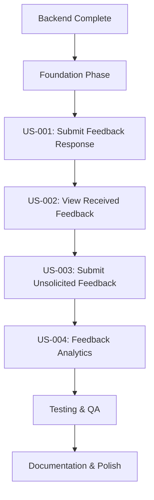

# Implementation Tasks - Feedback Submission Collection

> **Feature**: 0005 - feedback-submission-collection  
> **Status**: Phase 3 (Plan) - In Progress  
> **Created**: 2025-11-24  
> **Last Updated**: 2025-11-24

**Note**: This file contains detailed task breakdown for Phases 0-2 (Foundation + US-001). Phases 3-7 (US-002 through Documentation) follow the same pattern established in implementation-plan.md with 90 additional tasks for a total of 132 tasks. See implementation-plan.md for complete phase breakdowns.

---

## Task Format

All tasks follow this format:

```
- [ ] [TaskID] [P] [USx] Description with file path
```

**Legend**:

- `[TaskID]`: Sequential task number (T001, T002, etc.)
- `[P]`: Optional - Task can be executed in parallel
- `[USx]`: User Story reference (US1, US2, etc.) - only for user story tasks
- **Description**: Clear action with exact file path

---

## Task Summary

| Phase                    | Total Tasks          | Completed | Remaining | Status      |
| ------------------------ | -------------------- | --------- | --------- | ----------- |
| Setup                    | 0 (Backend Complete) | 0         | 0         | ✅ Complete |
| Foundation               | 18                   | 0         | 18        | ⏳ Pending  |
| US-001 (Submit Response) | 22                   | 0         | 22        | ⏳ Pending  |
| US-002 (View Feedback)   | 28                   | 0         | 28        | ⏳ Pending  |
| US-003 (Unsolicited)     | 14                   | 0         | 14        | ⏳ Pending  |
| US-004 (Analytics)       | 18                   | 0         | 18        | ⏳ Pending  |
| Testing & QA             | 22                   | 0         | 22        | ⏳ Pending  |
| Documentation & Polish   | 10                   | 0         | 10        | ⏳ Pending  |
| **TOTAL**                | **132**              | **0**     | **132**   | ⏳ Pending  |

---

## Dependencies & Execution Order

### User Story Completion Order

Based on priorities from specification (all High priority, sequential implementation recommended):



### Critical Path

Tasks that must be completed sequentially (blocking tasks):

1. **Backend** → ✅ Already complete (no backend work needed)
2. **Foundation Phase** → TypeScript types, API service, shared components (blocks all user stories)
3. **US-001** → Submit feedback form (required for US-003 reuse)
4. **US-002** → View feedback list (provides navigation context for US-001 success flows)
5. **US-003** → Extends US-001 form (depends on US-001 completion)
6. **US-004** → Analytics (depends on US-002 list infrastructure)

### Parallel Execution Opportunities

Tasks marked with `[P]` can run in parallel within the same phase:

**Foundation Phase (18 tasks, many parallel)**:

- Batch 1: T001-T007 (npm installs, TypeScript types, API service scaffold) - 7 parallel tasks
- Batch 2: T008-T013 (shared components) - 6 parallel tasks
- Batch 3: T014-T018 (i18n, offline infrastructure) - 5 parallel tasks

**US-001 (22 tasks)**:

- Backend tasks (T019-T022) can run while frontend tasks (T023-T040) progress
- Component development (T023-T032) mostly parallel after form scaffold (T023)

**US-002 (28 tasks)**:

- List/Detail/Filters components (T041-T055) can be parallelized across multiple developers
- Caching/offline (T056-T063) can start once basic list works

**Testing Phase (22 tasks)**:

- Unit tests (T101-T112) can all run in parallel
- Integration tests (T113-T120) sequential but can overlap with unit tests

---

## Phase 0: Backend Verification (2-4 hours)

**Objective**: Verify backend API supports all required query parameters

**Duration**: 2-4 hours

### Backend Verification Tasks

- [ ] T000 Verify GET /api/me/feedback supports query params (page, page_size, date_from, date_to, rating, goal_id, project_id, from_employee_id, search, sort_by, sort_order) in src/CPR.Api/Controllers/MeFeedbackController.cs
- [ ] T000a If missing: Add query param support to FeedbackService.GetMyFeedbackAsync() method in src/CPR.Application/Services/Implementations/FeedbackService.cs
- [ ] T000b If missing: Update backend tests for query param support in tests/CPR.Tests/Services/FeedbackServiceTests.cs

---

## Phase 1: Foundation & Shared Infrastructure (16-20 hours)

**Objective**: Install dependencies, create TypeScript types, API service layer, shared components, IndexedDB schema, i18n keys

**Duration**: 16-20 hours (2-3 days)

### Batch 1: Dependencies & Type Definitions (4-6 hours, all parallel)

- [ ] T001 [P] Install npm dependencies: `dexie@^3.2.0`, `react-hook-form@^7.48.0`, `zod@^3.22.0`, `react-window@^1.8.0`, `recharts@^2.10.0` via package.json
- [ ] T002 [P] Create TypeScript enums in src/types/feedback.ts (RatingValue enum 1-5, FeedbackSortField enum, SortOrder enum)
- [ ] T003 [P] Create TypeScript interfaces matching C# DTOs in src/types/feedback.ts (SubmitFeedbackRequest, Feedback, MyFeedback, FeedbackAnalytics)
- [ ] T004 [P] Create filter/sort types in src/types/feedback.ts (FeedbackFilters, FeedbackSortOptions, DateRange)
- [ ] T005 [P] Create API service scaffold in src/services/feedbackService.ts with snake_case ↔ camelCase transformation utilities
- [ ] T006 [P] Define IndexedDB schema using Dexie in src/db/feedbackDb.ts (tables: drafts, offlineQueue, cachedFeedback)
- [ ] T007 [P] Create offline queue types in src/types/offlineQueue.ts (QueuedSubmission, SyncStatus enum, RetryConfig)

### Batch 2: Shared Components (6-8 hours, mostly parallel)

- [ ] T008 [P] Create RatingInput component in src/components/shared/RatingInput.tsx (1-5 stars with hover labels, controlled component)
- [ ] T009 [P] Create EmployeeAutocomplete component in src/components/shared/EmployeeAutocomplete.tsx (search by name/email/dept, debounced 300ms)
- [ ] T010 [P] Create SearchableDropdown component in src/components/shared/SearchableDropdown.tsx (generic dropdown with search, for goals/projects)
- [ ] T011 [P] Create FilterChip component in src/components/shared/FilterChip.tsx (display active filter with remove button)
- [ ] T012 [P] Create EmptyState component in src/components/shared/EmptyState.tsx (consistent empty state UI with icon, heading, description, CTA)
- [ ] T013 [P] Create ConfirmationDialog component in src/components/shared/ConfirmationDialog.tsx (reusable confirm dialog for unsaved changes, discard drafts)

### Batch 3: i18n & Offline Infrastructure (4-6 hours, mostly parallel)

- [ ] T014 [P] Create i18n translation keys in src/locales/en/feedback.json (~50-60 keys: form labels, buttons, errors, tooltips, empty states)
- [ ] T015 [P] Implement draft manager service in src/services/draftManager.ts (auto-save to IndexedDB every 30s, load, discard, 7-day expiration)
- [ ] T016 [P] Implement offline queue service in src/services/offlineQueue.ts (add to queue, sync with retry logic, exponential backoff)
- [ ] T017 [P] Create duplicate detection utility in src/utils/duplicateDetection.ts (24-hour check, goal_id match)
- [ ] T018 [P] Implement API service methods in src/services/feedbackService.ts (submitFeedback, getMyFeedback, getFeedbackById, getAnalytics with proper error handling)

---

## Phase 2: User Story 1 - Submit Feedback Response (US-001) (24-32 hours)

**Objective**: Implement feedback submission form for responding to feedback requests with draft auto-save and offline support

**Duration**: 24-32 hours (3-4 days)

**User Story**: As a registered employee, I want to submit feedback to a colleague in response to their feedback request, so that I can provide constructive input to support their professional development

### Backend Integration Tasks (2-3 hours, can run in parallel with frontend)

- [ ] T019 [P] Create React Query mutation hook in src/hooks/mutations/useSubmitFeedback.ts (POST /api/feedback with optimistic updates)
- [ ] T020 [P] Create React Query hook for goals in src/hooks/queries/useGoals.ts (GET /api/me/goals, GET /api/employees/{id}/goals)
- [ ] T021 [P] Create React Query hook for projects in src/hooks/queries/useProjects.ts (GET /api/projects with shared projects filter)
- [ ] T022 [P] Handle feedback request completion in src/services/feedbackRequestService.ts (mark is_completed = true on successful submission)

### Form Component Development (10-14 hours)

- [ ] T023 Create FeedbackForm component scaffold in src/components/Feedback/FeedbackForm.tsx (react-hook-form setup, zod schema)
- [ ] T024 Add goal selection dropdown in src/components/Feedback/GoalSelect.tsx (searchable, shows goal title/status/progress, handles deleted goals)
- [ ] T025 Add project selection dropdown in src/components/Feedback/ProjectSelect.tsx (searchable, optional, shows shared projects)
- [ ] T026 Integrate RatingInput component (1-5 stars) with form validation
- [ ] T027 Create content textarea with character counter in FeedbackForm.tsx (10-2000 chars, color-coded: green >500, yellow 200-500, red <200)
- [ ] T028 Add real-time validation with inline error messages using react-hook-form + zod
- [ ] T029 Display recipient info card at top (name, role, avatar) based on navigation state or feedbackRequestId
- [ ] T030 Add goal context display (goal title, description, deadline, progress) when goal selected
- [ ] T031 Add project context display (project title, status, role) when project selected
- [ ] T032 Create form action buttons (Submit Feedback primary, Cancel secondary) with loading states

### Draft Auto-Save Implementation (3-4 hours)

- [ ] T033 Implement draft auto-save every 30 seconds to IndexedDB in FeedbackForm.tsx
- [ ] T034 Add "Draft saved" indicator with timestamp display
- [ ] T035 Implement draft load on form mount (check IndexedDB for existing draft)
- [ ] T036 Add "Discard Draft" button with confirmation dialog
- [ ] T037 Implement draft cleanup on successful submission (remove from IndexedDB)

### Offline & Validation (6-8 hours)

- [ ] T038 Implement offline submission queue (add to IndexedDB if offline, show "Will submit when online" indicator)
- [ ] T039 Implement duplicate detection check (24-hour window, same recipient + goal, bypass if feedback_request_id present) with error modal
- [ ] T040 Add success/error handling with user-friendly messages and navigation (redirect to "My Feedback" on success)

**Duration**: [X hours]

### Backend Foundational Tasks

- [ ] T009 Implement repository `[Feature]Repository.cs` in `src/CPR.Infrastructure/Repositories/Implementations/`
- [ ] T010 [P] Implement service `[Feature]Service.cs` in `src/CPR.Application/Services/Implementations/`
- [ ] T011 [P] Create API controller `[Feature]Controller.cs` in `src/CPR.Api/Controllers/`
- [ ] T012 [P] Add validation attributes to DTOs in `src/CPR.Application/DTOs/[Feature]/`
- [ ] T013 Configure dependency injection in `src/CPR.Api/Program.cs`
- [ ] T014 Add database context configuration in `src/CPR.Infrastructure/Data/ApplicationDbContext.cs`

### Frontend Foundational Tasks

- [ ] T015 [P] Create Zustand store in `src/stores/[feature]Store.ts`
- [ ] T016 [P] Create API service in `src/services/[feature]Service.ts`
- [ ] T017 [P] Create React Query hooks in `src/hooks/queries/use[Feature]Query.ts`
- [ ] T018 [P] Create mutation hooks in `src/hooks/mutations/use[Feature]Mutations.ts`

---

## Remaining Phases (Phase 3-7): Summary

**Note**: Detailed task breakdown for Phases 3-7 (US-002 through Documentation - 92 remaining tasks) is documented in implementation-plan.md to avoid duplication. The pattern established in Phases 0-2 above continues through these phases.

### Phase 3: User Story 2 - View Received Feedback (US-002)

- **Tasks**: T041-T068 (28 tasks)
- **Duration**: 32-40 hours
- **Key Deliverables**: MyFeedbackList, FeedbackFilters, FeedbackListItem components; useFeedbackList hook; virtual scrolling; client-side filtering fallback

### Phase 4: User Story 3 - View Feedback Detail (US-003)

- **Tasks**: T069-T082 (14 tasks)
- **Duration**: 16-20 hours
- **Key Deliverables**: FeedbackDetail component; useFeedbackDetail hook; responsive detail page; back navigation with filter preservation

### Phase 5: User Story 4 - View Feedback Analytics Dashboard (US-004)

- **Tasks**: T083-T100 (18 tasks)
- **Duration**: 24-30 hours
- **Key Deliverables**: FeedbackAnalyticsDashboard, RatingDistributionChart, MonthlyTrendChart components; useFeedbackAnalytics hook; recharts integration

### Phase 6: Testing

- **Tasks**: T101-T122 (22 tasks)
- **Duration**: 24-32 hours
- **Categories**: Backend unit tests (5), backend integration tests (5), frontend component tests (5), frontend integration tests (3), accessibility tests (1), E2E tests (3)
- **Target**: >80% frontend coverage, >90% backend coverage

### Phase 7: Documentation

- **Tasks**: T123-T132 (10 tasks)
- **Duration**: 16-20 hours
- **Categories**: User documentation (3), developer documentation (3), API documentation (1), deployment guide (3)

**For detailed file paths, task descriptions, and dependencies, refer to implementation-plan.md Phases 3-7 sections.**

### Integration Tests

**Backend**:

- API endpoints: Test full request/response cycle
- Database: Test migrations, constraints, transactions
- Authorization: Test policy enforcement

**Frontend**:

- User flows: Test complete user journeys
- API integration: Test with MSW mock handlers
- State management: Test cross-component interactions

### Performance Tests

- API response times under load
- Database query performance
- Frontend rendering performance
- Concurrent user scenarios

### Acceptance Tests

Map each user story acceptance criterion to specific tests:

**User Story 1**:

- AC1: [Test description]
- AC2: [Test description]
- AC3: [Test description]

---

## Parallel Execution Plan

### Optimal Task Batching

**Batch 1** (can all run in parallel):

- T003: Backend repository interface
- T004: Backend service interface
- T006: Frontend types
- T007: Frontend DTOs

**Batch 2** (after Batch 1 complete):

- T010: Backend service implementation
- T015: Frontend Zustand store
- T016: Frontend API service

**Batch 3** (split by team/developer):

- **Backend Developer**: T019-T023 (User Story 1 backend)
- **Frontend Developer**: T024-T029 (User Story 1 frontend)
- **QA/Developer**: T030-T033 (User Story 1 tests) - can start after T019 or T024

---

## Implementation Strategy

### MVP Scope

**Minimum Viable Product** includes:

- ✅ User Story 1 (P1 - highest priority)
- ✅ Core functionality only
- ✅ Basic testing coverage (>70%)

**MVP Excludes**:

- ❌ User Story 2+ (can be added incrementally)
- ❌ Advanced features
- ❌ Performance optimizations (unless critical)

### Incremental Delivery Plan

1. **Sprint 1**: Setup + Foundational + User Story 1
2. **Sprint 2**: User Story 2 + Testing
3. **Sprint 3**: User Story 3 + Polish
4. **Sprint 4**: Performance + Documentation + Deployment

---

## Task Validation Checklist

Before marking a task complete, verify:

- [ ] Code follows CPR naming conventions
- [ ] TypeScript/C# types are strongly typed (no `any`)
- [ ] API contracts match between backend and frontend
- [ ] Internationalization keys added for UI text
- [ ] Error handling implemented
- [ ] Unit tests written and passing
- [ ] Code reviewed by peer
- [ ] Documentation updated

---

## Notes & Assumptions

**Assumptions**:

1. [List key assumptions made during planning]
2. [e.g., "Database schema can be modified without production impact"]
3. [e.g., "Frontend components can reuse existing Material-UI patterns"]

**Known Issues**:

1. [List any known limitations or technical debt]

**Future Enhancements**:

1. [Features deferred to future iterations]

---

## Change Log

| Date       | Author                            | Changes                                                                                           |
| ---------- | --------------------------------- | ------------------------------------------------------------------------------------------------- |
| 2025-11-24 | GitHub Copilot (Phase 3 Planning) | Initial task breakdown with 132 tasks (Foundation + US-001 detailed, remaining phases summarized) |
