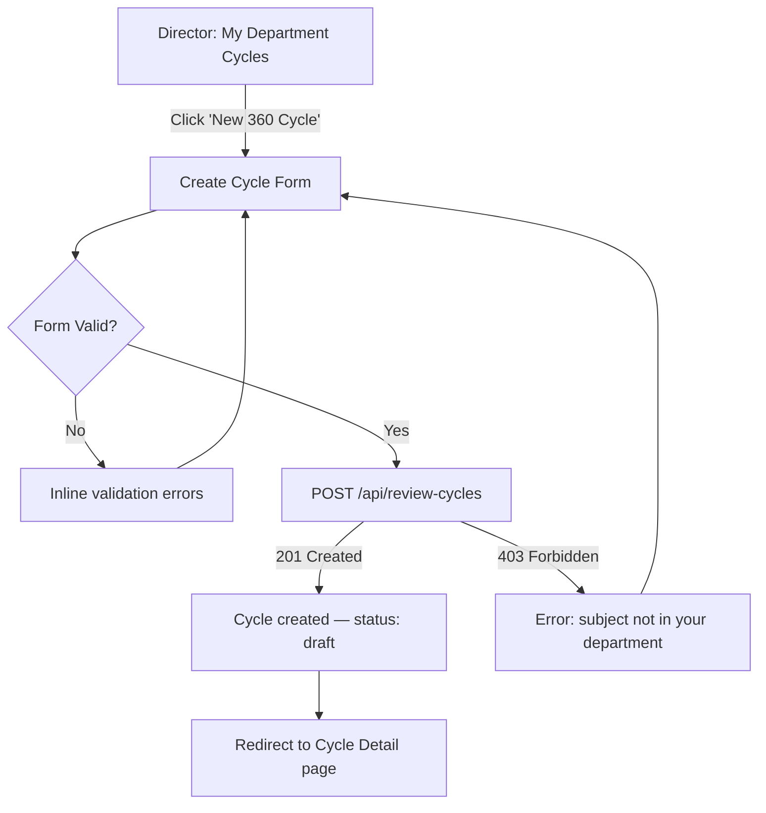
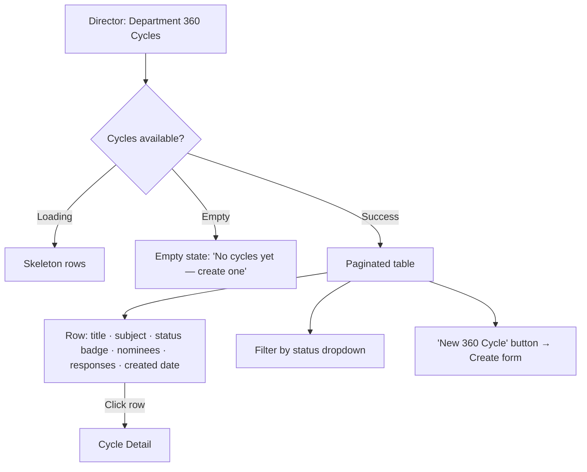
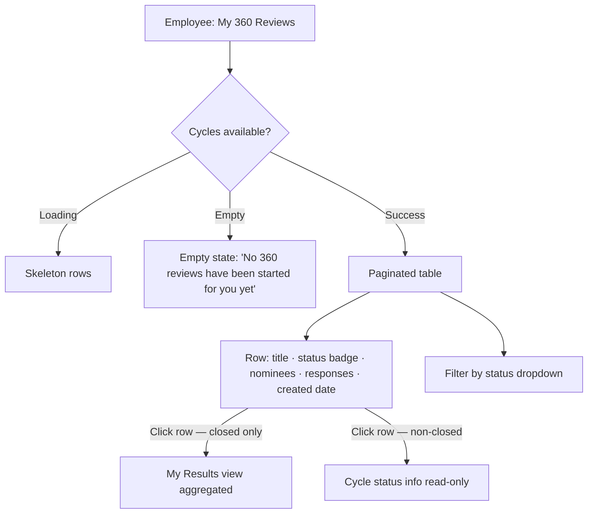
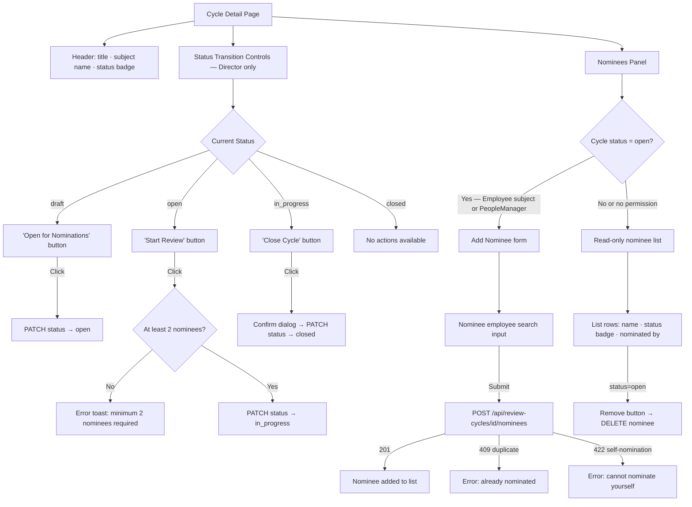
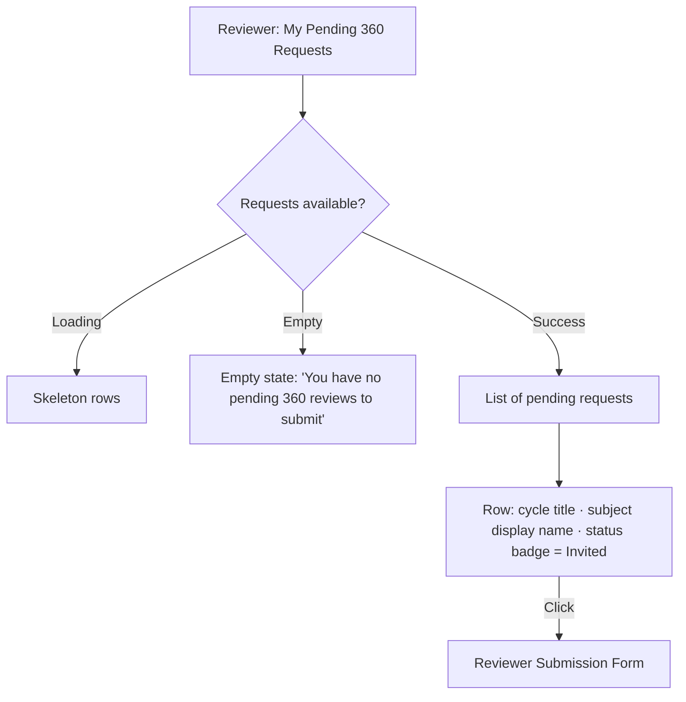
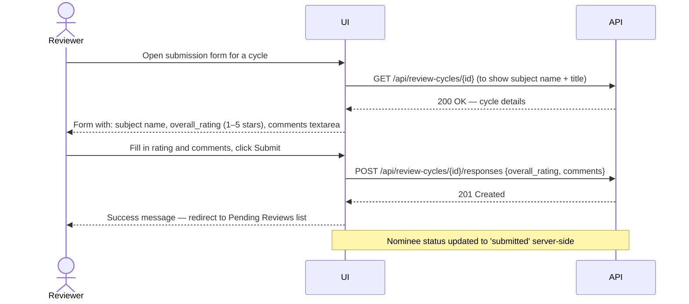
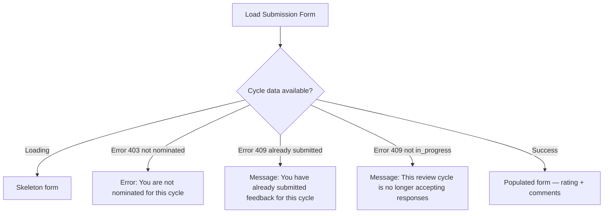
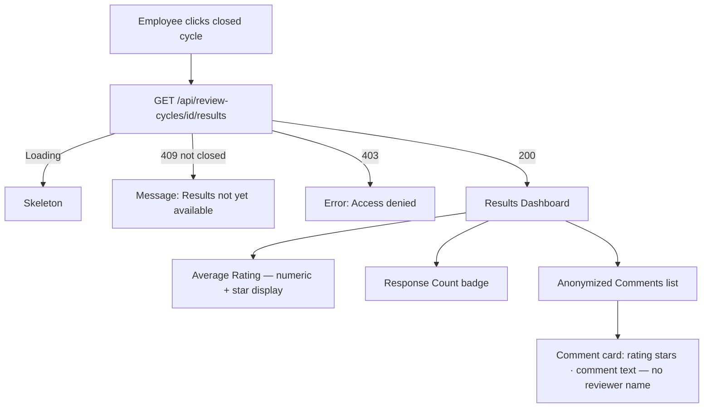
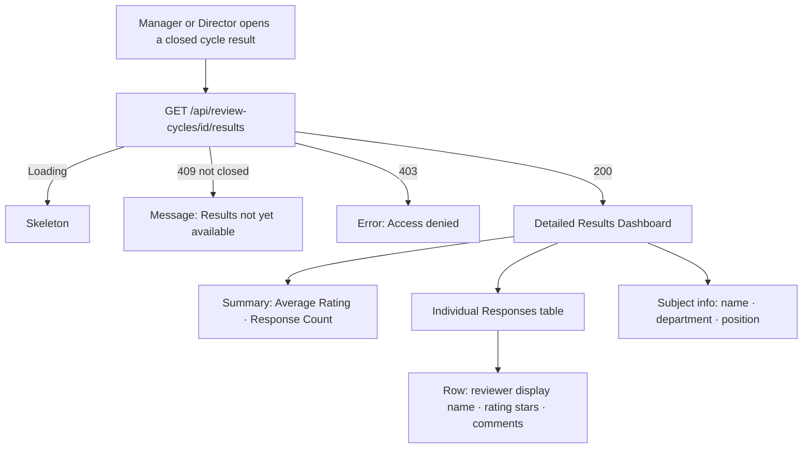

# Wireframes — 360-Degree Feedback (0006)

> **Coverage requirement**: every screen or interaction flow mentioned in `stories.md`
> must have a corresponding section below. Check stories.md before finalising this document.

---

## Director: Create Review Cycle (US-001)



**Notes**
- Fields: `title` (required, max 200 chars), `subject_employee_id` (required, searchable dropdown of dept employees), `description` (optional, max 2000 chars).
- The employee picker only shows employees within the Director's department.
- On creation the cycle lands in `draft` status — no reviewers can be added yet.

---

## Director: Cycle List (US-011)



**Notes**
- Status badge colours: draft=grey, open=blue, in_progress=amber, closed=green.
- Default sort: `created_at` descending.

---

## Employee: My Cycles List (US-012)



**Notes**
- Employee cannot create a cycle; the 'New' button is hidden.
- Clicking a non-closed cycle shows cycle title, status, and nominee count (read-only).
- Results link is only active for `closed` cycles.

---

## Cycle Detail — Nominations Panel (US-003, US-004, US-005)



**Notes**
- "Add Nominee" form shows only when cycle is `open` AND the current user is the subject employee OR their PeopleManager OR a Director.
- Nominee status badges: pending=grey, invited=blue, submitted=green.
- Director sees all nominee rows; PeopleManager sees all rows for direct report's cycle; Employee sees rows but without `nominated_by` details.
- Remove button visible only while cycle is `open`.

---

## Status Transition Flow (US-002, US-005, US-007)

```mermaid
sequenceDiagram
    actor Director
    participant UI
    participant API

    Director->>UI: Click 'Open for Nominations'
    UI->>API: PATCH /api/review-cycles/{id}/status {status: "open"}
    API-->>UI: 200 OK — updated cycle
    UI-->>Director: Status badge updates to 'Open'

    Director->>UI: Click 'Start Review'
    UI->>API: PATCH /api/review-cycles/{id}/status {status: "in_progress"}
    API-->>UI: 200 OK — updated cycle; all nominees → invited
    UI-->>Director: Status badge updates to 'In Progress'

    Director->>UI: Click 'Close Cycle' + confirm dialog
    UI->>API: PATCH /api/review-cycles/{id}/status {status: "closed"}
    API-->>UI: 200 OK — updated cycle
    UI-->>Director: Status badge updates to 'Closed'; results now accessible
```

---

## Reviewer: Pending Review Requests (US-013)



**Notes**
- Only shows requests where nominee status is `invited` and cycle is `in_progress`.
- Subject display name shown; no email or personal identifiers.
- Accessible from a global navigation item ("My Reviews").

---

## Reviewer: Submission Form (US-006)



**Notes**
- Rating rendered as a 1–5 star selector; required.
- Comments textarea: min 10, max 2000 chars; character counter shown.
- Submit is disabled until both fields are valid.
- If cycle status is no longer `in_progress` (race condition), API returns 409 and UI shows error toast.

---

## Reviewer: Submission Form — States



---

## Employee: Aggregated Results View (US-008)



**Notes**
- No reviewer names, roles, or IDs shown in any part of this view.
- If response count is 0 (edge case — cycle closed with no responses), show: "No feedback was submitted for this cycle."
- Comments displayed in random order to further protect anonymity.

---

## Manager / Director: Detailed Results View (US-009, US-010)



**Notes**
- Reviewer display names are shown in full (attributed view).
- PeopleManager sees this for direct reports only.
- Director sees this for all employees in their department.
- Empty state (no responses): "No reviewers submitted feedback before the cycle was closed."
