# Wireframes — Skills Taxonomy & Career Framework (0008)

> **Coverage requirement**: every screen or interaction flow mentioned in `stories.md`
> must have a corresponding section below. Check stories.md before finalising this document.

---

## Career Paths List Page (US-001)

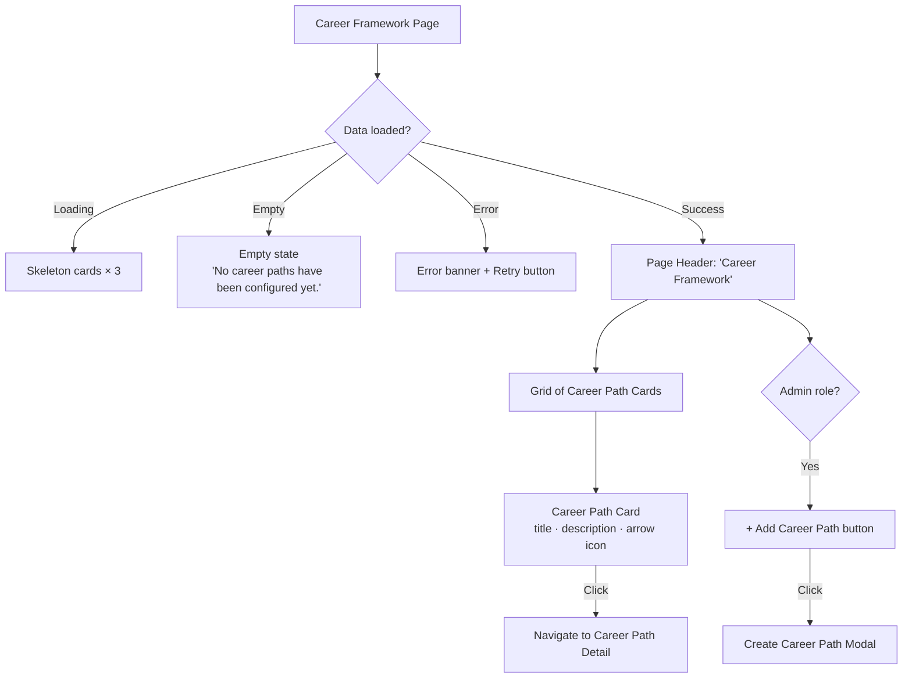

**Notes**

- Cards are sorted alphabetically by title.
- Description is truncated to 2 lines with an ellipsis; full text shown in the detail view.
- The "+ Add Career Path" button is only visible to users with the `Administrator` role.

---

## Career Path Detail Page (US-002)

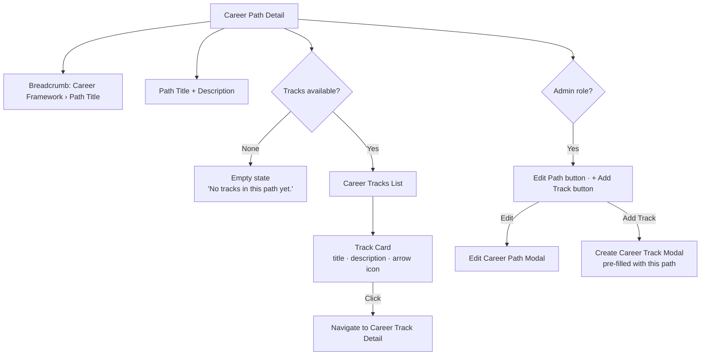

**Notes**

- Breadcrumb allows navigation back to the Career Paths list.
- Track cards are sorted alphabetically by title.

---

## Career Track Detail Page — Position Progression Ladder (US-003)

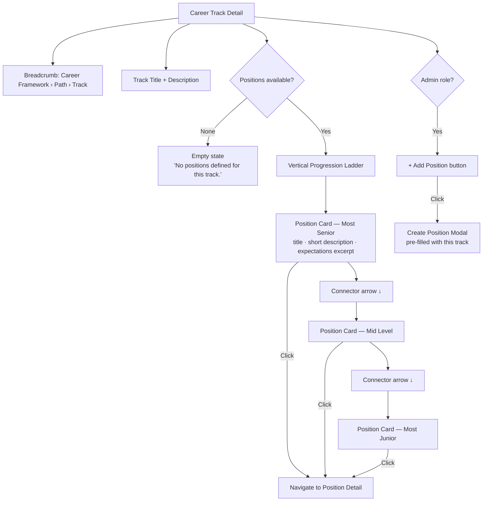

**Notes**

- Positions are ordered alphabetically by title (ascending). The visual ladder reads top = senior, bottom = junior to indicate career progression direction.
- Each position card shows title, description (2-line truncated), and the first line of expectations.
- "Expectations" field is expanded inline on click (accordion) before navigating to full detail.

---

## Position Detail Page (US-004, US-005)

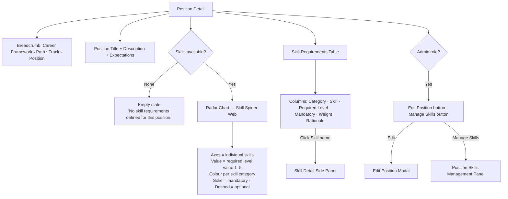

**Notes**

- The radar chart is rendered using a radar/spider chart library (e.g., Recharts RadarChart or Chart.js Radar).
- Skills grouped by category; each category polygon is drawn in a distinct colour with a legend.
- If a position has only 1 or 2 skills, the chart degrades gracefully to a bar chart.
- Clicking a skill name in the table opens a side panel (not a new page) showing skill title, description, category, and all proficiency levels in ascending order.

---

## Skill Detail Side Panel (US-005)

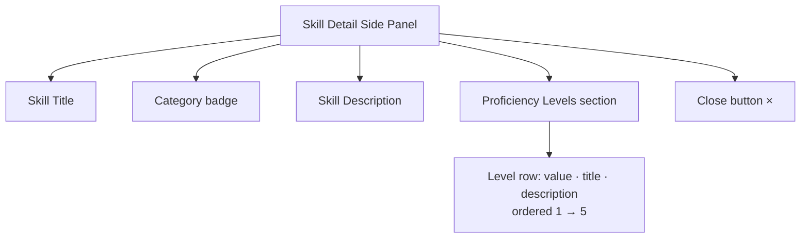

**Notes**

- Opens as a right-side drawer/panel overlaying the position detail page.
- Does not navigate away from the position detail.
- The currently required level for the position is highlighted.

---

## Position Detail — Loading / Error States

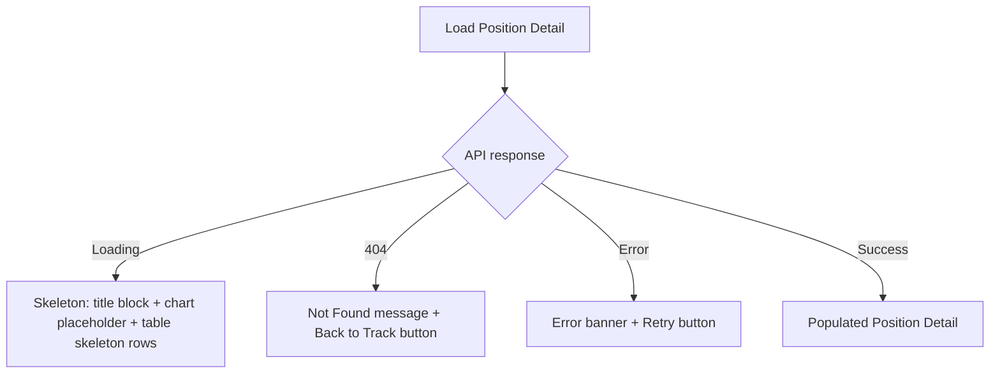

---

## Admin: Career Framework Management (US-006–US-011)

The admin management UI is a dedicated section under **Settings > Career Framework**, organised with tabs.

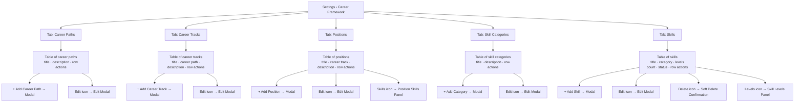

**Notes**

- All tables support sorting by column headers and text-search filtering by title.
- Soft-deleted skills are hidden from this table by default; a "Show deleted" toggle reveals them (read-only, no restore in this feature).
- Row actions are icon buttons with tooltips.

---

## Admin Flow: Create / Edit Career Path (US-006)

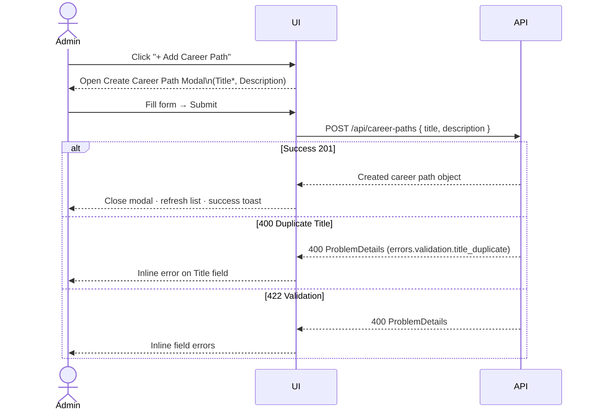

---

## Admin Flow: Create Skill with Proficiency Levels (US-010)

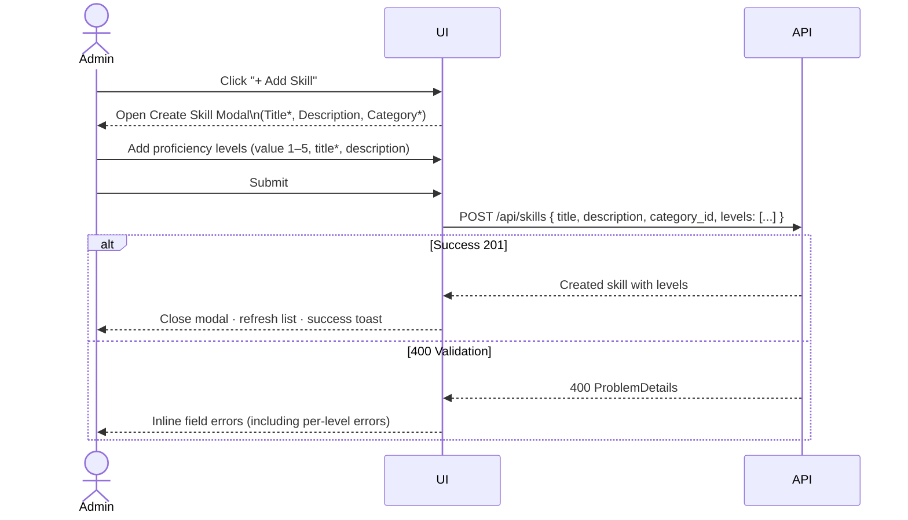

---

## Admin Flow: Soft-Delete Skill (US-010)

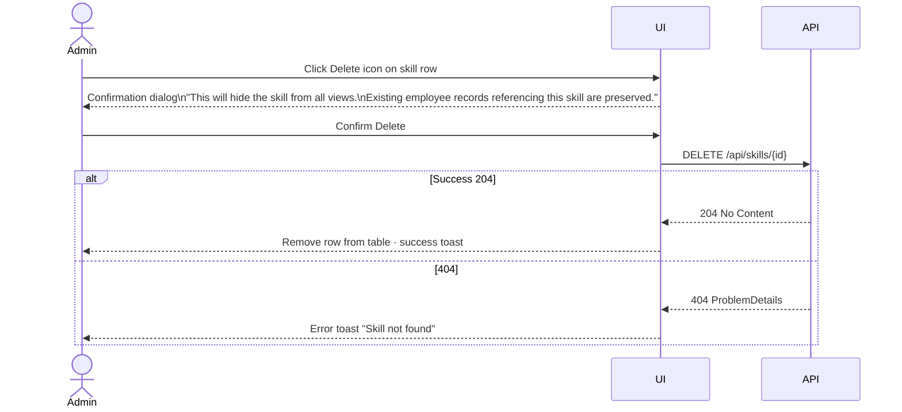

---

## Admin Flow: Manage Position Skill Requirements (US-011)

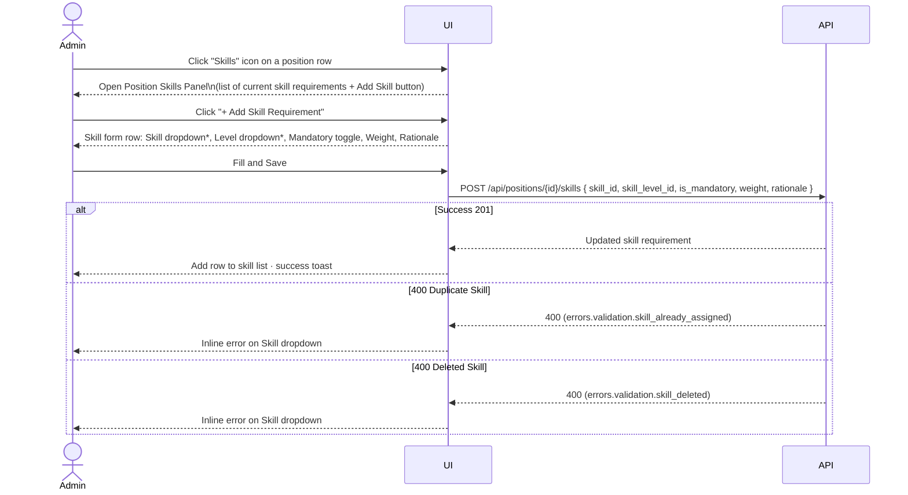

**Notes**

- The Skill dropdown filters to only active (non-deleted) skills.
- The Level dropdown is populated dynamically based on the selected skill's proficiency levels.
- Editing a row (skill level, mandatory, weight, rationale) uses PATCH inline; skill itself cannot be changed — remove and re-add instead.

---

## Admin: Skills Management — Proficiency Levels Sub-Panel (US-010)

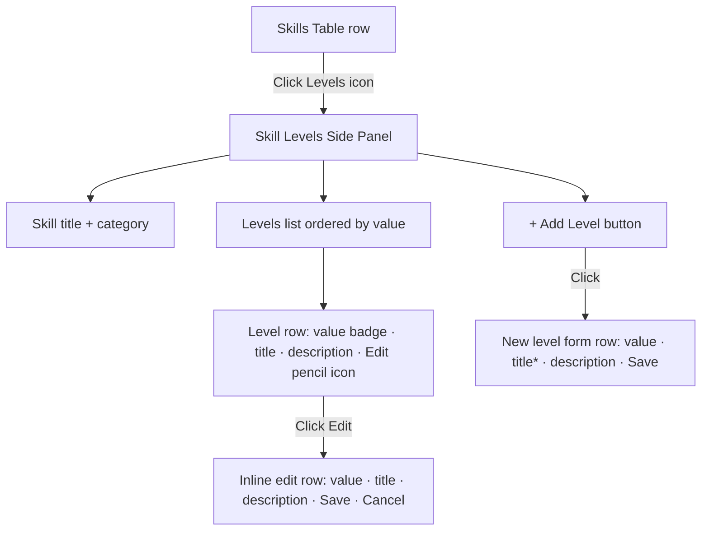

**Notes**

- Level value must be an integer 1–5 and unique within the skill.
- At least one level should exist before the skill can be assigned to a position.
