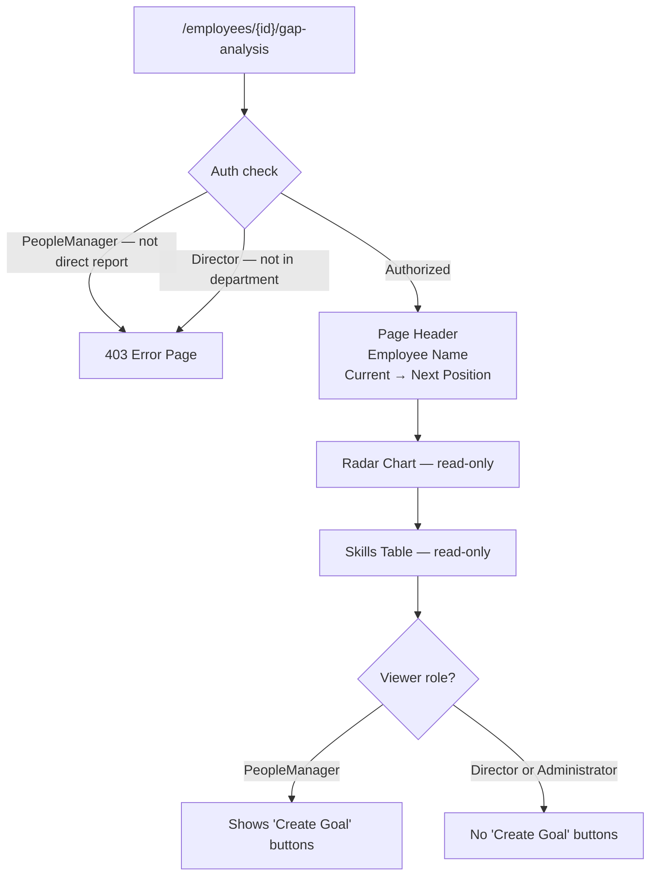
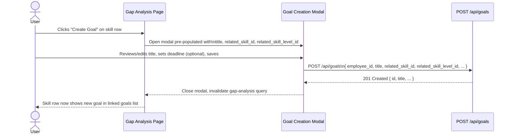
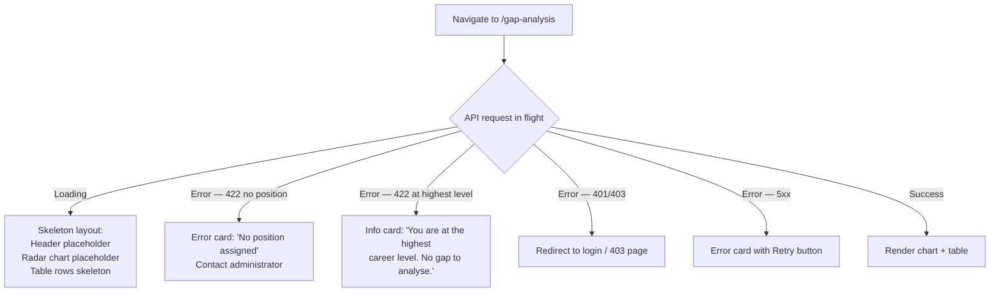

# Wireframes — Skills Gap Analysis & Development Planning (0009)

> **Coverage**: all screens and flows from stories.md are represented below.

---

## Gap Analysis Page — Own Profile (Employee)

```mermaid
flowchart TD
    A["/gap-analysis"] --> B{Employee has position?}
    B -->|No| C[Error State\n'No position assigned.\nContact your administrator.']
    B -->|Yes| D{Next level position exists?}
    D -->|No| E[Info State\n'You are at the highest level\nin your career track.']
    D -->|Yes| F[Page Header\nCurrent Position → Next Level Position\nCareer Track name]
    F --> G[Radar Chart\nRequired vs Actual levels\none axis per skill]
    G --> H[Skills Table\nGrouped by category\nSkill | Category | Required | Actual | Gap | Mandatory]
    H --> I{Row: gap > 0?}
    I -->|Yes| J[Highlighted row\n+ linked goals list\n+ 'Create Goal' button]
    I -->|No| K[Normal row\nGap = 'Met']
```

**Notes**
- Page title: "Skills Gap Analysis" with subtitle showing "Current: [Position] → Next: [Position]".
- Radar chart is rendered using a spider/radar chart component (e.g., Recharts RadarChart).
- Skills table immediately follows the chart on the same page — no tabs or pagination.
- "Create Goal" button is shown only for Employee own view and PeopleManager viewing a direct report.

---

## Gap Analysis Page — Manager / Director View (`/employees/{id}/gap-analysis`)



**Notes**
- The page layout is identical to the own-profile view, except for the presence/absence of "Create Goal" buttons.
- A breadcrumb or back link is shown at the top: "← [Employee Name]'s Profile".

---

## Skills Table — Row Detail

```mermaid
flowchart TD
    A[Skill Row: gap > 0] --> B[Skill Name\nCategory badge]
    B --> C[Required Level: 'Senior — Level 4']
    C --> D[Actual Level: 'Mid — Level 2' or 'Beginner — Level 1 (default)']
    D --> E[Gap: +2]
    E --> F[Mandatory: Yes / No]
    F --> G[Linked goals list\ne.g. 'Improve TypeScript — 45%']
    G --> H['Create Goal' button\nvisible based on role]
```

**Notes**
- Rows with `assessment_source = "default"` show a tooltip on the "(default)" annotation explaining: "No manager-approved assessment found. Using your position's minimum skill level."
- The Gap value is shown as a signed integer ("+2", "+1"). Zero or negative shows "Met" in green.

---

## Create Goal from Gap — Modal Flow



**Notes**
- The modal is the standard goal creation modal from F001, reused here with pre-populated fields.
- When a PeopleManager creates a goal for a direct report, `employee_id` in the POST body is the direct report's UUID.
- On failure, the modal displays an inline error and remains open.

---

## Page Load States



**Notes**
- Skeleton uses MUI Skeleton components matching the chart circle and table rows.
- The 422 "no position" and "highest level" states are distinct cards with different icons and copy.
- Retry button re-triggers the React Query fetch.
