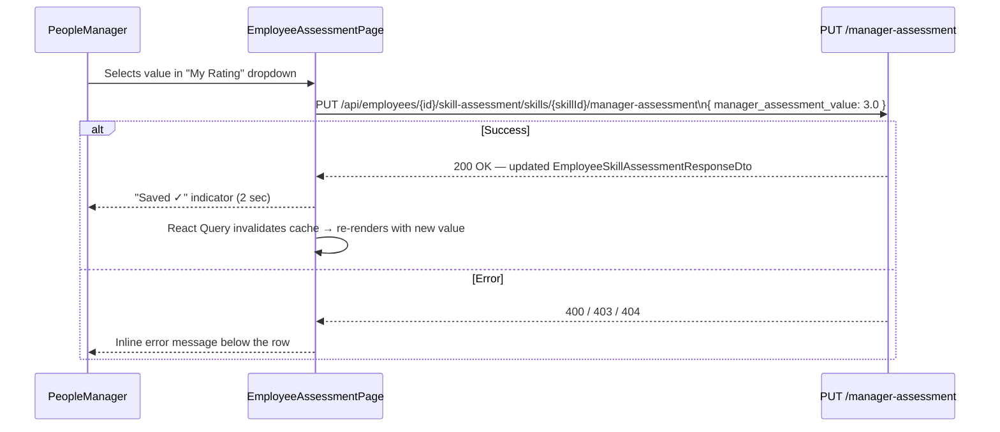
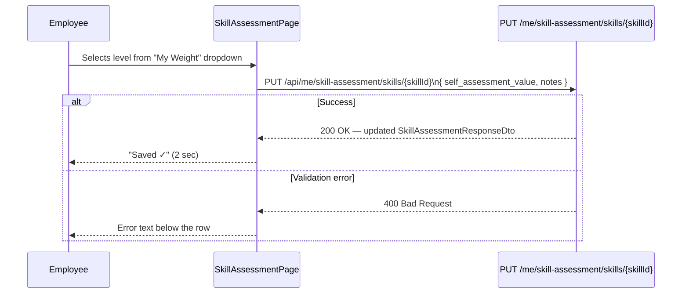

# Feature 0010 — Wireframes

---

## WF-001 — Employee Skill Assessment Page (/skills)

**Change from current:** Target Level column removed. Proficiency level dropdown removed. "My Weight" column is a plain numeric input only.

```
┌─────────────────────────────────────────────────────────────────┐
│  Skill Self-Assessment                                          │
│  Senior Software Engineer · Backend Engineering                 │
│                                                                 │
│  [Tab: Backend Skills] [Tab: Soft Skills]                       │
│                                                                 │
│  ┌──────────────────────────────────────────────────────────┐  │
│  │  [Radar chart — My Current Level vs Next Level Required] │  │
│  └──────────────────────────────────────────────────────────┘  │
│                                                                 │
│  ┌────────────────┬────────────┬───────────┬───────┬────────┐  │
│  │ Skill          │ Required   │ My Weight │ Notes │        │  │
│  ├────────────────┼────────────┼───────────┼───────┼────────┤  │
│  │ Go             │ [Senior]   │ [ 3.5   ] │ [...] │ Saved✓ │  │
│  │ Kubernetes     │ [Mid]      │ [ 2.0   ] │ [...] │        │  │
│  │ System Design  │ Not req.   │ [       ] │       │        │  │
│  └────────────────┴────────────┴───────────┴───────┴────────┘  │
│                                                                 │
│  ▼ Go — Evidence                                                │
│    [Alice — ★4 — "Strong Go skills on Project X"]  ✕           │
│    [Link feedback]                                              │
└─────────────────────────────────────────────────────────────────┘

Notes:
- No "Target Level" column. No proficiency level dropdown.
- "My Weight" is a plain numeric input (type=number, min=0, step=0.1).
- On blur, PUT /api/me/skill-assessment/skills/{skillId} is called
  with { self_assessment_value, notes }.
- If the field is empty or ≤ 0, an inline error is shown; no API call.
- "Link feedback" appears below the skill row when an assessment exists.
- "Saved ✓" appears in the actions cell after a successful save.
```

---

## WF-002 — Manager View: Employee Assessment Page (/employees/{id}/skill-assessment)

**Change from current:** Added Manager Assessment column (editable for PeopleManager).

```
┌─────────────────────────────────────────────────────────────────┐
│  ℹ Viewing assessment for: Eve Adams                            │
│                                                                 │
│  Skill Assessment                                               │
│  Junior Software Engineer · Backend Engineering                 │
│                                                                 │
│  ┌──────────────────────────────────────────────────────────┐  │
│  │  [Radar chart — read-only]                               │  │
│  └──────────────────────────────────────────────────────────┘  │
│                                                                 │
│  Backend Skills                                                 │
│  ┌────────────────┬────────────┬───────────────┬────────────┐  │
│  │ Skill          │ Required   │ Self-Assessed  │ My Rating  │  │
│  ├────────────────┼────────────┼───────────────┼────────────┤  │
│  │ Go             │ [Mid]      │ Junior         │ [Mid ▾] ✓  │  │
│  │ Kubernetes     │ [Mid]      │ Not assessed   │ [— ▾]      │  │
│  │ System Design  │ Not req.   │ Mid            │ [Mid ▾]    │  │
│  └────────────────┴────────────┴───────────────┴────────────┘  │
└─────────────────────────────────────────────────────────────────┘

Notes:
- "Self-Assessed" column = employee's own assessed level (read-only for manager).
- "My Rating" column = manager_assessment_value (editable select for PeopleManager/Director/Admin).
- Selecting a value in "My Rating" calls PUT /api/employees/{id}/skill-assessment/skills/{skillId}/manager-assessment.
- "Saved ✓" indicator appears briefly on successful save (consistent with self-assessment UX).
- If viewer is Employee (not manager), "My Rating" column shows the value as read-only text (no select).
```

---

## WF-003 — Manager Assessment Save Flow



---

## WF-004 — Self-Assessment Save Flow (updated)



---

## WF-005 — Removed: Target Level Endpoints

```
If a client calls:
  PUT  /api/me/skill-assessment/skills/{skillId}/target
  DELETE /api/me/skill-assessment/skills/{skillId}/target

→ API returns 404 Not Found (endpoints removed from routing table)
```
