# Wireframes — Team Member Dashboard (0010a)

> **Coverage requirement**: every screen or interaction flow mentioned in `stories.md`
> must have a corresponding section below. Check stories.md before finalising this document.

---

## Team List Screen (US-001)

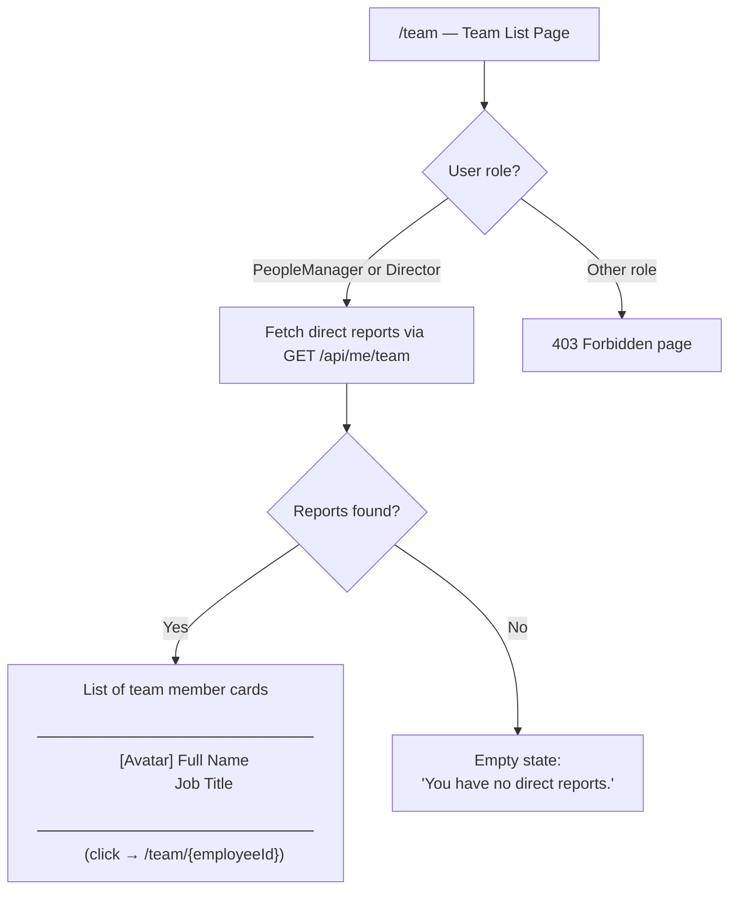

**Notes**
- Cards are listed alphabetically by last name.
- No pagination required — assumption: list fits on one screen for typical manager span of 2–15 reports.

---

## Team Member Dashboard Screen (US-002, US-003, US-010, US-011, US-012)

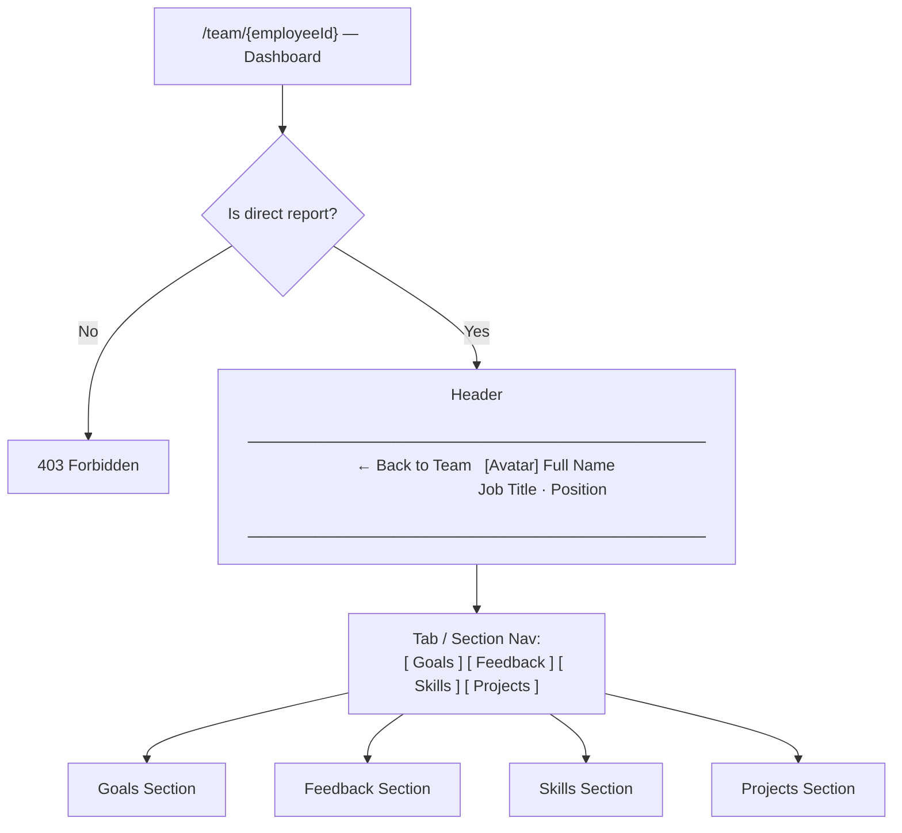

**Notes**
- Sections can be rendered as collapsible panels or tabs — layout decision left to UI implementation.
- The back link returns the manager to `/team`.

---

## Goals Section Layout (US-003, US-004, US-005, US-008, US-009)

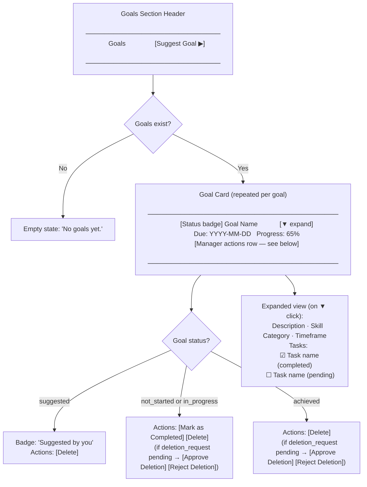

**Notes**
- The "Deletion Requested" label and Approve/Reject buttons replace normal actions when a pending deletion request exists.
- Suggested goals show the suggestion badge but no "Mark as Completed" action.
- The Delete action is always available to the manager regardless of status.

---

## Suggest Goal Form Flow (US-005)

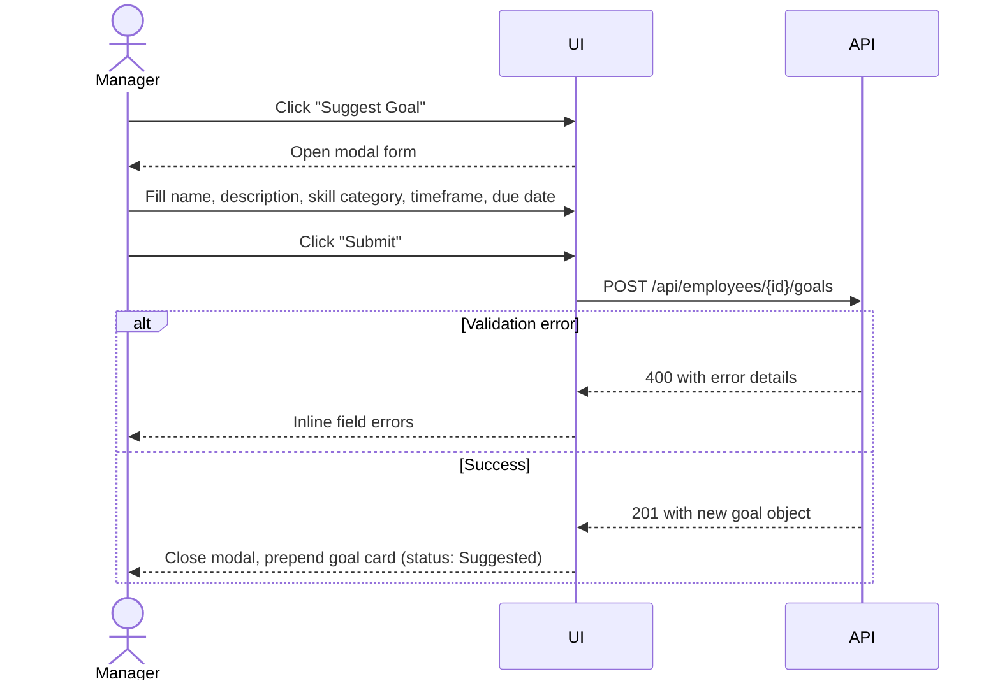

---

## Accept / Reject Suggestion Flow — Employee View (US-006)

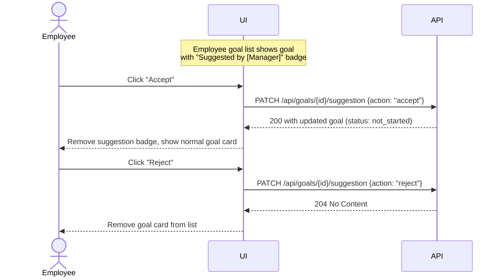

---

## Goal Deletion Request Flow — Employee (US-007)

```mermaid
sequenceDiagram
    actor Employee
    participant UI
    participant API

    Employee->>UI: Click "Request Deletion" on a goal
    UI->>API: POST /api/goals/{id}/deletion-request
    API-->>UI: 201 Created
    UI-->>Employee: Goal card labelled "Deletion Requested"
                    Action changes to "Cancel Request"

    Employee->>UI: Click "Cancel Request"
    UI->>API: DELETE /api/goals/{id}/deletion-request
    API-->>UI: 204 No Content
    UI-->>Employee: Label removed, normal action buttons restored
```

---

## Goal Deletion Request Flow — Manager (US-008)

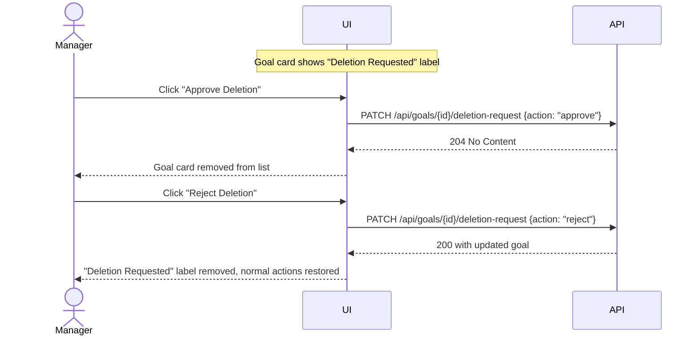

---

## Manager Direct Goal Deletion (US-009)

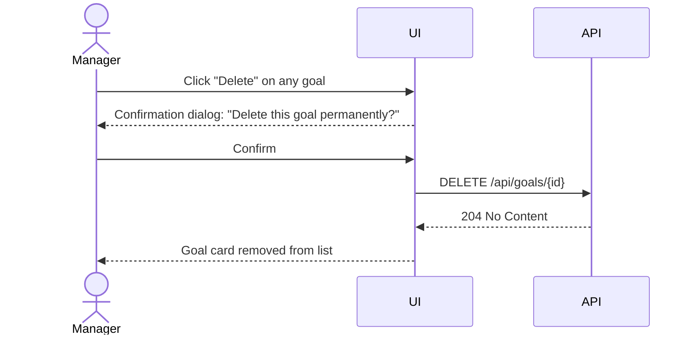

---

## Feedback Section Layout (US-010)

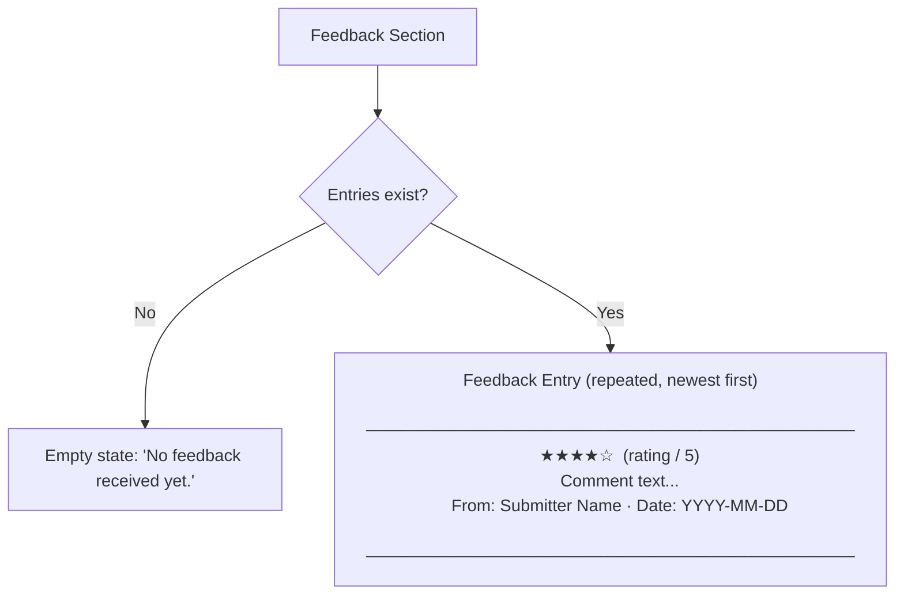

---

## Skills Section Layout (US-011)

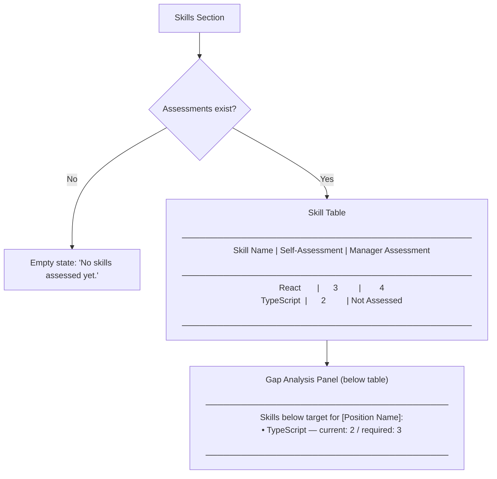

**Notes**
- Gap analysis panel is hidden if `GET /api/employees/{id}/gap-analysis` returns no gaps.

---

## Projects Section Layout (US-012)

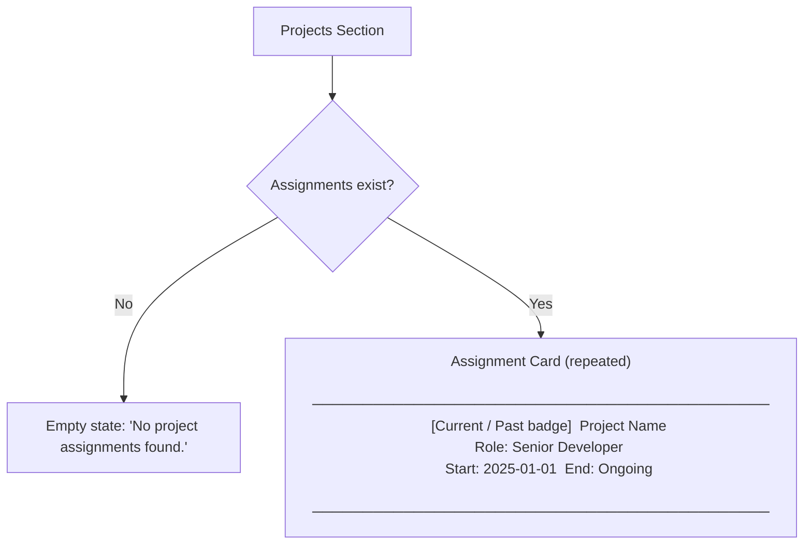

---

## Dashboard Screen — Loading and Error States

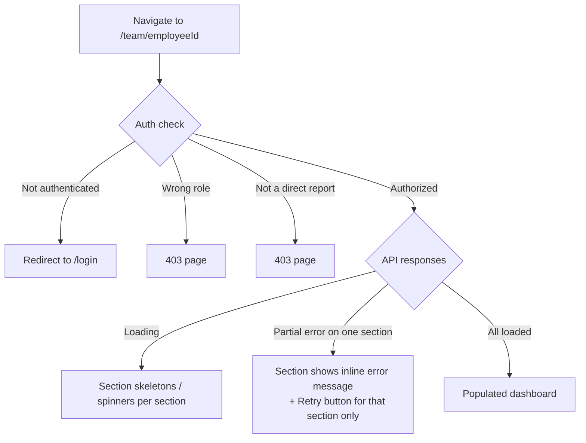

**Notes**
- Each of the four sections loads independently; a failure in one section should not block the others.
- Empty state: shown per section when the data array is empty.
- Loading state: skeleton placeholder matching the section's expected height.
