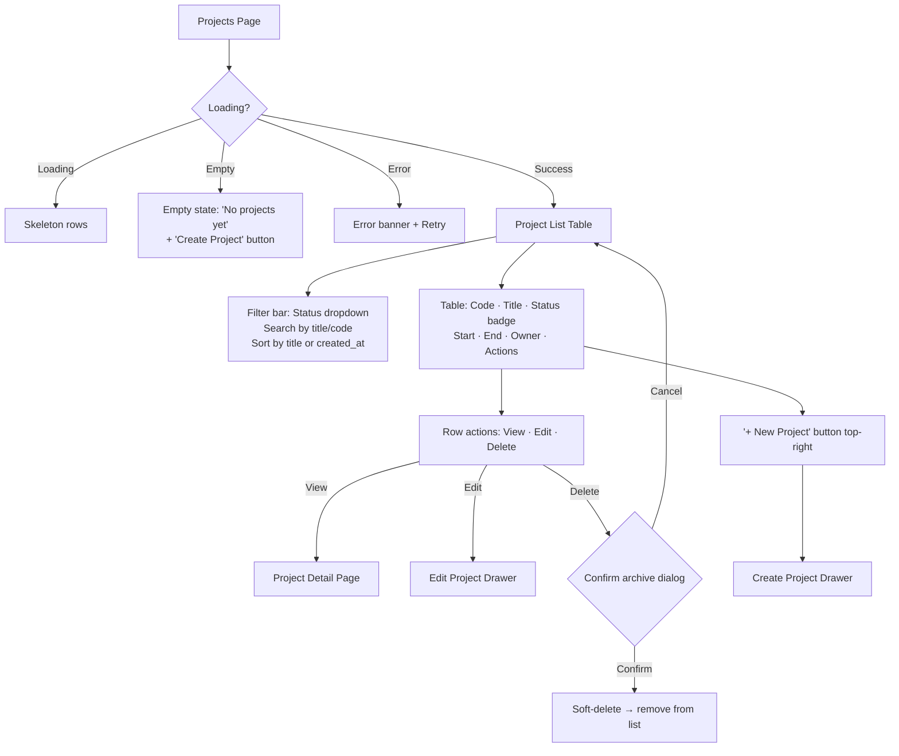
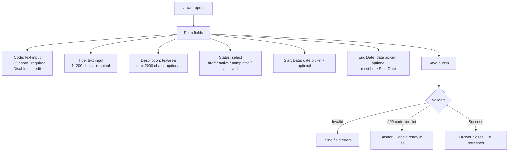
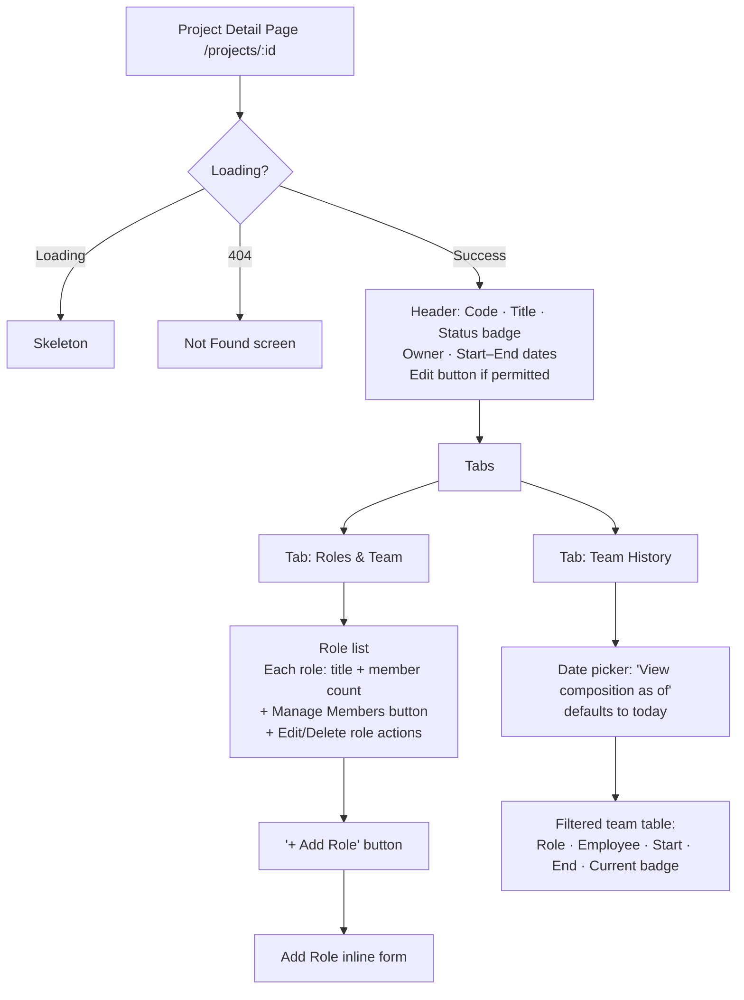
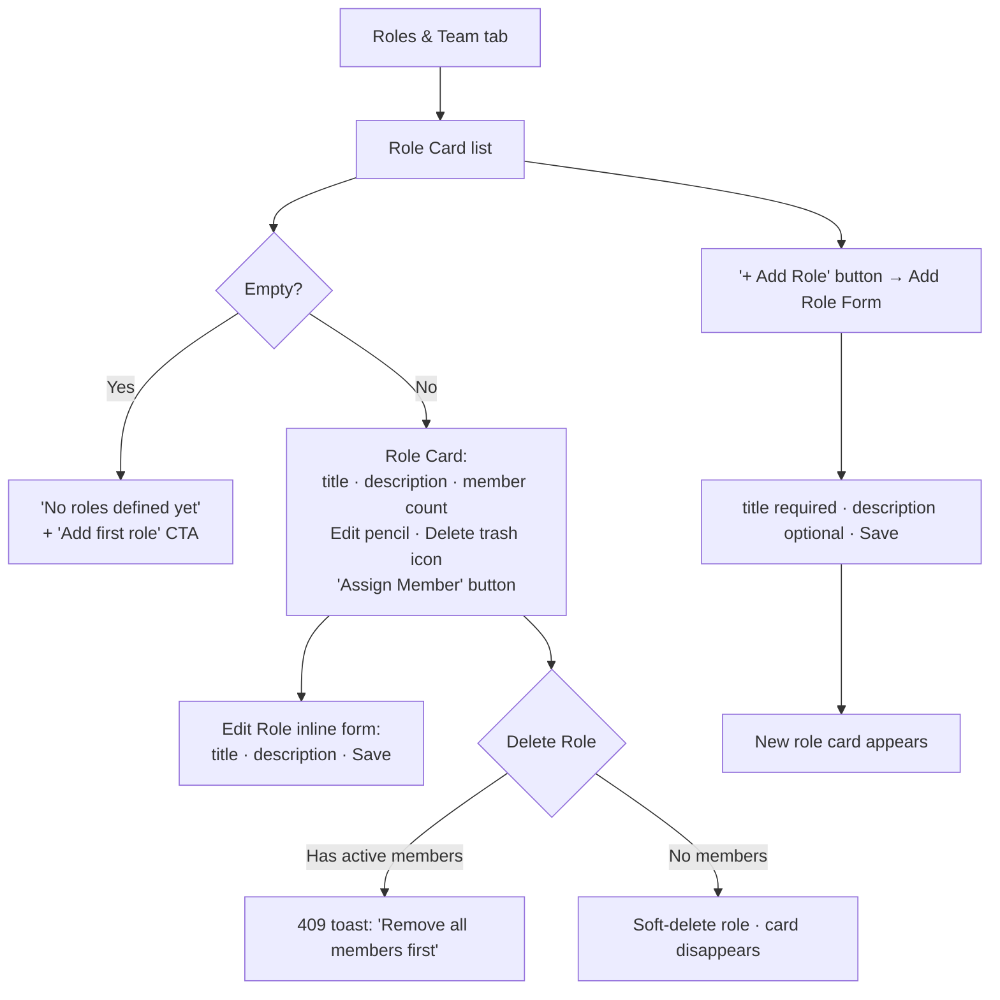
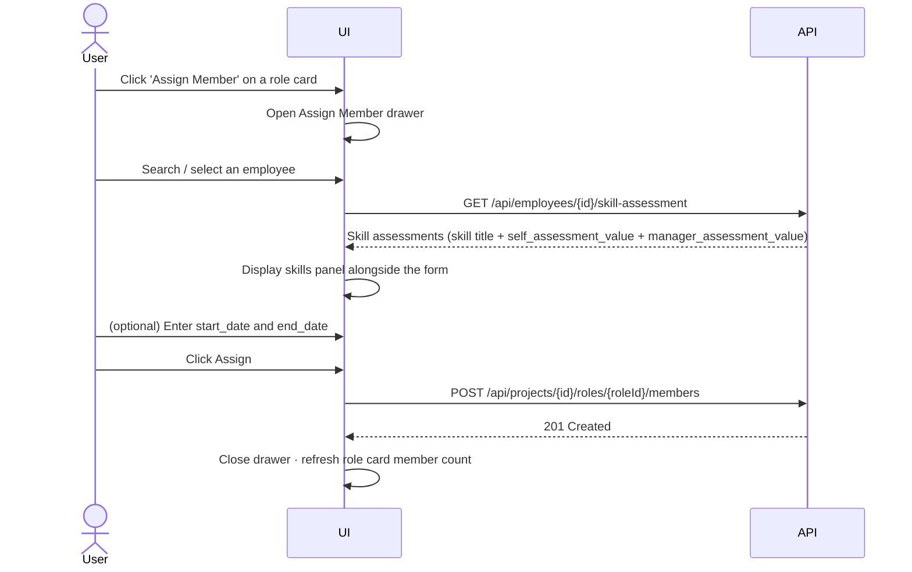
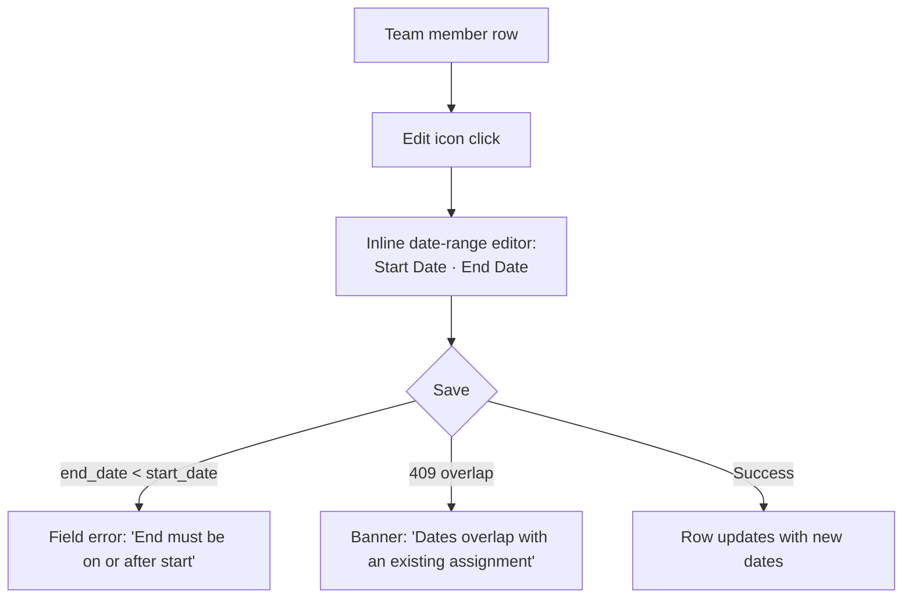
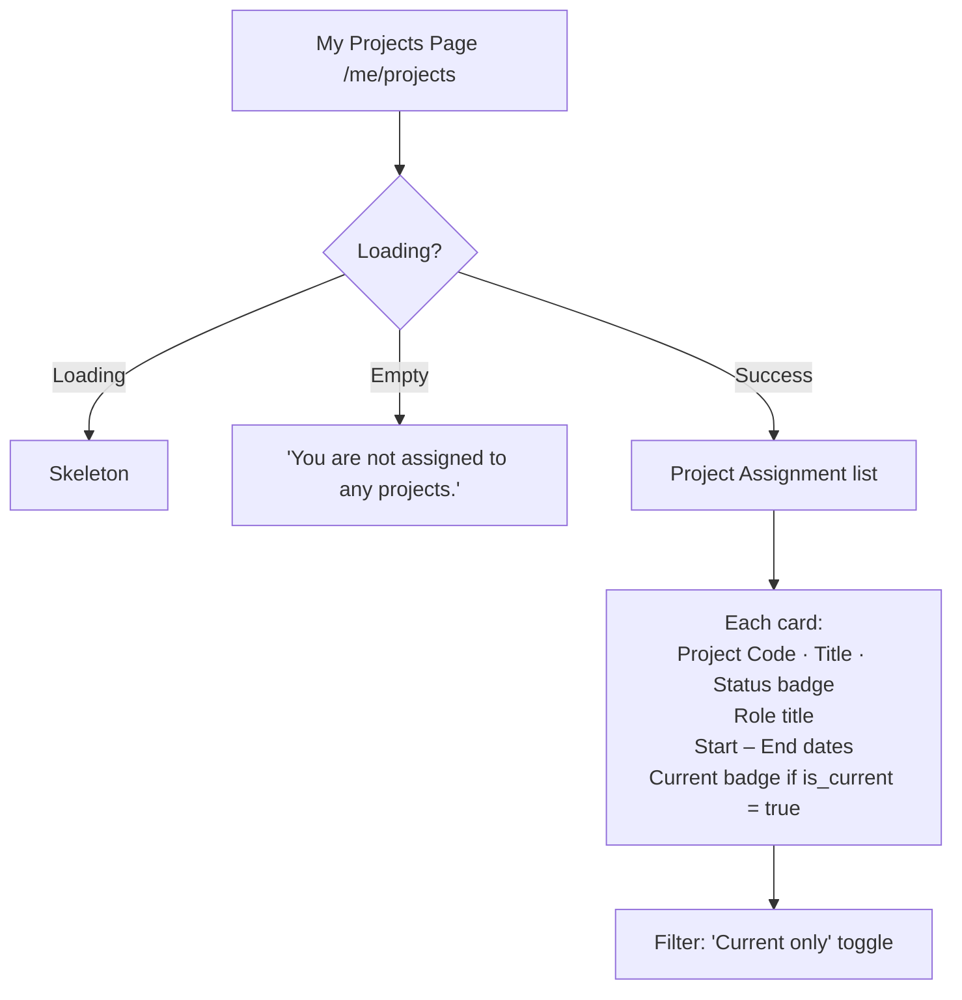
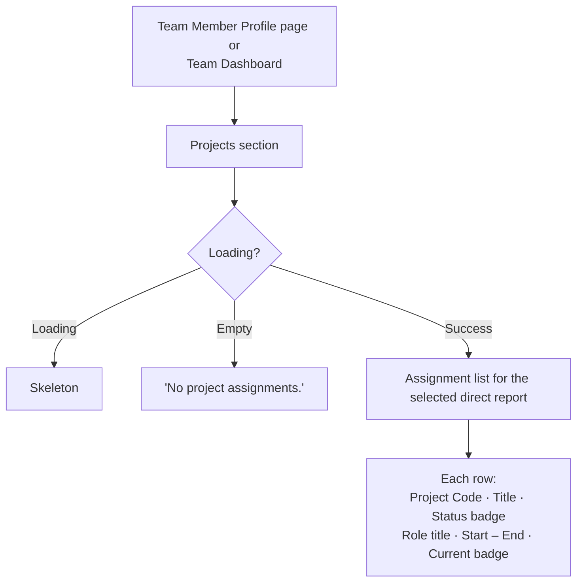
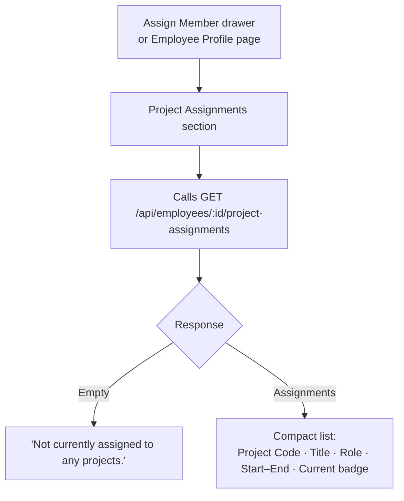

# Wireframes — Project Team Management (0011)

> **Coverage requirement**: every screen or interaction flow mentioned in `stories.md`
> must have a corresponding section below.

---

## Project List Page (SolutionOwner / Director / Administrator)



**Notes**
- Status badge colours: `draft` = grey, `active` = green, `completed` = blue, `archived` = orange.
- SolutionOwner sees all projects but Edit/Delete row actions are only enabled for projects they own.
- Director and Administrator see all projects with full Edit/Delete access.

---

## Create / Edit Project Drawer



**Notes**
- On Edit, `Code` field is read-only (disabled) — it cannot be changed.
- End Date picker disables dates before the selected Start Date.

---

## Project Detail Page



**Notes**
- Edit button visible only if user has permission (own project for SolutionOwner; any for Director/Admin).
- The "Team History" tab sends `as_of` param to GET /api/projects/{id}/team when a date is selected.

---

## Manage Project Roles (within Project Detail)



---

## Assign Team Member Flow (with Skills Panel)



**Notes**
- Employee search is a typeahead against the employee directory.
- Skills panel shows skill name, self-assessment value, and manager-assessment value (if present) as a compact list.
- If the selected employee has no skills recorded, the panel shows "No skill assessments on record."
- Overlap conflict (409) shows an inline banner: "This employee already has an overlapping assignment for this role."

---

## Update Assignment Dates



---

## Remove Team Member Confirmation

```mermaid
flowchart TD
    A[Team member row] --> B[Remove icon click]
    B --> C{Confirm dialog:\n'Remove [Name] from [Role]?'\nHistory will be preserved.}
    C -->|Cancel| D[Dialog closes]
    C -->|Confirm| E[DELETE request]
    E --> F[Member row removed from current view\nRetained in Team History tab]
```

---

## Employee — My Projects Page



**Notes**
- Available to all roles via the personal nav.
- "Current" badge uses `is_current` from the API response.

---

## People Manager — Direct Reports' Project Assignments



**Notes**
- Manager calls GET /api/employees/{id}/project-assignments for the selected direct report.
- Attempting to load assignments for a non-direct-report employee results in 403; UI shows "You don't have access to this employee's project data."

---

## SolutionOwner / Director / Admin — Employee Project Capacity View



**Notes**
- This view is embedded in the Assign Member drawer (below the skills panel) so the user can see both the candidate's skills and their existing project load before assigning.
- SolutionOwner, Director, and Administrator all have access.
