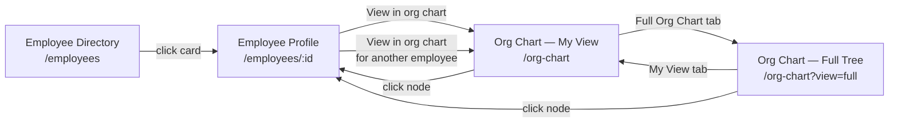
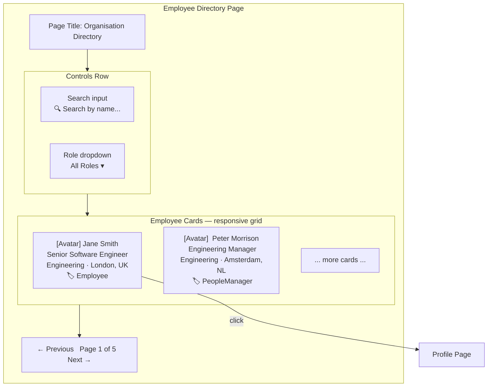
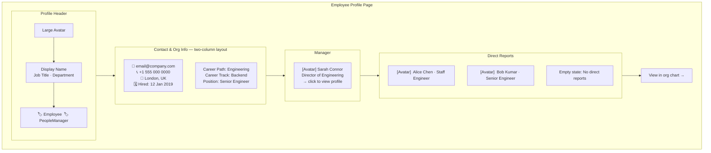

# Wireframes — Org Hierarchy & Employee Directory (0012)

## Navigation Flow



---

## Screen 1 — Employee Directory (`/employees`)



**Notes**:
- Empty state: "No employees match your search" shown when results list is empty.
- Roles are shown as badge chips (one per role).
- Avatar falls back to initials when `avatar_url` is null.

---

## Screen 2 — Employee Profile (`/employees/:id`)



**Notes**:
- Null fields (email, phone, hire date, etc.) are hidden rather than shown as blank.
- Manager card and each direct report card are clickable links to that employee's profile.
- "View in org chart" button navigates to `/org-chart?employee_id={id}`.

---

## Screen 3 — Org Chart: My View (`/org-chart`)

```mermaid
flowchart TD
  subgraph PAGE[Org Chart Page]
    TABS[My View tab ◀ selected | Full Org Chart tab]
    TABS --> CHART

    subgraph CHART[Interactive Chart]
      MM["[Avatar]\nManagers Manager\nCTO"]
      M["[Avatar]\nManager\nDirector of Engineering"]
      SELF["★ [Avatar]\nJane Smith — YOU\nSenior Engineer"]
      P1["[Avatar]\nPeer 1\nStaff Engineer"]
      P2["[Avatar]\nPeer 2\nSenior Engineer"]
      DR1["[Avatar]\nDirect Report 1\n▶ expand"]
      DR2["[Avatar]\nDirect Report 2\n▶ expand"]

      MM --> M
      M --> SELF
      M --> P1
      M --> P2
      SELF --> DR1
      SELF --> DR2
    end
  end
```

**Notes**:
- The logged-in user's node is visually highlighted (border, background).
- Clicking any node navigates to that employee's profile page.
- If logged-in user has no manager, root is the self node.
- If manager has no manager, the manager's manager row is omitted.

---

## Screen 4 — Org Chart: Full Tree (`/org-chart?view=full`)

```mermaid
flowchart TD
  subgraph PAGE[Org Chart Page]
    TABS[My View tab | Full Org Chart tab ◀ selected]
    TABS --> TREE

    subgraph TREE[Full Company Tree]
      ROOT["[Avatar]\nCEO\nCompany Root\n▼ collapse"]
      C1["[Avatar]\nDirector A\n▶ expand"]
      C2["[Avatar]\nDirector B\n▼ collapse"]
      GC1["[Avatar]\nManager B1\n▶ expand"]
      GC2["[Avatar]\nManager B2\n▶ expand"]

      ROOT --> C1
      ROOT --> C2
      C2 --> GC1
      C2 --> GC2
    end
  end
```

**Notes**:
- On load, only root level and their immediate children are visible.
- Clicking ▶ on any node expands it to show its direct children (loaded from the full tree data already returned by the API).
- Clicking ▼ collapses the node's children.
- Leaf nodes (no direct reports) show no toggle.
- Clicking a node name/avatar navigates to that employee's profile page.

---

## Interaction: Expand Node in Full Tree

```mermaid
sequenceDiagram
  participant U as User
  participant UI as Org Chart UI
  participant API as API

  Note over UI,API: Full tree data is fetched once on page load
  U->>UI: Open Full Org Chart tab
  UI->>API: GET /api/org-chart
  API-->>UI: Full hierarchical tree (all nodes)
  UI-->>U: Render tree — root + first-level children visible; rest collapsed

  U->>UI: Click ▶ expand on a node
  UI-->>U: Reveal that node's children (already in memory — no new API call)

  U->>UI: Click a node name/avatar
  UI->>UI: navigate to /employees/{id}
```
