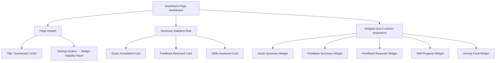
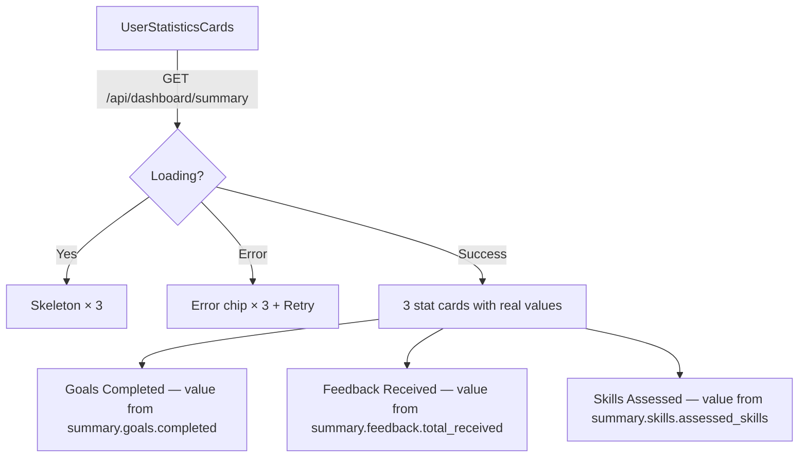
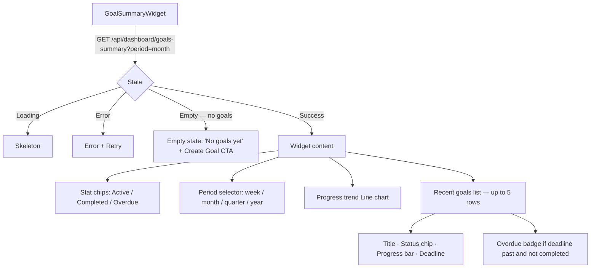
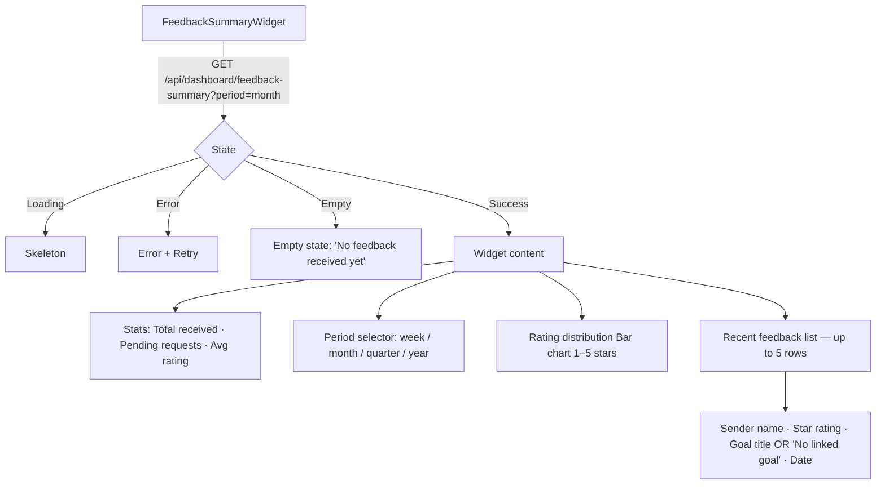
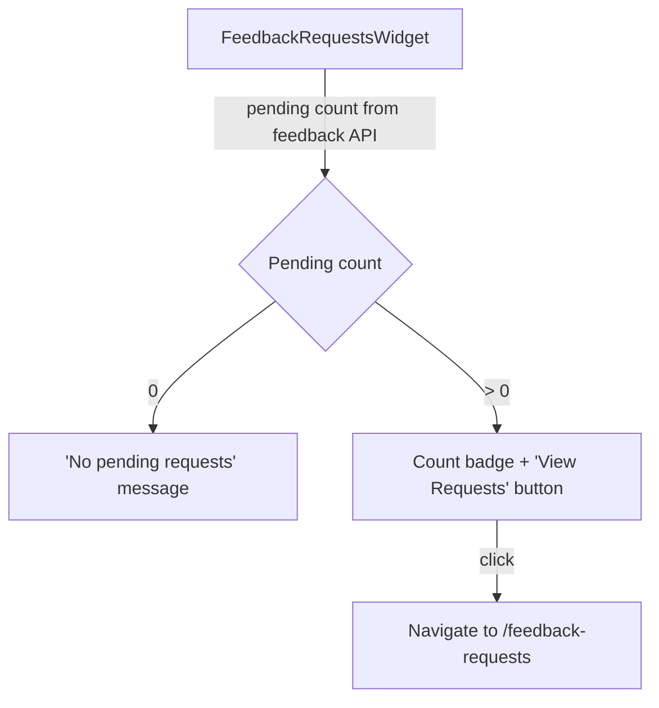
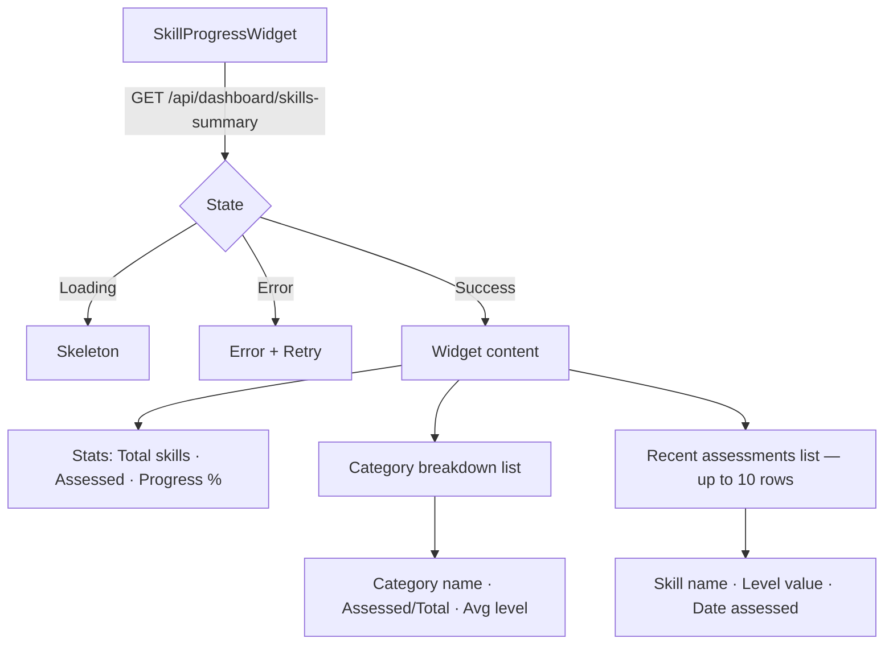
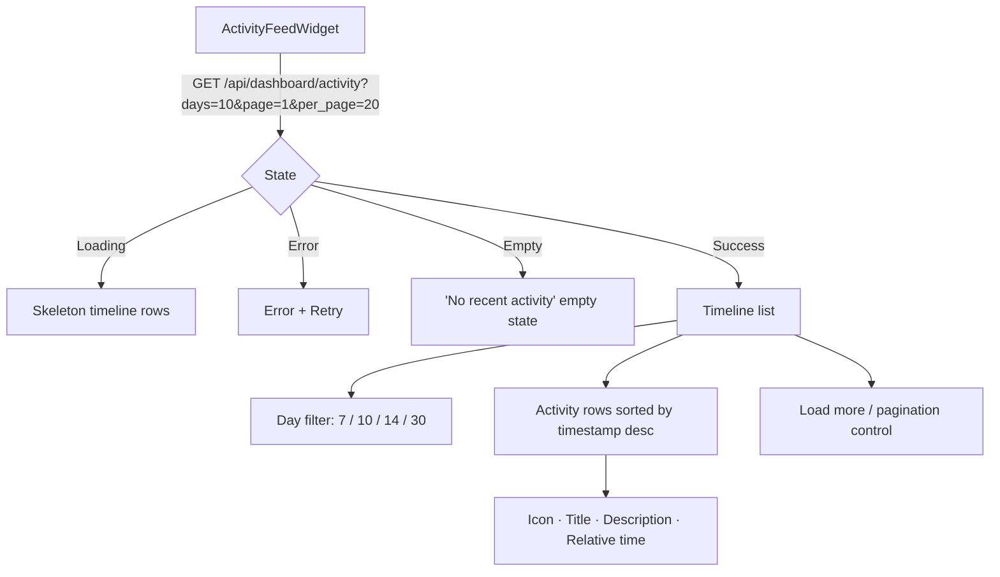
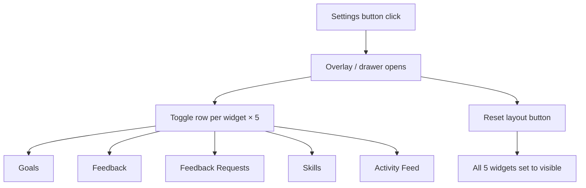
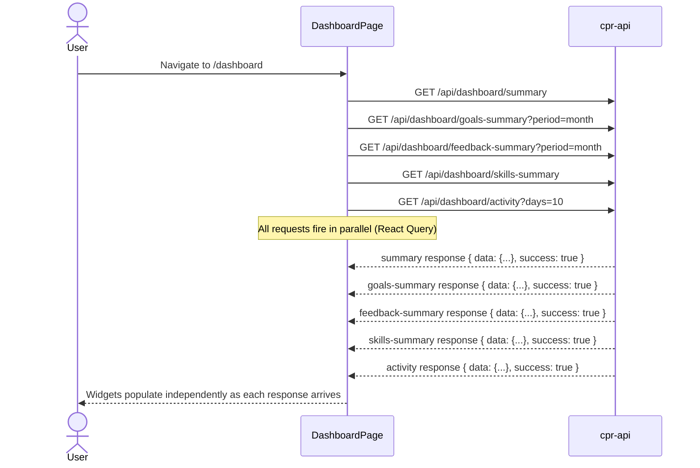
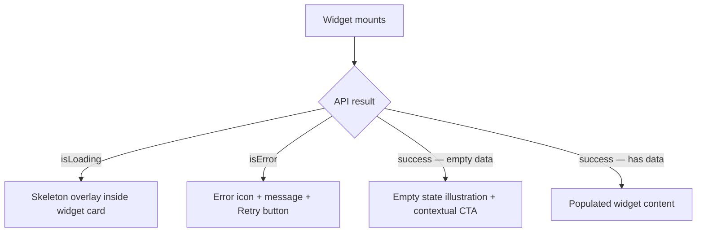

# Wireframes — Personal Performance Dashboard (0013)

> **Coverage requirement**: every screen or interaction flow mentioned in `stories.md`
> must have a corresponding section below. Check stories.md before finalising this document.

---

## Dashboard Page Layout

**Notes**
- Grid collapses to single column on `xs` breakpoint.
- Each widget slot is only rendered if the widget is toggled visible.
- Summary cards always visible (not individually toggleable).

---

## Summary Statistics Cards

**Notes**
- Trend chip text must be driven by API data — no hardcoded "+2 this month" strings.
- Cards use `success`, `info`, `primary` colour tokens respectively.

---

## Goals Summary Widget

---

## Feedback Summary Widget

**Notes**
- Feedback rows where `goal_id` is null must render "No linked goal" label, never be absent from the list.

---

## Feedback Requests Widget

---

## Skill Progress Widget

**Notes**
- Recent assessments list renders only `skill_name`, `level`, `assessed_at` — no `assessor_name`, `category`, or `category_id` fields (not in API response).

---

## Activity Feed Widget

**Notes**
- Widget title rendered from i18n key — no hardcoded "Activity Feed" string.
- `feedback_received` activities appear even when the originating feedback has no linked goal.

---

## Widget Visibility Panel

**Notes**
- State is Zustand client-only; not persisted to backend or localStorage.
- Toggle changes take effect immediately without page reload.

---

## Dashboard Load Flow (Sequence)

**Notes**
- Each widget transitions from skeleton → content independently.
- A widget failure renders its own error state; other widgets are unaffected.
- All responses are unwrapped via `response.data.data` (envelope pattern).

---

## Widget Error / Empty States

