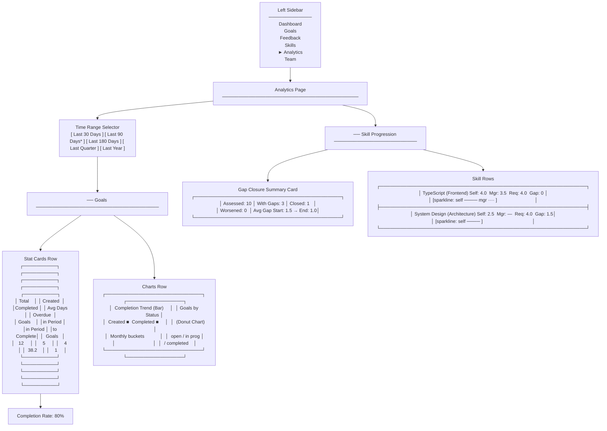
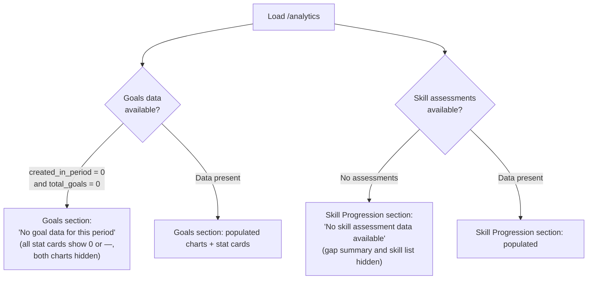
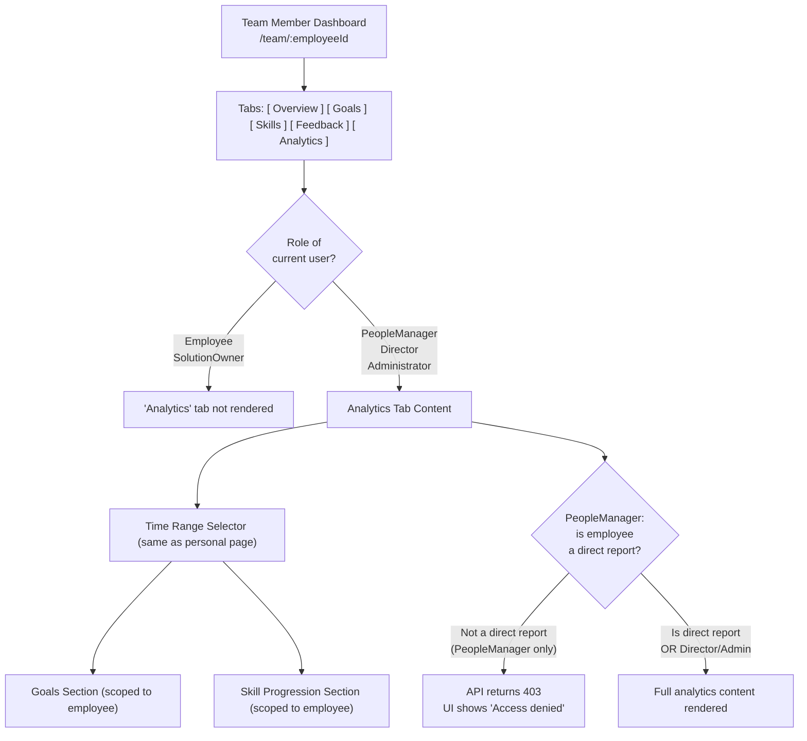
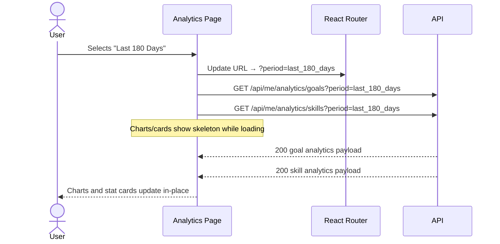
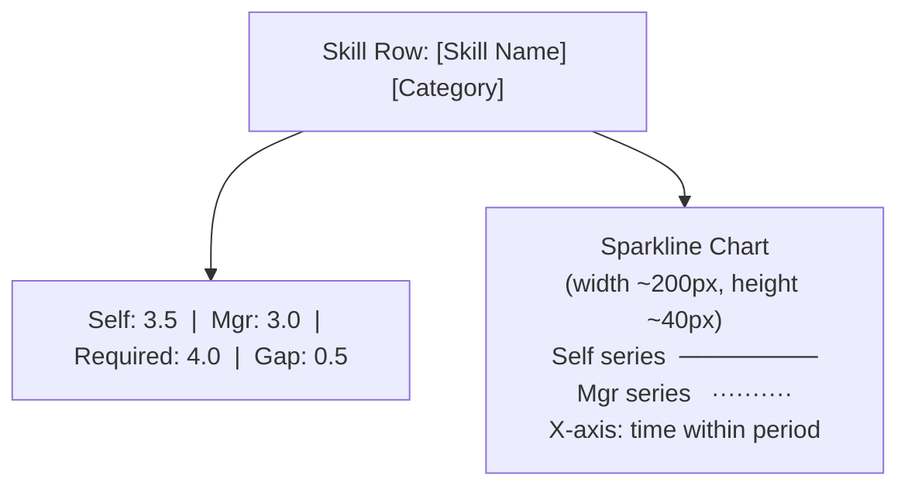

# Wireframes — Performance Analytics & Reporting (0014)

> **Coverage requirement**: every screen or interaction flow mentioned in `stories.md`
> must have a corresponding section below.

---

## Personal Analytics Page — `/analytics`

**Notes**
- The "Analytics" sidebar item is active when the current route starts with `/analytics`.
- Time range selector renders as a segmented button group (MUI `ToggleButtonGroup`).
- The default selected preset is "Last 90 Days" (marked with `*` above).
- The Completion Trend bar chart uses monthly buckets; the x-axis shows abbreviated month labels (e.g., "Nov", "Dec").
- The Donut chart shows the current status distribution (not period-bounded).

---

## Personal Analytics Page — Empty States

**Notes**
- Each section loads and renders independently; one section being empty does not affect the other.
- Loading state uses MUI `Skeleton` cards/charts while API calls are in-flight.
- Error state (API failure): shows a retry button with message "Could not load analytics data".

---

## Team Member Dashboard — Analytics Tab

**Notes**
- The "Analytics" tab is positioned last in the tab bar on the Team Member Dashboard.
- The tab is omitted from the DOM entirely (not just disabled) for Employee and SolutionOwner roles.
- 403 responses are caught at the hook level; the tab shows an inline error card, not a full-page error.

---

## Time Range Selection — Interaction Flow

**Notes**
- Both API requests are fired in parallel (Promise.all / separate React Query queries).
- URL update happens synchronously before the API calls, so a page refresh restores the correct preset.
- If the user changes the preset again while requests are in-flight, the previous responses are discarded (React Query handles this via `queryKey` invalidation).

---

## Skill Row — Sparkline Detail

**Notes**
- Sparklines use Recharts `LineChart` (already in the project dependency tree) with no axes labels to keep them compact.
- Self-assessment line: solid primary colour. Manager assessment line: dashed secondary colour.
- The required level is shown as a horizontal reference line if applicable.
- Gap value is colour-coded: green if gap ≤ 0, amber if 0 < gap ≤ 1, red if gap > 1.
